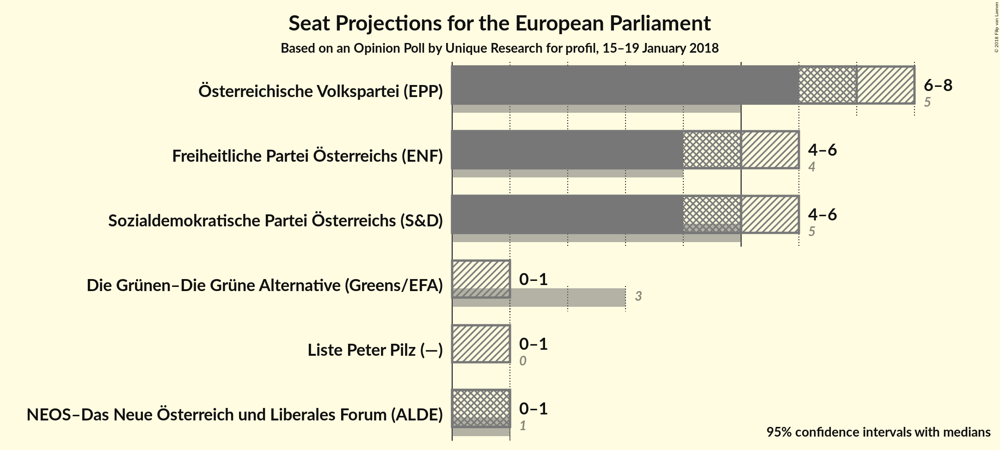
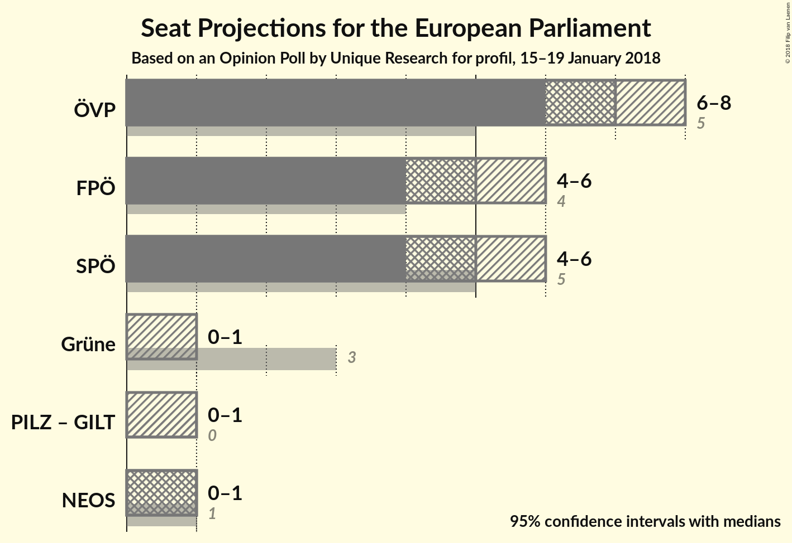

# Opinion Poll by Unique Research for profil, 15–19 January 2018

<a href="#voting-intentions">Voting Intentions</a> | <a href="#seats">Seats</a> | <a href="#coalitions">Coalitions</a> | <a href="#technical-information">Technical Information</a>

## Voting Intentions

### Confidence Intervals

| Party | Last Result | Poll Result | 80% Confidence Interval | 90% Confidence Interval | 95% Confidence Interval | 99% Confidence Interval |
|:-----:|:-----------:|:-----------:|:-----------------------:|:-----------------------:|:-----------------------:|:-----------------------:|
| Österreichische Volkspartei (EPP) | 27.0% | 34.0% | 31.4–36.8% |30.6–37.6% |30.0–38.3% |28.7–39.6% |
| Sozialdemokratische Partei Österreichs (S&D) | 24.1% | 27.0% | 24.6–29.7% |23.9–30.4% |23.3–31.1% |22.2–32.4% |
| Freiheitliche Partei Österreichs (ENF) | 19.7% | 25.0% | 22.6–27.6% |22.0–28.3% |21.4–29.0% |20.3–30.3% |
| NEOS–Das Neue Österreich und Liberales Forum (ALDE) | 8.1% | 6.0% | 4.8–7.6% |4.5–8.0% |4.2–8.4% |3.7–9.3% |
| Die Grünen–Die Grüne Alternative (Greens/EFA) | 14.5% | 4.0% | 3.1–5.4% |2.8–5.8% |2.6–6.1% |2.2–6.8% |
| Liste Peter Pilz (*) | 0.0% | 3.0% | 2.2–4.2% |2.0–4.6% |1.8–4.9% |1.5–5.5% |

*Note:* The poll result column reflects the actual value used in the calculations. Published results may vary slightly, and in addition be rounded to fewer digits.

## Seats

### Confidence Intervals

| Party | Last Result | Median | 80% Confidence Interval | 90% Confidence Interval | 95% Confidence Interval | 99% Confidence Interval |
|:-----:|:-----------:|:------:|:-----------------------:|:-----------------------:|:-----------------------:|:-----------------------:|
| <a href="#österreichische-volkspartei-(epp)">Österreichische Volkspartei (EPP)</a> | 5 | 7 | 6–8 |6–8 |6–8 |6–8 |
| <a href="#sozialdemokratische-partei-österreichs-(s&d)">Sozialdemokratische Partei Österreichs (S&D)</a> | 5 | 5 | 5–6 |5–6 |5–6 |4–7 |
| <a href="#freiheitliche-partei-österreichs-(enf)">Freiheitliche Partei Österreichs (ENF)</a> | 4 | 5 | 4–6 |4–6 |4–6 |4–6 |
| <a href="#neos–das-neue-österreich-und-liberales-forum-(alde)">NEOS–Das Neue Österreich und Liberales Forum (ALDE)</a> | 1 | 1 | 1 |1 |0–1 |0–2 |
| <a href="#die-grünen–die-grüne-alternative-(greens/efa)">Die Grünen–Die Grüne Alternative (Greens/EFA)</a> | 3 | 0 | 0–1 |0–1 |0–1 |0–1 |
| <a href="#liste-peter-pilz-(*)">Liste Peter Pilz (*)</a> | 0 | 0 | 0 |0–1 |0–1 |0–1 |

### Österreichische Volkspartei (EPP)

*For a full overview of the results for this party, see the [Österreichische Volkspartei (EPP)](party-österreichischevolksparteiepp.html) page.*

| Number of Seats | Probability | Accumulated | Special Marks |
|:---------------:|:-----------:|:-----------:|:-------------:|
| 5 | 0.1% | 100% | Last Result |
| 6 | 13% | 99.9% |  |
| 7 | 66% | 87% | Median |
| 8 | 21% | 21% |  |
| 9 | 0.3% | 0.3% |  |
| 10 | 0% | 0% | Majority |

### Sozialdemokratische Partei Österreichs (S&D)

*For a full overview of the results for this party, see the [Sozialdemokratische Partei Österreichs (S&D)](party-sozialdemokratischeparteiösterreichssd.html) page.*

| Number of Seats | Probability | Accumulated | Special Marks |
|:---------------:|:-----------:|:-----------:|:-------------:|
| 4 | 1.1% | 100% |  |
| 5 | 50% | 98.9% | Last Result, Median |
| 6 | 47% | 49% |  |
| 7 | 2% | 2% |  |
| 8 | 0% | 0% |  |

### Freiheitliche Partei Österreichs (ENF)

*For a full overview of the results for this party, see the [Freiheitliche Partei Österreichs (ENF)](party-freiheitlicheparteiösterreichsenf.html) page.*

| Number of Seats | Probability | Accumulated | Special Marks |
|:---------------:|:-----------:|:-----------:|:-------------:|
| 4 | 10% | 100% | Last Result |
| 5 | 72% | 90% | Median |
| 6 | 18% | 18% |  |
| 7 | 0.1% | 0.1% |  |
| 8 | 0% | 0% |  |

### NEOS–Das Neue Österreich und Liberales Forum (ALDE)

*For a full overview of the results for this party, see the [NEOS–Das Neue Österreich und Liberales Forum (ALDE)](party-neos–dasneueösterreichundliberalesforumalde.html) page.*

| Number of Seats | Probability | Accumulated | Special Marks |
|:---------------:|:-----------:|:-----------:|:-------------:|
| 0 | 5% | 100% |  |
| 1 | 94% | 95% | Last Result, Median |
| 2 | 1.0% | 1.0% |  |
| 3 | 0% | 0% |  |

### Die Grünen–Die Grüne Alternative (Greens/EFA)

*For a full overview of the results for this party, see the [Die Grünen–Die Grüne Alternative (Greens/EFA)](party-diegrünen–diegrünealternativegreensefa.html) page.*

| Number of Seats | Probability | Accumulated | Special Marks |
|:---------------:|:-----------:|:-----------:|:-------------:|
| 0 | 68% | 100% | Median |
| 1 | 32% | 32% |  |
| 2 | 0% | 0% |  |
| 3 | 0% | 0% | Last Result |

### Liste Peter Pilz (*)

*For a full overview of the results for this party, see the [Liste Peter Pilz (*)](party-listepeterpilz.html) page.*

| Number of Seats | Probability | Accumulated | Special Marks |
|:---------------:|:-----------:|:-----------:|:-------------:|
| 0 | 94% | 100% | Last Result, Median |
| 1 | 6% | 6% |  |
| 2 | 0% | 0% |  |

## Coalitions

### Confidence Intervals

| Coalition | Last Result | Median | Majority? | 80% Confidence Interval | 90% Confidence Interval | 95% Confidence Interval | 99% Confidence Interval |
|:---------:|:-----------:|:------:|:---------:|:-----------------------:|:-----------------------:|:-----------------------:|:-----------------------:|
| Österreichische Volkspartei (EPP) | 5 | 7 | 0% | 6–8 | 6–8 | 6–8 | 6–8 |
| Sozialdemokratische Partei Österreichs (S&D) | 5 | 5 | 0% | 5–6 | 5–6 | 5–6 | 4–7 |
| Freiheitliche Partei Österreichs (ENF) | 4 | 5 | 0% | 4–6 | 4–6 | 4–6 | 4–6 |
| Die Grünen–Die Grüne Alternative (Greens/EFA) | 3 | 0 | 0% | 0–1 | 0–1 | 0–1 | 0–1 |
| NEOS–Das Neue Österreich und Liberales Forum (ALDE) | 1 | 1 | 0% | 1 | 1 | 0–1 | 0–2 |

### Österreichische Volkspartei (EPP)

| Number of Seats | Probability | Accumulated | Special Marks |
|:---------------:|:-----------:|:-----------:|:-------------:|
| 5 | 0.1% | 100% | Last Result |
| 6 | 13% | 99.9% |  |
| 7 | 66% | 87% | Median |
| 8 | 21% | 21% |  |
| 9 | 0.3% | 0.3% |  |
| 10 | 0% | 0% | Majority |

### Sozialdemokratische Partei Österreichs (S&D)

| Number of Seats | Probability | Accumulated | Special Marks |
|:---------------:|:-----------:|:-----------:|:-------------:|
| 4 | 1.1% | 100% |  |
| 5 | 50% | 98.9% | Last Result, Median |
| 6 | 47% | 49% |  |
| 7 | 2% | 2% |  |
| 8 | 0% | 0% |  |

### Freiheitliche Partei Österreichs (ENF)

| Number of Seats | Probability | Accumulated | Special Marks |
|:---------------:|:-----------:|:-----------:|:-------------:|
| 4 | 10% | 100% | Last Result |
| 5 | 72% | 90% | Median |
| 6 | 18% | 18% |  |
| 7 | 0.1% | 0.1% |  |
| 8 | 0% | 0% |  |

### Die Grünen–Die Grüne Alternative (Greens/EFA)

| Number of Seats | Probability | Accumulated | Special Marks |
|:---------------:|:-----------:|:-----------:|:-------------:|
| 0 | 68% | 100% | Median |
| 1 | 32% | 32% |  |
| 2 | 0% | 0% |  |
| 3 | 0% | 0% | Last Result |

### NEOS–Das Neue Österreich und Liberales Forum (ALDE)

| Number of Seats | Probability | Accumulated | Special Marks |
|:---------------:|:-----------:|:-----------:|:-------------:|
| 0 | 5% | 100% |  |
| 1 | 94% | 95% | Last Result, Median |
| 2 | 1.0% | 1.0% |  |
| 3 | 0% | 0% |  |

## Technical Information

### Opinion Poll

+ **Polling firm:** Unique Research
+ **Commissioner(s):** profil
+ **Fieldwork period:** 15–19 January 2018

### Calculations

+ **Sample size:** 500
+ **Simulations done:** 1,048,576
+ **Error estimate:** 1.17%

