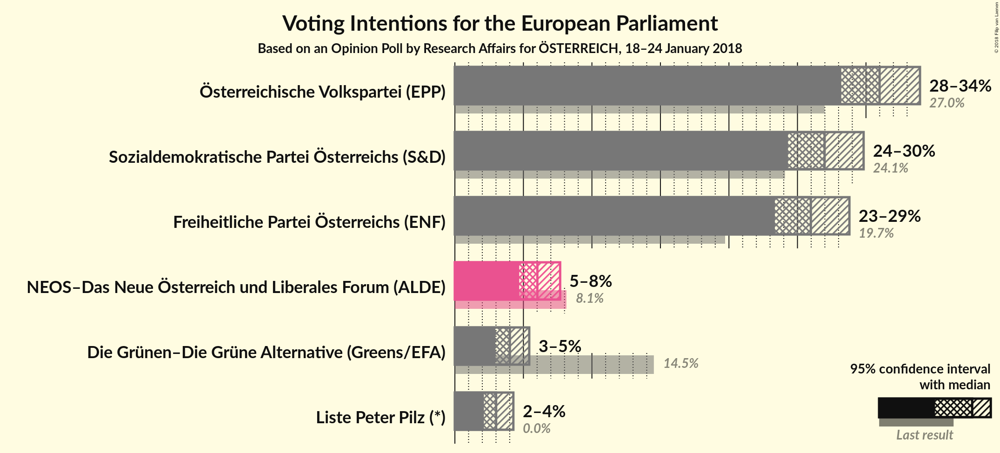
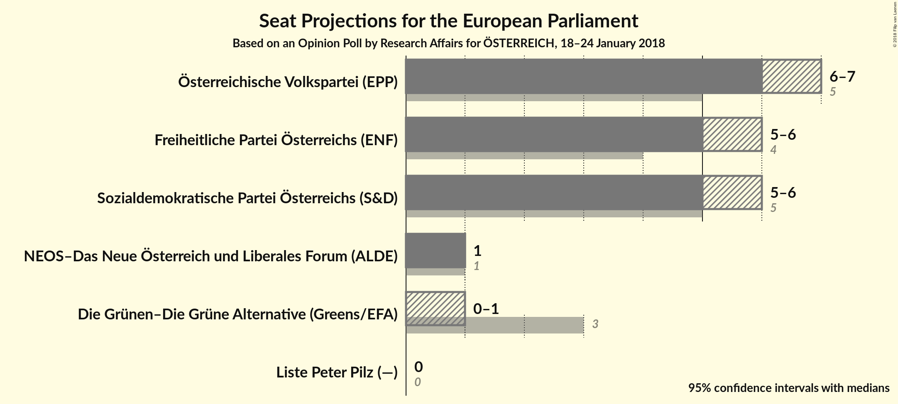
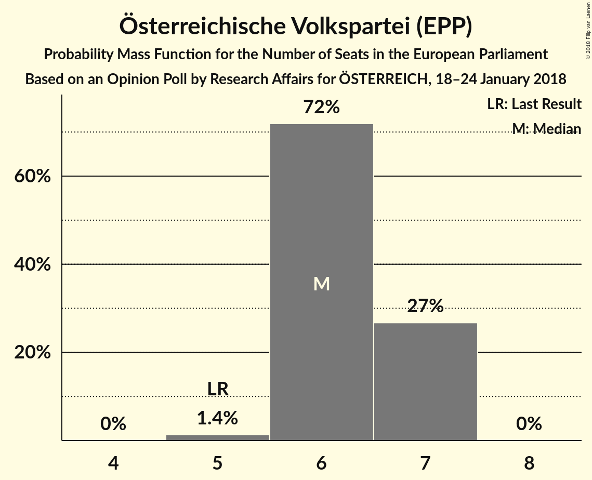
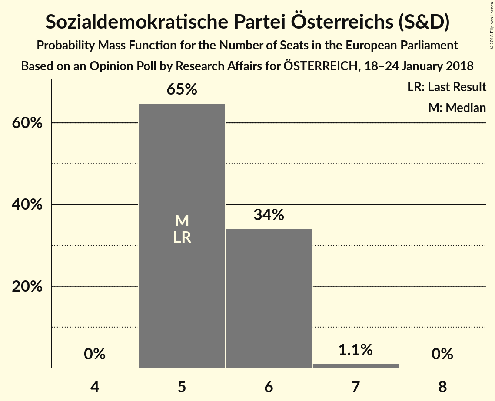
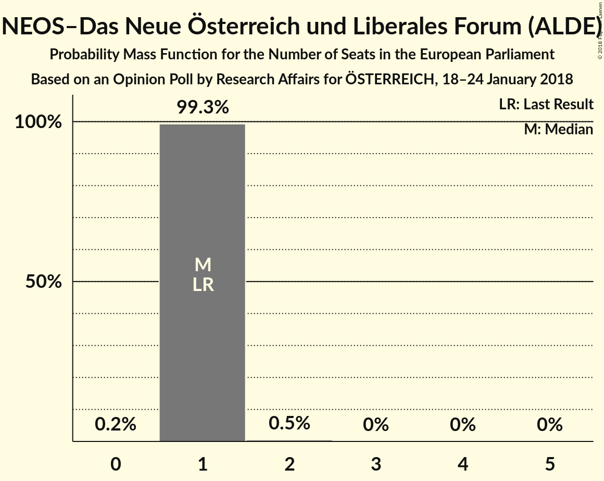
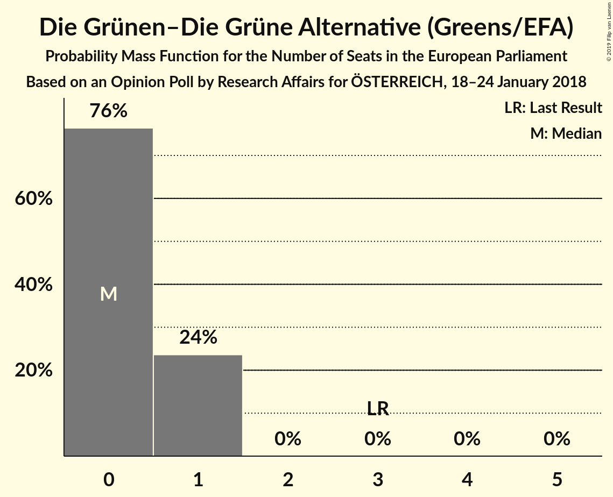
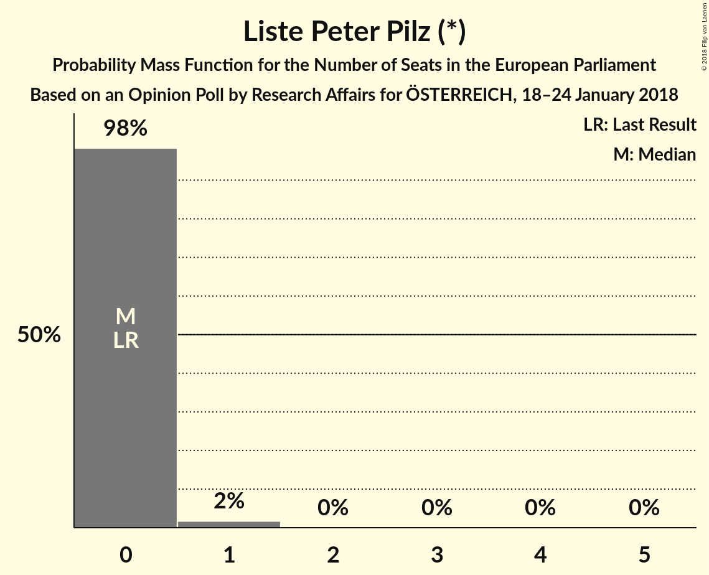
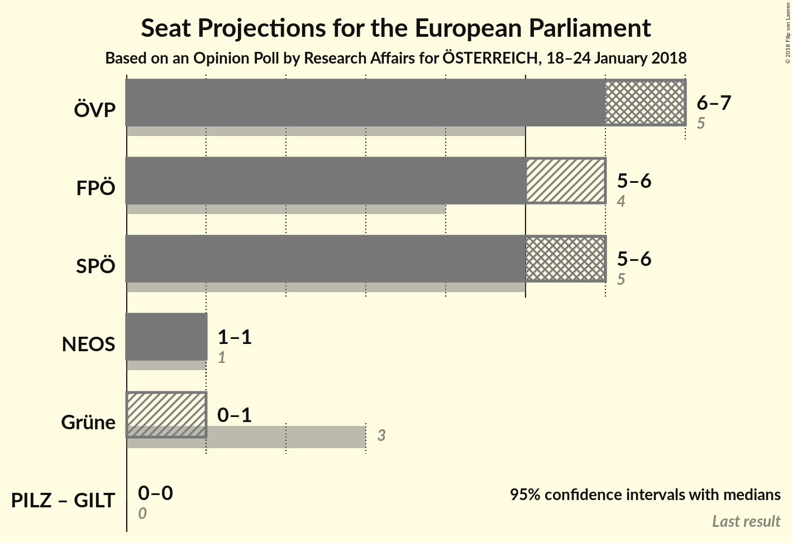

# Opinion Poll by Research Affairs for ÖSTERREICH, 18–24 January 2018

<a href="#voting-intentions">Voting Intentions</a> | <a href="#seats">Seats</a> | <a href="#coalitions">Coalitions</a> | <a href="#technical-information">Technical Information</a>

## Voting Intentions

### Confidence Intervals

| Party | Last Result | Poll Result | 80% Confidence Interval | 90% Confidence Interval | 95% Confidence Interval | 99% Confidence Interval |
|:-----:|:-----------:|:-----------:|:-----------------------:|:-----------------------:|:-----------------------:|:-----------------------:|
| Österreichische Volkspartei (EPP) | 27.0% | 31.0% | 29.2–32.9% |28.6–33.5% |28.2–33.9% |27.3–34.9% |
| Sozialdemokratische Partei Österreichs (S&D) | 24.1% | 27.0% | 25.2–28.8% |24.7–29.4% |24.3–29.8% |23.5–30.7% |
| Freiheitliche Partei Österreichs (ENF) | 19.7% | 26.0% | 24.2–27.8% |23.8–28.3% |23.4–28.8% |22.5–29.7% |
| NEOS–Das Neue Österreich und Liberales Forum (ALDE) | 8.1% | 6.0% | 5.2–7.1% |4.9–7.4% |4.7–7.7% |4.3–8.2% |
| Die Grünen–Die Grüne Alternative (Greens/EFA) | 14.5% | 4.0% | 3.3–4.9% |3.1–5.2% |3.0–5.4% |2.7–5.9% |
| Liste Peter Pilz (*) | 0.0% | 3.0% | 2.4–3.8% |2.3–4.1% |2.1–4.3% |1.9–4.7% |

*Note:* The poll result column reflects the actual value used in the calculations. Published results may vary slightly, and in addition be rounded to fewer digits.

## Seats

### Confidence Intervals

| Party | Last Result | Median | 80% Confidence Interval | 90% Confidence Interval | 95% Confidence Interval | 99% Confidence Interval |
|:-----:|:-----------:|:------:|:-----------------------:|:-----------------------:|:-----------------------:|:-----------------------:|
| <a href="#Österreichische-volkspartei-(epp)">Österreichische Volkspartei (EPP)</a> | 5 | 7 | 6–7 |6–7 |6–7 |6–8 |
| <a href="#sozialdemokratische-partei-Österreichs-(s&d)">Sozialdemokratische Partei Österreichs (S&D)</a> | 5 | 6 | 5–6 |5–6 |5–6 |5–7 |
| <a href="#freiheitliche-partei-Österreichs-(enf)">Freiheitliche Partei Österreichs (ENF)</a> | 4 | 5 | 5–6 |5–6 |5–6 |5–6 |
| <a href="#neos–das-neue-Österreich-und-liberales-forum-(alde)">NEOS–Das Neue Österreich und Liberales Forum (ALDE)</a> | 1 | 1 | 1 |1 |1 |0–1 |
| <a href="#die-grünen–die-grüne-alternative-(greens/efa)">Die Grünen–Die Grüne Alternative (Greens/EFA)</a> | 3 | 0 | 0–1 |0–1 |0–1 |0–1 |
| <a href="#liste-peter-pilz-(*)">Liste Peter Pilz (*)</a> | 0 | 0 | 0 |0 |0 |0–1 |

### Österreichische Volkspartei (EPP)

*For a full overview of the results for this party, see the [Österreichische Volkspartei (EPP)](party-Österreichischevolksparteiepp.html) page.*

| Number of Seats | Probability | Accumulated | Special Marks |
|:---------------:|:-----------:|:-----------:|:-------------:|
| 5 | 0.2% | 100% | Last Result |
| 6 | 42% | 99.8% |  |
| 7 | 57% | 57% | Median |
| 8 | 0.8% | 0.8% |  |
| 9 | 0% | 0% |  |

### Sozialdemokratische Partei Österreichs (S&D)

*For a full overview of the results for this party, see the [Sozialdemokratische Partei Österreichs (S&D)](party-sozialdemokratischeparteiÖsterreichssd.html) page.*

| Number of Seats | Probability | Accumulated | Special Marks |
|:---------------:|:-----------:|:-----------:|:-------------:|
| 5 | 32% | 100% | Last Result |
| 6 | 67% | 68% | Median |
| 7 | 1.1% | 1.1% |  |
| 8 | 0% | 0% |  |

### Freiheitliche Partei Österreichs (ENF)

*For a full overview of the results for this party, see the [Freiheitliche Partei Österreichs (ENF)](party-freiheitlicheparteiÖsterreichsenf.html) page.*

| Number of Seats | Probability | Accumulated | Special Marks |
|:---------------:|:-----------:|:-----------:|:-------------:|
| 4 | 0.3% | 100% | Last Result |
| 5 | 60% | 99.7% | Median |
| 6 | 40% | 40% |  |
| 7 | 0.1% | 0.1% |  |
| 8 | 0% | 0% |  |

### NEOS–Das Neue Österreich und Liberales Forum (ALDE)

*For a full overview of the results for this party, see the [NEOS–Das Neue Österreich und Liberales Forum (ALDE)](party-neos–dasneueÖsterreichundliberalesforumalde.html) page.*

| Number of Seats | Probability | Accumulated | Special Marks |
|:---------------:|:-----------:|:-----------:|:-------------:|
| 0 | 0.7% | 100% |  |
| 1 | 99.2% | 99.3% | Last Result, Median |
| 2 | 0.1% | 0.1% |  |
| 3 | 0% | 0% |  |

### Die Grünen–Die Grüne Alternative (Greens/EFA)

*For a full overview of the results for this party, see the [Die Grünen–Die Grüne Alternative (Greens/EFA)](party-diegrünen–diegrünealternativegreensefa.html) page.*

| Number of Seats | Probability | Accumulated | Special Marks |
|:---------------:|:-----------:|:-----------:|:-------------:|
| 0 | 70% | 100% | Median |
| 1 | 30% | 30% |  |
| 2 | 0% | 0% |  |
| 3 | 0% | 0% | Last Result |

### Liste Peter Pilz (*)

*For a full overview of the results for this party, see the [Liste Peter Pilz (*)](party-listepeterpilz.html) page.*

| Number of Seats | Probability | Accumulated | Special Marks |
|:---------------:|:-----------:|:-----------:|:-------------:|
| 0 | 98% | 100% | Last Result, Median |
| 1 | 2% | 2% |  |
| 2 | 0% | 0% |  |

## Coalitions

### Confidence Intervals

| Coalition | Last Result | Median | Majority? | 80% Confidence Interval | 90% Confidence Interval | 95% Confidence Interval | 99% Confidence Interval |
|:---------:|:-----------:|:------:|:---------:|:-----------------------:|:-----------------------:|:-----------------------:|:-----------------------:|
| Österreichische Volkspartei (EPP) | 5 | 7 | 0% | 6–7 | 6–7 | 6–7 | 6–8 |
| Freiheitliche Partei Österreichs (ENF) | 4 | 5 | 0% | 5–6 | 5–6 | 5–6 | 5–6 |
| Sozialdemokratische Partei Österreichs (S&D) | 5 | 6 | 0% | 5–6 | 5–6 | 5–6 | 5–7 |
| NEOS–Das Neue Österreich und Liberales Forum (ALDE) | 1 | 1 | 0% | 1 | 1 | 1 | 0–1 |
| Die Grünen–Die Grüne Alternative (Greens/EFA) | 3 | 0 | 0% | 0–1 | 0–1 | 0–1 | 0–1 |

### Österreichische Volkspartei (EPP)

| Number of Seats | Probability | Accumulated | Special Marks |
|:---------------:|:-----------:|:-----------:|:-------------:|
| 5 | 0.2% | 100% | Last Result |
| 6 | 42% | 99.8% |  |
| 7 | 57% | 57% | Median |
| 8 | 0.8% | 0.8% |  |
| 9 | 0% | 0% |  |

### Freiheitliche Partei Österreichs (ENF)

| Number of Seats | Probability | Accumulated | Special Marks |
|:---------------:|:-----------:|:-----------:|:-------------:|
| 4 | 0.3% | 100% | Last Result |
| 5 | 60% | 99.7% | Median |
| 6 | 40% | 40% |  |
| 7 | 0.1% | 0.1% |  |
| 8 | 0% | 0% |  |

### Sozialdemokratische Partei Österreichs (S&D)

| Number of Seats | Probability | Accumulated | Special Marks |
|:---------------:|:-----------:|:-----------:|:-------------:|
| 5 | 32% | 100% | Last Result |
| 6 | 67% | 68% | Median |
| 7 | 1.1% | 1.1% |  |
| 8 | 0% | 0% |  |

### NEOS–Das Neue Österreich und Liberales Forum (ALDE)

| Number of Seats | Probability | Accumulated | Special Marks |
|:---------------:|:-----------:|:-----------:|:-------------:|
| 0 | 0.7% | 100% |  |
| 1 | 99.2% | 99.3% | Last Result, Median |
| 2 | 0.1% | 0.1% |  |
| 3 | 0% | 0% |  |

### Die Grünen–Die Grüne Alternative (Greens/EFA)

| Number of Seats | Probability | Accumulated | Special Marks |
|:---------------:|:-----------:|:-----------:|:-------------:|
| 0 | 70% | 100% | Median |
| 1 | 30% | 30% |  |
| 2 | 0% | 0% |  |
| 3 | 0% | 0% | Last Result |

## Technical Information

### Opinion Poll

+ **Polling firm:** Research Affairs
+ **Commissioner(s):** ÖSTERREICH
+ **Fieldwork period:** 18–24 January 2018

### Calculations

+ **Sample size:** 997
+ **Simulations done:** 1,048,576
+ **Error estimate:** 1.54%

