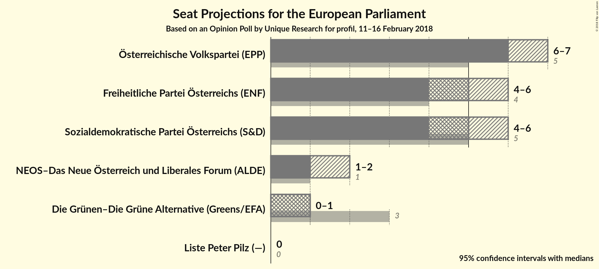
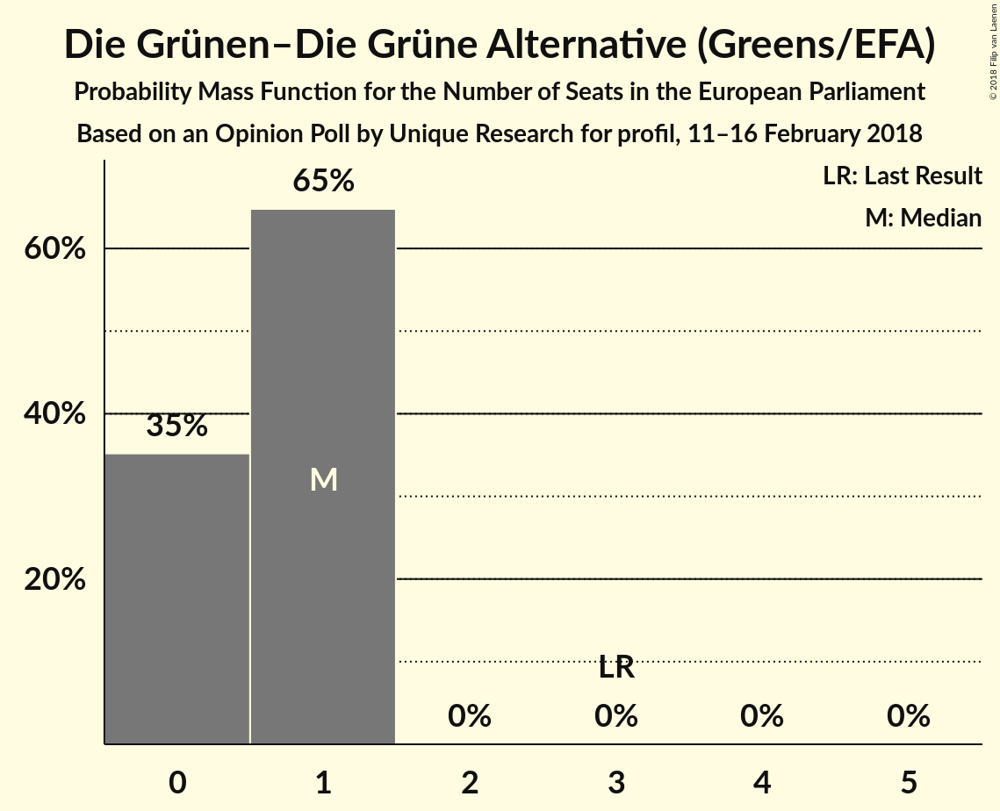
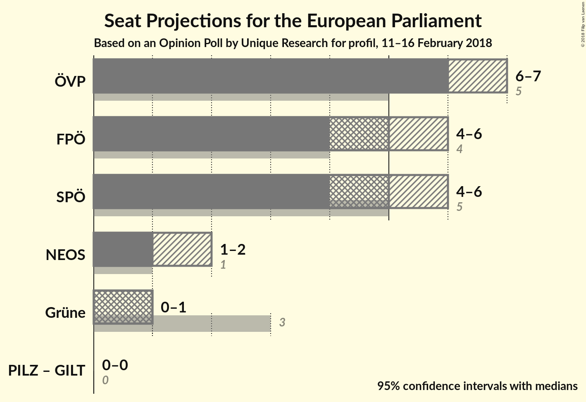

# Opinion Poll by Unique Research for profil, 11–16 February 2018

<a href="#voting-intentions">Voting Intentions</a> | <a href="#seats">Seats</a> | <a href="#coalitions">Coalitions</a> | <a href="#technical-information">Technical Information</a>

## Voting Intentions

### Confidence Intervals

| Party | Last Result | Poll Result | 80% Confidence Interval | 90% Confidence Interval | 95% Confidence Interval | 99% Confidence Interval |
|:-----:|:-----------:|:-----------:|:-----------------------:|:-----------------------:|:-----------------------:|:-----------------------:|
| Österreichische Volkspartei (EPP) | 27.0% | 33.0% | 30.4–35.8% |29.6–36.6% |29.0–37.3% |27.8–38.6% |
| Sozialdemokratische Partei Österreichs (S&D) | 24.1% | 26.0% | 23.6–28.6% |22.9–29.4% |22.3–30.0% |21.2–31.3% |
| Freiheitliche Partei Österreichs (ENF) | 19.7% | 26.0% | 23.6–28.6% |22.9–29.4% |22.3–30.0% |21.2–31.3% |
| NEOS–Das Neue Österreich und Liberales Forum (ALDE) | 8.1% | 7.0% | 5.7–8.7% |5.4–9.2% |5.1–9.6% |4.5–10.5% |
| Die Grünen–Die Grüne Alternative (Greens/EFA) | 14.5% | 5.0% | 3.9–6.5% |3.7–6.9% |3.4–7.3% |3.0–8.1% |
| Liste Peter Pilz (*) | 0.0% | 2.0% | 1.4–3.1% |1.2–3.4% |1.1–3.6% |0.9–4.2% |

*Note:* The poll result column reflects the actual value used in the calculations. Published results may vary slightly, and in addition be rounded to fewer digits.

## Seats

### Confidence Intervals

| Party | Last Result | Median | 80% Confidence Interval | 90% Confidence Interval | 95% Confidence Interval | 99% Confidence Interval |
|:-----:|:-----------:|:------:|:-----------------------:|:-----------------------:|:-----------------------:|:-----------------------:|
| <a href="#österreichische-volkspartei-(epp)">Österreichische Volkspartei (EPP)</a> | 5 | 7 | 6–7 |6–8 |6–8 |6–8 |
| <a href="#sozialdemokratische-partei-österreichs-(s&d)">Sozialdemokratische Partei Österreichs (S&D)</a> | 5 | 5 | 5–6 |4–6 |4–6 |4–6 |
| <a href="#freiheitliche-partei-österreichs-(enf)">Freiheitliche Partei Österreichs (ENF)</a> | 4 | 5 | 5–6 |5–6 |4–6 |4–6 |
| <a href="#neos–das-neue-österreich-und-liberales-forum-(alde)">NEOS–Das Neue Österreich und Liberales Forum (ALDE)</a> | 1 | 1 | 1 |1–2 |1–2 |0–2 |
| <a href="#die-grünen–die-grüne-alternative-(greens/efa)">Die Grünen–Die Grüne Alternative (Greens/EFA)</a> | 3 | 1 | 0–1 |0–1 |0–1 |0–1 |
| <a href="#liste-peter-pilz-(*)">Liste Peter Pilz (*)</a> | 0 | 0 | 0 |0 |0 |0 |

### Österreichische Volkspartei (EPP)

*For a full overview of the results for this party, see the [Österreichische Volkspartei (EPP)](party-österreichischevolksparteiepp.html) page.*

| Number of Seats | Probability | Accumulated | Special Marks |
|:---------------:|:-----------:|:-----------:|:-------------:|
| 5 | 0.3% | 100% | Last Result |
| 6 | 30% | 99.7% |  |
| 7 | 63% | 69% | Median |
| 8 | 7% | 7% |  |
| 9 | 0% | 0% |  |

### Sozialdemokratische Partei Österreichs (S&D)

*For a full overview of the results for this party, see the [Sozialdemokratische Partei Österreichs (S&D)](party-sozialdemokratischeparteiösterreichssd.html) page.*

| Number of Seats | Probability | Accumulated | Special Marks |
|:---------------:|:-----------:|:-----------:|:-------------:|
| 4 | 5% | 100% |  |
| 5 | 69% | 95% | Last Result, Median |
| 6 | 26% | 26% |  |
| 7 | 0.3% | 0.3% |  |
| 8 | 0% | 0% |  |

### Freiheitliche Partei Österreichs (ENF)

*For a full overview of the results for this party, see the [Freiheitliche Partei Österreichs (ENF)](party-freiheitlicheparteiösterreichsenf.html) page.*

| Number of Seats | Probability | Accumulated | Special Marks |
|:---------------:|:-----------:|:-----------:|:-------------:|
| 4 | 4% | 100% | Last Result |
| 5 | 68% | 96% | Median |
| 6 | 28% | 28% |  |
| 7 | 0.3% | 0.3% |  |
| 8 | 0% | 0% |  |

### NEOS–Das Neue Österreich und Liberales Forum (ALDE)

*For a full overview of the results for this party, see the [NEOS–Das Neue Österreich und Liberales Forum (ALDE)](party-neos–dasneueösterreichundliberalesforumalde.html) page.*

| Number of Seats | Probability | Accumulated | Special Marks |
|:---------------:|:-----------:|:-----------:|:-------------:|
| 0 | 0.6% | 100% |  |
| 1 | 94% | 99.4% | Last Result, Median |
| 2 | 6% | 6% |  |
| 3 | 0% | 0% |  |

### Die Grünen–Die Grüne Alternative (Greens/EFA)

*For a full overview of the results for this party, see the [Die Grünen–Die Grüne Alternative (Greens/EFA)](party-diegrünen–diegrünealternativegreensefa.html) page.*

| Number of Seats | Probability | Accumulated | Special Marks |
|:---------------:|:-----------:|:-----------:|:-------------:|
| 0 | 27% | 100% |  |
| 1 | 73% | 73% | Median |
| 2 | 0% | 0% |  |
| 3 | 0% | 0% | Last Result |

### Liste Peter Pilz (*)

*For a full overview of the results for this party, see the [Liste Peter Pilz (*)](party-listepeterpilz.html) page.*

| Number of Seats | Probability | Accumulated | Special Marks |
|:---------------:|:-----------:|:-----------:|:-------------:|
| 0 | 99.8% | 100% | Last Result, Median |
| 1 | 0.2% | 0.2% |  |
| 2 | 0% | 0% |  |

## Coalitions

### Confidence Intervals

| Coalition | Last Result | Median | Majority? | 80% Confidence Interval | 90% Confidence Interval | 95% Confidence Interval | 99% Confidence Interval |
|:---------:|:-----------:|:------:|:---------:|:-----------------------:|:-----------------------:|:-----------------------:|:-----------------------:|
| Österreichische Volkspartei (EPP) | 5 | 7 | 0% | 6–7 | 6–8 | 6–8 | 6–8 |
| Freiheitliche Partei Österreichs (ENF) | 4 | 5 | 0% | 5–6 | 5–6 | 4–6 | 4–6 |
| Sozialdemokratische Partei Österreichs (S&D) | 5 | 5 | 0% | 5–6 | 4–6 | 4–6 | 4–6 |
| NEOS–Das Neue Österreich und Liberales Forum (ALDE) | 1 | 1 | 0% | 1 | 1–2 | 1–2 | 0–2 |
| Die Grünen–Die Grüne Alternative (Greens/EFA) | 3 | 1 | 0% | 0–1 | 0–1 | 0–1 | 0–1 |

### Österreichische Volkspartei (EPP)

| Number of Seats | Probability | Accumulated | Special Marks |
|:---------------:|:-----------:|:-----------:|:-------------:|
| 5 | 0.3% | 100% | Last Result |
| 6 | 30% | 99.7% |  |
| 7 | 63% | 69% | Median |
| 8 | 7% | 7% |  |
| 9 | 0% | 0% |  |

### Freiheitliche Partei Österreichs (ENF)

| Number of Seats | Probability | Accumulated | Special Marks |
|:---------------:|:-----------:|:-----------:|:-------------:|
| 4 | 4% | 100% | Last Result |
| 5 | 68% | 96% | Median |
| 6 | 28% | 28% |  |
| 7 | 0.3% | 0.3% |  |
| 8 | 0% | 0% |  |

### Sozialdemokratische Partei Österreichs (S&D)

| Number of Seats | Probability | Accumulated | Special Marks |
|:---------------:|:-----------:|:-----------:|:-------------:|
| 4 | 5% | 100% |  |
| 5 | 69% | 95% | Last Result, Median |
| 6 | 26% | 26% |  |
| 7 | 0.3% | 0.3% |  |
| 8 | 0% | 0% |  |

### NEOS–Das Neue Österreich und Liberales Forum (ALDE)

| Number of Seats | Probability | Accumulated | Special Marks |
|:---------------:|:-----------:|:-----------:|:-------------:|
| 0 | 0.6% | 100% |  |
| 1 | 94% | 99.4% | Last Result, Median |
| 2 | 6% | 6% |  |
| 3 | 0% | 0% |  |

### Die Grünen–Die Grüne Alternative (Greens/EFA)

| Number of Seats | Probability | Accumulated | Special Marks |
|:---------------:|:-----------:|:-----------:|:-------------:|
| 0 | 27% | 100% |  |
| 1 | 73% | 73% | Median |
| 2 | 0% | 0% |  |
| 3 | 0% | 0% | Last Result |

## Technical Information

### Opinion Poll

+ **Polling firm:** Unique Research
+ **Commissioner(s):** profil
+ **Fieldwork period:** 11–16 February 2018

### Calculations

+ **Sample size:** 500
+ **Simulations done:** 1,048,576
+ **Error estimate:** 0.94%

