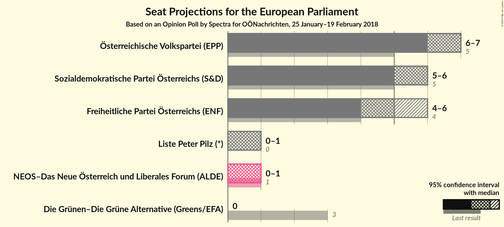
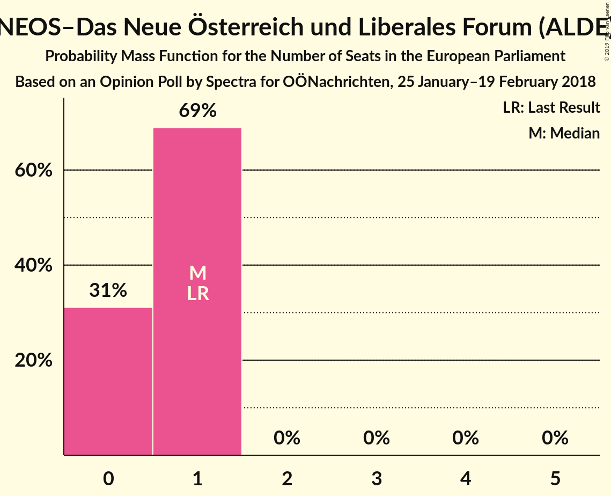
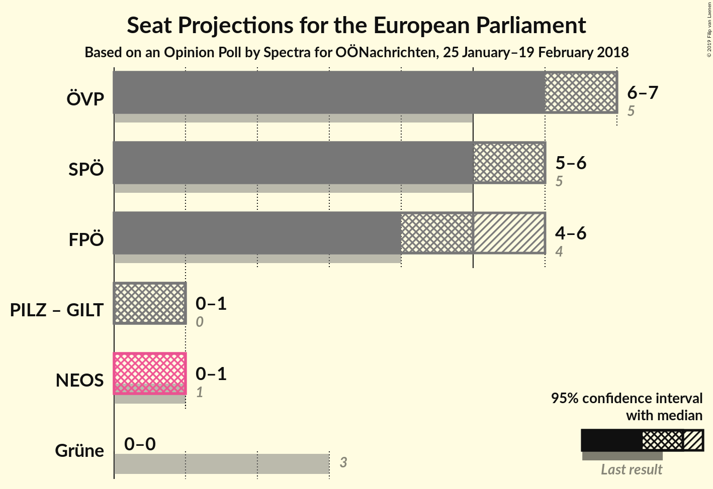

# Opinion Poll by Spectra for OÖNachrichten, 25 January–19 February 2018

<a href="#voting-intentions">Voting Intentions</a> | <a href="#seats">Seats</a> | <a href="#coalitions">Coalitions</a> | <a href="#technical-information">Technical Information</a>

## Voting Intentions

### Confidence Intervals

| Party | Last Result | Poll Result | 80% Confidence Interval | 90% Confidence Interval | 95% Confidence Interval | 99% Confidence Interval |
|:-----:|:-----------:|:-----------:|:-----------------------:|:-----------------------:|:-----------------------:|:-----------------------:|
| Österreichische Volkspartei (EPP) | 27.0% | 32.9% | 30.7–35.2% |30.0–35.8% |29.5–36.4% |28.5–37.5% |
| Sozialdemokratische Partei Österreichs (S&D) | 24.1% | 27.9% | 25.8–30.2% |25.3–30.8% |24.7–31.4% |23.8–32.4% |
| Freiheitliche Partei Österreichs (ENF) | 19.7% | 26.0% | 23.9–28.2% |23.4–28.8% |22.9–29.3% |21.9–30.4% |
| Liste Peter Pilz (*) | 0.0% | 5.9% | 4.9–7.2% |4.6–7.6% |4.4–7.9% |4.0–8.6% |
| NEOS–Das Neue Österreich und Liberales Forum (ALDE) | 8.1% | 4.9% | 4.0–6.1% |3.8–6.5% |3.6–6.8% |3.2–7.4% |
| Die Grünen–Die Grüne Alternative (Greens/EFA) | 14.5% | 2.0% | 1.4–2.8% |1.3–3.1% |1.2–3.3% |1.0–3.7% |

*Note:* The poll result column reflects the actual value used in the calculations. Published results may vary slightly, and in addition be rounded to fewer digits.

## Seats

### Confidence Intervals

| Party | Last Result | Median | 80% Confidence Interval | 90% Confidence Interval | 95% Confidence Interval | 99% Confidence Interval |
|:-----:|:-----------:|:------:|:-----------------------:|:-----------------------:|:-----------------------:|:-----------------------:|
| <a href="#österreichische-volkspartei-(epp)">Österreichische Volkspartei (EPP)</a> | 5 | 7 | 6–7 |6–7 |6–7 |6–8 |
| <a href="#sozialdemokratische-partei-österreichs-(s&d)">Sozialdemokratische Partei Österreichs (S&D)</a> | 5 | 6 | 5–6 |5–6 |5–6 |5–7 |
| <a href="#freiheitliche-partei-österreichs-(enf)">Freiheitliche Partei Österreichs (ENF)</a> | 4 | 5 | 5–6 |5–6 |4–6 |4–6 |
| <a href="#liste-peter-pilz-(*)">Liste Peter Pilz (*)</a> | 0 | 1 | 1 |1 |0–1 |0–1 |
| <a href="#neos–das-neue-österreich-und-liberales-forum-(alde)">NEOS–Das Neue Österreich und Liberales Forum (ALDE)</a> | 1 | 1 | 0–1 |0–1 |0–1 |0–1 |
| <a href="#die-grünen–die-grüne-alternative-(greens/efa)">Die Grünen–Die Grüne Alternative (Greens/EFA)</a> | 3 | 0 | 0 |0 |0 |0 |

### Österreichische Volkspartei (EPP)

*For a full overview of the results for this party, see the [Österreichische Volkspartei (EPP)](party-österreichischevolksparteiepp.html) page.*

| Number of Seats | Probability | Accumulated | Special Marks |
|:---------------:|:-----------:|:-----------:|:-------------:|
| 5 | 0.2% | 100% | Last Result |
| 6 | 40% | 99.8% |  |
| 7 | 57% | 59% | Median |
| 8 | 2% | 2% |  |
| 9 | 0% | 0% |  |

### Sozialdemokratische Partei Österreichs (S&D)

*For a full overview of the results for this party, see the [Sozialdemokratische Partei Österreichs (S&D)](party-sozialdemokratischeparteiösterreichssd.html) page.*

| Number of Seats | Probability | Accumulated | Special Marks |
|:---------------:|:-----------:|:-----------:|:-------------:|
| 4 | 0.2% | 100% |  |
| 5 | 42% | 99.8% | Last Result |
| 6 | 57% | 58% | Median |
| 7 | 1.2% | 1.2% |  |
| 8 | 0% | 0% |  |

### Freiheitliche Partei Österreichs (ENF)

*For a full overview of the results for this party, see the [Freiheitliche Partei Österreichs (ENF)](party-freiheitlicheparteiösterreichsenf.html) page.*

| Number of Seats | Probability | Accumulated | Special Marks |
|:---------------:|:-----------:|:-----------:|:-------------:|
| 4 | 4% | 100% | Last Result |
| 5 | 77% | 96% | Median |
| 6 | 19% | 19% |  |
| 7 | 0% | 0% |  |

### Liste Peter Pilz (*)

*For a full overview of the results for this party, see the [Liste Peter Pilz (*)](party-listepeterpilz.html) page.*

| Number of Seats | Probability | Accumulated | Special Marks |
|:---------------:|:-----------:|:-----------:|:-------------:|
| 0 | 4% | 100% | Last Result |
| 1 | 95% | 96% | Median |
| 2 | 0.1% | 0.1% |  |
| 3 | 0% | 0% |  |

### NEOS–Das Neue Österreich und Liberales Forum (ALDE)

*For a full overview of the results for this party, see the [NEOS–Das Neue Österreich und Liberales Forum (ALDE)](party-neos–dasneueösterreichundliberalesforumalde.html) page.*

| Number of Seats | Probability | Accumulated | Special Marks |
|:---------------:|:-----------:|:-----------:|:-------------:|
| 0 | 31% | 100% |  |
| 1 | 69% | 69% | Last Result, Median |
| 2 | 0% | 0% |  |

### Die Grünen–Die Grüne Alternative (Greens/EFA)

*For a full overview of the results for this party, see the [Die Grünen–Die Grüne Alternative (Greens/EFA)](party-diegrünen–diegrünealternativegreensefa.html) page.*

| Number of Seats | Probability | Accumulated | Special Marks |
|:---------------:|:-----------:|:-----------:|:-------------:|
| 0 | 100% | 100% | Median |
| 1 | 0% | 0% |  |
| 2 | 0% | 0% |  |
| 3 | 0% | 0% | Last Result |

## Coalitions

### Confidence Intervals

| Coalition | Last Result | Median | Majority? | 80% Confidence Interval | 90% Confidence Interval | 95% Confidence Interval | 99% Confidence Interval |
|:---------:|:-----------:|:------:|:---------:|:-----------------------:|:-----------------------:|:-----------------------:|:-----------------------:|
| Österreichische Volkspartei (EPP) | 5 | 7 | 0% | 6–7 | 6–7 | 6–7 | 6–8 |
| Sozialdemokratische Partei Österreichs (S&D) | 5 | 6 | 0% | 5–6 | 5–6 | 5–6 | 5–7 |
| Freiheitliche Partei Österreichs (ENF) | 4 | 5 | 0% | 5–6 | 5–6 | 4–6 | 4–6 |
| NEOS–Das Neue Österreich und Liberales Forum (ALDE) | 1 | 1 | 0% | 0–1 | 0–1 | 0–1 | 0–1 |
| Die Grünen–Die Grüne Alternative (Greens/EFA) | 3 | 0 | 0% | 0 | 0 | 0 | 0 |

### Österreichische Volkspartei (EPP)

| Number of Seats | Probability | Accumulated | Special Marks |
|:---------------:|:-----------:|:-----------:|:-------------:|
| 5 | 0.2% | 100% | Last Result |
| 6 | 40% | 99.8% |  |
| 7 | 57% | 59% | Median |
| 8 | 2% | 2% |  |
| 9 | 0% | 0% |  |

### Sozialdemokratische Partei Österreichs (S&D)

| Number of Seats | Probability | Accumulated | Special Marks |
|:---------------:|:-----------:|:-----------:|:-------------:|
| 4 | 0.2% | 100% |  |
| 5 | 42% | 99.8% | Last Result |
| 6 | 57% | 58% | Median |
| 7 | 1.2% | 1.2% |  |
| 8 | 0% | 0% |  |

### Freiheitliche Partei Österreichs (ENF)

| Number of Seats | Probability | Accumulated | Special Marks |
|:---------------:|:-----------:|:-----------:|:-------------:|
| 4 | 4% | 100% | Last Result |
| 5 | 77% | 96% | Median |
| 6 | 19% | 19% |  |
| 7 | 0% | 0% |  |

### NEOS–Das Neue Österreich und Liberales Forum (ALDE)

| Number of Seats | Probability | Accumulated | Special Marks |
|:---------------:|:-----------:|:-----------:|:-------------:|
| 0 | 31% | 100% |  |
| 1 | 69% | 69% | Last Result, Median |
| 2 | 0% | 0% |  |

### Die Grünen–Die Grüne Alternative (Greens/EFA)

| Number of Seats | Probability | Accumulated | Special Marks |
|:---------------:|:-----------:|:-----------:|:-------------:|
| 0 | 100% | 100% | Median |
| 1 | 0% | 0% |  |
| 2 | 0% | 0% |  |
| 3 | 0% | 0% | Last Result |

## Technical Information

### Opinion Poll

+ **Polling firm:** Spectra
+ **Commissioner(s):** OÖNachrichten
+ **Fieldwork period:** 25 January–19 February 2018

### Calculations

+ **Sample size:** 709
+ **Simulations done:** 1,048,576
+ **Error estimate:** 1.22%

