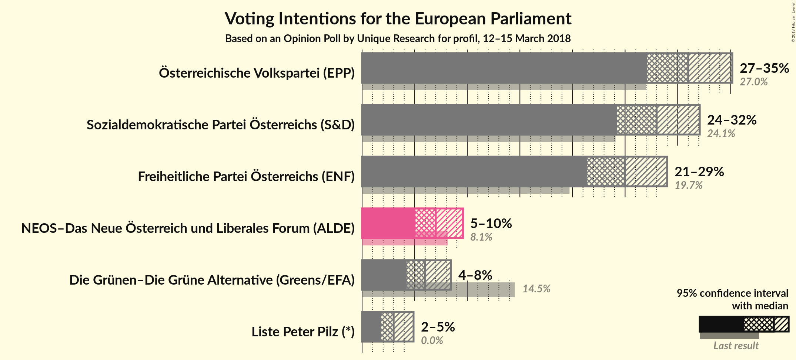
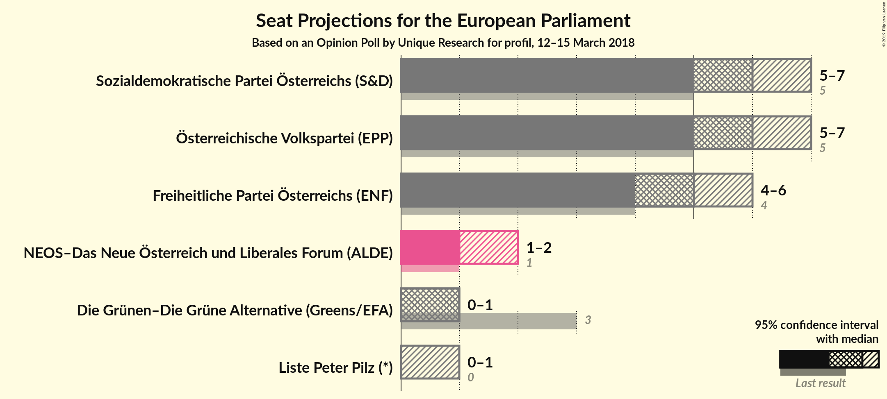
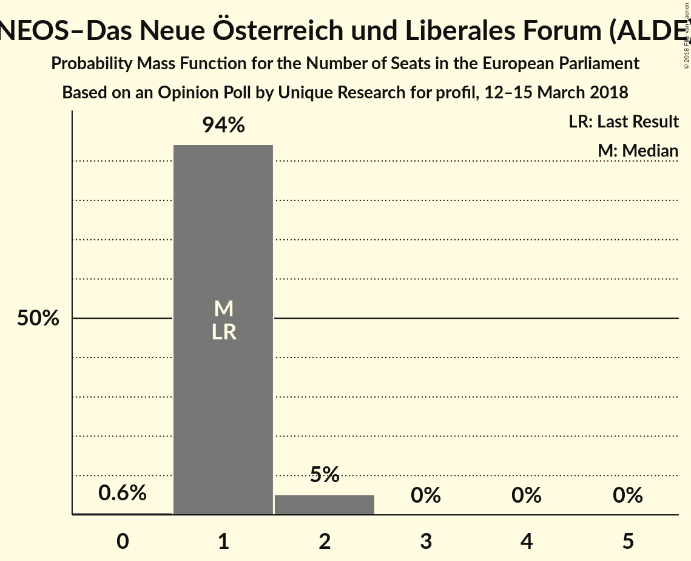
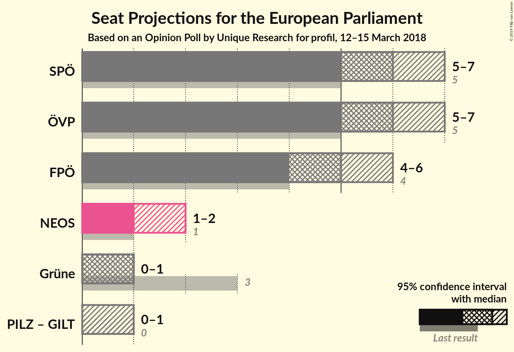

# Opinion Poll by Unique Research for profil, 12–15 March 2018

<a href="#voting-intentions">Voting Intentions</a> | <a href="#seats">Seats</a> | <a href="#coalitions">Coalitions</a> | <a href="#technical-information">Technical Information</a>

## Voting Intentions

### Confidence Intervals

| Party | Last Result | Poll Result | 80% Confidence Interval | 90% Confidence Interval | 95% Confidence Interval | 99% Confidence Interval |
|:-----:|:-----------:|:-----------:|:-----------------------:|:-----------------------:|:-----------------------:|:-----------------------:|
| Österreichische Volkspartei (EPP) | 27.0% | 31.0% | 28.4–33.7% |27.7–34.5% |27.1–35.2% |25.9–36.5% |
| Sozialdemokratische Partei Österreichs (S&D) | 24.1% | 28.0% | 25.5–30.7% |24.8–31.4% |24.2–32.1% |23.1–33.4% |
| Freiheitliche Partei Österreichs (ENF) | 19.7% | 25.0% | 22.6–27.6% |22.0–28.3% |21.4–29.0% |20.3–30.3% |
| NEOS–Das Neue Österreich und Liberales Forum (ALDE) | 8.1% | 7.0% | 5.7–8.7% |5.4–9.2% |5.1–9.6% |4.5–10.5% |
| Die Grünen–Die Grüne Alternative (Greens/EFA) | 14.5% | 6.0% | 4.8–7.6% |4.5–8.0% |4.2–8.4% |3.7–9.3% |
| Liste Peter Pilz (—) | 0.0% | 3.0% | 2.2–4.2% |2.0–4.6% |1.8–4.9% |1.5–5.5% |

*Note:* The poll result column reflects the actual value used in the calculations. Published results may vary slightly, and in addition be rounded to fewer digits.

## Seats

### Confidence Intervals

| Party | Last Result | Median | 80% Confidence Interval | 90% Confidence Interval | 95% Confidence Interval | 99% Confidence Interval |
|:-----:|:-----------:|:------:|:-----------------------:|:-----------------------:|:-----------------------:|:-----------------------:|
| <a href="#Österreichische-volkspartei-(epp)">Österreichische Volkspartei (EPP)</a> | 5 | 6 | 6–7 |6–7 |5–7 |5–8 |
| <a href="#sozialdemokratische-partei-Österreichs-(s&d)">Sozialdemokratische Partei Österreichs (S&D)</a> | 5 | 6 | 5–6 |5–6 |5–7 |5–7 |
| <a href="#freiheitliche-partei-Österreichs-(enf)">Freiheitliche Partei Österreichs (ENF)</a> | 4 | 5 | 4–6 |4–6 |4–6 |4–6 |
| <a href="#neos–das-neue-Österreich-und-liberales-forum-(alde)">NEOS–Das Neue Österreich und Liberales Forum (ALDE)</a> | 1 | 1 | 1 |1–2 |1–2 |0–2 |
| <a href="#die-grünen–die-grüne-alternative-(greens/efa)">Die Grünen–Die Grüne Alternative (Greens/EFA)</a> | 3 | 1 | 1 |0–1 |0–1 |0–2 |
| <a href="#liste-peter-pilz-(—)">Liste Peter Pilz (—)</a> | 0 | 0 | 0 |0 |0–1 |0–1 |

### Österreichische Volkspartei (EPP)

*For a full overview of the results for this party, see the [Österreichische Volkspartei (EPP)](party-Österreichischevolksparteiepp.html) page.*

| Number of Seats | Probability | Accumulated | Special Marks |
|:---------------:|:-----------:|:-----------:|:-------------:|
| 5 | 4% | 100% | Last Result |
| 6 | 63% | 96% | Median |
| 7 | 33% | 33% |  |
| 8 | 0.5% | 0.5% |  |
| 9 | 0% | 0% |  |

### Sozialdemokratische Partei Österreichs (S&D)

*For a full overview of the results for this party, see the [Sozialdemokratische Partei Österreichs (S&D)](party-sozialdemokratischeparteiÖsterreichssd.html) page.*

| Number of Seats | Probability | Accumulated | Special Marks |
|:---------------:|:-----------:|:-----------:|:-------------:|
| 4 | 0.3% | 100% |  |
| 5 | 37% | 99.7% | Last Result |
| 6 | 60% | 63% | Median |
| 7 | 3% | 3% |  |
| 8 | 0% | 0% |  |

### Freiheitliche Partei Österreichs (ENF)

*For a full overview of the results for this party, see the [Freiheitliche Partei Österreichs (ENF)](party-freiheitlicheparteiÖsterreichsenf.html) page.*

| Number of Seats | Probability | Accumulated | Special Marks |
|:---------------:|:-----------:|:-----------:|:-------------:|
| 4 | 12% | 100% | Last Result |
| 5 | 75% | 87% | Median |
| 6 | 12% | 12% |  |
| 7 | 0.1% | 0.1% |  |
| 8 | 0% | 0% |  |

### NEOS–Das Neue Österreich und Liberales Forum (ALDE)

*For a full overview of the results for this party, see the [NEOS–Das Neue Österreich und Liberales Forum (ALDE)](party-neos–dasneueÖsterreichundliberalesforumalde.html) page.*

| Number of Seats | Probability | Accumulated | Special Marks |
|:---------------:|:-----------:|:-----------:|:-------------:|
| 0 | 0.6% | 100% |  |
| 1 | 94% | 99.4% | Last Result, Median |
| 2 | 5% | 5% |  |
| 3 | 0% | 0% |  |

### Die Grünen–Die Grüne Alternative (Greens/EFA)

*For a full overview of the results for this party, see the [Die Grünen–Die Grüne Alternative (Greens/EFA)](party-diegrünen–diegrünealternativegreensefa.html) page.*

| Number of Seats | Probability | Accumulated | Special Marks |
|:---------------:|:-----------:|:-----------:|:-------------:|
| 0 | 6% | 100% |  |
| 1 | 93% | 94% | Median |
| 2 | 0.9% | 0.9% |  |
| 3 | 0% | 0% | Last Result |

### Liste Peter Pilz (—)

*For a full overview of the results for this party, see the [Liste Peter Pilz (—)](party-listepeterpilz—.html) page.*

| Number of Seats | Probability | Accumulated | Special Marks |
|:---------------:|:-----------:|:-----------:|:-------------:|
| 0 | 95% | 100% | Last Result, Median |
| 1 | 5% | 5% |  |
| 2 | 0% | 0% |  |

## Coalitions

### Confidence Intervals

| Coalition | Last Result | Median | Majority? | 80% Confidence Interval | 90% Confidence Interval | 95% Confidence Interval | 99% Confidence Interval |
|:---------:|:-----------:|:------:|:---------:|:-----------------------:|:-----------------------:|:-----------------------:|:-----------------------:|
| Sozialdemokratische Partei Österreichs (S&D) | 5 | 6 | 0% | 5–6 | 5–6 | 5–7 | 5–7 |
| Österreichische Volkspartei (EPP) | 5 | 6 | 0% | 6–7 | 6–7 | 5–7 | 5–8 |
| Freiheitliche Partei Österreichs (ENF) | 4 | 5 | 0% | 4–6 | 4–6 | 4–6 | 4–6 |
| NEOS–Das Neue Österreich und Liberales Forum (ALDE) | 1 | 1 | 0% | 1 | 1–2 | 1–2 | 0–2 |
| Die Grünen–Die Grüne Alternative (Greens/EFA) | 3 | 1 | 0% | 1 | 0–1 | 0–1 | 0–2 |

### Sozialdemokratische Partei Österreichs (S&D)

| Number of Seats | Probability | Accumulated | Special Marks |
|:---------------:|:-----------:|:-----------:|:-------------:|
| 4 | 0.3% | 100% |  |
| 5 | 37% | 99.7% | Last Result |
| 6 | 60% | 63% | Median |
| 7 | 3% | 3% |  |
| 8 | 0% | 0% |  |

### Österreichische Volkspartei (EPP)

| Number of Seats | Probability | Accumulated | Special Marks |
|:---------------:|:-----------:|:-----------:|:-------------:|
| 5 | 4% | 100% | Last Result |
| 6 | 63% | 96% | Median |
| 7 | 33% | 33% |  |
| 8 | 0.5% | 0.5% |  |
| 9 | 0% | 0% |  |

### Freiheitliche Partei Österreichs (ENF)

| Number of Seats | Probability | Accumulated | Special Marks |
|:---------------:|:-----------:|:-----------:|:-------------:|
| 4 | 12% | 100% | Last Result |
| 5 | 75% | 87% | Median |
| 6 | 12% | 12% |  |
| 7 | 0.1% | 0.1% |  |
| 8 | 0% | 0% |  |

### NEOS–Das Neue Österreich und Liberales Forum (ALDE)

| Number of Seats | Probability | Accumulated | Special Marks |
|:---------------:|:-----------:|:-----------:|:-------------:|
| 0 | 0.6% | 100% |  |
| 1 | 94% | 99.4% | Last Result, Median |
| 2 | 5% | 5% |  |
| 3 | 0% | 0% |  |

### Die Grünen–Die Grüne Alternative (Greens/EFA)

| Number of Seats | Probability | Accumulated | Special Marks |
|:---------------:|:-----------:|:-----------:|:-------------:|
| 0 | 6% | 100% |  |
| 1 | 93% | 94% | Median |
| 2 | 0.9% | 0.9% |  |
| 3 | 0% | 0% | Last Result |

## Technical Information

### Opinion Poll

+ **Polling firm:** Unique Research
+ **Commissioner(s):** profil
+ **Fieldwork period:** 12–15 March 2018

### Calculations

+ **Sample size:** 500
+ **Simulations done:** 1,048,576
+ **Error estimate:** 3.14%

