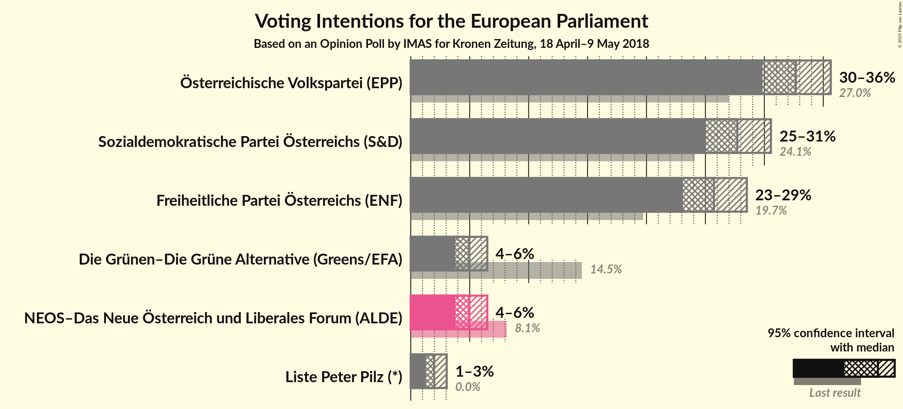
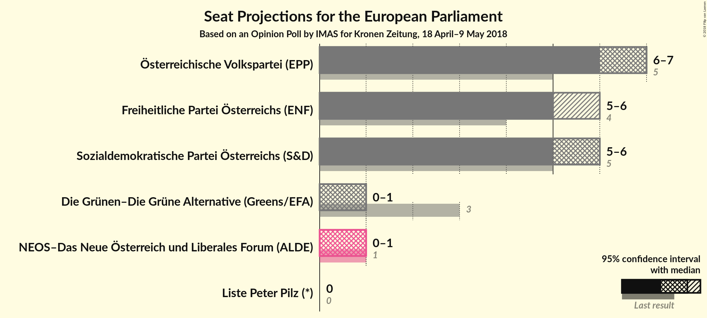
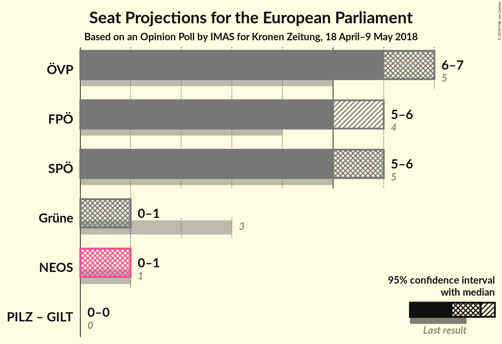

# Opinion Poll by IMAS for Kronen Zeitung, 18 April–9 May 2018

<a href="#voting-intentions">Voting Intentions</a> | <a href="#seats">Seats</a> | <a href="#coalitions">Coalitions</a> | <a href="#technical-information">Technical Information</a>

## Voting Intentions

### Confidence Intervals

| Party | Last Result | Poll Result | 80% Confidence Interval | 90% Confidence Interval | 95% Confidence Interval | 99% Confidence Interval |
|:-----:|:-----------:|:-----------:|:-----------------------:|:-----------------------:|:-----------------------:|:-----------------------:|
| Österreichische Volkspartei (EPP) | 27.0% | 32.7% | N/A |N/A |N/A |N/A |
| Sozialdemokratische Partei Österreichs (S&D) | 24.1% | 27.7% | N/A |N/A |N/A |N/A |
| Freiheitliche Partei Österreichs (ENF) | 19.7% | 25.7% | N/A |N/A |N/A |N/A |
| NEOS–Das Neue Österreich und Liberales Forum (ALDE) | 8.1% | 5.0% | N/A |N/A |N/A |N/A |
| Die Grünen–Die Grüne Alternative (Greens/EFA) | 14.5% | 5.0% | N/A |N/A |N/A |N/A |
| Liste Peter Pilz (*) | 0.0% | 2.0% | N/A |N/A |N/A |N/A |

*Note:* The poll result column reflects the actual value used in the calculations. Published results may vary slightly, and in addition be rounded to fewer digits.

## Seats

### Confidence Intervals

| Party | Last Result | Median | 80% Confidence Interval | 90% Confidence Interval | 95% Confidence Interval | 99% Confidence Interval |
|:-----:|:-----------:|:------:|:-----------------------:|:-----------------------:|:-----------------------:|:-----------------------:|
| <a href="#österreichische-volkspartei-(epp)">Österreichische Volkspartei (EPP)</a> | 5 | N/A | N/A |N/A |N/A |N/A |
| <a href="#sozialdemokratische-partei-österreichs-(s&d)">Sozialdemokratische Partei Österreichs (S&D)</a> | 5 | N/A | N/A |N/A |N/A |N/A |
| <a href="#freiheitliche-partei-österreichs-(enf)">Freiheitliche Partei Österreichs (ENF)</a> | 4 | N/A | N/A |N/A |N/A |N/A |
| <a href="#neos–das-neue-österreich-und-liberales-forum-(alde)">NEOS–Das Neue Österreich und Liberales Forum (ALDE)</a> | 1 | N/A | N/A |N/A |N/A |N/A |
| <a href="#die-grünen–die-grüne-alternative-(greens/efa)">Die Grünen–Die Grüne Alternative (Greens/EFA)</a> | 3 | N/A | N/A |N/A |N/A |N/A |
| <a href="#liste-peter-pilz-(*)">Liste Peter Pilz (*)</a> | 0 | N/A | N/A |N/A |N/A |N/A |

## Coalitions

## Technical Information

### Opinion Poll

+ **Polling firm:** IMAS
+ **Commissioner(s):** Kronen Zeitung
+ **Fieldwork period:** 18 April–9 May 2018

### Calculations

+ **Sample size:** 1007
+ **Simulations done:** 0
+ **Error estimate:** 100.00%

