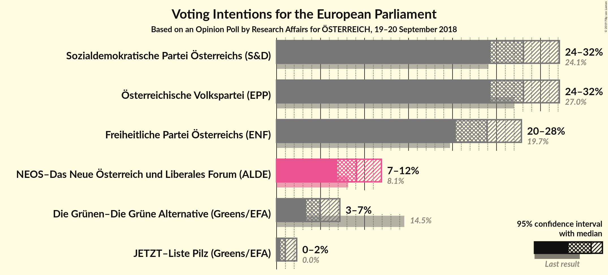
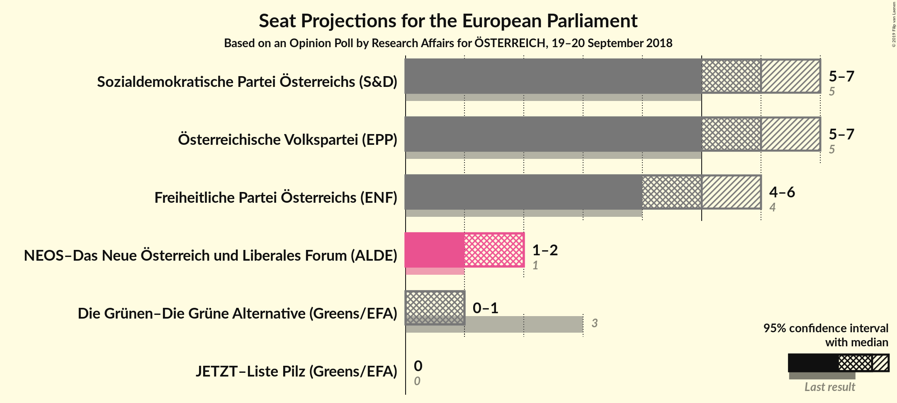
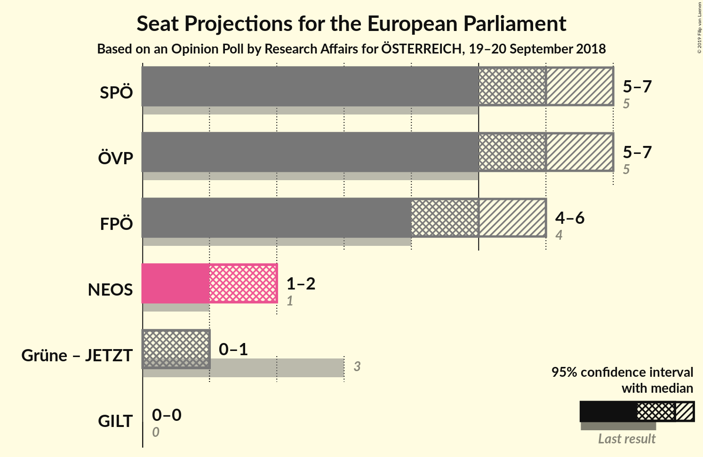
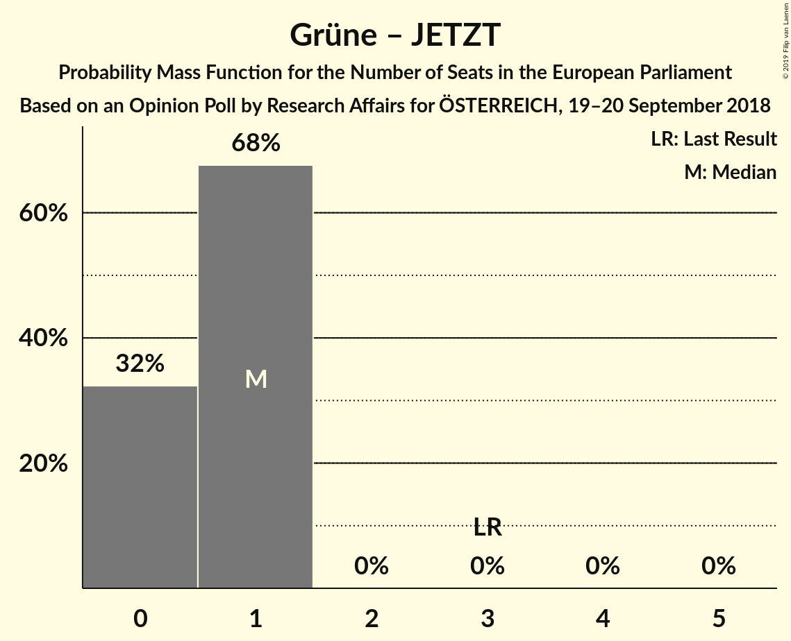

# Opinion Poll by Research Affairs for ÖSTERREICH, 19–20 September 2018

<a href="#voting-intentions">Voting Intentions</a> | <a href="#seats">Seats</a> | <a href="#coalitions">Coalitions</a> | <a href="#technical-information">Technical Information</a>

## Voting Intentions

### Confidence Intervals

| Party | Last Result | Poll Result | 80% Confidence Interval | 90% Confidence Interval | 95% Confidence Interval | 99% Confidence Interval |
|:-----:|:-----------:|:-----------:|:-----------------------:|:-----------------------:|:-----------------------:|:-----------------------:|
| Österreichische Volkspartei (EPP) | 27.0% | 28.1% | 25.6–30.7% |24.9–31.5% |24.3–32.1% |23.2–33.4% |
| Sozialdemokratische Partei Österreichs (S&D) | 24.1% | 28.1% | 25.6–30.7% |24.9–31.5% |24.3–32.1% |23.2–33.4% |
| Freiheitliche Partei Österreichs (ENF) | 19.7% | 23.9% | 21.6–26.5% |21.0–27.2% |20.4–27.8% |19.3–29.1% |
| NEOS–Das Neue Österreich und Liberales Forum (ALDE) | 8.1% | 9.1% | 7.6–10.9% |7.2–11.5% |6.9–11.9% |6.2–12.9% |
| Die Grünen–Die Grüne Alternative (Greens/EFA) | 14.5% | 4.9% | 3.9–6.4% |3.6–6.8% |3.4–7.2% |2.9–8.0% |
| JETZT–Liste Pilz (Greens/EFA) | 0.0% | 1.0% | 0.6–1.8% |0.5–2.1% |0.4–2.3% |0.3–2.8% |

*Note:* The poll result column reflects the actual value used in the calculations. Published results may vary slightly, and in addition be rounded to fewer digits.

## Seats

### Confidence Intervals

| Party | Last Result | Median | 80% Confidence Interval | 90% Confidence Interval | 95% Confidence Interval | 99% Confidence Interval |
|:-----:|:-----------:|:------:|:-----------------------:|:-----------------------:|:-----------------------:|:-----------------------:|
| <a href="#österreichische-volkspartei-(epp)">Österreichische Volkspartei (EPP)</a> | 5 | 5 | 5 |5 |5 |5 |
| <a href="#sozialdemokratische-partei-österreichs-(s&d)">Sozialdemokratische Partei Österreichs (S&D)</a> | 5 | 6 | 6 |6 |6–7 |6–7 |
| <a href="#freiheitliche-partei-österreichs-(enf)">Freiheitliche Partei Österreichs (ENF)</a> | 4 | 4 | 4–5 |4–5 |4–5 |4–5 |
| <a href="#neos–das-neue-österreich-und-liberales-forum-(alde)">NEOS–Das Neue Österreich und Liberales Forum (ALDE)</a> | 1 | 2 | 1–2 |1–2 |1–2 |1–2 |
| <a href="#die-grünen–die-grüne-alternative-(greens/efa)">Die Grünen–Die Grüne Alternative (Greens/EFA)</a> | 3 | 1 | 1 |1 |0–1 |0–1 |
| <a href="#jetzt–liste-pilz-(greens/efa)">JETZT–Liste Pilz (Greens/EFA)</a> | 0 | 0 | 0 |0 |0 |0 |

### Österreichische Volkspartei (EPP)

*For a full overview of the results for this party, see the [Österreichische Volkspartei (EPP)](party-österreichischevolksparteiepp.html) page.*

| Number of Seats | Probability | Accumulated | Special Marks |
|:---------------:|:-----------:|:-----------:|:-------------:|
| 4 | 0.2% | 100% |  |
| 5 | 99.5% | 99.8% | Last Result, Median |
| 6 | 0.2% | 0.3% |  |
| 7 | 0% | 0.1% |  |
| 8 | 0.1% | 0.1% |  |
| 9 | 0% | 0% |  |

### Sozialdemokratische Partei Österreichs (S&D)

*For a full overview of the results for this party, see the [Sozialdemokratische Partei Österreichs (S&D)](party-sozialdemokratischeparteiösterreichssd.html) page.*

| Number of Seats | Probability | Accumulated | Special Marks |
|:---------------:|:-----------:|:-----------:|:-------------:|
| 4 | 0.1% | 100% |  |
| 5 | 0.1% | 99.9% | Last Result |
| 6 | 96% | 99.8% | Median |
| 7 | 4% | 4% |  |
| 8 | 0% | 0% |  |

### Freiheitliche Partei Österreichs (ENF)

*For a full overview of the results for this party, see the [Freiheitliche Partei Österreichs (ENF)](party-freiheitlicheparteiösterreichsenf.html) page.*

| Number of Seats | Probability | Accumulated | Special Marks |
|:---------------:|:-----------:|:-----------:|:-------------:|
| 4 | 65% | 100% | Last Result, Median |
| 5 | 35% | 35% |  |
| 6 | 0.2% | 0.2% |  |
| 7 | 0% | 0% |  |

### NEOS–Das Neue Österreich und Liberales Forum (ALDE)

*For a full overview of the results for this party, see the [NEOS–Das Neue Österreich und Liberales Forum (ALDE)](party-neos–dasneueösterreichundliberalesforumalde.html) page.*

| Number of Seats | Probability | Accumulated | Special Marks |
|:---------------:|:-----------:|:-----------:|:-------------:|
| 1 | 16% | 100% | Last Result |
| 2 | 84% | 84% | Median |
| 3 | 0% | 0% |  |

### Die Grünen–Die Grüne Alternative (Greens/EFA)

*For a full overview of the results for this party, see the [Die Grünen–Die Grüne Alternative (Greens/EFA)](party-diegrünen–diegrünealternativegreensefa.html) page.*

| Number of Seats | Probability | Accumulated | Special Marks |
|:---------------:|:-----------:|:-----------:|:-------------:|
| 0 | 5% | 100% |  |
| 1 | 95% | 95% | Median |
| 2 | 0% | 0% |  |
| 3 | 0% | 0% | Last Result |

### JETZT–Liste Pilz (Greens/EFA)

*For a full overview of the results for this party, see the [JETZT–Liste Pilz (Greens/EFA)](party-jetzt–listepilzgreensefa.html) page.*

| Number of Seats | Probability | Accumulated | Special Marks |
|:---------------:|:-----------:|:-----------:|:-------------:|
| 0 | 100% | 100% | Last Result, Median |

## Coalitions

### Confidence Intervals

| Coalition | Last Result | Median | Majority? | 80% Confidence Interval | 90% Confidence Interval | 95% Confidence Interval | 99% Confidence Interval |
|:---------:|:-----------:|:------:|:---------:|:-----------------------:|:-----------------------:|:-----------------------:|:-----------------------:|
| Sozialdemokratische Partei Österreichs (S&D) | 5 | 6 | 0% | 6 | 6 | 6–7 | 6–7 |
| Österreichische Volkspartei (EPP) | 5 | 5 | 0% | 5 | 5 | 5 | 5 |
| Freiheitliche Partei Österreichs (ENF) | 4 | 4 | 0% | 4–5 | 4–5 | 4–5 | 4–5 |
| NEOS–Das Neue Österreich und Liberales Forum (ALDE) | 1 | 2 | 0% | 1–2 | 1–2 | 1–2 | 1–2 |
| Die Grünen–Die Grüne Alternative (Greens/EFA) – JETZT–Liste Pilz (Greens/EFA) | 3 | 1 | 0% | 1 | 1 | 0–1 | 0–1 |

### Sozialdemokratische Partei Österreichs (S&D)

| Number of Seats | Probability | Accumulated | Special Marks |
|:---------------:|:-----------:|:-----------:|:-------------:|
| 4 | 0.1% | 100% |  |
| 5 | 0.1% | 99.9% | Last Result |
| 6 | 96% | 99.8% | Median |
| 7 | 4% | 4% |  |
| 8 | 0% | 0% |  |

### Österreichische Volkspartei (EPP)

| Number of Seats | Probability | Accumulated | Special Marks |
|:---------------:|:-----------:|:-----------:|:-------------:|
| 4 | 0.2% | 100% |  |
| 5 | 99.5% | 99.8% | Last Result, Median |
| 6 | 0.2% | 0.3% |  |
| 7 | 0% | 0.1% |  |
| 8 | 0.1% | 0.1% |  |
| 9 | 0% | 0% |  |

### Freiheitliche Partei Österreichs (ENF)

| Number of Seats | Probability | Accumulated | Special Marks |
|:---------------:|:-----------:|:-----------:|:-------------:|
| 4 | 65% | 100% | Last Result, Median |
| 5 | 35% | 35% |  |
| 6 | 0.2% | 0.2% |  |
| 7 | 0% | 0% |  |

### NEOS–Das Neue Österreich und Liberales Forum (ALDE)

| Number of Seats | Probability | Accumulated | Special Marks |
|:---------------:|:-----------:|:-----------:|:-------------:|
| 1 | 16% | 100% | Last Result |
| 2 | 84% | 84% | Median |
| 3 | 0% | 0% |  |

### Die Grünen–Die Grüne Alternative (Greens/EFA) – JETZT–Liste Pilz (Greens/EFA)

| Number of Seats | Probability | Accumulated | Special Marks |
|:---------------:|:-----------:|:-----------:|:-------------:|
| 0 | 5% | 100% |  |
| 1 | 95% | 95% | Median |
| 2 | 0% | 0% |  |
| 3 | 0% | 0% | Last Result |

## Technical Information

### Opinion Poll

+ **Polling firm:** Research Affairs
+ **Commissioner(s):** ÖSTERREICH
+ **Fieldwork period:** 19–20 September 2018

### Calculations

+ **Sample size:** 506
+ **Simulations done:** 1,024
+ **Error estimate:** 6.52%

