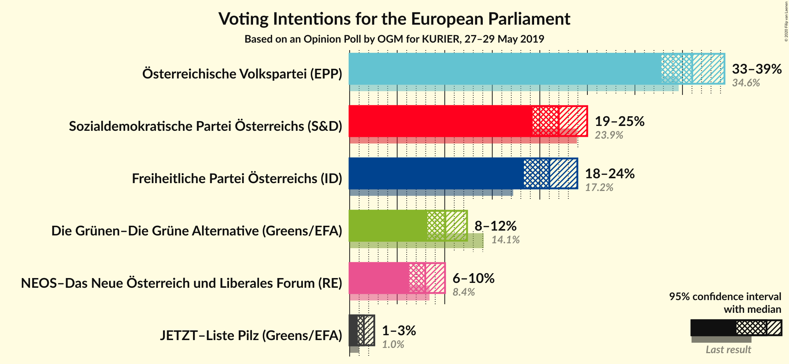
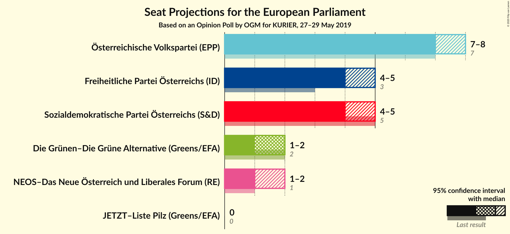
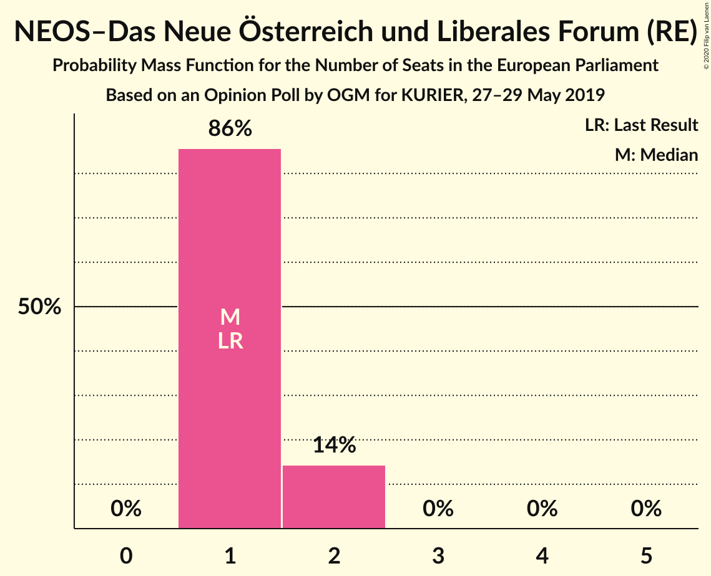
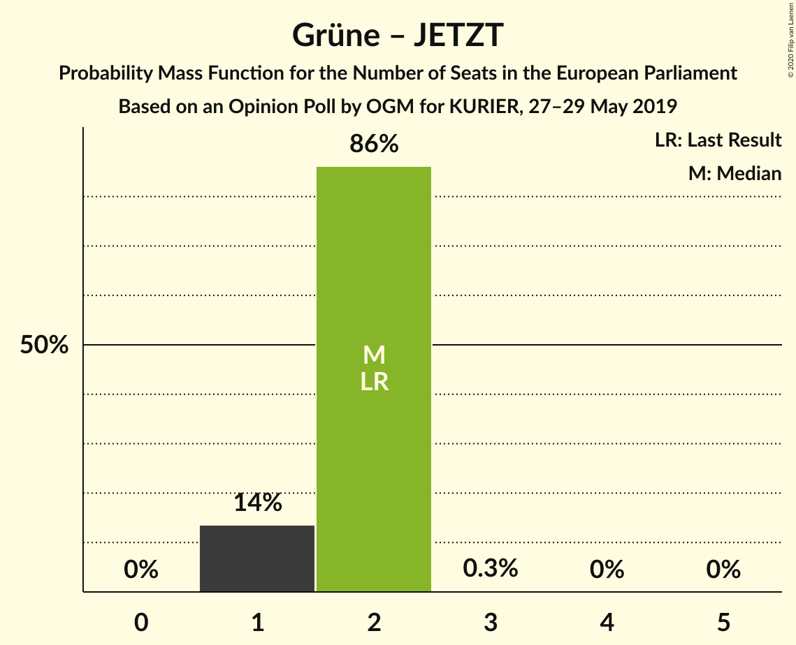
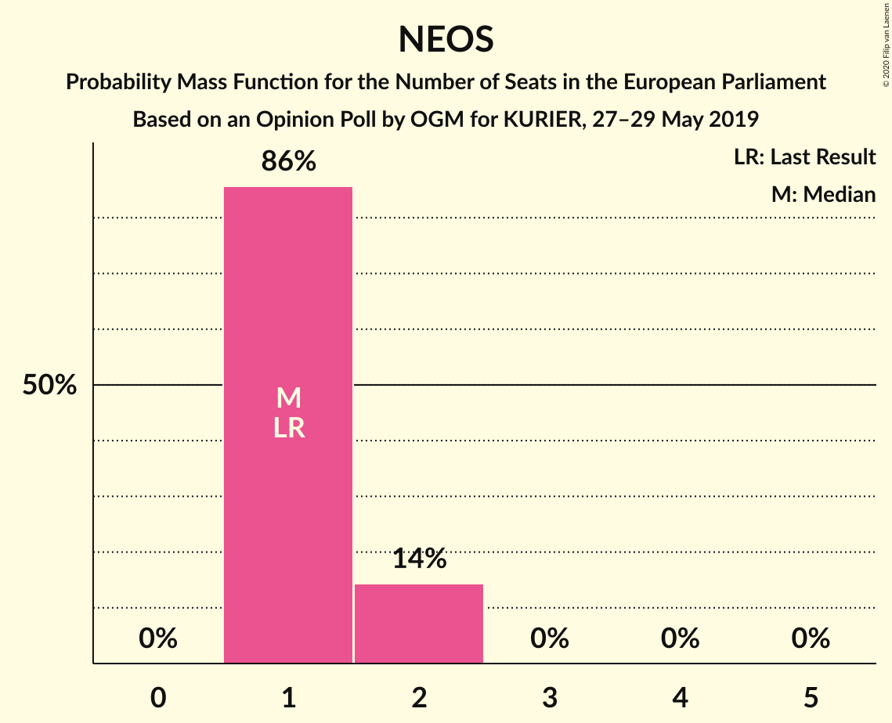

# Opinion Poll by OGM for KURIER, 27–29 May 2019

<a href="#voting-intentions">Voting Intentions</a> | <a href="#seats">Seats</a> | <a href="#coalitions">Coalitions</a> | <a href="#technical-information">Technical Information</a>

## Voting Intentions

### Confidence Intervals

| Party | Last Result | Poll Result | 80% Confidence Interval | 90% Confidence Interval | 95% Confidence Interval | 99% Confidence Interval |
|:-----:|:-----------:|:-----------:|:-----------------------:|:-----------------------:|:-----------------------:|:-----------------------:|
| Österreichische Volkspartei (EPP) | 34.6% | 36.0% | 33.9–38.2% |33.3–38.9% |32.8–39.4% |31.8–40.5% |
| Sozialdemokratische Partei Österreichs (S&D) | 23.9% | 22.0% | 20.2–23.9% |19.7–24.5% |19.3–25.0% |18.4–25.9% |
| Freiheitliche Partei Österreichs (ID) | 17.2% | 21.0% | 19.2–22.9% |18.7–23.5% |18.3–23.9% |17.5–24.9% |
| Die Grünen–Die Grüne Alternative (Greens/EFA) | 14.1% | 10.1% | 8.8–11.6% |8.5–12.0% |8.2–12.3% |7.6–13.1% |
| NEOS–Das Neue Österreich und Liberales Forum (RE) | 8.4% | 8.0% | 6.8–9.3% |6.5–9.7% |6.3–10.0% |5.8–10.7% |
| JETZT–Liste Pilz (Greens/EFA) | 1.0% | 1.5% | 1.1–2.2% |0.9–2.4% |0.9–2.6% |0.7–3.0% |

*Note:* The poll result column reflects the actual value used in the calculations. Published results may vary slightly, and in addition be rounded to fewer digits.

## Seats

### Confidence Intervals

| Party | Last Result | Median | 80% Confidence Interval | 90% Confidence Interval | 95% Confidence Interval | 99% Confidence Interval |
|:-----:|:-----------:|:------:|:-----------------------:|:-----------------------:|:-----------------------:|:-----------------------:|
| <a href="#österreichische-volkspartei-(epp)">Österreichische Volkspartei (EPP)</a> | 7 | 8 | 7–8 |7–8 |7–9 |7–9 |
| <a href="#sozialdemokratische-partei-österreichs-(s&d)">Sozialdemokratische Partei Österreichs (S&D)</a> | 5 | 4 | 4 |4 |4 |4–5 |
| <a href="#freiheitliche-partei-österreichs-(id)">Freiheitliche Partei Österreichs (ID)</a> | 3 | 4 | 4 |4 |4 |4–5 |
| <a href="#die-grünen–die-grüne-alternative-(greens/efa)">Die Grünen–Die Grüne Alternative (Greens/EFA)</a> | 2 | 2 | 2 |1–2 |1–2 |1–2 |
| <a href="#neos–das-neue-österreich-und-liberales-forum-(re)">NEOS–Das Neue Österreich und Liberales Forum (RE)</a> | 1 | 1 | 1–2 |1–2 |1–2 |1–2 |
| <a href="#jetzt–liste-pilz-(greens/efa)">JETZT–Liste Pilz (Greens/EFA)</a> | 0 | 0 | 0 |0 |0 |0 |

### Österreichische Volkspartei (EPP)

*For a full overview of the results for this party, see the [Österreichische Volkspartei (EPP)](party-österreichischevolksparteiepp.html) page.*

| Number of Seats | Probability | Accumulated | Special Marks |
|:---------------:|:-----------:|:-----------:|:-------------:|
| 6 | 0.1% | 100% |  |
| 7 | 46% | 99.9% | Last Result |
| 8 | 49% | 54% | Median |
| 9 | 4% | 4% |  |
| 10 | 0% | 0% | Majority |

### Sozialdemokratische Partei Österreichs (S&D)

*For a full overview of the results for this party, see the [Sozialdemokratische Partei Österreichs (S&D)](party-sozialdemokratischeparteiösterreichssd.html) page.*

| Number of Seats | Probability | Accumulated | Special Marks |
|:---------------:|:-----------:|:-----------:|:-------------:|
| 4 | 98% | 100% | Median |
| 5 | 2% | 2% | Last Result |
| 6 | 0% | 0% |  |

### Freiheitliche Partei Österreichs (ID)

*For a full overview of the results for this party, see the [Freiheitliche Partei Österreichs (ID)](party-freiheitlicheparteiösterreichsid.html) page.*

| Number of Seats | Probability | Accumulated | Special Marks |
|:---------------:|:-----------:|:-----------:|:-------------:|
| 3 | 0.2% | 100% | Last Result |
| 4 | 99.2% | 99.8% | Median |
| 5 | 0.7% | 0.7% |  |
| 6 | 0% | 0% |  |

### Die Grünen–Die Grüne Alternative (Greens/EFA)

*For a full overview of the results for this party, see the [Die Grünen–Die Grüne Alternative (Greens/EFA)](party-diegrünen–diegrünealternativegreensefa.html) page.*

| Number of Seats | Probability | Accumulated | Special Marks |
|:---------------:|:-----------:|:-----------:|:-------------:|
| 1 | 5% | 100% |  |
| 2 | 95% | 95% | Last Result, Median |
| 3 | 0% | 0% |  |

### NEOS–Das Neue Österreich und Liberales Forum (RE)

*For a full overview of the results for this party, see the [NEOS–Das Neue Österreich und Liberales Forum (RE)](party-neos–dasneueösterreichundliberalesforumre.html) page.*

| Number of Seats | Probability | Accumulated | Special Marks |
|:---------------:|:-----------:|:-----------:|:-------------:|
| 1 | 55% | 100% | Last Result, Median |
| 2 | 45% | 45% |  |
| 3 | 0% | 0% |  |

### JETZT–Liste Pilz (Greens/EFA)

*For a full overview of the results for this party, see the [JETZT–Liste Pilz (Greens/EFA)](party-jetzt–listepilzgreensefa.html) page.*

| Number of Seats | Probability | Accumulated | Special Marks |
|:---------------:|:-----------:|:-----------:|:-------------:|
| 0 | 100% | 100% | Last Result, Median |

## Coalitions

### Confidence Intervals

| Coalition | Last Result | Median | Majority? | 80% Confidence Interval | 90% Confidence Interval | 95% Confidence Interval | 99% Confidence Interval |
|:---------:|:-----------:|:------:|:---------:|:-----------------------:|:-----------------------:|:-----------------------:|:-----------------------:|
| Österreichische Volkspartei (EPP) | 7 | 8 | 0% | 7–8 | 7–8 | 7–9 | 7–9 |
| Freiheitliche Partei Österreichs (ID) | 3 | 4 | 0% | 4 | 4 | 4 | 4–5 |
| Sozialdemokratische Partei Österreichs (S&D) | 5 | 4 | 0% | 4 | 4 | 4 | 4–5 |
| Die Grünen–Die Grüne Alternative (Greens/EFA) – JETZT–Liste Pilz (Greens/EFA) | 2 | 2 | 0% | 2 | 1–2 | 1–2 | 1–2 |
| NEOS–Das Neue Österreich und Liberales Forum (RE) | 1 | 1 | 0% | 1–2 | 1–2 | 1–2 | 1–2 |

### Österreichische Volkspartei (EPP)

| Number of Seats | Probability | Accumulated | Special Marks |
|:---------------:|:-----------:|:-----------:|:-------------:|
| 6 | 0.1% | 100% |  |
| 7 | 46% | 99.9% | Last Result |
| 8 | 49% | 54% | Median |
| 9 | 4% | 4% |  |
| 10 | 0% | 0% | Majority |

### Freiheitliche Partei Österreichs (ID)

| Number of Seats | Probability | Accumulated | Special Marks |
|:---------------:|:-----------:|:-----------:|:-------------:|
| 3 | 0.2% | 100% | Last Result |
| 4 | 99.2% | 99.8% | Median |
| 5 | 0.7% | 0.7% |  |
| 6 | 0% | 0% |  |

### Sozialdemokratische Partei Österreichs (S&D)

| Number of Seats | Probability | Accumulated | Special Marks |
|:---------------:|:-----------:|:-----------:|:-------------:|
| 4 | 98% | 100% | Median |
| 5 | 2% | 2% | Last Result |
| 6 | 0% | 0% |  |

### Die Grünen–Die Grüne Alternative (Greens/EFA) – JETZT–Liste Pilz (Greens/EFA)

| Number of Seats | Probability | Accumulated | Special Marks |
|:---------------:|:-----------:|:-----------:|:-------------:|
| 1 | 5% | 100% |  |
| 2 | 95% | 95% | Last Result, Median |
| 3 | 0% | 0% |  |

### NEOS–Das Neue Österreich und Liberales Forum (RE)

| Number of Seats | Probability | Accumulated | Special Marks |
|:---------------:|:-----------:|:-----------:|:-------------:|
| 1 | 55% | 100% | Last Result, Median |
| 2 | 45% | 45% |  |
| 3 | 0% | 0% |  |

## Technical Information

### Opinion Poll

+ **Polling firm:** OGM
+ **Commissioner(s):** KURIER
+ **Fieldwork period:** 27–29 May 2019

### Calculations

+ **Sample size:** 805
+ **Simulations done:** 1,024
+ **Error estimate:** 2.77%

