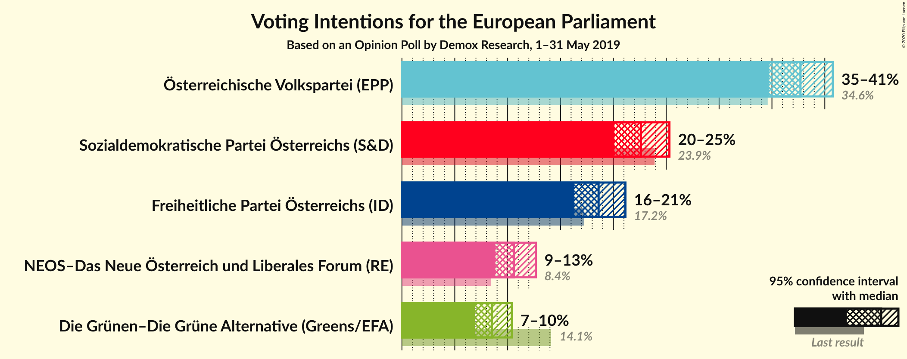
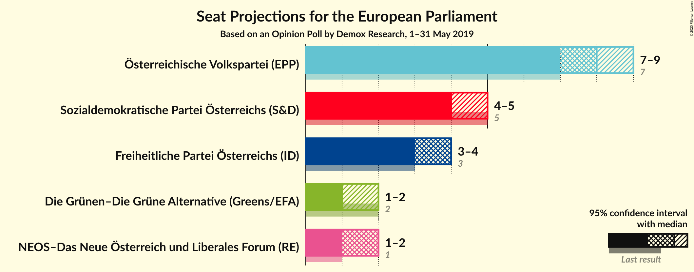
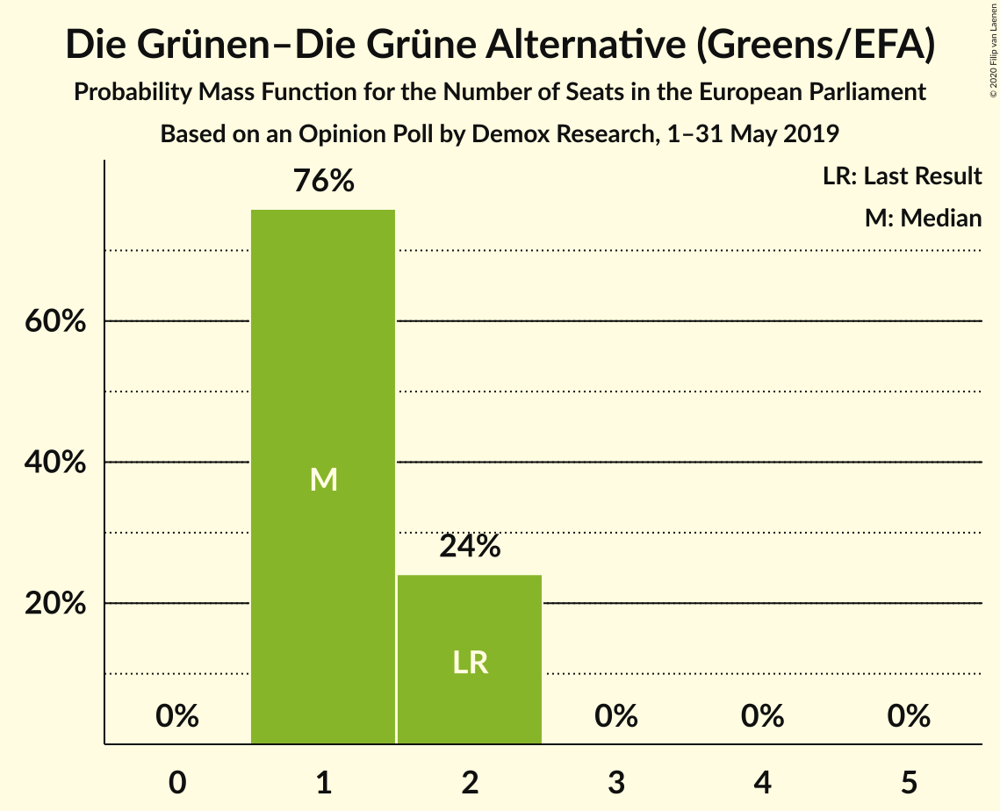
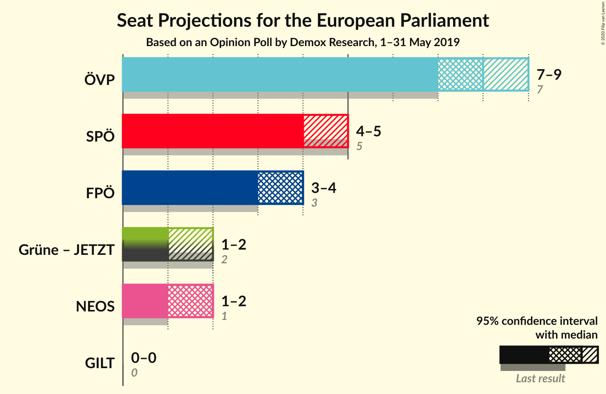
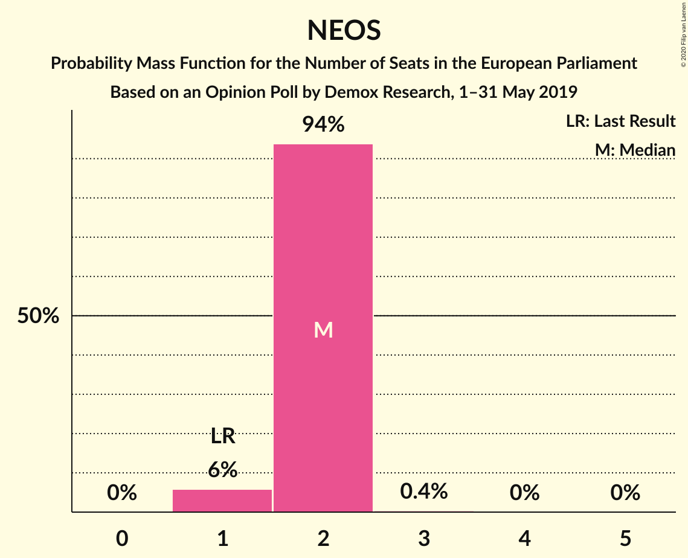

# Opinion Poll by Demox Research, 1–31 May 2019

<a href="#voting-intentions">Voting Intentions</a> | <a href="#seats">Seats</a> | <a href="#coalitions">Coalitions</a> | <a href="#technical-information">Technical Information</a>

## Voting Intentions

### Confidence Intervals

| Party | Last Result | Poll Result | 80% Confidence Interval | 90% Confidence Interval | 95% Confidence Interval | 99% Confidence Interval |
|:-----:|:-----------:|:-----------:|:-----------------------:|:-----------------------:|:-----------------------:|:-----------------------:|
| Österreichische Volkspartei (EPP) | 27.0% | 37.7% | 35.8–39.7% |35.2–40.3% |34.7–40.8% |33.8–41.7% |
| Sozialdemokratische Partei Österreichs (S&D) | 24.1% | 22.6% | 21.0–24.4% |20.5–24.9% |20.1–25.3% |19.3–26.2% |
| Freiheitliche Partei Österreichs (ID) | 19.7% | 18.6% | 17.1–20.3% |16.7–20.7% |16.3–21.1% |15.6–21.9% |
| NEOS–Das Neue Österreich und Liberales Forum (RE) | 8.1% | 10.6% | 9.4–11.9% |9.1–12.3% |8.8–12.7% |8.3–13.3% |
| Die Grünen–Die Grüne Alternative (Greens/EFA) | 14.5% | 8.5% | 7.5–9.7% |7.2–10.1% |6.9–10.4% |6.4–11.0% |

*Note:* The poll result column reflects the actual value used in the calculations. Published results may vary slightly, and in addition be rounded to fewer digits.

## Seats

### Confidence Intervals

| Party | Last Result | Median | 80% Confidence Interval | 90% Confidence Interval | 95% Confidence Interval | 99% Confidence Interval |
|:-----:|:-----------:|:------:|:-----------------------:|:-----------------------:|:-----------------------:|:-----------------------:|
| <a href="#österreichische-volkspartei-(epp)">Österreichische Volkspartei (EPP)</a> | 5 | 7 | 7–8 |7–8 |7–8 |6–8 |
| <a href="#sozialdemokratische-partei-österreichs-(s&d)">Sozialdemokratische Partei Österreichs (S&D)</a> | 5 | 4 | 4–5 |4–5 |4–5 |3–5 |
| <a href="#freiheitliche-partei-österreichs-(id)">Freiheitliche Partei Österreichs (ID)</a> | 4 | 3 | 3–4 |3–4 |3–4 |3–4 |
| <a href="#neos–das-neue-österreich-und-liberales-forum-(re)">NEOS–Das Neue Österreich und Liberales Forum (RE)</a> | 1 | 2 | 1–2 |1–2 |1–2 |1–2 |
| <a href="#die-grünen–die-grüne-alternative-(greens/efa)">Die Grünen–Die Grüne Alternative (Greens/EFA)</a> | 3 | 1 | 1–2 |1–2 |1–2 |1–2 |

### Österreichische Volkspartei (EPP)

*For a full overview of the results for this party, see the [Österreichische Volkspartei (EPP)](party-österreichischevolksparteiepp.html) page.*

| Number of Seats | Probability | Accumulated | Special Marks |
|:---------------:|:-----------:|:-----------:|:-------------:|
| 5 | 0% | 100% | Last Result |
| 6 | 0.7% | 100% |  |
| 7 | 58% | 99.3% | Median |
| 8 | 41% | 42% |  |
| 9 | 0.2% | 0.2% |  |
| 10 | 0% | 0% | Majority |

### Sozialdemokratische Partei Österreichs (S&D)

*For a full overview of the results for this party, see the [Sozialdemokratische Partei Österreichs (S&D)](party-sozialdemokratischeparteiösterreichssd.html) page.*

| Number of Seats | Probability | Accumulated | Special Marks |
|:---------------:|:-----------:|:-----------:|:-------------:|
| 3 | 0.5% | 100% |  |
| 4 | 79% | 99.5% | Median |
| 5 | 20% | 20% | Last Result |
| 6 | 0% | 0% |  |

### Freiheitliche Partei Österreichs (ID)

*For a full overview of the results for this party, see the [Freiheitliche Partei Österreichs (ID)](party-freiheitlicheparteiösterreichsid.html) page.*

| Number of Seats | Probability | Accumulated | Special Marks |
|:---------------:|:-----------:|:-----------:|:-------------:|
| 3 | 63% | 100% | Median |
| 4 | 37% | 37% | Last Result |
| 5 | 0% | 0% |  |

### NEOS–Das Neue Österreich und Liberales Forum (RE)

*For a full overview of the results for this party, see the [NEOS–Das Neue Österreich und Liberales Forum (RE)](party-neos–dasneueösterreichundliberalesforumre.html) page.*

| Number of Seats | Probability | Accumulated | Special Marks |
|:---------------:|:-----------:|:-----------:|:-------------:|
| 1 | 12% | 100% | Last Result |
| 2 | 88% | 88% | Median |
| 3 | 0.1% | 0.1% |  |
| 4 | 0% | 0% |  |

### Die Grünen–Die Grüne Alternative (Greens/EFA)

*For a full overview of the results for this party, see the [Die Grünen–Die Grüne Alternative (Greens/EFA)](party-diegrünen–diegrünealternativegreensefa.html) page.*

| Number of Seats | Probability | Accumulated | Special Marks |
|:---------------:|:-----------:|:-----------:|:-------------:|
| 1 | 86% | 100% | Median |
| 2 | 14% | 14% |  |
| 3 | 0% | 0% | Last Result |

## Coalitions

### Confidence Intervals

| Coalition | Last Result | Median | Majority? | 80% Confidence Interval | 90% Confidence Interval | 95% Confidence Interval | 99% Confidence Interval |
|:---------:|:-----------:|:------:|:---------:|:-----------------------:|:-----------------------:|:-----------------------:|:-----------------------:|
| Österreichische Volkspartei (EPP) | 5 | 7 | 0% | 7–8 | 7–8 | 7–8 | 6–8 |
| Sozialdemokratische Partei Österreichs (S&D) | 5 | 4 | 0% | 4–5 | 4–5 | 4–5 | 3–5 |
| Freiheitliche Partei Österreichs (ID) | 4 | 3 | 0% | 3–4 | 3–4 | 3–4 | 3–4 |
| NEOS–Das Neue Österreich und Liberales Forum (RE) | 1 | 2 | 0% | 1–2 | 1–2 | 1–2 | 1–2 |

### Österreichische Volkspartei (EPP)

| Number of Seats | Probability | Accumulated | Special Marks |
|:---------------:|:-----------:|:-----------:|:-------------:|
| 5 | 0% | 100% | Last Result |
| 6 | 0.7% | 100% |  |
| 7 | 58% | 99.3% | Median |
| 8 | 41% | 42% |  |
| 9 | 0.2% | 0.2% |  |
| 10 | 0% | 0% | Majority |

### Sozialdemokratische Partei Österreichs (S&D)

| Number of Seats | Probability | Accumulated | Special Marks |
|:---------------:|:-----------:|:-----------:|:-------------:|
| 3 | 0.5% | 100% |  |
| 4 | 79% | 99.5% | Median |
| 5 | 20% | 20% | Last Result |
| 6 | 0% | 0% |  |

### Freiheitliche Partei Österreichs (ID)

| Number of Seats | Probability | Accumulated | Special Marks |
|:---------------:|:-----------:|:-----------:|:-------------:|
| 3 | 63% | 100% | Median |
| 4 | 37% | 37% | Last Result |
| 5 | 0% | 0% |  |

### NEOS–Das Neue Österreich und Liberales Forum (RE)

| Number of Seats | Probability | Accumulated | Special Marks |
|:---------------:|:-----------:|:-----------:|:-------------:|
| 1 | 12% | 100% | Last Result |
| 2 | 88% | 88% | Median |
| 3 | 0.1% | 0.1% |  |
| 4 | 0% | 0% |  |

## Technical Information

### Opinion Poll

+ **Polling firm:** Demox Research
+ **Commissioner(s):** —
+ **Fieldwork period:** 1–31 May 2019

### Calculations

+ **Sample size:** 1000
+ **Simulations done:** 1,048,576
+ **Error estimate:** 1.08%

