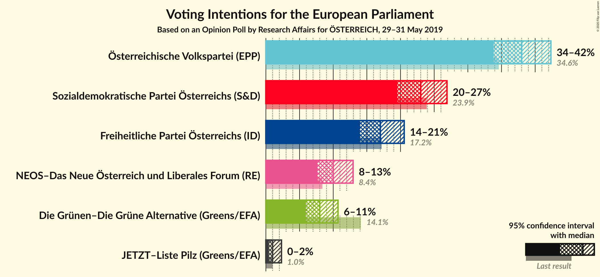
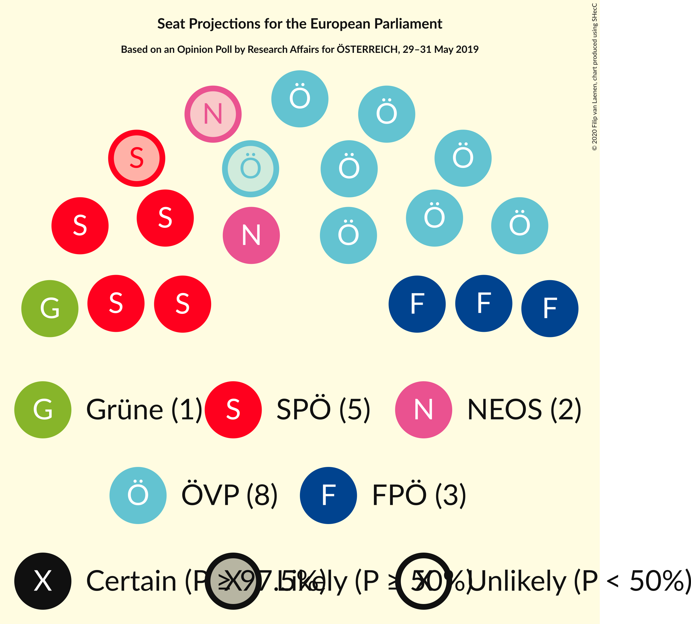
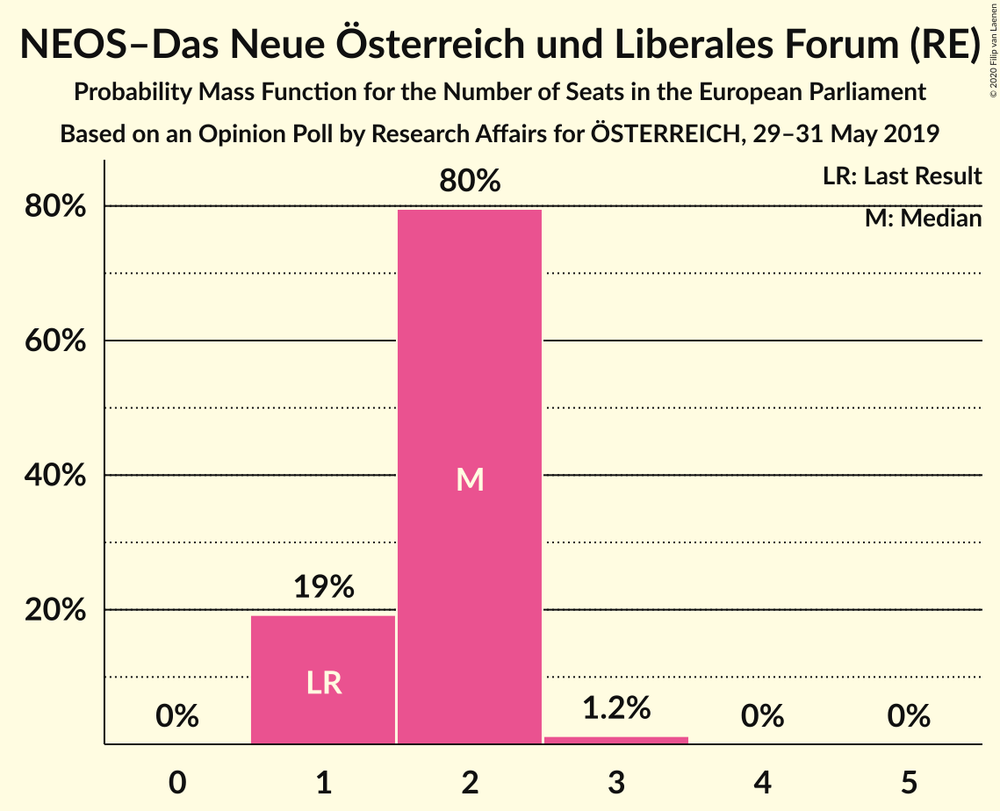
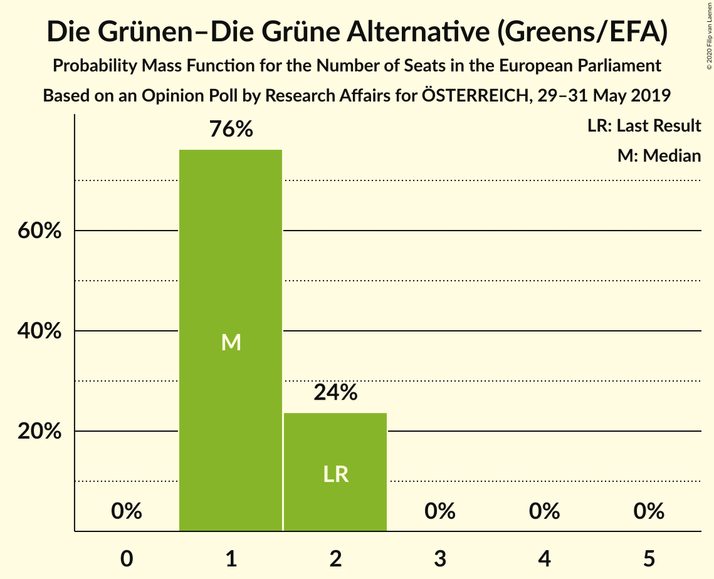
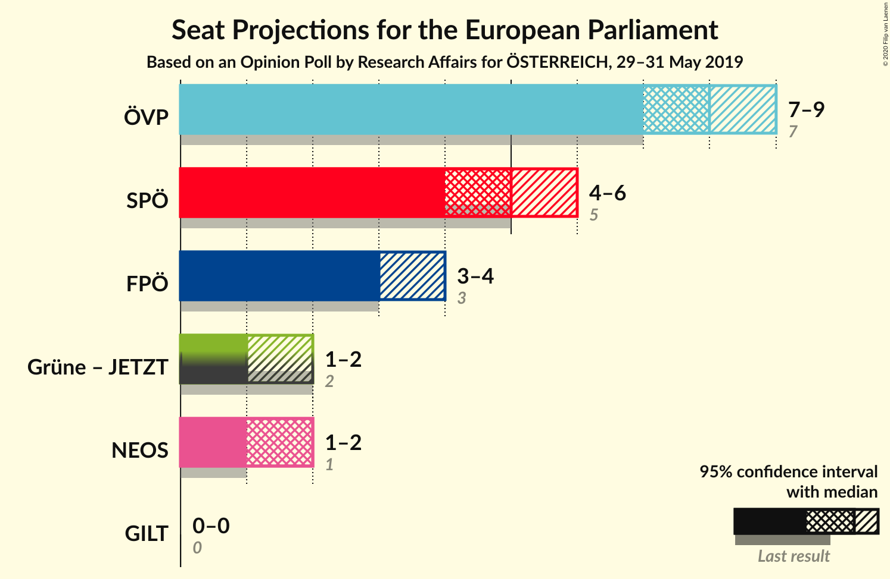
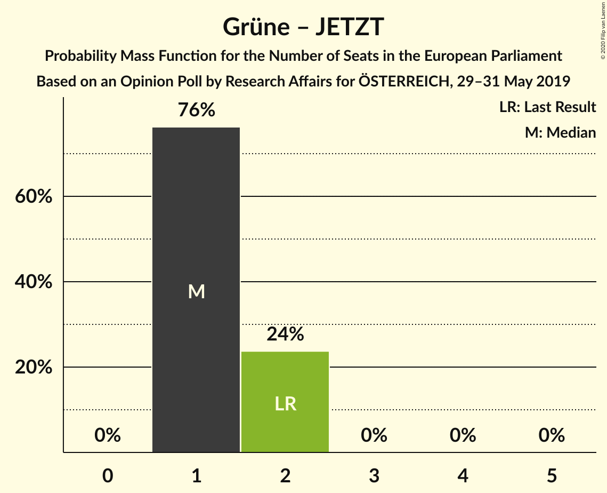
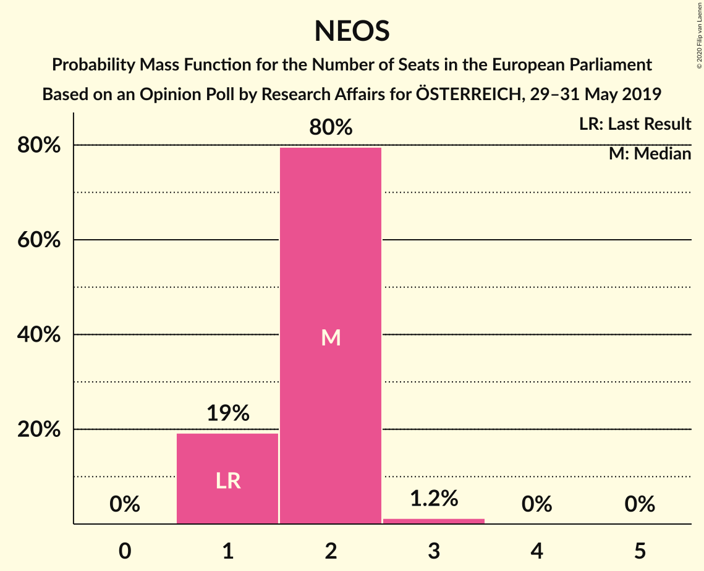

# Opinion Poll by Research Affairs for ÖSTERREICH, 29–31 May 2019

<a href="#voting-intentions">Voting Intentions</a> | <a href="#seats">Seats</a> | <a href="#coalitions">Coalitions</a> | <a href="#technical-information">Technical Information</a>

## Voting Intentions

### Confidence Intervals

| Party | Last Result | Poll Result | 80% Confidence Interval | 90% Confidence Interval | 95% Confidence Interval | 99% Confidence Interval |
|:-----:|:-----------:|:-----------:|:-----------------------:|:-----------------------:|:-----------------------:|:-----------------------:|
| Österreichische Volkspartei (EPP) | 34.6% | 38.0% | 35.3–40.8% |34.5–41.6% |33.9–42.3% |32.6–43.7% |
| Sozialdemokratische Partei Österreichs (S&D) | 23.9% | 23.0% | 20.7–25.5% |20.1–26.3% |19.5–26.9% |18.5–28.2% |
| Freiheitliche Partei Österreichs (ID) | 17.2% | 17.0% | 15.0–19.3% |14.4–20.0% |14.0–20.5% |13.0–21.7% |
| NEOS–Das Neue Österreich und Liberales Forum (RE) | 8.4% | 10.0% | 8.5–11.9% |8.0–12.5% |7.7–13.0% |7.0–13.9% |
| Die Grünen–Die Grüne Alternative (Greens/EFA) | 14.1% | 8.0% | 6.6–9.8% |6.2–10.3% |5.9–10.7% |5.3–11.6% |
| JETZT–Liste Pilz (Greens/EFA) | 1.0% | 1.0% | 0.6–1.8% |0.5–2.1% |0.4–2.3% |0.3–2.8% |

*Note:* The poll result column reflects the actual value used in the calculations. Published results may vary slightly, and in addition be rounded to fewer digits.

## Seats

### Confidence Intervals

| Party | Last Result | Median | 80% Confidence Interval | 90% Confidence Interval | 95% Confidence Interval | 99% Confidence Interval |
|:-----:|:-----------:|:------:|:-----------------------:|:-----------------------:|:-----------------------:|:-----------------------:|
| <a href="#österreichische-volkspartei-(epp)">Österreichische Volkspartei (EPP)</a> | 7 | 8 | 7–9 |7–9 |7–9 |7–9 |
| <a href="#sozialdemokratische-partei-österreichs-(s&d)">Sozialdemokratische Partei Österreichs (S&D)</a> | 5 | 4 | 4–5 |4–6 |4–6 |3–6 |
| <a href="#freiheitliche-partei-österreichs-(id)">Freiheitliche Partei Österreichs (ID)</a> | 3 | 4 | 2–4 |2–4 |2–4 |2–4 |
| <a href="#neos–das-neue-österreich-und-liberales-forum-(re)">NEOS–Das Neue Österreich und Liberales Forum (RE)</a> | 1 | 1 | 1–2 |1–2 |1–2 |1–3 |
| <a href="#die-grünen–die-grüne-alternative-(greens/efa)">Die Grünen–Die Grüne Alternative (Greens/EFA)</a> | 2 | 2 | 1–2 |1–2 |1–2 |1–2 |
| <a href="#jetzt–liste-pilz-(greens/efa)">JETZT–Liste Pilz (Greens/EFA)</a> | 0 | 0 | 0 |0 |0 |0 |

### Österreichische Volkspartei (EPP)

*For a full overview of the results for this party, see the [Österreichische Volkspartei (EPP)](party-österreichischevolksparteiepp.html) page.*

| Number of Seats | Probability | Accumulated | Special Marks |
|:---------------:|:-----------:|:-----------:|:-------------:|
| 7 | 20% | 100% | Last Result |
| 8 | 69% | 80% | Median |
| 9 | 10% | 11% |  |
| 10 | 0% | 0% | Majority |

### Sozialdemokratische Partei Österreichs (S&D)

*For a full overview of the results for this party, see the [Sozialdemokratische Partei Österreichs (S&D)](party-sozialdemokratischeparteiösterreichssd.html) page.*

| Number of Seats | Probability | Accumulated | Special Marks |
|:---------------:|:-----------:|:-----------:|:-------------:|
| 3 | 1.1% | 100% |  |
| 4 | 53% | 98.9% | Median |
| 5 | 39% | 46% | Last Result |
| 6 | 6% | 6% |  |
| 7 | 0% | 0% |  |

### Freiheitliche Partei Österreichs (ID)

*For a full overview of the results for this party, see the [Freiheitliche Partei Österreichs (ID)](party-freiheitlicheparteiösterreichsid.html) page.*

| Number of Seats | Probability | Accumulated | Special Marks |
|:---------------:|:-----------:|:-----------:|:-------------:|
| 2 | 12% | 100% |  |
| 3 | 31% | 88% | Last Result |
| 4 | 56% | 56% | Median |
| 5 | 0.3% | 0.3% |  |
| 6 | 0% | 0% |  |

### NEOS–Das Neue Österreich und Liberales Forum (RE)

*For a full overview of the results for this party, see the [NEOS–Das Neue Österreich und Liberales Forum (RE)](party-neos–dasneueösterreichundliberalesforumre.html) page.*

| Number of Seats | Probability | Accumulated | Special Marks |
|:---------------:|:-----------:|:-----------:|:-------------:|
| 1 | 54% | 100% | Last Result, Median |
| 2 | 45% | 46% |  |
| 3 | 1.1% | 1.1% |  |
| 4 | 0% | 0% |  |

### Die Grünen–Die Grüne Alternative (Greens/EFA)

*For a full overview of the results for this party, see the [Die Grünen–Die Grüne Alternative (Greens/EFA)](party-diegrünen–diegrünealternativegreensefa.html) page.*

| Number of Seats | Probability | Accumulated | Special Marks |
|:---------------:|:-----------:|:-----------:|:-------------:|
| 1 | 35% | 100% |  |
| 2 | 65% | 65% | Last Result, Median |
| 3 | 0% | 0% |  |

### JETZT–Liste Pilz (Greens/EFA)

*For a full overview of the results for this party, see the [JETZT–Liste Pilz (Greens/EFA)](party-jetzt–listepilzgreensefa.html) page.*

| Number of Seats | Probability | Accumulated | Special Marks |
|:---------------:|:-----------:|:-----------:|:-------------:|
| 0 | 100% | 100% | Last Result, Median |

## Coalitions

### Confidence Intervals

| Coalition | Last Result | Median | Majority? | 80% Confidence Interval | 90% Confidence Interval | 95% Confidence Interval | 99% Confidence Interval |
|:---------:|:-----------:|:------:|:---------:|:-----------------------:|:-----------------------:|:-----------------------:|:-----------------------:|
| Österreichische Volkspartei (EPP) | 7 | 8 | 0% | 7–9 | 7–9 | 7–9 | 7–9 |
| Sozialdemokratische Partei Österreichs (S&D) | 5 | 4 | 0% | 4–5 | 4–6 | 4–6 | 3–6 |
| Freiheitliche Partei Österreichs (ID) | 3 | 4 | 0% | 2–4 | 2–4 | 2–4 | 2–4 |
| Die Grünen–Die Grüne Alternative (Greens/EFA) – JETZT–Liste Pilz (Greens/EFA) | 2 | 2 | 0% | 1–2 | 1–2 | 1–2 | 1–2 |
| NEOS–Das Neue Österreich und Liberales Forum (RE) | 1 | 1 | 0% | 1–2 | 1–2 | 1–2 | 1–3 |

### Österreichische Volkspartei (EPP)

| Number of Seats | Probability | Accumulated | Special Marks |
|:---------------:|:-----------:|:-----------:|:-------------:|
| 7 | 20% | 100% | Last Result |
| 8 | 69% | 80% | Median |
| 9 | 10% | 11% |  |
| 10 | 0% | 0% | Majority |

### Sozialdemokratische Partei Österreichs (S&D)

| Number of Seats | Probability | Accumulated | Special Marks |
|:---------------:|:-----------:|:-----------:|:-------------:|
| 3 | 1.1% | 100% |  |
| 4 | 53% | 98.9% | Median |
| 5 | 39% | 46% | Last Result |
| 6 | 6% | 6% |  |
| 7 | 0% | 0% |  |

### Freiheitliche Partei Österreichs (ID)

| Number of Seats | Probability | Accumulated | Special Marks |
|:---------------:|:-----------:|:-----------:|:-------------:|
| 2 | 12% | 100% |  |
| 3 | 31% | 88% | Last Result |
| 4 | 56% | 56% | Median |
| 5 | 0.3% | 0.3% |  |
| 6 | 0% | 0% |  |

### Die Grünen–Die Grüne Alternative (Greens/EFA) – JETZT–Liste Pilz (Greens/EFA)

| Number of Seats | Probability | Accumulated | Special Marks |
|:---------------:|:-----------:|:-----------:|:-------------:|
| 1 | 35% | 100% |  |
| 2 | 65% | 65% | Last Result, Median |
| 3 | 0% | 0% |  |

### NEOS–Das Neue Österreich und Liberales Forum (RE)

| Number of Seats | Probability | Accumulated | Special Marks |
|:---------------:|:-----------:|:-----------:|:-------------:|
| 1 | 54% | 100% | Last Result, Median |
| 2 | 45% | 46% |  |
| 3 | 1.1% | 1.1% |  |
| 4 | 0% | 0% |  |

## Technical Information

### Opinion Poll

+ **Polling firm:** Research Affairs
+ **Commissioner(s):** ÖSTERREICH
+ **Fieldwork period:** 29–31 May 2019

### Calculations

+ **Sample size:** 500
+ **Simulations done:** 1,024
+ **Error estimate:** 4.91%

