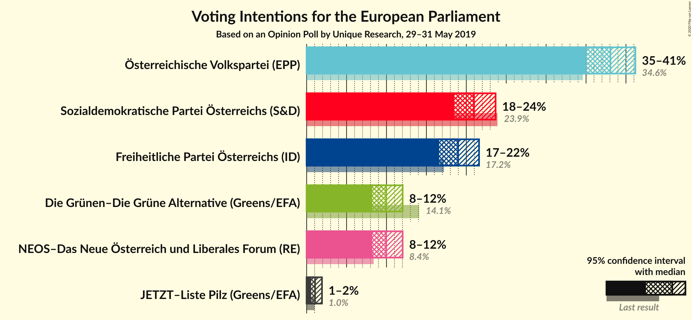
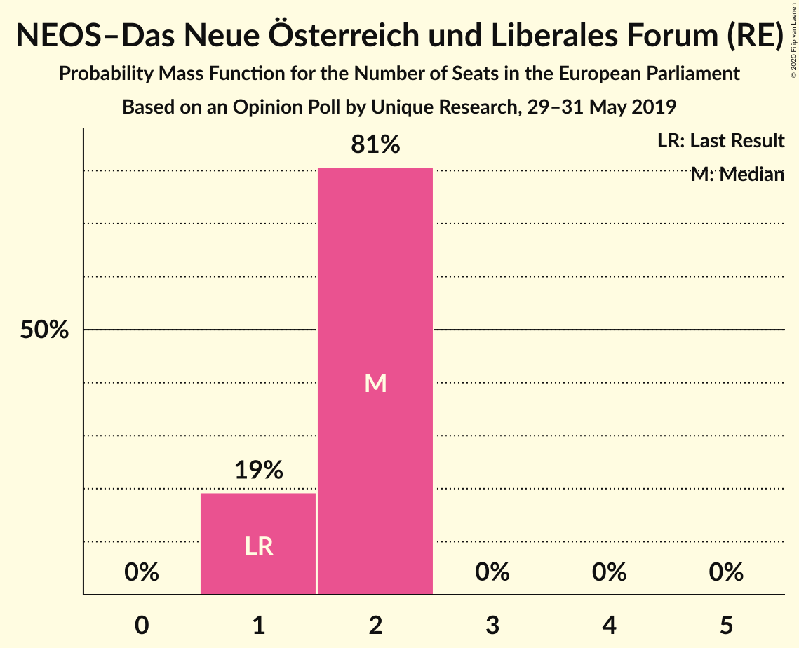
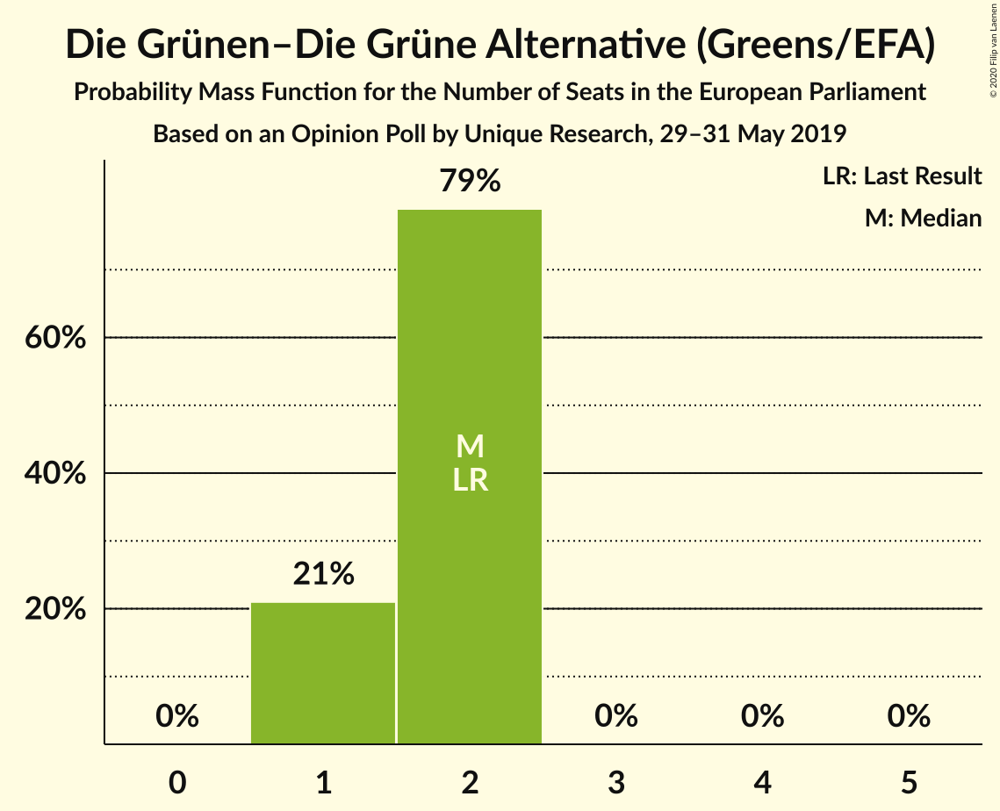
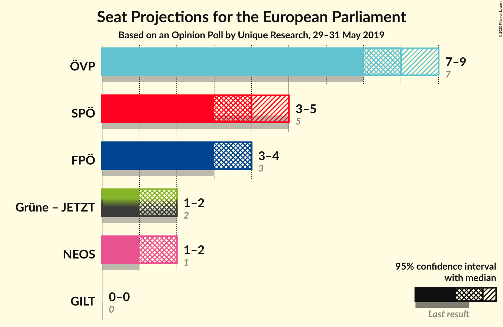
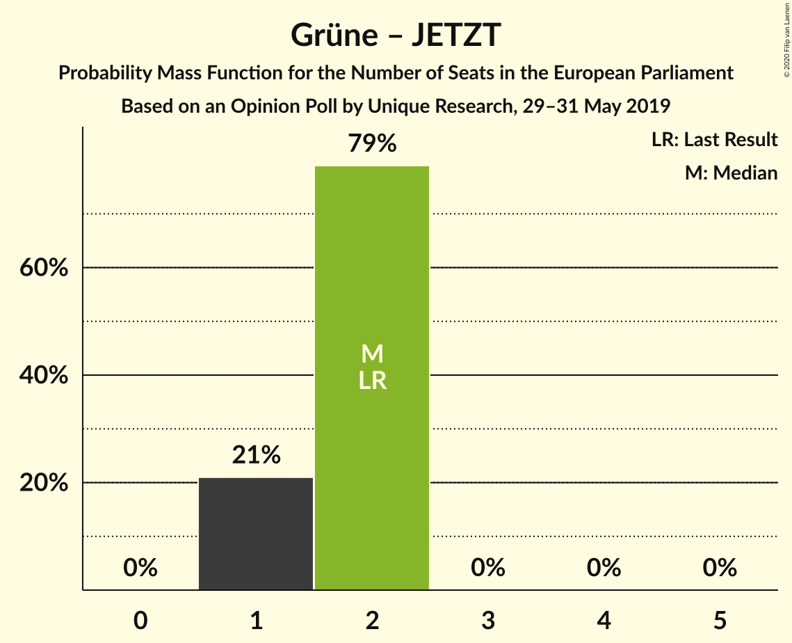

# Opinion Poll by Unique Research, 29–31 May 2019

<a href="#voting-intentions">Voting Intentions</a> | <a href="#seats">Seats</a> | <a href="#coalitions">Coalitions</a> | <a href="#technical-information">Technical Information</a>

## Voting Intentions

### Confidence Intervals

| Party | Last Result | Poll Result | 80% Confidence Interval | 90% Confidence Interval | 95% Confidence Interval | 99% Confidence Interval |
|:-----:|:-----------:|:-----------:|:-----------------------:|:-----------------------:|:-----------------------:|:-----------------------:|
| Österreichische Volkspartei (EPP) | 34.6% | 38.1% | 36.1–40.1% |35.5–40.7% |35.0–41.2% |34.1–42.2% |
| Sozialdemokratische Partei Österreichs (S&D) | 23.9% | 21.0% | 19.3–22.7% |18.9–23.2% |18.5–23.7% |17.7–24.5% |
| Freiheitliche Partei Österreichs (ID) | 17.2% | 19.0% | 17.4–20.7% |17.0–21.2% |16.6–21.6% |15.9–22.4% |
| NEOS–Das Neue Österreich und Liberales Forum (RE) | 8.4% | 10.0% | 8.8–11.3% |8.5–11.7% |8.2–12.0% |7.7–12.7% |
| Die Grünen–Die Grüne Alternative (Greens/EFA) | 14.1% | 10.0% | 8.8–11.3% |8.5–11.7% |8.2–12.0% |7.7–12.7% |
| JETZT–Liste Pilz (Greens/EFA) | 1.0% | 1.0% | 0.7–1.6% |0.6–1.8% |0.6–1.9% |0.4–2.2% |

*Note:* The poll result column reflects the actual value used in the calculations. Published results may vary slightly, and in addition be rounded to fewer digits.

## Seats

### Confidence Intervals

| Party | Last Result | Median | 80% Confidence Interval | 90% Confidence Interval | 95% Confidence Interval | 99% Confidence Interval |
|:-----:|:-----------:|:------:|:-----------------------:|:-----------------------:|:-----------------------:|:-----------------------:|
| <a href="#österreichische-volkspartei-(epp)">Österreichische Volkspartei (EPP)</a> | 7 | 8 | 7–8 |7–8 |7–9 |7–9 |
| <a href="#sozialdemokratische-partei-österreichs-(s&d)">Sozialdemokratische Partei Österreichs (S&D)</a> | 5 | 4 | 4 |4–5 |3–5 |3–5 |
| <a href="#freiheitliche-partei-österreichs-(id)">Freiheitliche Partei Österreichs (ID)</a> | 3 | 4 | 3–4 |3–4 |3–4 |3–4 |
| <a href="#neos–das-neue-österreich-und-liberales-forum-(re)">NEOS–Das Neue Österreich und Liberales Forum (RE)</a> | 1 | 2 | 1–2 |1–2 |1–2 |1–2 |
| <a href="#die-grünen–die-grüne-alternative-(greens/efa)">Die Grünen–Die Grüne Alternative (Greens/EFA)</a> | 2 | 2 | 1–2 |1–2 |1–2 |1–2 |
| <a href="#jetzt–liste-pilz-(greens/efa)">JETZT–Liste Pilz (Greens/EFA)</a> | 0 | 0 | 0 |0 |0 |0 |

### Österreichische Volkspartei (EPP)

*For a full overview of the results for this party, see the [Österreichische Volkspartei (EPP)](party-österreichischevolksparteiepp.html) page.*

| Number of Seats | Probability | Accumulated | Special Marks |
|:---------------:|:-----------:|:-----------:|:-------------:|
| 7 | 32% | 100% | Last Result |
| 8 | 65% | 68% | Median |
| 9 | 3% | 3% |  |
| 10 | 0% | 0% | Majority |

### Sozialdemokratische Partei Österreichs (S&D)

*For a full overview of the results for this party, see the [Sozialdemokratische Partei Österreichs (S&D)](party-sozialdemokratischeparteiösterreichssd.html) page.*

| Number of Seats | Probability | Accumulated | Special Marks |
|:---------------:|:-----------:|:-----------:|:-------------:|
| 3 | 3% | 100% |  |
| 4 | 90% | 97% | Median |
| 5 | 6% | 6% | Last Result |
| 6 | 0% | 0% |  |

### Freiheitliche Partei Österreichs (ID)

*For a full overview of the results for this party, see the [Freiheitliche Partei Österreichs (ID)](party-freiheitlicheparteiösterreichsid.html) page.*

| Number of Seats | Probability | Accumulated | Special Marks |
|:---------------:|:-----------:|:-----------:|:-------------:|
| 3 | 24% | 100% | Last Result |
| 4 | 76% | 76% | Median |
| 5 | 0.2% | 0.2% |  |
| 6 | 0% | 0% |  |

### NEOS–Das Neue Österreich und Liberales Forum (RE)

*For a full overview of the results for this party, see the [NEOS–Das Neue Österreich und Liberales Forum (RE)](party-neos–dasneueösterreichundliberalesforumre.html) page.*

| Number of Seats | Probability | Accumulated | Special Marks |
|:---------------:|:-----------:|:-----------:|:-------------:|
| 1 | 33% | 100% | Last Result |
| 2 | 67% | 67% | Median |
| 3 | 0% | 0% |  |

### Die Grünen–Die Grüne Alternative (Greens/EFA)

*For a full overview of the results for this party, see the [Die Grünen–Die Grüne Alternative (Greens/EFA)](party-diegrünen–diegrünealternativegreensefa.html) page.*

| Number of Seats | Probability | Accumulated | Special Marks |
|:---------------:|:-----------:|:-----------:|:-------------:|
| 1 | 17% | 100% |  |
| 2 | 83% | 83% | Last Result, Median |
| 3 | 0% | 0% |  |

### JETZT–Liste Pilz (Greens/EFA)

*For a full overview of the results for this party, see the [JETZT–Liste Pilz (Greens/EFA)](party-jetzt–listepilzgreensefa.html) page.*

| Number of Seats | Probability | Accumulated | Special Marks |
|:---------------:|:-----------:|:-----------:|:-------------:|
| 0 | 100% | 100% | Last Result, Median |

## Coalitions

### Confidence Intervals

| Coalition | Last Result | Median | Majority? | 80% Confidence Interval | 90% Confidence Interval | 95% Confidence Interval | 99% Confidence Interval |
|:---------:|:-----------:|:------:|:---------:|:-----------------------:|:-----------------------:|:-----------------------:|:-----------------------:|
| Österreichische Volkspartei (EPP) | 7 | 8 | 0% | 7–8 | 7–8 | 7–9 | 7–9 |
| Sozialdemokratische Partei Österreichs (S&D) | 5 | 4 | 0% | 4 | 4–5 | 3–5 | 3–5 |
| Freiheitliche Partei Österreichs (ID) | 3 | 4 | 0% | 3–4 | 3–4 | 3–4 | 3–4 |
| Die Grünen–Die Grüne Alternative (Greens/EFA) – JETZT–Liste Pilz (Greens/EFA) | 2 | 2 | 0% | 1–2 | 1–2 | 1–2 | 1–2 |
| NEOS–Das Neue Österreich und Liberales Forum (RE) | 1 | 2 | 0% | 1–2 | 1–2 | 1–2 | 1–2 |

### Österreichische Volkspartei (EPP)

| Number of Seats | Probability | Accumulated | Special Marks |
|:---------------:|:-----------:|:-----------:|:-------------:|
| 7 | 32% | 100% | Last Result |
| 8 | 65% | 68% | Median |
| 9 | 3% | 3% |  |
| 10 | 0% | 0% | Majority |

### Sozialdemokratische Partei Österreichs (S&D)

| Number of Seats | Probability | Accumulated | Special Marks |
|:---------------:|:-----------:|:-----------:|:-------------:|
| 3 | 3% | 100% |  |
| 4 | 90% | 97% | Median |
| 5 | 6% | 6% | Last Result |
| 6 | 0% | 0% |  |

### Freiheitliche Partei Österreichs (ID)

| Number of Seats | Probability | Accumulated | Special Marks |
|:---------------:|:-----------:|:-----------:|:-------------:|
| 3 | 24% | 100% | Last Result |
| 4 | 76% | 76% | Median |
| 5 | 0.2% | 0.2% |  |
| 6 | 0% | 0% |  |

### Die Grünen–Die Grüne Alternative (Greens/EFA) – JETZT–Liste Pilz (Greens/EFA)

| Number of Seats | Probability | Accumulated | Special Marks |
|:---------------:|:-----------:|:-----------:|:-------------:|
| 1 | 17% | 100% |  |
| 2 | 83% | 83% | Last Result, Median |
| 3 | 0% | 0% |  |

### NEOS–Das Neue Österreich und Liberales Forum (RE)

| Number of Seats | Probability | Accumulated | Special Marks |
|:---------------:|:-----------:|:-----------:|:-------------:|
| 1 | 33% | 100% | Last Result |
| 2 | 67% | 67% | Median |
| 3 | 0% | 0% |  |

## Technical Information

### Opinion Poll

+ **Polling firm:** Unique Research
+ **Commissioner(s):** —
+ **Fieldwork period:** 29–31 May 2019

### Calculations

+ **Sample size:** 954
+ **Simulations done:** 131,072
+ **Error estimate:** 1.19%

