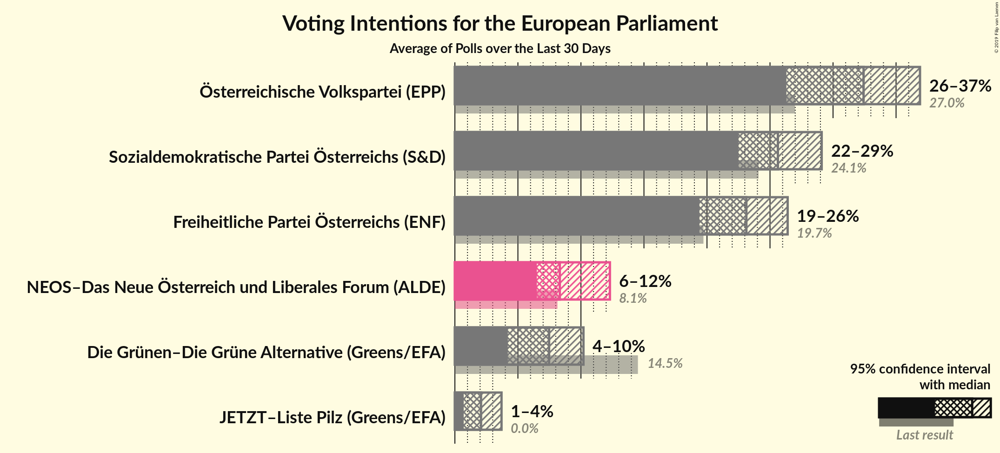
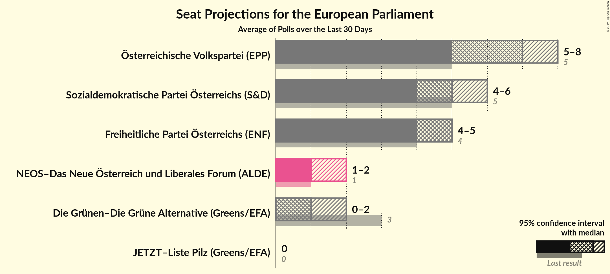
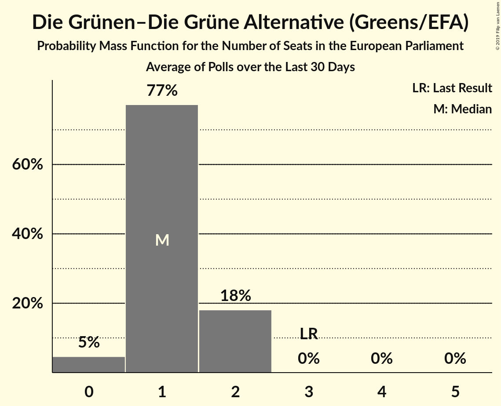
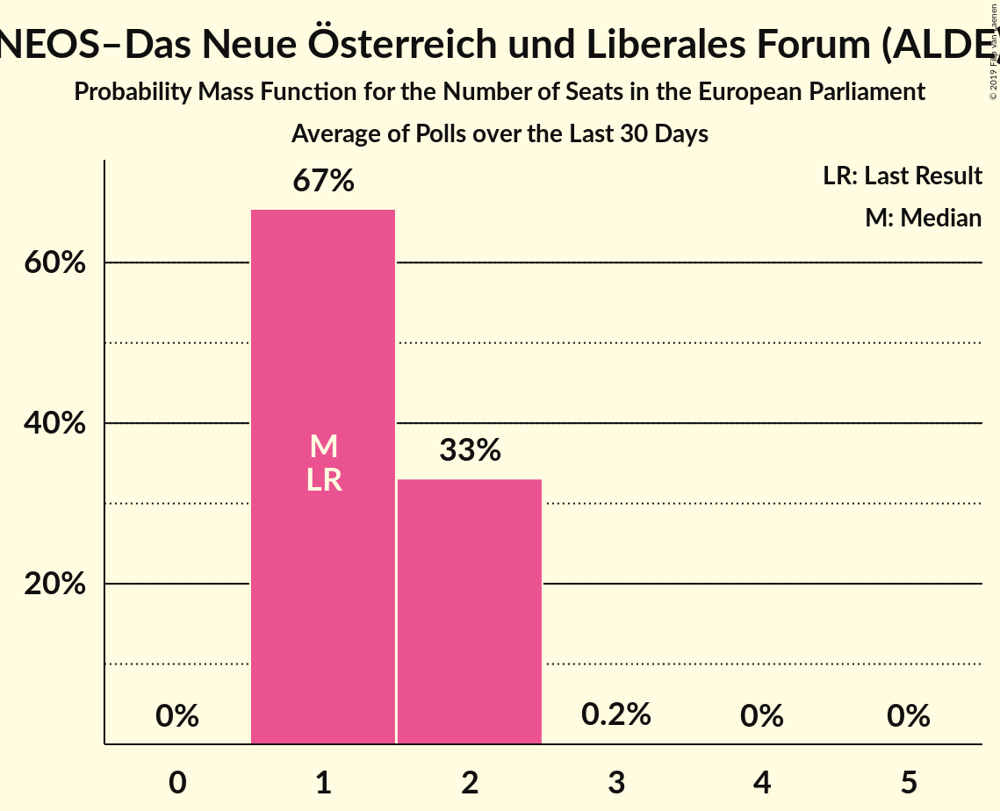
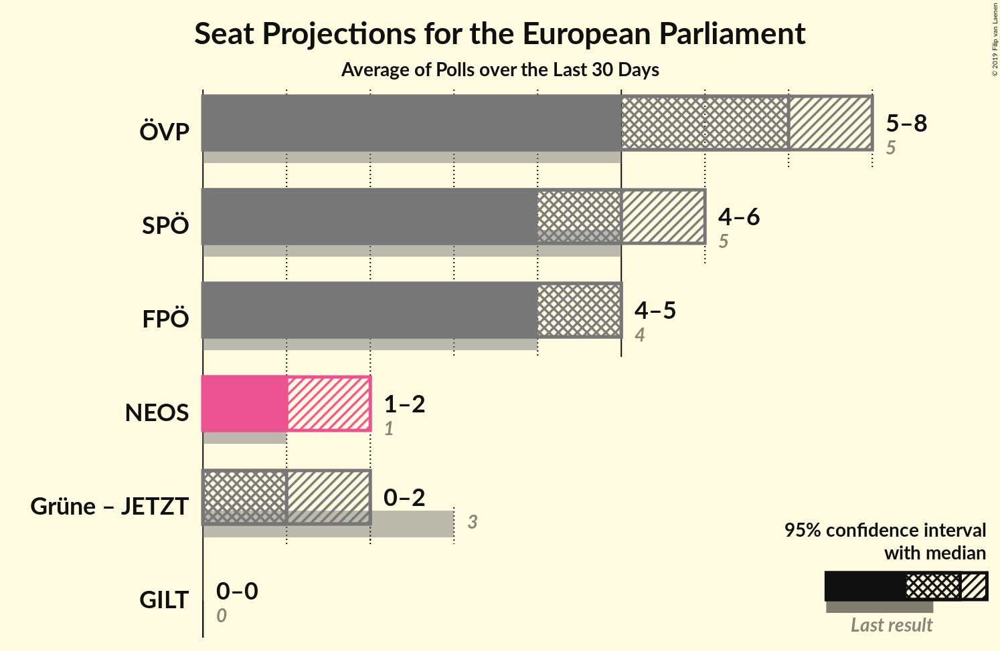
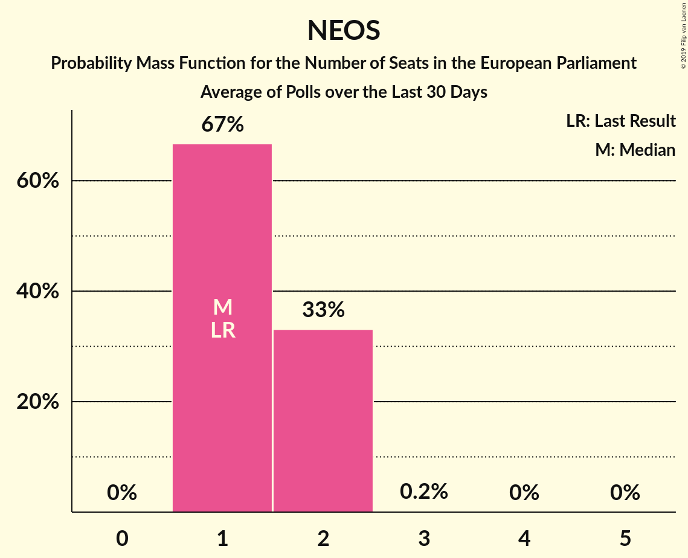
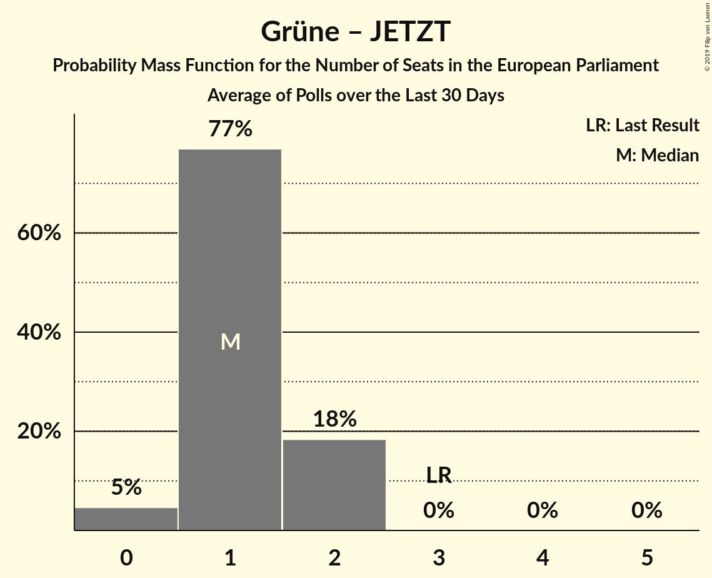
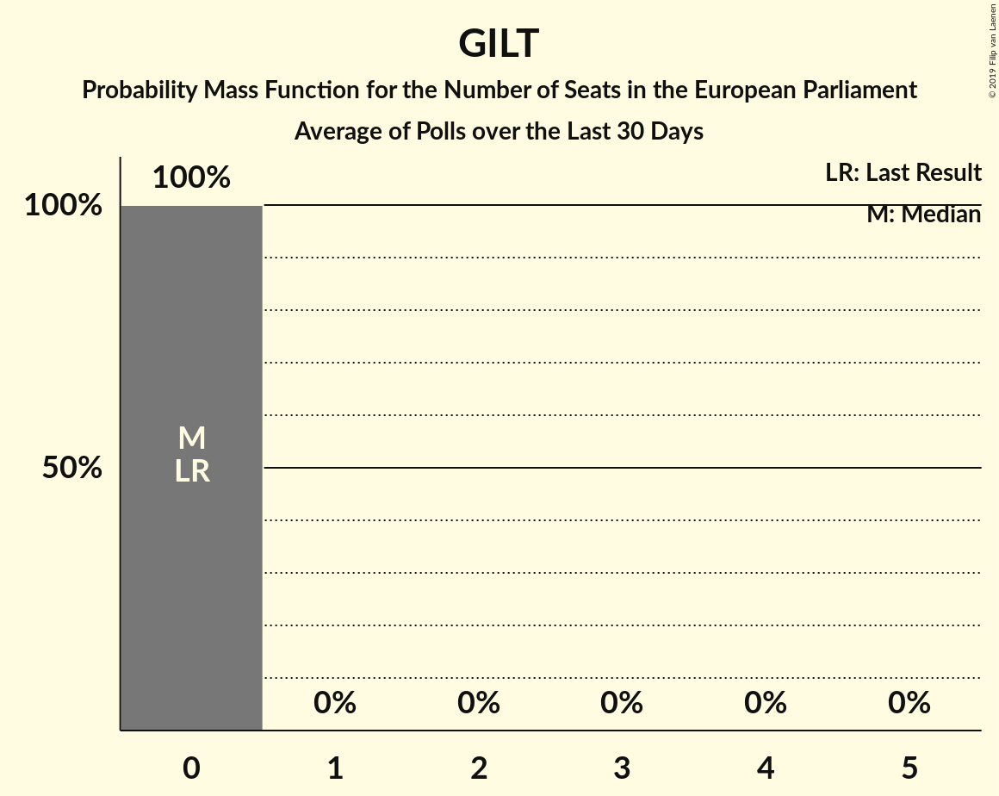

# Poll Average

<a href="#voting-intentions">Voting Intentions</a> | <a href="#seats">Seats</a> | <a href="#coalitions">Coalitions</a> | <a href="#technical-information">Technical Information</a>

## Summary

The table below lists the polls on which the average is based. They are the most recent polls (less than 30 days old) registered and analyzed so far.

| Period     | Polling firm/Commissioner(s) | ÖVP | SPÖ | FPÖ | Grüne | NEOS | JETZT | GILT |
|:----------:|:----------------------------:|:--:|:--:|:--:|:--:|:--:|:--:|:--:|
| 25 May 2014 | General Election | 27.0%   5 | 24.1%   5 | 19.7%   4 | 14.5%   3 | 8.1%   1 | 0.0%   0 | 0.0%   0 |
| N/A | Poll Average | 26–37%   5–8 | 22–29%   4–6 | 19–26%   4–5 | 4–10%   0–2 | 6–12%   1–2 | 1–4%   0 | N/A   N/A |
| [14–20 March 2019](2019-03-20-ResearchAffairs.html) | Research Affairs   ÖSTERREICH | 25–31%   5–7 | 23–29%   5–6 | 20–26%   4–5 | 6–10%   1–2 | 6–10%   1–2 | 2–4%   0 | N/A   N/A |
| [11–15 March 2019](2019-03-15-UniqueResearch.html) | Unique Research   profil | 31–37%   6–8 | 22–28%   4–6 | 21–27%   4–6 | 4–7%   0–1 | 6–10%   1–2 | 1–3%   0 | N/A   N/A |
| [27 February–1 March 2019](2019-03-01-INSA.html) | INSA   SWG | 26–32%   5–7 | 22–28%   5–6 | 21–27%   4–6 | 7–11%   1–2 | 6–10%   1–2 | 1–3%   0 | N/A   N/A |
| [21–28 February 2019](2019-02-28-PeterHajek.html) | Peter Hajek   ATV | 31–37%   6–8 | 24–30%   5–6 | 20–26%   4–5 | 5–8%   1 | 6–10%   1–2 | 1–2%   0 | N/A   N/A |
| [18–20 February 2019](2019-02-20-market.html) | market   Der Standard | 31–37%   6–8 | 22–28%   4–6 | 18–24%   3–5 | 6–10%   1–2 | 9–13%   1–2 | 1–3%   0 | N/A   N/A |
| 25 May 2014 | General Election | 27.0%   5 | 24.1%   5 | 19.7%   4 | 14.5%   3 | 8.1%   1 | 0.0%   0 | 0.0%   0 |

Only polls for which at least the sample size has been published are included in the table above.

**Legend:**
+ **Top half of each row:** Voting intentions (95% confidence interval)
+ **Bottom half of each row:** Seat projections for the European Parliament (95% confidence interval)
+ **ÖVP:** Österreichische Volkspartei (EPP)
+ **SPÖ:** Sozialdemokratische Partei Österreichs (S&D)
+ **FPÖ:** Freiheitliche Partei Österreichs (ENF)
+ **Grüne:** Die Grünen–Die Grüne Alternative (Greens/EFA)
+ **NEOS:** NEOS–Das Neue Österreich und Liberales Forum (ALDE)
+ **JETZT:** JETZT–Liste Pilz (Greens/EFA)
+ **GILT:** Meine Stimme Gilt! (*)
+ **N/A (single party):** Party not included the published results
+ **N/A (entire row):** Calculation for this opinion poll not started yet

## Voting Intentions

### Confidence Intervals

| Party | Last Result | Median | 80% Confidence Interval | 90% Confidence Interval | 95% Confidence Interval | 99% Confidence Interval |
|:-----:|:-----------:|:------:|:-----------------------:|:-----------------------:|:-----------------------:|:-----------------------:|
| <a href="#österreichische-volkspartei-(epp)">Österreichische Volkspartei (EPP)</a> | 27.0% | 32.4% | 27.5–35.6% |26.8–36.3% | 26.3–36.9% | 25.3–38.1% |
| <a href="#sozialdemokratische-partei-österreichs-(s&d)">Sozialdemokratische Partei Österreichs (S&D)</a> | 24.1% | 25.6% | 23.6–27.9% |23.0–28.5% | 22.5–29.1% | 21.6–30.3% |
| <a href="#freiheitliche-partei-österreichs-(enf)">Freiheitliche Partei Österreichs (ENF)</a> | 19.7% | 23.1% | 20.7–25.3% |20.0–25.9% | 19.4–26.4% | 18.3–27.4% |
| <a href="#die-grünen–die-grüne-alternative-(greens/efa)">Die Grünen–Die Grüne Alternative (Greens/EFA)</a> | 14.5% | 7.5% | 4.9–9.4% |4.5–9.9% | 4.2–10.2% | 3.7–11.0% |
| <a href="#neos–das-neue-österreich-und-liberales-forum-(alde)">NEOS–Das Neue Österreich und Liberales Forum (ALDE)</a> | 8.1% | 8.3% | 7.0–11.0% |6.7–11.8% | 6.5–12.3% | 6.0–13.3% |
| <a href="#jetzt–liste-pilz-(greens/efa)">JETZT–Liste Pilz (Greens/EFA)</a> | 0.0% | 2.1% | 1.1–3.2% |0.8–3.5% | 0.7–3.7% | 0.5–4.2% |
| <a href="#meine-stimme-gilt!-(*)">Meine Stimme Gilt! (*)</a> | 0.0% | N/A | N/A |N/A | N/A | N/A |

### Österreichische Volkspartei (EPP)

*For a full overview of the results for this party, see the [Österreichische Volkspartei (EPP)](party-österreichischevolksparteiepp.html) page.*

| Voting Intentions | Probability | Accumulated | Special Marks |
|:-----------------:|:-----------:|:-----------:|:-------------:|
| 22.5–23.5% | 0% | 100% |  |
| 23.5–24.5% | 0.1% | 100% |  |
| 24.5–25.5% | 0.7% | 99.9% |  |
| 25.5–26.5% | 3% | 99.2% |  |
| 26.5–27.5% | 7% | 96% | Last Result |
| 27.5–28.5% | 10% | 90% |  |
| 28.5–29.5% | 10% | 80% |  |
| 29.5–30.5% | 7% | 70% |  |
| 30.5–31.5% | 6% | 63% |  |
| 31.5–32.5% | 8% | 57% | Median |
| 32.5–33.5% | 12% | 49% |  |
| 33.5–34.5% | 14% | 37% |  |
| 34.5–35.5% | 12% | 22% |  |
| 35.5–36.5% | 7% | 11% |  |
| 36.5–37.5% | 3% | 4% |  |
| 37.5–38.5% | 0.9% | 1.1% |  |
| 38.5–39.5% | 0.2% | 0.2% |  |
| 39.5–40.5% | 0% | 0% |  |

### Sozialdemokratische Partei Österreichs (S&D)

*For a full overview of the results for this party, see the [Sozialdemokratische Partei Österreichs (S&D)](party-sozialdemokratischeparteiösterreichssd.html) page.*

| Voting Intentions | Probability | Accumulated | Special Marks |
|:-----------------:|:-----------:|:-----------:|:-------------:|
| 19.5–20.5% | 0% | 100% |  |
| 20.5–21.5% | 0.4% | 100% |  |
| 21.5–22.5% | 2% | 99.5% |  |
| 22.5–23.5% | 7% | 97% |  |
| 23.5–24.5% | 16% | 90% | Last Result |
| 24.5–25.5% | 22% | 74% |  |
| 25.5–26.5% | 22% | 52% | Median |
| 26.5–27.5% | 16% | 29% |  |
| 27.5–28.5% | 8% | 13% |  |
| 28.5–29.5% | 3% | 5% |  |
| 29.5–30.5% | 1.1% | 1.4% |  |
| 30.5–31.5% | 0.3% | 0.3% |  |
| 31.5–32.5% | 0% | 0.1% |  |
| 32.5–33.5% | 0% | 0% |  |

### Freiheitliche Partei Österreichs (ENF)

*For a full overview of the results for this party, see the [Freiheitliche Partei Österreichs (ENF)](party-freiheitlicheparteiösterreichsenf.html) page.*

| Voting Intentions | Probability | Accumulated | Special Marks |
|:-----------------:|:-----------:|:-----------:|:-------------:|
| 15.5–16.5% | 0% | 100% |  |
| 16.5–17.5% | 0.1% | 100% |  |
| 17.5–18.5% | 0.6% | 99.9% |  |
| 18.5–19.5% | 2% | 99.3% |  |
| 19.5–20.5% | 6% | 97% | Last Result |
| 20.5–21.5% | 11% | 91% |  |
| 21.5–22.5% | 18% | 80% |  |
| 22.5–23.5% | 22% | 62% | Median |
| 23.5–24.5% | 20% | 40% |  |
| 24.5–25.5% | 13% | 20% |  |
| 25.5–26.5% | 6% | 8% |  |
| 26.5–27.5% | 2% | 2% |  |
| 27.5–28.5% | 0.3% | 0.4% |  |
| 28.5–29.5% | 0.1% | 0.1% |  |
| 29.5–30.5% | 0% | 0% |  |

### Die Grünen–Die Grüne Alternative (Greens/EFA)

*For a full overview of the results for this party, see the [Die Grünen–Die Grüne Alternative (Greens/EFA)](party-diegrünen–diegrünealternativegreensefa.html) page.*

| Voting Intentions | Probability | Accumulated | Special Marks |
|:-----------------:|:-----------:|:-----------:|:-------------:|
| 1.5–2.5% | 0% | 100% |  |
| 2.5–3.5% | 0.3% | 100% |  |
| 3.5–4.5% | 5% | 99.7% |  |
| 4.5–5.5% | 14% | 95% |  |
| 5.5–6.5% | 15% | 80% |  |
| 6.5–7.5% | 16% | 65% | Median |
| 7.5–8.5% | 23% | 49% |  |
| 8.5–9.5% | 18% | 26% |  |
| 9.5–10.5% | 7% | 8% |  |
| 10.5–11.5% | 1.3% | 1.4% |  |
| 11.5–12.5% | 0.1% | 0.1% |  |
| 12.5–13.5% | 0% | 0% |  |
| 13.5–14.5% | 0% | 0% |  |
| 14.5–15.5% | 0% | 0% | Last Result |

### NEOS–Das Neue Österreich und Liberales Forum (ALDE)

*For a full overview of the results for this party, see the [NEOS–Das Neue Österreich und Liberales Forum (ALDE)](party-neos–dasneueösterreichundliberalesforumalde.html) page.*

| Voting Intentions | Probability | Accumulated | Special Marks |
|:-----------------:|:-----------:|:-----------:|:-------------:|
| 3.5–4.5% | 0% | 100% |  |
| 4.5–5.5% | 0.1% | 100% |  |
| 5.5–6.5% | 3% | 99.9% |  |
| 6.5–7.5% | 19% | 97% |  |
| 7.5–8.5% | 34% | 77% | Last Result, Median |
| 8.5–9.5% | 21% | 44% |  |
| 9.5–10.5% | 9% | 23% |  |
| 10.5–11.5% | 7% | 14% |  |
| 11.5–12.5% | 4% | 6% |  |
| 12.5–13.5% | 2% | 2% |  |
| 13.5–14.5% | 0.3% | 0.3% |  |
| 14.5–15.5% | 0% | 0% |  |

### JETZT–Liste Pilz (Greens/EFA)

*For a full overview of the results for this party, see the [JETZT–Liste Pilz (Greens/EFA)](party-jetzt–listepilzgreensefa.html) page.*

| Voting Intentions | Probability | Accumulated | Special Marks |
|:-----------------:|:-----------:|:-----------:|:-------------:|
| 0.0–0.5% | 0.7% | 100% | Last Result |
| 0.5–1.5% | 24% | 99.3% |  |
| 1.5–2.5% | 48% | 75% | Median |
| 2.5–3.5% | 23% | 28% |  |
| 3.5–4.5% | 4% | 4% |  |
| 4.5–5.5% | 0.2% | 0.2% |  |
| 5.5–6.5% | 0% | 0% |  |

## Seats

### Confidence Intervals

| Party | Last Result | Median | 80% Confidence Interval | 90% Confidence Interval | 95% Confidence Interval | 99% Confidence Interval |
|:-----:|:-----------:|:------:|:-----------------------:|:-----------------------:|:-----------------------:|:-----------------------:|
| <a href="#österreichische-volkspartei-(epp)">Österreichische Volkspartei (EPP)</a> | 5 | 7 | 6–7 |6–8 | 5–8 | 5–8 |
| <a href="#sozialdemokratische-partei-österreichs-(s&d)">Sozialdemokratische Partei Österreichs (S&D)</a> | 5 | 5 | 5–6 |5–6 | 4–6 | 4–6 |
| <a href="#freiheitliche-partei-österreichs-(enf)">Freiheitliche Partei Österreichs (ENF)</a> | 4 | 5 | 4–5 |4–5 | 4–5 | 3–6 |
| <a href="#die-grünen–die-grüne-alternative-(greens/efa)">Die Grünen–Die Grüne Alternative (Greens/EFA)</a> | 3 | 1 | 1–2 |1–2 | 0–2 | 0–2 |
| <a href="#neos–das-neue-österreich-und-liberales-forum-(alde)">NEOS–Das Neue Österreich und Liberales Forum (ALDE)</a> | 1 | 1 | 1–2 |1–2 | 1–2 | 1–2 |
| <a href="#jetzt–liste-pilz-(greens/efa)">JETZT–Liste Pilz (Greens/EFA)</a> | 0 | 0 | 0 |0 | 0 | 0 |
| <a href="#meine-stimme-gilt!-(*)">Meine Stimme Gilt! (*)</a> | 0 | N/A | N/A |N/A | N/A | N/A |

### Österreichische Volkspartei (EPP)

*For a full overview of the results for this party, see the [Österreichische Volkspartei (EPP)](party-österreichischevolksparteiepp.html) page.*

| Number of Seats | Probability | Accumulated | Special Marks |
|:---------------:|:-----------:|:-----------:|:-------------:|
| 5 | 4% | 100% | Last Result |
| 6 | 39% | 96% |  |
| 7 | 52% | 57% | Median |
| 8 | 6% | 6% |  |
| 9 | 0% | 0% |  |

### Sozialdemokratische Partei Österreichs (S&D)

*For a full overview of the results for this party, see the [Sozialdemokratische Partei Österreichs (S&D)](party-sozialdemokratischeparteiösterreichssd.html) page.*

| Number of Seats | Probability | Accumulated | Special Marks |
|:---------------:|:-----------:|:-----------:|:-------------:|
| 4 | 3% | 100% |  |
| 5 | 72% | 97% | Last Result, Median |
| 6 | 24% | 24% |  |
| 7 | 0.1% | 0.1% |  |
| 8 | 0% | 0% |  |

### Freiheitliche Partei Österreichs (ENF)

*For a full overview of the results for this party, see the [Freiheitliche Partei Österreichs (ENF)](party-freiheitlicheparteiösterreichsenf.html) page.*

| Number of Seats | Probability | Accumulated | Special Marks |
|:---------------:|:-----------:|:-----------:|:-------------:|
| 3 | 0.6% | 100% |  |
| 4 | 35% | 99.4% | Last Result |
| 5 | 62% | 64% | Median |
| 6 | 2% | 2% |  |
| 7 | 0% | 0% |  |

### Die Grünen–Die Grüne Alternative (Greens/EFA)

*For a full overview of the results for this party, see the [Die Grünen–Die Grüne Alternative (Greens/EFA)](party-diegrünen–diegrünealternativegreensefa.html) page.*

| Number of Seats | Probability | Accumulated | Special Marks |
|:---------------:|:-----------:|:-----------:|:-------------:|
| 0 | 5% | 100% |  |
| 1 | 77% | 95% | Median |
| 2 | 18% | 18% |  |
| 3 | 0% | 0% | Last Result |

### NEOS–Das Neue Österreich und Liberales Forum (ALDE)

*For a full overview of the results for this party, see the [NEOS–Das Neue Österreich und Liberales Forum (ALDE)](party-neos–dasneueösterreichundliberalesforumalde.html) page.*

| Number of Seats | Probability | Accumulated | Special Marks |
|:---------------:|:-----------:|:-----------:|:-------------:|
| 1 | 67% | 100% | Last Result, Median |
| 2 | 33% | 33% |  |
| 3 | 0.2% | 0.2% |  |
| 4 | 0% | 0% |  |

### JETZT–Liste Pilz (Greens/EFA)

*For a full overview of the results for this party, see the [JETZT–Liste Pilz (Greens/EFA)](party-jetzt–listepilzgreensefa.html) page.*

| Number of Seats | Probability | Accumulated | Special Marks |
|:---------------:|:-----------:|:-----------:|:-------------:|
| 0 | 99.7% | 100% | Last Result, Median |
| 1 | 0.3% | 0.3% |  |
| 2 | 0% | 0% |  |

## Coalitions

### Confidence Intervals

| Coalition | Last Result | Median | Majority? | 80% Confidence Interval | 90% Confidence Interval | 95% Confidence Interval | 99% Confidence Interval |
|:---------:|:-----------:|:------:|:---------:|:-----------------------:|:-----------------------:|:-----------------------:|:-----------------------:|
| Österreichische Volkspartei (EPP) | 5 | 7 | 0% | 6–7 | 6–8 | 5–8 | 5–8 |
| Sozialdemokratische Partei Österreichs (S&D) | 5 | 5 | 0% | 5–6 | 5–6 | 4–6 | 4–6 |
| Freiheitliche Partei Österreichs (ENF) | 4 | 5 | 0% | 4–5 | 4–5 | 4–5 | 3–6 |
| NEOS–Das Neue Österreich und Liberales Forum (ALDE) | 1 | 1 | 0% | 1–2 | 1–2 | 1–2 | 1–2 |
| Die Grünen–Die Grüne Alternative (Greens/EFA) – JETZT–Liste Pilz (Greens/EFA) | 3 | 1 | 0% | 1–2 | 1–2 | 0–2 | 0–2 |
| Meine Stimme Gilt! (*) | 0 | 0 | 0% | 0 | 0 | 0 | 0 |

### Österreichische Volkspartei (EPP)

| Number of Seats | Probability | Accumulated | Special Marks |
|:---------------:|:-----------:|:-----------:|:-------------:|
| 5 | 4% | 100% | Last Result |
| 6 | 39% | 96% |  |
| 7 | 52% | 57% | Median |
| 8 | 6% | 6% |  |
| 9 | 0% | 0% |  |

### Sozialdemokratische Partei Österreichs (S&D)

| Number of Seats | Probability | Accumulated | Special Marks |
|:---------------:|:-----------:|:-----------:|:-------------:|
| 4 | 3% | 100% |  |
| 5 | 72% | 97% | Last Result, Median |
| 6 | 24% | 24% |  |
| 7 | 0.1% | 0.1% |  |
| 8 | 0% | 0% |  |

### Freiheitliche Partei Österreichs (ENF)

| Number of Seats | Probability | Accumulated | Special Marks |
|:---------------:|:-----------:|:-----------:|:-------------:|
| 3 | 0.6% | 100% |  |
| 4 | 35% | 99.4% | Last Result |
| 5 | 62% | 64% | Median |
| 6 | 2% | 2% |  |
| 7 | 0% | 0% |  |

### NEOS–Das Neue Österreich und Liberales Forum (ALDE)

| Number of Seats | Probability | Accumulated | Special Marks |
|:---------------:|:-----------:|:-----------:|:-------------:|
| 1 | 67% | 100% | Last Result, Median |
| 2 | 33% | 33% |  |
| 3 | 0.2% | 0.2% |  |
| 4 | 0% | 0% |  |

### Die Grünen–Die Grüne Alternative (Greens/EFA) – JETZT–Liste Pilz (Greens/EFA)

| Number of Seats | Probability | Accumulated | Special Marks |
|:---------------:|:-----------:|:-----------:|:-------------:|
| 0 | 5% | 100% |  |
| 1 | 77% | 95% | Median |
| 2 | 18% | 18% |  |
| 3 | 0% | 0% | Last Result |

### Meine Stimme Gilt! (*)

| Number of Seats | Probability | Accumulated | Special Marks |
|:---------------:|:-----------:|:-----------:|:-------------:|
| 0 | 100% | 100% | Last Result, Median |

## Technical Information

+ **Number of polls included in this average:** 5
+ **Lowest number of simulations done in a poll included in this average:** 1,048,576
+ **Total number of simulations done in the polls included in this average:** 5,242,880
+ **Error estimate:** 1.19%
