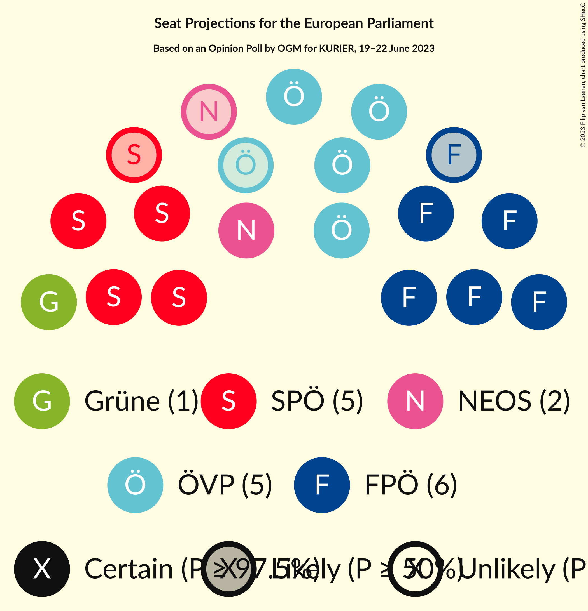

# Opinion Poll by OGM for KURIER, 19–22 June 2023

<a href="#voting-intentions">Voting Intentions</a> | <a href="#seats">Seats</a> | <a href="#coalitions">Coalitions</a> | <a href="#technical-information">Technical Information</a>

## Voting Intentions

### Confidence Intervals

| Party | Last Result | Poll Result | 80% Confidence Interval | 90% Confidence Interval | 95% Confidence Interval | 99% Confidence Interval |
|:-----:|:-----------:|:-----------:|:-----------------------:|:-----------------------:|:-----------------------:|:-----------------------:|
| Freiheitliche Partei Österreichs (ID) | 17.2% | 28.0% | 26.4–29.8% |25.9–30.3% |25.5–30.7% |24.8–31.5% |
| Sozialdemokratische Partei Österreichs (S&D) | 23.9% | 24.0% | 22.4–25.6% |22.0–26.1% |21.6–26.5% |20.9–27.3% |
| Österreichische Volkspartei (EPP) | 34.6% | 23.0% | 21.5–24.7% |21.1–25.1% |20.7–25.5% |20.0–26.3% |
| NEOS–Das Neue Österreich und Liberales Forum (RE) | 8.4% | 9.0% | 8.0–10.2% |7.7–10.5% |7.5–10.8% |7.0–11.4% |
| Die Grünen–Die Grüne Alternative (Greens/EFA) | 14.1% | 9.0% | 8.0–10.2% |7.7–10.5% |7.5–10.8% |7.0–11.4% |
| Kommunistische Partei Österreichs (GUE/NGL) | N/A | 4.0% | 3.3–4.8% |3.2–5.1% |3.0–5.3% |2.7–5.7% |

*Note:* The poll result column reflects the actual value used in the calculations. Published results may vary slightly, and in addition be rounded to fewer digits.

## Seats

### Confidence Intervals

| Party | Last Result | Median | 80% Confidence Interval | 90% Confidence Interval | 95% Confidence Interval | 99% Confidence Interval |
|:-----:|:-----------:|:------:|:-----------------------:|:-----------------------:|:-----------------------:|:-----------------------:|
| <a href="#freiheitliche-partei-österreichs-(id)">Freiheitliche Partei Österreichs (ID)</a> | 3 | 6 | 5–6 |5–6 |5–7 |5–7 |
| <a href="#sozialdemokratische-partei-österreichs-(s&d)">Sozialdemokratische Partei Österreichs (S&D)</a> | 5 | 5 | 5 |4–5 |4–6 |4–6 |
| <a href="#österreichische-volkspartei-(epp)">Österreichische Volkspartei (EPP)</a> | 7 | 5 | 4–5 |4–5 |4–5 |4–6 |
| <a href="#neos–das-neue-österreich-und-liberales-forum-(re)">NEOS–Das Neue Österreich und Liberales Forum (RE)</a> | 1 | 2 | 1–2 |1–2 |1–2 |1–2 |
| <a href="#die-grünen–die-grüne-alternative-(greens/efa)">Die Grünen–Die Grüne Alternative (Greens/EFA)</a> | 2 | 2 | 1–2 |1–2 |1–2 |1–2 |
| <a href="#kommunistische-partei-österreichs-(gue/ngl)">Kommunistische Partei Österreichs (GUE/NGL)</a> | N/A | 0 | 0–1 |0–1 |0–1 |0–1 |

