# Poll Average

<a href="#voting-intentions">Voting Intentions</a> | <a href="#seats">Seats</a> | <a href="#coalitions">Coalitions</a> | <a href="#technical-information">Technical Information</a>

## Summary

The table below lists the polls on which the average is based. They are the most recent polls (less than 90 days old) registered and analyzed so far.

| Period     | Polling firm/Commissioner(s) | ÖVP | SPÖ | FPÖ | Grüne | NEOS | JETZT | GILT |
|:----------:|:----------------------------:|:--:|:--:|:--:|:--:|:--:|:--:|:--:|
| 26 May 2019 | General Election | 34.6%   7 | 23.9%   5 | 17.2%   3 | 14.1%   2 | 8.4%   1 | 1.0%   0 | 0.0%   0 |
| N/A | Poll Average | 36–45%   7–9 | 14–21%   2–4 | 10–18%   2–3 | 15–21%   3–4 | 6–12%   1–2 | N/A   N/A | N/A   N/A |
| [24–31 March 2020](2020-03-31-Market.html) | Market   Der Standard | 40–46%   8–10 | 17–22%   3–4 | 9–13%   1–2 | 17–22%   3–4 | 6–9%   1 | N/A   N/A | N/A   N/A |
| [5–11 March 2020](2020-03-11-ResearchAffairs.html) | Research Affairs   ÖSTERREICH | 37–43%   8–9 | 15–20%   3–4 | 10–14%   2–3 | 15–20%   3–4 | 8–11%   1–2 | N/A   N/A | N/A   N/A |
| [10–14 February 2020](2020-02-14-UniqueResearch.html) | Unique Research   profil | 35–41%   7–9 | 13–18%   2–3 | 14–19%   2–4 | 15–20%   3–4 | 8–12%   1–2 | N/A   N/A | N/A   N/A |
| [10–15 January 2020](2020-01-15-KarmasinResearchIdentity.html) | Karmasin Research & Identity | 36–42%   7–9 | 15–19%   3–4 | 13–17%   2–3 | 15–19%   3–4 | 7–11%   1–2 | N/A   N/A | N/A   N/A |
| 26 May 2019 | General Election | 34.6%   7 | 23.9%   5 | 17.2%   3 | 14.1%   2 | 8.4%   1 | 1.0%   0 | 0.0%   0 |

Only polls for which at least the sample size has been published are included in the table above.

**Legend:**
+ **Top half of each row:** Voting intentions (95% confidence interval)
+ **Bottom half of each row:** Seat projections for the European Parliament (95% confidence interval)
+ **ÖVP:** Österreichische Volkspartei (EPP)
+ **SPÖ:** Sozialdemokratische Partei Österreichs (S&D)
+ **FPÖ:** Freiheitliche Partei Österreichs (ID)
+ **Grüne:** Die Grünen–Die Grüne Alternative (Greens/EFA)
+ **NEOS:** NEOS–Das Neue Österreich und Liberales Forum (RE)
+ **JETZT:** JETZT–Liste Pilz (Greens/EFA)
+ **GILT:** Meine Stimme Gilt! (*)
+ **N/A (single party):** Party not included the published results
+ **N/A (entire row):** Calculation for this opinion poll not started yet

## Voting Intentions

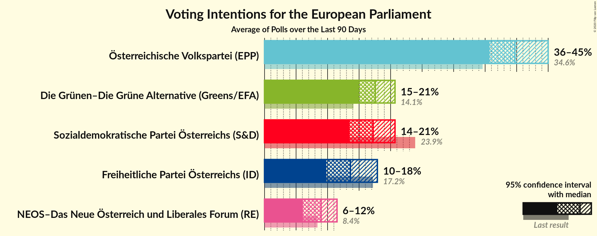

### Confidence Intervals

| Party | Last Result | Median | 80% Confidence Interval | 90% Confidence Interval | 95% Confidence Interval | 99% Confidence Interval |
|:-----:|:-----------:|:------:|:-----------------------:|:-----------------------:|:-----------------------:|:-----------------------:|
| <a href="#österreichische-volkspartei-(epp)">Österreichische Volkspartei (EPP)</a> | 34.6% | 39.7% | 37.0–43.5% |36.3–44.3% | 35.7–45.0% | 34.5–46.2% |
| <a href="#sozialdemokratische-partei-österreichs-(s&d)">Sozialdemokratische Partei Österreichs (S&D)</a> | 23.9% | 17.2% | 14.7–19.6% |14.0–20.2% | 13.5–20.7% | 12.6–21.7% |
| <a href="#freiheitliche-partei-österreichs-(id)">Freiheitliche Partei Österreichs (ID)</a> | 17.2% | 13.6% | 10.7–16.7% |10.2–17.3% | 9.8–17.9% | 9.1–18.9% |
| <a href="#die-grünen–die-grüne-alternative-(greens/efa)">Die Grünen–Die Grüne Alternative (Greens/EFA)</a> | 14.1% | 17.6% | 15.8–19.6% |15.4–20.2% | 15.0–20.7% | 14.2–21.7% |
| <a href="#neos–das-neue-österreich-und-liberales-forum-(re)">NEOS–Das Neue Österreich und Liberales Forum (RE)</a> | 8.4% | 9.0% | 6.8–10.6% |6.4–11.1% | 6.1–11.5% | 5.5–12.4% |
| <a href="#jetzt–liste-pilz-(greens/efa)">JETZT–Liste Pilz (Greens/EFA)</a> | 1.0% | N/A | N/A |N/A | N/A | N/A |
| <a href="#meine-stimme-gilt!-(*)">Meine Stimme Gilt! (*)</a> | 0.0% | N/A | N/A |N/A | N/A | N/A |

### Österreichische Volkspartei (EPP)

*For a full overview of the results for this party, see the [Österreichische Volkspartei (EPP)](party-österreichischevolksparteiepp.html) page.*

| Voting Intentions | Probability | Accumulated | Special Marks |
|:-----------------:|:-----------:|:-----------:|:-------------:|
| 31.5–32.5% | 0% | 100% |  |
| 32.5–33.5% | 0.1% | 100% |  |
| 33.5–34.5% | 0.4% | 99.9% |  |
| 34.5–35.5% | 2% | 99.5% | Last Result |
| 35.5–36.5% | 4% | 98% |  |
| 36.5–37.5% | 9% | 94% |  |
| 37.5–38.5% | 14% | 85% |  |
| 38.5–39.5% | 17% | 70% |  |
| 39.5–40.5% | 15% | 53% | Median |
| 40.5–41.5% | 12% | 38% |  |
| 41.5–42.5% | 9% | 26% |  |
| 42.5–43.5% | 7% | 17% |  |
| 43.5–44.5% | 5% | 9% |  |
| 44.5–45.5% | 3% | 4% |  |
| 45.5–46.5% | 1.0% | 1.3% |  |
| 46.5–47.5% | 0.3% | 0.3% |  |
| 47.5–48.5% | 0% | 0% |  |
| 48.5–49.5% | 0% | 0% |  |

### Sozialdemokratische Partei Österreichs (S&D)

*For a full overview of the results for this party, see the [Sozialdemokratische Partei Österreichs (S&D)](party-sozialdemokratischeparteiösterreichssd.html) page.*

| Voting Intentions | Probability | Accumulated | Special Marks |
|:-----------------:|:-----------:|:-----------:|:-------------:|
| 10.5–11.5% | 0% | 100% |  |
| 11.5–12.5% | 0.4% | 100% |  |
| 12.5–13.5% | 2% | 99.6% |  |
| 13.5–14.5% | 6% | 97% |  |
| 14.5–15.5% | 11% | 91% |  |
| 15.5–16.5% | 17% | 80% |  |
| 16.5–17.5% | 21% | 64% | Median |
| 17.5–18.5% | 19% | 43% |  |
| 18.5–19.5% | 13% | 24% |  |
| 19.5–20.5% | 7% | 10% |  |
| 20.5–21.5% | 3% | 3% |  |
| 21.5–22.5% | 0.6% | 0.6% |  |
| 22.5–23.5% | 0.1% | 0.1% |  |
| 23.5–24.5% | 0% | 0% | Last Result |

### Freiheitliche Partei Österreichs (ID)

*For a full overview of the results for this party, see the [Freiheitliche Partei Österreichs (ID)](party-freiheitlicheparteiösterreichsid.html) page.*

| Voting Intentions | Probability | Accumulated | Special Marks |
|:-----------------:|:-----------:|:-----------:|:-------------:|
| 6.5–7.5% | 0% | 100% |  |
| 7.5–8.5% | 0.1% | 100% |  |
| 8.5–9.5% | 1.4% | 99.9% |  |
| 9.5–10.5% | 7% | 98.5% |  |
| 10.5–11.5% | 14% | 92% |  |
| 11.5–12.5% | 15% | 77% |  |
| 12.5–13.5% | 11% | 62% |  |
| 13.5–14.5% | 11% | 51% | Median |
| 14.5–15.5% | 15% | 40% |  |
| 15.5–16.5% | 13% | 25% |  |
| 16.5–17.5% | 8% | 12% | Last Result |
| 17.5–18.5% | 3% | 4% |  |
| 18.5–19.5% | 0.8% | 0.9% |  |
| 19.5–20.5% | 0.1% | 0.1% |  |
| 20.5–21.5% | 0% | 0% |  |

### Die Grünen–Die Grüne Alternative (Greens/EFA)

*For a full overview of the results for this party, see the [Die Grünen–Die Grüne Alternative (Greens/EFA)](party-diegrünen–diegrünealternativegreensefa.html) page.*

| Voting Intentions | Probability | Accumulated | Special Marks |
|:-----------------:|:-----------:|:-----------:|:-------------:|
| 11.5–12.5% | 0% | 100% |  |
| 12.5–13.5% | 0.1% | 100% |  |
| 13.5–14.5% | 1.0% | 99.9% | Last Result |
| 14.5–15.5% | 6% | 98.9% |  |
| 15.5–16.5% | 17% | 93% |  |
| 16.5–17.5% | 25% | 77% |  |
| 17.5–18.5% | 24% | 51% | Median |
| 18.5–19.5% | 16% | 27% |  |
| 19.5–20.5% | 8% | 11% |  |
| 20.5–21.5% | 3% | 3% |  |
| 21.5–22.5% | 0.6% | 0.7% |  |
| 22.5–23.5% | 0.1% | 0.1% |  |
| 23.5–24.5% | 0% | 0% |  |

### NEOS–Das Neue Österreich und Liberales Forum (RE)

*For a full overview of the results for this party, see the [NEOS–Das Neue Österreich und Liberales Forum (RE)](party-neos–dasneueösterreichundliberalesforumre.html) page.*

| Voting Intentions | Probability | Accumulated | Special Marks |
|:-----------------:|:-----------:|:-----------:|:-------------:|
| 3.5–4.5% | 0% | 100% |  |
| 4.5–5.5% | 0.6% | 100% |  |
| 5.5–6.5% | 6% | 99.4% |  |
| 6.5–7.5% | 13% | 93% |  |
| 7.5–8.5% | 19% | 80% | Last Result |
| 8.5–9.5% | 28% | 62% | Median |
| 9.5–10.5% | 22% | 33% |  |
| 10.5–11.5% | 9% | 11% |  |
| 11.5–12.5% | 2% | 2% |  |
| 12.5–13.5% | 0.3% | 0.3% |  |
| 13.5–14.5% | 0% | 0% |  |

## Seats

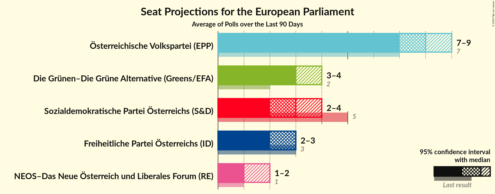

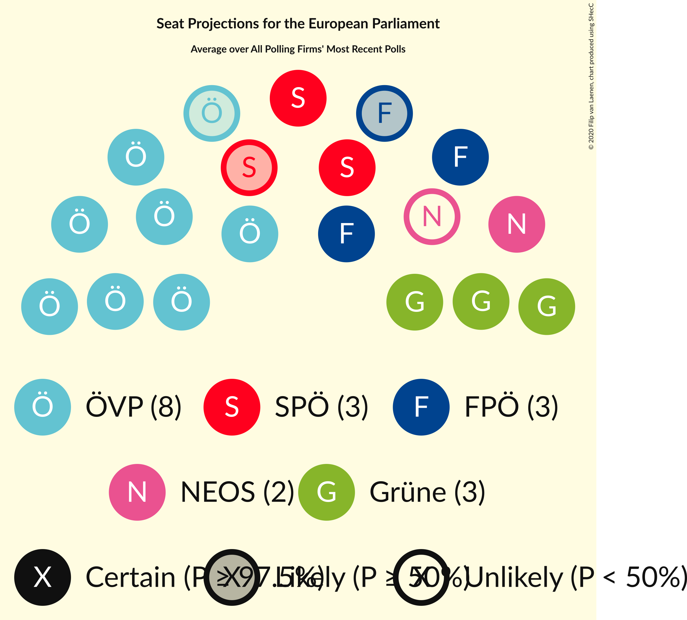

### Confidence Intervals

| Party | Last Result | Median | 80% Confidence Interval | 90% Confidence Interval | 95% Confidence Interval | 99% Confidence Interval |
|:-----:|:-----------:|:------:|:-----------------------:|:-----------------------:|:-----------------------:|:-----------------------:|
| <a href="#österreichische-volkspartei-(epp)">Österreichische Volkspartei (EPP)</a> | 7 | 8 | 8–9 |7–9 | 7–9 | 7–10 |
| <a href="#sozialdemokratische-partei-österreichs-(s&d)">Sozialdemokratische Partei Österreichs (S&D)</a> | 5 | 3 | 3–4 |3–4 | 2–4 | 2–4 |
| <a href="#freiheitliche-partei-österreichs-(id)">Freiheitliche Partei Österreichs (ID)</a> | 3 | 3 | 2–3 |2–3 | 2–3 | 1–4 |
| <a href="#die-grünen–die-grüne-alternative-(greens/efa)">Die Grünen–Die Grüne Alternative (Greens/EFA)</a> | 2 | 3 | 3–4 |3–4 | 3–4 | 3–4 |
| <a href="#neos–das-neue-österreich-und-liberales-forum-(re)">NEOS–Das Neue Österreich und Liberales Forum (RE)</a> | 1 | 1 | 1–2 |1–2 | 1–2 | 1–2 |
| <a href="#jetzt–liste-pilz-(greens/efa)">JETZT–Liste Pilz (Greens/EFA)</a> | 0 | N/A | N/A |N/A | N/A | N/A |
| <a href="#meine-stimme-gilt!-(*)">Meine Stimme Gilt! (*)</a> | 0 | N/A | N/A |N/A | N/A | N/A |

### Österreichische Volkspartei (EPP)

*For a full overview of the results for this party, see the [Österreichische Volkspartei (EPP)](party-österreichischevolksparteiepp.html) page.*

| Number of Seats | Probability | Accumulated | Special Marks |
|:---------------:|:-----------:|:-----------:|:-------------:|
| 7 | 7% | 100% | Last Result |
| 8 | 59% | 93% | Median |
| 9 | 33% | 34% |  |
| 10 | 0.8% | 0.8% | Majority |
| 11 | 0% | 0% |  |

### Sozialdemokratische Partei Österreichs (S&D)

*For a full overview of the results for this party, see the [Sozialdemokratische Partei Österreichs (S&D)](party-sozialdemokratischeparteiösterreichssd.html) page.*

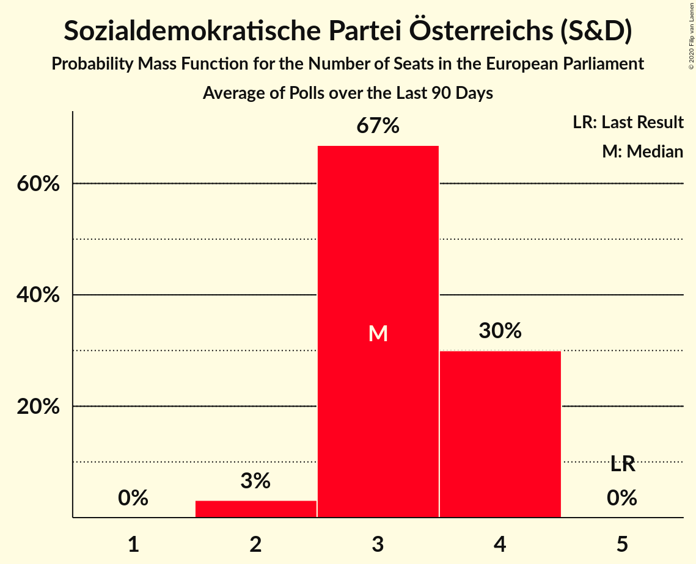

| Number of Seats | Probability | Accumulated | Special Marks |
|:---------------:|:-----------:|:-----------:|:-------------:|
| 2 | 3% | 100% |  |
| 3 | 67% | 97% | Median |
| 4 | 30% | 30% |  |
| 5 | 0% | 0% | Last Result |

### Freiheitliche Partei Österreichs (ID)

*For a full overview of the results for this party, see the [Freiheitliche Partei Österreichs (ID)](party-freiheitlicheparteiösterreichsid.html) page.*

| Number of Seats | Probability | Accumulated | Special Marks |
|:---------------:|:-----------:|:-----------:|:-------------:|
| 1 | 1.0% | 100% |  |
| 2 | 48% | 99.0% |  |
| 3 | 49% | 51% | Last Result, Median |
| 4 | 2% | 2% |  |
| 5 | 0% | 0% |  |

### Die Grünen–Die Grüne Alternative (Greens/EFA)

*For a full overview of the results for this party, see the [Die Grünen–Die Grüne Alternative (Greens/EFA)](party-diegrünen–diegrünealternativegreensefa.html) page.*

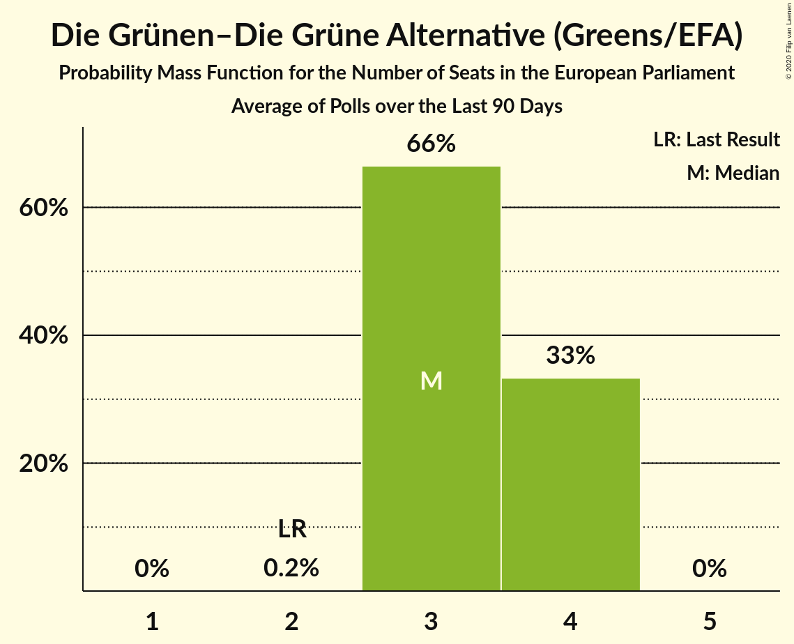

| Number of Seats | Probability | Accumulated | Special Marks |
|:---------------:|:-----------:|:-----------:|:-------------:|
| 2 | 0.2% | 100% | Last Result |
| 3 | 66% | 99.8% | Median |
| 4 | 33% | 33% |  |
| 5 | 0% | 0% |  |

### NEOS–Das Neue Österreich und Liberales Forum (RE)

*For a full overview of the results for this party, see the [NEOS–Das Neue Österreich und Liberales Forum (RE)](party-neos–dasneueösterreichundliberalesforumre.html) page.*

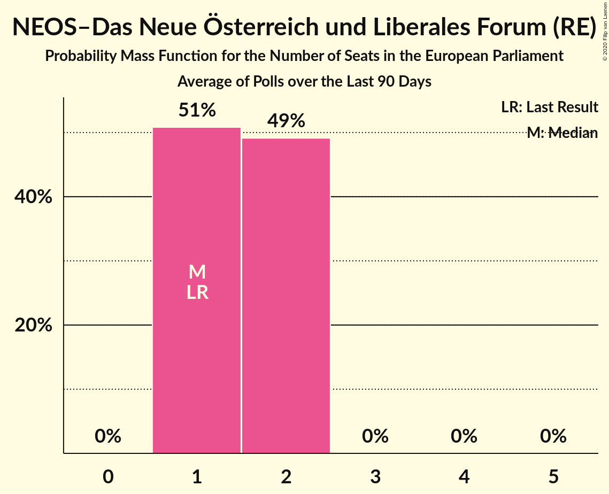

| Number of Seats | Probability | Accumulated | Special Marks |
|:---------------:|:-----------:|:-----------:|:-------------:|
| 1 | 51% | 100% | Last Result, Median |
| 2 | 49% | 49% |  |
| 3 | 0% | 0% |  |

### JETZT–Liste Pilz (Greens/EFA)

*For a full overview of the results for this party, see the [JETZT–Liste Pilz (Greens/EFA)](party-jetzt–listepilzgreensefa.html) page.*

### Meine Stimme Gilt! (*)

*For a full overview of the results for this party, see the [Meine Stimme Gilt! (*)](party-meinestimmegilt.html) page.*

## Coalitions

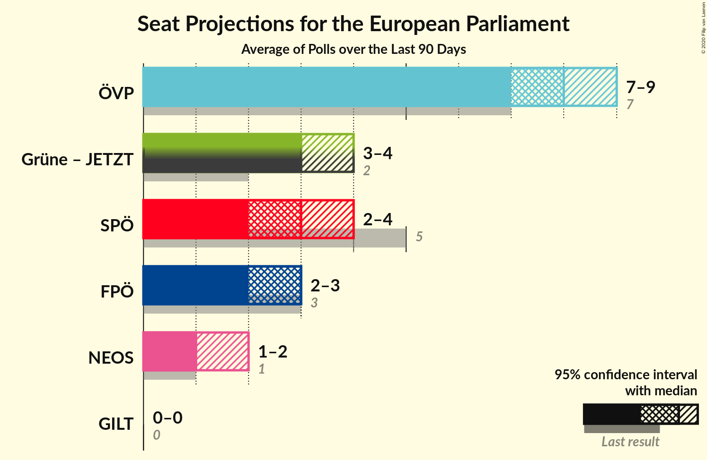

### Confidence Intervals

| Coalition | Last Result | Median | Majority? | 80% Confidence Interval | 90% Confidence Interval | 95% Confidence Interval | 99% Confidence Interval |
|:---------:|:-----------:|:------:|:---------:|:-----------------------:|:-----------------------:|:-----------------------:|:-----------------------:|
| Österreichische Volkspartei (EPP) | 7 | 8 | 0.8% | 8–9 | 7–9 | 7–9 | 7–10 |
| Die Grünen–Die Grüne Alternative (Greens/EFA) – JETZT–Liste Pilz (Greens/EFA) | 2 | 3 | 0% | 3–4 | 3–4 | 3–4 | 3–4 |
| Sozialdemokratische Partei Österreichs (S&D) | 5 | 3 | 0% | 3–4 | 3–4 | 2–4 | 2–4 |
| Freiheitliche Partei Österreichs (ID) | 3 | 3 | 0% | 2–3 | 2–3 | 2–3 | 1–4 |
| NEOS–Das Neue Österreich und Liberales Forum (RE) | 1 | 1 | 0% | 1–2 | 1–2 | 1–2 | 1–2 |
| Meine Stimme Gilt! (*) | 0 | 0 | 0% | 0 | 0 | 0 | 0 |

### Österreichische Volkspartei (EPP)

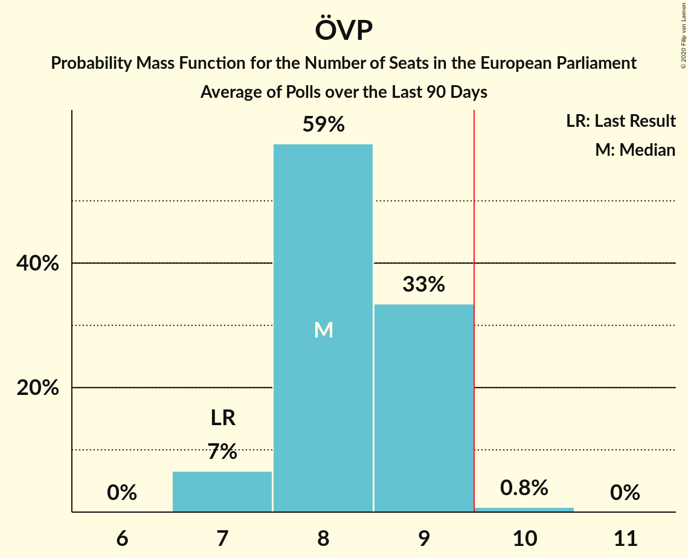

| Number of Seats | Probability | Accumulated | Special Marks |
|:---------------:|:-----------:|:-----------:|:-------------:|
| 7 | 7% | 100% | Last Result |
| 8 | 59% | 93% | Median |
| 9 | 33% | 34% |  |
| 10 | 0.8% | 0.8% | Majority |
| 11 | 0% | 0% |  |

### Die Grünen–Die Grüne Alternative (Greens/EFA) – JETZT–Liste Pilz (Greens/EFA)

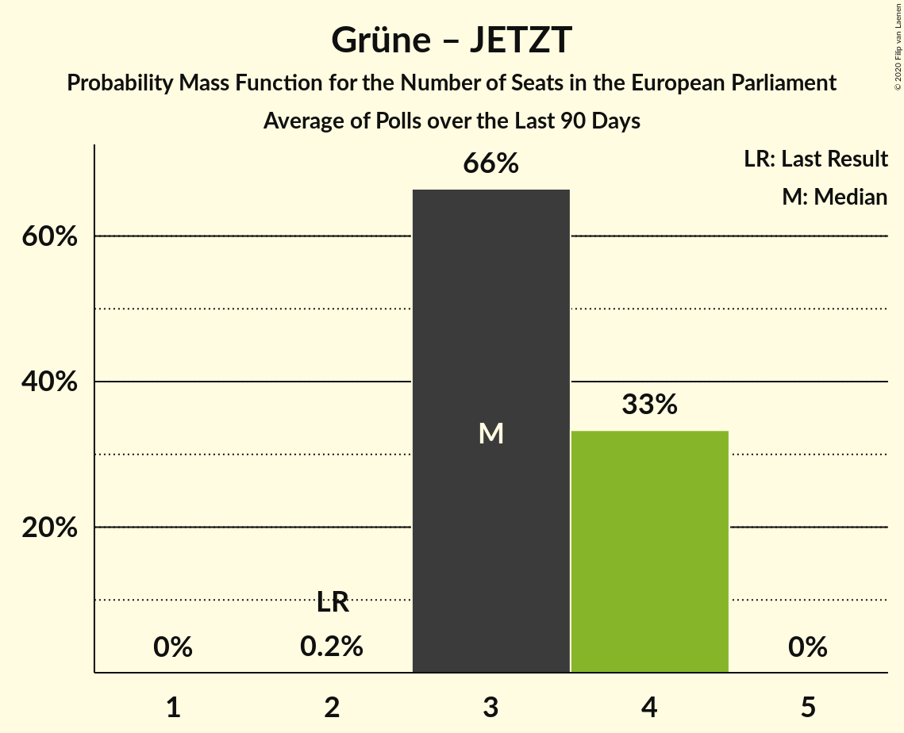

| Number of Seats | Probability | Accumulated | Special Marks |
|:---------------:|:-----------:|:-----------:|:-------------:|
| 2 | 0.2% | 100% | Last Result |
| 3 | 66% | 99.8% | Median |
| 4 | 33% | 33% |  |
| 5 | 0% | 0% |  |

### Sozialdemokratische Partei Österreichs (S&D)

| Number of Seats | Probability | Accumulated | Special Marks |
|:---------------:|:-----------:|:-----------:|:-------------:|
| 2 | 3% | 100% |  |
| 3 | 67% | 97% | Median |
| 4 | 30% | 30% |  |
| 5 | 0% | 0% | Last Result |

### Freiheitliche Partei Österreichs (ID)

| Number of Seats | Probability | Accumulated | Special Marks |
|:---------------:|:-----------:|:-----------:|:-------------:|
| 1 | 1.0% | 100% |  |
| 2 | 48% | 99.0% |  |
| 3 | 49% | 51% | Last Result, Median |
| 4 | 2% | 2% |  |
| 5 | 0% | 0% |  |

### NEOS–Das Neue Österreich und Liberales Forum (RE)

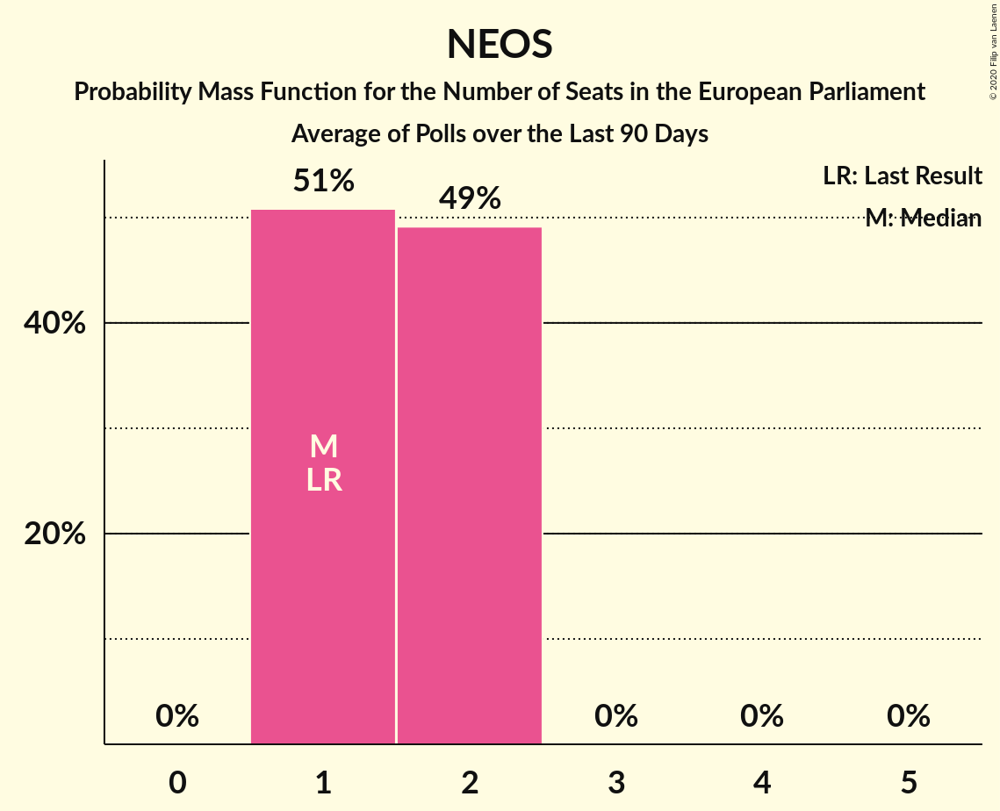

| Number of Seats | Probability | Accumulated | Special Marks |
|:---------------:|:-----------:|:-----------:|:-------------:|
| 1 | 51% | 100% | Last Result, Median |
| 2 | 49% | 49% |  |
| 3 | 0% | 0% |  |

### Meine Stimme Gilt! (*)

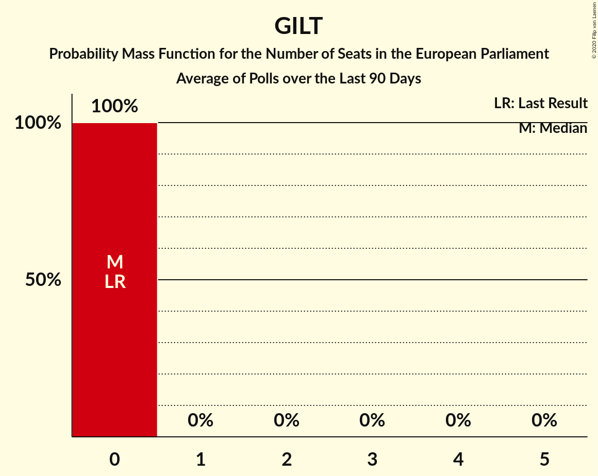

| Number of Seats | Probability | Accumulated | Special Marks |
|:---------------:|:-----------:|:-----------:|:-------------:|
| 0 | 100% | 100% | Last Result, Median |

## Technical Information

+ **Number of polls included in this average:** 4
+ **Lowest number of simulations done in a poll included in this average:** 1,048,576
+ **Total number of simulations done in the polls included in this average:** 4,194,304
+ **Error estimate:** 0.64%
