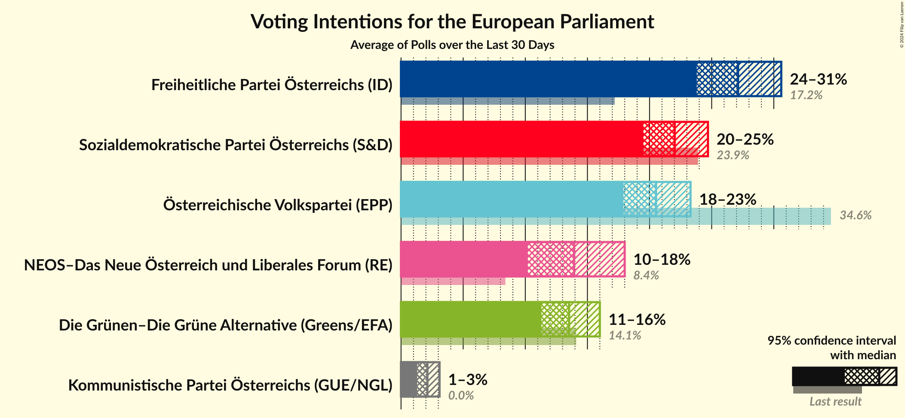
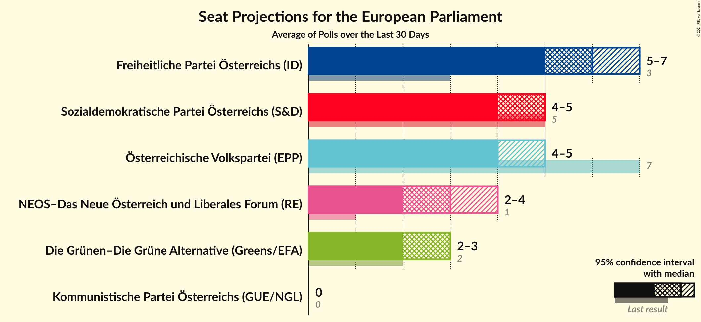
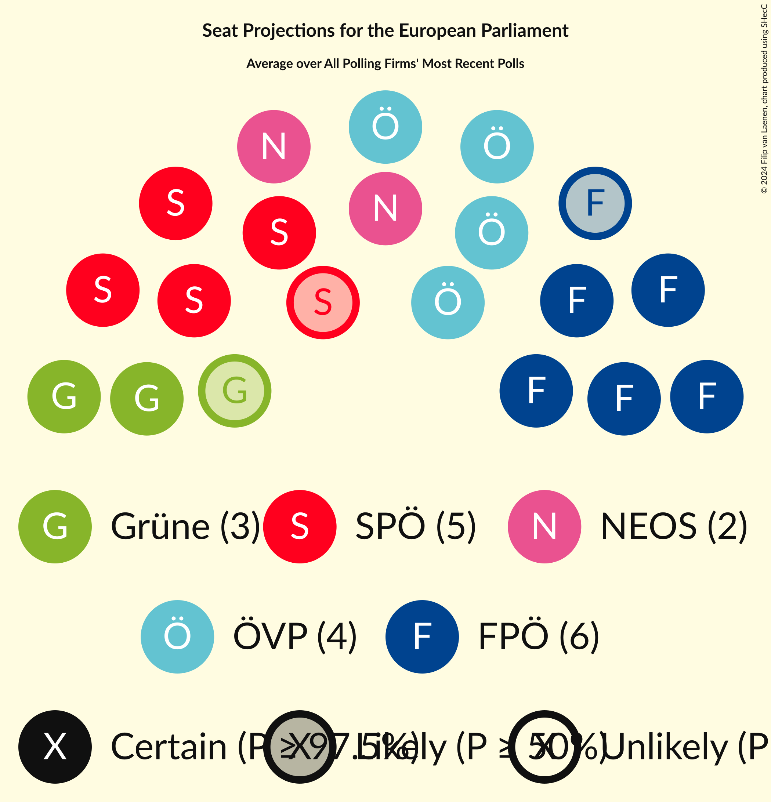
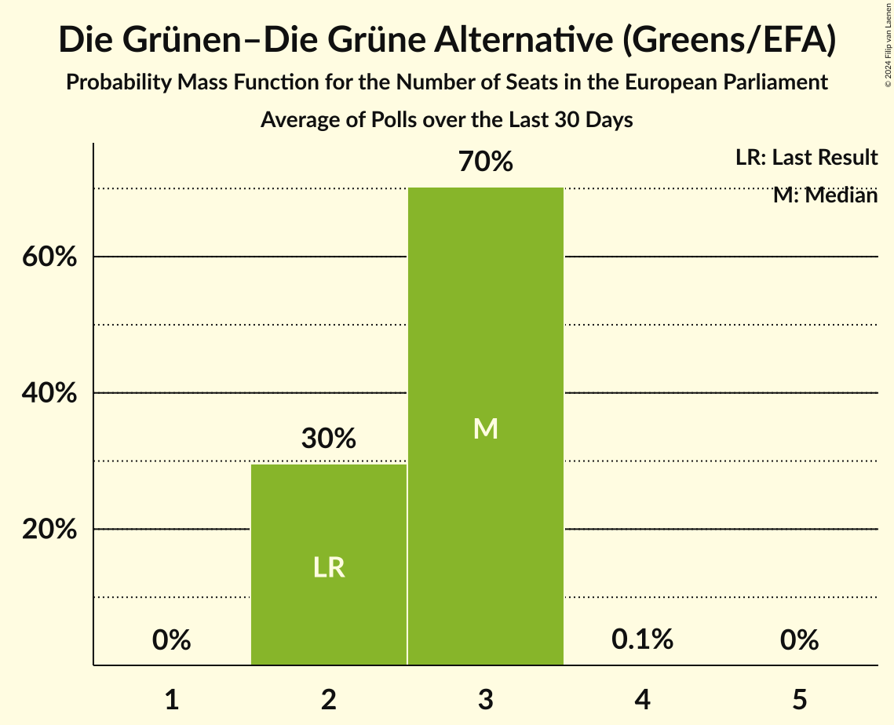
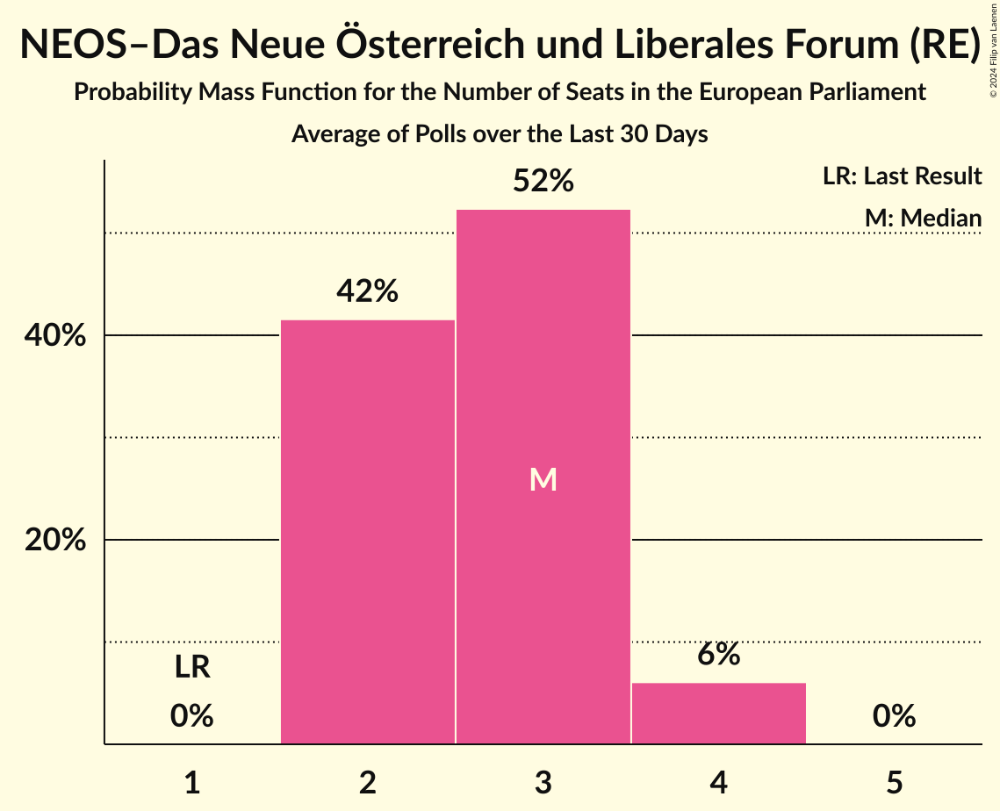
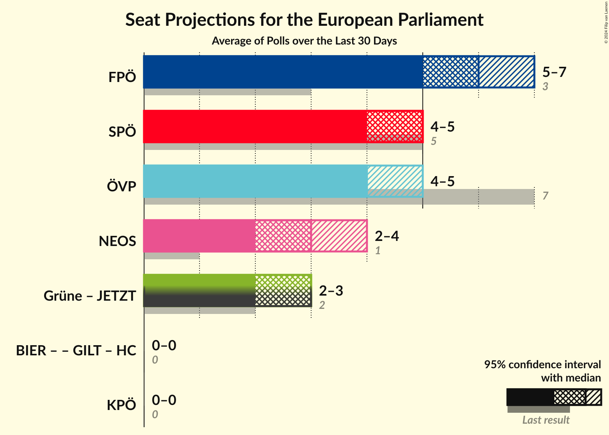
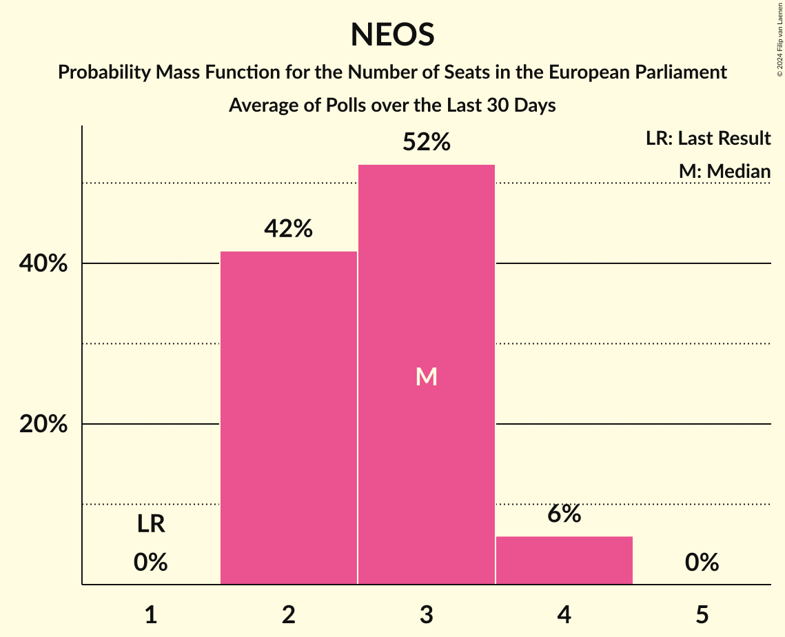
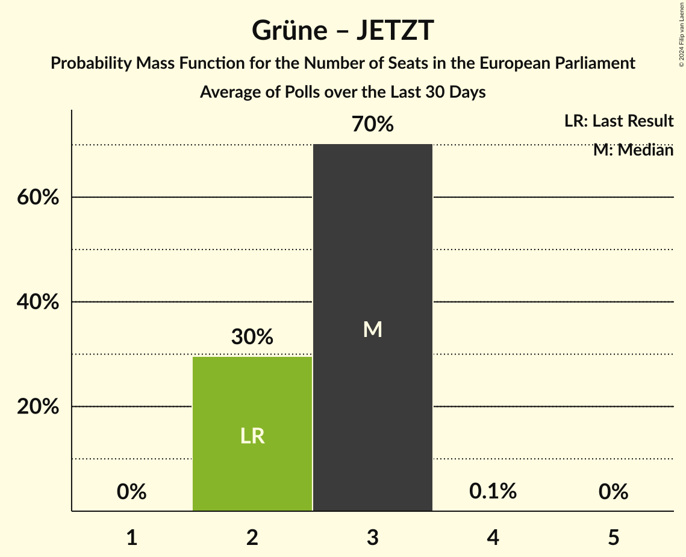

# Poll Average

<a href="#voting-intentions">Voting Intentions</a> | <a href="#seats">Seats</a> | <a href="#coalitions">Coalitions</a> | <a href="#technical-information">Technical Information</a>

## Summary

The table below lists the polls on which the average is based. They are the most recent polls (less than 30 days old) registered and analyzed so far.

| Period     | Polling firm/Commissioner(s) | ÖVP | SPÖ | FPÖ | Grüne | NEOS | JETZT | GILT | HC | BIER | KPÖ |
|:----------:|:----------------------------:|:--:|:--:|:--:|:--:|:--:|:--:|:--:|:--:|:--:|:--:|
| 26 May 2019 | General Election | 34.6%   7 | 23.9%   5 | 17.2%   3 | 14.1%   2 | 8.4%   1 | 1.0%   0 | 0.0%   0 | 0.0%   0 | 0.0%   0 | 0.0%   0 |
| N/A | Poll Average | 18–23%   4–5 | 20–25%   4–5 | 24–31%   5–7 | 11–16%   2–3 | 10–18%   2–4 | N/A   N/A | N/A   N/A | N/A   N/A | N/A   N/A | 1–3%   0 |
| [23 February–5 March 2024](2024-03-05-Ipsos.html) | Ipsos   Euronews | 19–24%   4–5 | 20–25%   4–5 | 25–31%   5–7 | 11–15%   2–3 | 10–14%   2–3 | N/A   N/A | N/A   N/A | N/A   N/A | N/A   N/A | 1–3%   0 |
| [26–28 February 2024](2024-02-28-Market.html) | Market   ÖSTERREICH | 18–23%   3–5 | 20–25%   4–5 | 23–29%   5–6 | 12–16%   2–3 | 14–18%   3–4 | N/A   N/A | N/A   N/A | N/A   N/A | N/A   N/A | 1–3%   0 |
| 26 May 2019 | General Election | 34.6%   7 | 23.9%   5 | 17.2%   3 | 14.1%   2 | 8.4%   1 | 1.0%   0 | 0.0%   0 | 0.0%   0 | 0.0%   0 | 0.0%   0 |

Only polls for which at least the sample size has been published are included in the table above.

**Legend:**
+ **Top half of each row:** Voting intentions (95% confidence interval)
+ **Bottom half of each row:** Seat projections for the European Parliament (95% confidence interval)
+ **ÖVP:** Österreichische Volkspartei (EPP)
+ **SPÖ:** Sozialdemokratische Partei Österreichs (S&D)
+ **FPÖ:** Freiheitliche Partei Österreichs (ID)
+ **Grüne:** Die Grünen–Die Grüne Alternative (Greens/EFA)
+ **NEOS:** NEOS–Das Neue Österreich und Liberales Forum (RE)
+ **JETZT:** JETZT–Liste Pilz (Greens/EFA)
+ **GILT:** Meine Stimme Gilt! (*)
+ **HC:** Team HC Strache–Allianz für Österreich (*)
+ **BIER:** Bierpartei (*)
+ **KPÖ:** Kommunistische Partei Österreichs (GUE/NGL)
+ **N/A (single party):** Party not included the published results
+ **N/A (entire row):** Calculation for this opinion poll not started yet

## Voting Intentions

### Confidence Intervals

| Party | Last Result | Median | 80% Confidence Interval | 90% Confidence Interval | 95% Confidence Interval | 99% Confidence Interval |
|:-----:|:-----------:|:------:|:-----------------------:|:-----------------------:|:-----------------------:|:-----------------------:|
| <a href="#österreichische-volkspartei-(epp)">Österreichische Volkspartei (EPP)</a> | 34.6% | 20.5% | 18.8–22.3% |18.3–22.9% | 17.9–23.3% | 17.2–24.2% |
| <a href="#sozialdemokratische-partei-österreichs-(s&d)">Sozialdemokratische Partei Österreichs (S&D)</a> | 23.9% | 22.0% | 20.4–23.7% |19.9–24.2% | 19.5–24.7% | 18.8–25.5% |
| <a href="#freiheitliche-partei-österreichs-(id)">Freiheitliche Partei Österreichs (ID)</a> | 17.2% | 27.1% | 24.8–29.5% |24.3–30.1% | 23.8–30.6% | 22.9–31.6% |
| <a href="#die-grünen–die-grüne-alternative-(greens/efa)">Die Grünen–Die Grüne Alternative (Greens/EFA)</a> | 14.1% | 13.5% | 12.1–15.1% |11.7–15.6% | 11.3–16.0% | 10.7–16.8% |
| <a href="#neos–das-neue-österreich-und-liberales-forum-(re)">NEOS–Das Neue Österreich und Liberales Forum (RE)</a> | 8.4% | 13.9% | 11.0–17.0% |10.6–17.6% | 10.2–18.0% | 9.6–18.9% |
| <a href="#jetzt–liste-pilz-(greens/efa)">JETZT–Liste Pilz (Greens/EFA)</a> | 1.0% | N/A | N/A |N/A | N/A | N/A |
| <a href="#meine-stimme-gilt!-(*)">Meine Stimme Gilt! (*)</a> | 0.0% | N/A | N/A |N/A | N/A | N/A |
| <a href="#team-hc-strache–allianz-für-österreich-(*)">Team HC Strache–Allianz für Österreich (*)</a> | 0.0% | N/A | N/A |N/A | N/A | N/A |
| <a href="#bierpartei-(*)">Bierpartei (*)</a> | 0.0% | N/A | N/A |N/A | N/A | N/A |
| <a href="#kommunistische-partei-österreichs-(gue/ngl)">Kommunistische Partei Österreichs (GUE/NGL)</a> | 0.0% | 2.1% | 1.6–2.8% |1.4–2.9% | 1.3–3.1% | 1.1–3.5% |

### Österreichische Volkspartei (EPP)

*For a full overview of the results for this party, see the [Österreichische Volkspartei (EPP)](party-österreichischevolksparteiepp.html) page.*

| Voting Intentions | Probability | Accumulated | Special Marks |
|:-----------------:|:-----------:|:-----------:|:-------------:|
| 14.5–15.5% | 0% | 100% |  |
| 15.5–16.5% | 0.1% | 100% |  |
| 16.5–17.5% | 1.0% | 99.9% |  |
| 17.5–18.5% | 6% | 98.9% |  |
| 18.5–19.5% | 17% | 93% |  |
| 19.5–20.5% | 27% | 76% |  |
| 20.5–21.5% | 26% | 50% | Median |
| 21.5–22.5% | 16% | 23% |  |
| 22.5–23.5% | 6% | 7% |  |
| 23.5–24.5% | 1.4% | 2% |  |
| 24.5–25.5% | 0.2% | 0.2% |  |
| 25.5–26.5% | 0% | 0% |  |
| 26.5–27.5% | 0% | 0% |  |
| 27.5–28.5% | 0% | 0% |  |
| 28.5–29.5% | 0% | 0% |  |
| 29.5–30.5% | 0% | 0% |  |
| 30.5–31.5% | 0% | 0% |  |
| 31.5–32.5% | 0% | 0% |  |
| 32.5–33.5% | 0% | 0% |  |
| 33.5–34.5% | 0% | 0% |  |
| 34.5–35.5% | 0% | 0% | Last Result |

### Sozialdemokratische Partei Österreichs (S&D)

*For a full overview of the results for this party, see the [Sozialdemokratische Partei Österreichs (S&D)](party-sozialdemokratischeparteiösterreichssd.html) page.*

| Voting Intentions | Probability | Accumulated | Special Marks |
|:-----------------:|:-----------:|:-----------:|:-------------:|
| 16.5–17.5% | 0% | 100% |  |
| 17.5–18.5% | 0.3% | 100% |  |
| 18.5–19.5% | 2% | 99.7% |  |
| 19.5–20.5% | 10% | 97% |  |
| 20.5–21.5% | 23% | 88% |  |
| 21.5–22.5% | 30% | 65% | Median |
| 22.5–23.5% | 22% | 35% |  |
| 23.5–24.5% | 10% | 13% | Last Result |
| 24.5–25.5% | 3% | 3% |  |
| 25.5–26.5% | 0.4% | 0.5% |  |
| 26.5–27.5% | 0% | 0% |  |
| 27.5–28.5% | 0% | 0% |  |

### Freiheitliche Partei Österreichs (ID)

*For a full overview of the results for this party, see the [Freiheitliche Partei Österreichs (ID)](party-freiheitlicheparteiösterreichsid.html) page.*

| Voting Intentions | Probability | Accumulated | Special Marks |
|:-----------------:|:-----------:|:-----------:|:-------------:|
| 16.5–17.5% | 0% | 100% | Last Result |
| 17.5–18.5% | 0% | 100% |  |
| 18.5–19.5% | 0% | 100% |  |
| 19.5–20.5% | 0% | 100% |  |
| 20.5–21.5% | 0% | 100% |  |
| 21.5–22.5% | 0.2% | 100% |  |
| 22.5–23.5% | 1.4% | 99.8% |  |
| 23.5–24.5% | 6% | 98% |  |
| 24.5–25.5% | 12% | 93% |  |
| 25.5–26.5% | 19% | 81% |  |
| 26.5–27.5% | 21% | 62% | Median |
| 27.5–28.5% | 19% | 41% |  |
| 28.5–29.5% | 13% | 22% |  |
| 29.5–30.5% | 6% | 9% |  |
| 30.5–31.5% | 2% | 3% |  |
| 31.5–32.5% | 0.5% | 0.6% |  |
| 32.5–33.5% | 0.1% | 0.1% |  |
| 33.5–34.5% | 0% | 0% |  |

### Die Grünen–Die Grüne Alternative (Greens/EFA)

*For a full overview of the results for this party, see the [Die Grünen–Die Grüne Alternative (Greens/EFA)](party-diegrünen–diegrünealternativegreensefa.html) page.*

| Voting Intentions | Probability | Accumulated | Special Marks |
|:-----------------:|:-----------:|:-----------:|:-------------:|
| 8.5–9.5% | 0% | 100% |  |
| 9.5–10.5% | 0.3% | 100% |  |
| 10.5–11.5% | 4% | 99.7% |  |
| 11.5–12.5% | 16% | 96% |  |
| 12.5–13.5% | 30% | 80% |  |
| 13.5–14.5% | 29% | 50% | Last Result, Median |
| 14.5–15.5% | 15% | 20% |  |
| 15.5–16.5% | 4% | 5% |  |
| 16.5–17.5% | 0.7% | 0.8% |  |
| 17.5–18.5% | 0.1% | 0.1% |  |
| 18.5–19.5% | 0% | 0% |  |

### NEOS–Das Neue Österreich und Liberales Forum (RE)

*For a full overview of the results for this party, see the [NEOS–Das Neue Österreich und Liberales Forum (RE)](party-neos–dasneueösterreichundliberalesforumre.html) page.*

| Voting Intentions | Probability | Accumulated | Special Marks |
|:-----------------:|:-----------:|:-----------:|:-------------:|
| 7.5–8.5% | 0% | 100% | Last Result |
| 8.5–9.5% | 0.4% | 100% |  |
| 9.5–10.5% | 4% | 99.6% |  |
| 10.5–11.5% | 15% | 95% |  |
| 11.5–12.5% | 18% | 81% |  |
| 12.5–13.5% | 10% | 63% |  |
| 13.5–14.5% | 6% | 52% | Median |
| 14.5–15.5% | 12% | 46% |  |
| 15.5–16.5% | 17% | 33% |  |
| 16.5–17.5% | 11% | 17% |  |
| 17.5–18.5% | 4% | 5% |  |
| 18.5–19.5% | 0.8% | 0.9% |  |
| 19.5–20.5% | 0.1% | 0.1% |  |
| 20.5–21.5% | 0% | 0% |  |

### Kommunistische Partei Österreichs (GUE/NGL)

*For a full overview of the results for this party, see the [Kommunistische Partei Österreichs (GUE/NGL)](party-kommunistischeparteiösterreichsguengl.html) page.*

| Voting Intentions | Probability | Accumulated | Special Marks |
|:-----------------:|:-----------:|:-----------:|:-------------:|
| 0.0–0.5% | 0% | 100% | Last Result |
| 0.5–1.5% | 9% | 100% |  |
| 1.5–2.5% | 72% | 91% | Median |
| 2.5–3.5% | 18% | 19% |  |
| 3.5–4.5% | 0.4% | 0.4% |  |
| 4.5–5.5% | 0% | 0% |  |

## Seats

### Confidence Intervals

| Party | Last Result | Median | 80% Confidence Interval | 90% Confidence Interval | 95% Confidence Interval | 99% Confidence Interval |
|:-----:|:-----------:|:------:|:-----------------------:|:-----------------------:|:-----------------------:|:-----------------------:|
| <a href="#österreichische-volkspartei-(epp)">Österreichische Volkspartei (EPP)</a> | 7 | 4 | 4–5 |4–5 | 4–5 | 3–5 |
| <a href="#sozialdemokratische-partei-österreichs-(s&d)">Sozialdemokratische Partei Österreichs (S&D)</a> | 5 | 5 | 4–5 |4–5 | 4–5 | 4–6 |
| <a href="#freiheitliche-partei-österreichs-(id)">Freiheitliche Partei Österreichs (ID)</a> | 3 | 6 | 5–6 |5–7 | 5–7 | 5–7 |
| <a href="#die-grünen–die-grüne-alternative-(greens/efa)">Die Grünen–Die Grüne Alternative (Greens/EFA)</a> | 2 | 3 | 2–3 |2–3 | 2–3 | 2–3 |
| <a href="#neos–das-neue-österreich-und-liberales-forum-(re)">NEOS–Das Neue Österreich und Liberales Forum (RE)</a> | 1 | 3 | 2–3 |2–4 | 2–4 | 2–4 |
| <a href="#jetzt–liste-pilz-(greens/efa)">JETZT–Liste Pilz (Greens/EFA)</a> | 0 | N/A | N/A |N/A | N/A | N/A |
| <a href="#meine-stimme-gilt!-(*)">Meine Stimme Gilt! (*)</a> | 0 | N/A | N/A |N/A | N/A | N/A |
| <a href="#team-hc-strache–allianz-für-österreich-(*)">Team HC Strache–Allianz für Österreich (*)</a> | 0 | N/A | N/A |N/A | N/A | N/A |
| <a href="#bierpartei-(*)">Bierpartei (*)</a> | 0 | N/A | N/A |N/A | N/A | N/A |
| <a href="#kommunistische-partei-österreichs-(gue/ngl)">Kommunistische Partei Österreichs (GUE/NGL)</a> | 0 | 0 | 0 |0 | 0 | 0 |

### Österreichische Volkspartei (EPP)

*For a full overview of the results for this party, see the [Österreichische Volkspartei (EPP)](party-österreichischevolksparteiepp.html) page.*

| Number of Seats | Probability | Accumulated | Special Marks |
|:---------------:|:-----------:|:-----------:|:-------------:|
| 3 | 2% | 100% |  |
| 4 | 73% | 98% | Median |
| 5 | 26% | 26% |  |
| 6 | 0% | 0% |  |
| 7 | 0% | 0% | Last Result |

### Sozialdemokratische Partei Österreichs (S&D)

*For a full overview of the results for this party, see the [Sozialdemokratische Partei Österreichs (S&D)](party-sozialdemokratischeparteiösterreichssd.html) page.*

| Number of Seats | Probability | Accumulated | Special Marks |
|:---------------:|:-----------:|:-----------:|:-------------:|
| 4 | 39% | 100% |  |
| 5 | 61% | 61% | Last Result, Median |
| 6 | 0.5% | 0.5% |  |
| 7 | 0% | 0% |  |

### Freiheitliche Partei Österreichs (ID)

*For a full overview of the results for this party, see the [Freiheitliche Partei Österreichs (ID)](party-freiheitlicheparteiösterreichsid.html) page.*

| Number of Seats | Probability | Accumulated | Special Marks |
|:---------------:|:-----------:|:-----------:|:-------------:|
| 3 | 0% | 100% | Last Result |
| 4 | 0.1% | 100% |  |
| 5 | 28% | 99.9% |  |
| 6 | 64% | 72% | Median |
| 7 | 8% | 8% |  |
| 8 | 0% | 0% |  |

### Die Grünen–Die Grüne Alternative (Greens/EFA)

*For a full overview of the results for this party, see the [Die Grünen–Die Grüne Alternative (Greens/EFA)](party-diegrünen–diegrünealternativegreensefa.html) page.*

| Number of Seats | Probability | Accumulated | Special Marks |
|:---------------:|:-----------:|:-----------:|:-------------:|
| 2 | 30% | 100% | Last Result |
| 3 | 70% | 70% | Median |
| 4 | 0.1% | 0.1% |  |
| 5 | 0% | 0% |  |

### NEOS–Das Neue Österreich und Liberales Forum (RE)

*For a full overview of the results for this party, see the [NEOS–Das Neue Österreich und Liberales Forum (RE)](party-neos–dasneueösterreichundliberalesforumre.html) page.*

| Number of Seats | Probability | Accumulated | Special Marks |
|:---------------:|:-----------:|:-----------:|:-------------:|
| 1 | 0% | 100% | Last Result |
| 2 | 42% | 100% |  |
| 3 | 52% | 58% | Median |
| 4 | 6% | 6% |  |
| 5 | 0% | 0% |  |

### JETZT–Liste Pilz (Greens/EFA)

*For a full overview of the results for this party, see the [JETZT–Liste Pilz (Greens/EFA)](party-jetzt–listepilzgreensefa.html) page.*

### Meine Stimme Gilt! (*)

*For a full overview of the results for this party, see the [Meine Stimme Gilt! (*)](party-meinestimmegilt.html) page.*

### Team HC Strache–Allianz für Österreich (*)

*For a full overview of the results for this party, see the [Team HC Strache–Allianz für Österreich (*)](party-teamhcstrache–allianzfürösterreich.html) page.*

### Bierpartei (*)

*For a full overview of the results for this party, see the [Bierpartei (*)](party-bierpartei.html) page.*

### Kommunistische Partei Österreichs (GUE/NGL)

*For a full overview of the results for this party, see the [Kommunistische Partei Österreichs (GUE/NGL)](party-kommunistischeparteiösterreichsguengl.html) page.*

| Number of Seats | Probability | Accumulated | Special Marks |
|:---------------:|:-----------:|:-----------:|:-------------:|
| 0 | 100% | 100% | Last Result, Median |

## Coalitions

### Confidence Intervals

| Coalition | Last Result | Median | Majority? | 80% Confidence Interval | 90% Confidence Interval | 95% Confidence Interval | 99% Confidence Interval |
|:---------:|:-----------:|:------:|:---------:|:-----------------------:|:-----------------------:|:-----------------------:|:-----------------------:|
| Freiheitliche Partei Österreichs (ID) | 3 | 6 | 0% | 5–6 | 5–7 | 5–7 | 5–7 |
| Sozialdemokratische Partei Österreichs (S&D) | 5 | 5 | 0% | 4–5 | 4–5 | 4–5 | 4–6 |
| Österreichische Volkspartei (EPP) | 7 | 4 | 0% | 4–5 | 4–5 | 4–5 | 3–5 |
| NEOS–Das Neue Österreich und Liberales Forum (RE) | 1 | 3 | 0% | 2–3 | 2–4 | 2–4 | 2–4 |
| Die Grünen–Die Grüne Alternative (Greens/EFA) – JETZT–Liste Pilz (Greens/EFA) | 2 | 3 | 0% | 2–3 | 2–3 | 2–3 | 2–3 |
| Kommunistische Partei Österreichs (GUE/NGL) | 0 | 0 | 0% | 0 | 0 | 0 | 0 |

### Freiheitliche Partei Österreichs (ID)

| Number of Seats | Probability | Accumulated | Special Marks |
|:---------------:|:-----------:|:-----------:|:-------------:|
| 3 | 0% | 100% | Last Result |
| 4 | 0.1% | 100% |  |
| 5 | 28% | 99.9% |  |
| 6 | 64% | 72% | Median |
| 7 | 8% | 8% |  |
| 8 | 0% | 0% |  |

### Sozialdemokratische Partei Österreichs (S&D)

| Number of Seats | Probability | Accumulated | Special Marks |
|:---------------:|:-----------:|:-----------:|:-------------:|
| 4 | 39% | 100% |  |
| 5 | 61% | 61% | Last Result, Median |
| 6 | 0.5% | 0.5% |  |
| 7 | 0% | 0% |  |

### Österreichische Volkspartei (EPP)

| Number of Seats | Probability | Accumulated | Special Marks |
|:---------------:|:-----------:|:-----------:|:-------------:|
| 3 | 2% | 100% |  |
| 4 | 73% | 98% | Median |
| 5 | 26% | 26% |  |
| 6 | 0% | 0% |  |
| 7 | 0% | 0% | Last Result |

### NEOS–Das Neue Österreich und Liberales Forum (RE)

| Number of Seats | Probability | Accumulated | Special Marks |
|:---------------:|:-----------:|:-----------:|:-------------:|
| 1 | 0% | 100% | Last Result |
| 2 | 42% | 100% |  |
| 3 | 52% | 58% | Median |
| 4 | 6% | 6% |  |
| 5 | 0% | 0% |  |

### Die Grünen–Die Grüne Alternative (Greens/EFA) – JETZT–Liste Pilz (Greens/EFA)

| Number of Seats | Probability | Accumulated | Special Marks |
|:---------------:|:-----------:|:-----------:|:-------------:|
| 2 | 30% | 100% | Last Result |
| 3 | 70% | 70% | Median |
| 4 | 0.1% | 0.1% |  |
| 5 | 0% | 0% |  |

### Kommunistische Partei Österreichs (GUE/NGL)

| Number of Seats | Probability | Accumulated | Special Marks |
|:---------------:|:-----------:|:-----------:|:-------------:|
| 0 | 100% | 100% | Last Result, Median |

## Technical Information

+ **Number of polls included in this average:** 2
+ **Lowest number of simulations done in a poll included in this average:** 1,048,576
+ **Total number of simulations done in the polls included in this average:** 2,097,152
+ **Error estimate:** 0.78%
