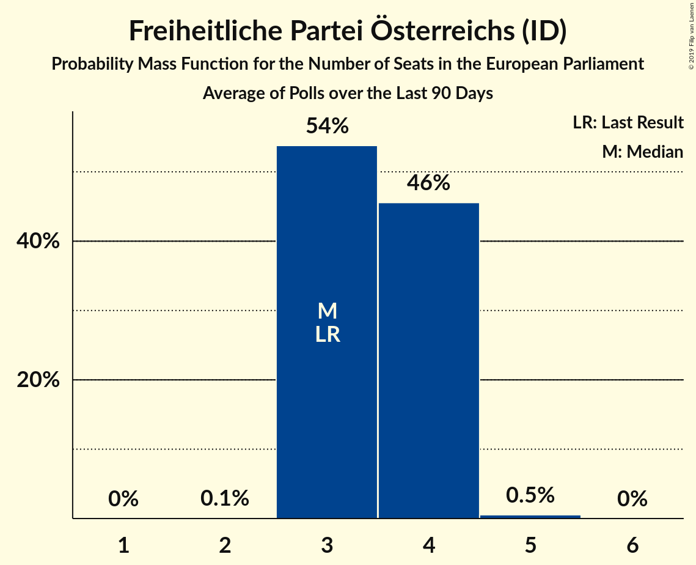
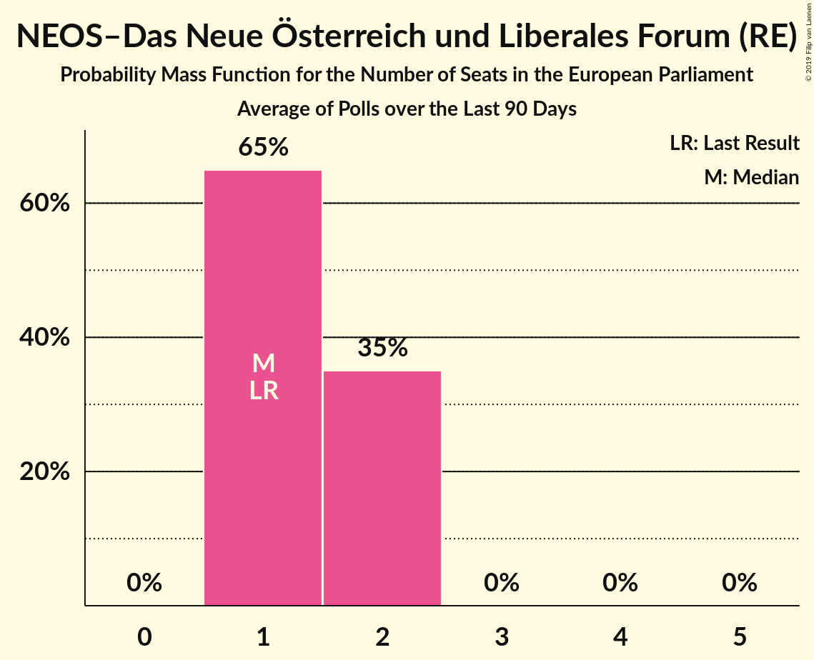

# Poll Average

<a href="#voting-intentions">Voting Intentions</a> | <a href="#seats">Seats</a> | <a href="#coalitions">Coalitions</a> | <a href="#technical-information">Technical Information</a>

## Summary

The table below lists the polls on which the average is based. They are the most recent polls (less than 90 days old) registered and analyzed so far.

| Period     | Polling firm/Commissioner(s) | ÖVP | SPÖ | FPÖ | Grüne | NEOS | JETZT | GILT |
|:----------:|:----------------------------:|:--:|:--:|:--:|:--:|:--:|:--:|:--:|
| 26 May 2019 | General Election | 34.6%   7 | 23.9%   5 | 17.2%   3 | 14.1%   2 | 8.4%   1 | 1.0%   0 | 0.0%   0 |
| N/A | Poll Average | 34–41%   7–8 | 18–25%   3–5 | 16–23%   3–4 | 8–13%   1–2 | 7–12%   1–2 | 0–3%   0 | N/A   N/A |
| [24–28 June 2019](2019-06-28-PeterHajek.html) | Peter Hajek   ATV | 35–41%   7–8 | 17–23%   3–4 | 17–23%   3–4 | 9–13%   1–2 | 7–11%   1–2 | 1–2%   0 | N/A   N/A |
| [14–20 June 2019](2019-06-20-ResearchAffairs.html) | Research Affairs | 35–41%   7–8 | 21–26%   4–5 | 15–20%   3–4 | 8–12%   1–2 | 6–10%   1–2 | 1–3%   0 | N/A   N/A |
| [31 May–10 June 2019](2019-06-10-SORA.html) | SORA   ORF | 35–41%   7–8 | 19–24%   3–5 | 16–20%   3–4 | 10–14%   2–3 | 7–10%   1–2 | 1–2%   0 | N/A   N/A |
| [5–6 June 2019](2019-06-06-Market.html) | Market   Der Standard | 35–41%   7–8 | 19–25%   3–5 | 16–22%   3–4 | 8–12%   1–2 | 7–11%   1–2 | 1–2%   0 | N/A   N/A |
| [31 May–5 June 2019](2019-06-05-UniqueResearch.html) | Unique Research | 34–40%   6–8 | 17–23%   3–4 | 18–24%   3–5 | 8–12%   1–2 | 8–12%   1–2 | 1–2%   0 | N/A   N/A |
| [1–31 May 2019](2019-05-31-DemoxResearch.html) | Demox Research | 35–41%   7–8 | 20–25%   4–5 | 16–21%   3–4 | 7–10%   1–2 | 9–13%   1–2 | N/A   N/A | N/A   N/A |
| 26 May 2019 | General Election | 34.6%   7 | 23.9%   5 | 17.2%   3 | 14.1%   2 | 8.4%   1 | 1.0%   0 | 0.0%   0 |

Only polls for which at least the sample size has been published are included in the table above.

**Legend:**
+ **Top half of each row:** Voting intentions (95% confidence interval)
+ **Bottom half of each row:** Seat projections for the European Parliament (95% confidence interval)
+ **ÖVP:** Österreichische Volkspartei (EPP)
+ **SPÖ:** Sozialdemokratische Partei Österreichs (S&D)
+ **FPÖ:** Freiheitliche Partei Österreichs (ID)
+ **Grüne:** Die Grünen–Die Grüne Alternative (Greens/EFA)
+ **NEOS:** NEOS–Das Neue Österreich und Liberales Forum (RE)
+ **JETZT:** JETZT–Liste Pilz (Greens/EFA)
+ **GILT:** Meine Stimme Gilt! (*)
+ **N/A (single party):** Party not included the published results
+ **N/A (entire row):** Calculation for this opinion poll not started yet

## Voting Intentions

### Confidence Intervals

| Party | Last Result | Median | 80% Confidence Interval | 90% Confidence Interval | 95% Confidence Interval | 99% Confidence Interval |
|:-----:|:-----------:|:------:|:-----------------------:|:-----------------------:|:-----------------------:|:-----------------------:|
| <a href="#österreichische-volkspartei-(epp)">Österreichische Volkspartei (EPP)</a> | 34.6% | 37.8% | 35.7–39.9% |35.1–40.5% | 34.5–41.0% | 33.5–42.1% |
| <a href="#sozialdemokratische-partei-österreichs-(s&d)">Sozialdemokratische Partei Österreichs (S&D)</a> | 23.9% | 21.5% | 19.2–23.8% |18.5–24.5% | 18.0–25.0% | 17.1–25.9% |
| <a href="#freiheitliche-partei-österreichs-(id)">Freiheitliche Partei Österreichs (ID)</a> | 17.2% | 18.9% | 16.7–21.5% |16.2–22.2% | 15.7–22.8% | 14.9–24.0% |
| <a href="#die-grünen–die-grüne-alternative-(greens/efa)">Die Grünen–Die Grüne Alternative (Greens/EFA)</a> | 14.1% | 10.3% | 8.4–12.3% |8.0–12.9% | 7.6–13.3% | 7.0–14.1% |
| <a href="#neos–das-neue-österreich-und-liberales-forum-(re)">NEOS–Das Neue Österreich und Liberales Forum (RE)</a> | 8.4% | 9.1% | 7.5–11.0% |7.1–11.5% | 6.8–12.0% | 6.3–12.8% |
| <a href="#jetzt–liste-pilz-(greens/efa)">JETZT–Liste Pilz (Greens/EFA)</a> | 1.0% | 1.2% | 0.7–2.1% |0.6–2.4% | 0.5–2.6% | 0.4–3.1% |
| <a href="#meine-stimme-gilt!-(*)">Meine Stimme Gilt! (*)</a> | 0.0% | N/A | N/A |N/A | N/A | N/A |

### Österreichische Volkspartei (EPP)

*For a full overview of the results for this party, see the [Österreichische Volkspartei (EPP)](party-österreichischevolksparteiepp.html) page.*

| Voting Intentions | Probability | Accumulated | Special Marks |
|:-----------------:|:-----------:|:-----------:|:-------------:|
| 30.5–31.5% | 0% | 100% |  |
| 31.5–32.5% | 0.1% | 100% |  |
| 32.5–33.5% | 0.5% | 99.9% |  |
| 33.5–34.5% | 2% | 99.5% |  |
| 34.5–35.5% | 6% | 97% | Last Result |
| 35.5–36.5% | 14% | 91% |  |
| 36.5–37.5% | 22% | 78% |  |
| 37.5–38.5% | 24% | 56% | Median |
| 38.5–39.5% | 18% | 33% |  |
| 39.5–40.5% | 10% | 14% |  |
| 40.5–41.5% | 4% | 5% |  |
| 41.5–42.5% | 1.0% | 1.2% |  |
| 42.5–43.5% | 0.2% | 0.2% |  |
| 43.5–44.5% | 0% | 0% |  |

### Sozialdemokratische Partei Österreichs (S&D)

*For a full overview of the results for this party, see the [Sozialdemokratische Partei Österreichs (S&D)](party-sozialdemokratischeparteiösterreichssd.html) page.*

| Voting Intentions | Probability | Accumulated | Special Marks |
|:-----------------:|:-----------:|:-----------:|:-------------:|
| 14.5–15.5% | 0% | 100% |  |
| 15.5–16.5% | 0.1% | 100% |  |
| 16.5–17.5% | 1.0% | 99.8% |  |
| 17.5–18.5% | 4% | 98.9% |  |
| 18.5–19.5% | 10% | 95% |  |
| 19.5–20.5% | 16% | 85% |  |
| 20.5–21.5% | 20% | 69% |  |
| 21.5–22.5% | 20% | 49% | Median |
| 22.5–23.5% | 16% | 29% |  |
| 23.5–24.5% | 9% | 13% | Last Result |
| 24.5–25.5% | 3% | 4% |  |
| 25.5–26.5% | 0.9% | 1.0% |  |
| 26.5–27.5% | 0.1% | 0.2% |  |
| 27.5–28.5% | 0% | 0% |  |

### Freiheitliche Partei Österreichs (ID)

*For a full overview of the results for this party, see the [Freiheitliche Partei Österreichs (ID)](party-freiheitlicheparteiösterreichsid.html) page.*

| Voting Intentions | Probability | Accumulated | Special Marks |
|:-----------------:|:-----------:|:-----------:|:-------------:|
| 12.5–13.5% | 0% | 100% |  |
| 13.5–14.5% | 0.2% | 100% |  |
| 14.5–15.5% | 2% | 99.8% |  |
| 15.5–16.5% | 6% | 98% |  |
| 16.5–17.5% | 14% | 92% | Last Result |
| 17.5–18.5% | 20% | 78% |  |
| 18.5–19.5% | 21% | 58% | Median |
| 19.5–20.5% | 16% | 37% |  |
| 20.5–21.5% | 11% | 21% |  |
| 21.5–22.5% | 6% | 9% |  |
| 22.5–23.5% | 2% | 3% |  |
| 23.5–24.5% | 0.7% | 0.9% |  |
| 24.5–25.5% | 0.2% | 0.2% |  |
| 25.5–26.5% | 0% | 0% |  |

### Die Grünen–Die Grüne Alternative (Greens/EFA)

*For a full overview of the results for this party, see the [Die Grünen–Die Grüne Alternative (Greens/EFA)](party-diegrünen–diegrünealternativegreensefa.html) page.*

| Voting Intentions | Probability | Accumulated | Special Marks |
|:-----------------:|:-----------:|:-----------:|:-------------:|
| 4.5–5.5% | 0% | 100% |  |
| 5.5–6.5% | 0.1% | 100% |  |
| 6.5–7.5% | 2% | 99.9% |  |
| 7.5–8.5% | 9% | 98% |  |
| 8.5–9.5% | 20% | 89% |  |
| 9.5–10.5% | 25% | 69% | Median |
| 10.5–11.5% | 22% | 43% |  |
| 11.5–12.5% | 14% | 21% |  |
| 12.5–13.5% | 6% | 8% |  |
| 13.5–14.5% | 1.4% | 2% | Last Result |
| 14.5–15.5% | 0.2% | 0.2% |  |
| 15.5–16.5% | 0% | 0% |  |

### NEOS–Das Neue Österreich und Liberales Forum (RE)

*For a full overview of the results for this party, see the [NEOS–Das Neue Österreich und Liberales Forum (RE)](party-neos–dasneueösterreichundliberalesforumre.html) page.*

| Voting Intentions | Probability | Accumulated | Special Marks |
|:-----------------:|:-----------:|:-----------:|:-------------:|
| 4.5–5.5% | 0% | 100% |  |
| 5.5–6.5% | 1.1% | 100% |  |
| 6.5–7.5% | 10% | 98.9% |  |
| 7.5–8.5% | 24% | 89% | Last Result |
| 8.5–9.5% | 26% | 65% | Median |
| 9.5–10.5% | 21% | 38% |  |
| 10.5–11.5% | 12% | 17% |  |
| 11.5–12.5% | 4% | 5% |  |
| 12.5–13.5% | 0.7% | 0.8% |  |
| 13.5–14.5% | 0.1% | 0.1% |  |
| 14.5–15.5% | 0% | 0% |  |

### JETZT–Liste Pilz (Greens/EFA)

*For a full overview of the results for this party, see the [JETZT–Liste Pilz (Greens/EFA)](party-jetzt–listepilzgreensefa.html) page.*

| Voting Intentions | Probability | Accumulated | Special Marks |
|:-----------------:|:-----------:|:-----------:|:-------------:|
| 0.0–0.5% | 3% | 100% |  |
| 0.5–1.5% | 71% | 97% | Last Result, Median |
| 1.5–2.5% | 24% | 27% |  |
| 2.5–3.5% | 3% | 3% |  |
| 3.5–4.5% | 0.1% | 0.1% |  |
| 4.5–5.5% | 0% | 0% |  |

## Seats

### Confidence Intervals

| Party | Last Result | Median | 80% Confidence Interval | 90% Confidence Interval | 95% Confidence Interval | 99% Confidence Interval |
|:-----:|:-----------:|:------:|:-----------------------:|:-----------------------:|:-----------------------:|:-----------------------:|
| <a href="#österreichische-volkspartei-(epp)">Österreichische Volkspartei (EPP)</a> | 7 | 7 | 7–8 |7–8 | 7–8 | 6–9 |
| <a href="#sozialdemokratische-partei-österreichs-(s&d)">Sozialdemokratische Partei Österreichs (S&D)</a> | 5 | 4 | 3–5 |3–5 | 3–5 | 3–5 |
| <a href="#freiheitliche-partei-österreichs-(id)">Freiheitliche Partei Österreichs (ID)</a> | 3 | 3 | 3–4 |3–4 | 3–4 | 3–5 |
| <a href="#die-grünen–die-grüne-alternative-(greens/efa)">Die Grünen–Die Grüne Alternative (Greens/EFA)</a> | 2 | 2 | 1–2 |1–2 | 1–2 | 1–3 |
| <a href="#neos–das-neue-österreich-und-liberales-forum-(re)">NEOS–Das Neue Österreich und Liberales Forum (RE)</a> | 1 | 1 | 1–2 |1–2 | 1–2 | 1–2 |
| <a href="#jetzt–liste-pilz-(greens/efa)">JETZT–Liste Pilz (Greens/EFA)</a> | 0 | 0 | 0 |0 | 0 | 0 |
| <a href="#meine-stimme-gilt!-(*)">Meine Stimme Gilt! (*)</a> | 0 | N/A | N/A |N/A | N/A | N/A |

### Österreichische Volkspartei (EPP)

*For a full overview of the results for this party, see the [Österreichische Volkspartei (EPP)](party-österreichischevolksparteiepp.html) page.*

| Number of Seats | Probability | Accumulated | Special Marks |
|:---------------:|:-----------:|:-----------:|:-------------:|
| 6 | 2% | 100% |  |
| 7 | 53% | 98% | Last Result, Median |
| 8 | 45% | 45% |  |
| 9 | 0.5% | 0.5% |  |
| 10 | 0% | 0% | Majority |

### Sozialdemokratische Partei Österreichs (S&D)

*For a full overview of the results for this party, see the [Sozialdemokratische Partei Österreichs (S&D)](party-sozialdemokratischeparteiösterreichssd.html) page.*

| Number of Seats | Probability | Accumulated | Special Marks |
|:---------------:|:-----------:|:-----------:|:-------------:|
| 3 | 11% | 100% |  |
| 4 | 76% | 89% | Median |
| 5 | 13% | 13% | Last Result |
| 6 | 0% | 0% |  |

### Freiheitliche Partei Österreichs (ID)

*For a full overview of the results for this party, see the [Freiheitliche Partei Österreichs (ID)](party-freiheitlicheparteiösterreichsid.html) page.*

| Number of Seats | Probability | Accumulated | Special Marks |
|:---------------:|:-----------:|:-----------:|:-------------:|
| 2 | 0.1% | 100% |  |
| 3 | 54% | 99.9% | Last Result, Median |
| 4 | 46% | 46% |  |
| 5 | 0.5% | 0.5% |  |
| 6 | 0% | 0% |  |

### Die Grünen–Die Grüne Alternative (Greens/EFA)

*For a full overview of the results for this party, see the [Die Grünen–Die Grüne Alternative (Greens/EFA)](party-diegrünen–diegrünealternativegreensefa.html) page.*

| Number of Seats | Probability | Accumulated | Special Marks |
|:---------------:|:-----------:|:-----------:|:-------------:|
| 1 | 32% | 100% |  |
| 2 | 68% | 68% | Last Result, Median |
| 3 | 0.6% | 0.6% |  |
| 4 | 0% | 0% |  |

### NEOS–Das Neue Österreich und Liberales Forum (RE)

*For a full overview of the results for this party, see the [NEOS–Das Neue Österreich und Liberales Forum (RE)](party-neos–dasneueösterreichundliberalesforumre.html) page.*

| Number of Seats | Probability | Accumulated | Special Marks |
|:---------------:|:-----------:|:-----------:|:-------------:|
| 1 | 61% | 100% | Last Result, Median |
| 2 | 39% | 39% |  |
| 3 | 0% | 0% |  |

### JETZT–Liste Pilz (Greens/EFA)

*For a full overview of the results for this party, see the [JETZT–Liste Pilz (Greens/EFA)](party-jetzt–listepilzgreensefa.html) page.*

| Number of Seats | Probability | Accumulated | Special Marks |
|:---------------:|:-----------:|:-----------:|:-------------:|
| 0 | 100% | 100% | Last Result, Median |

## Coalitions

### Confidence Intervals

| Coalition | Last Result | Median | Majority? | 80% Confidence Interval | 90% Confidence Interval | 95% Confidence Interval | 99% Confidence Interval |
|:---------:|:-----------:|:------:|:---------:|:-----------------------:|:-----------------------:|:-----------------------:|:-----------------------:|
| Österreichische Volkspartei (EPP) | 7 | 7 | 0% | 7–8 | 7–8 | 7–8 | 6–9 |
| Sozialdemokratische Partei Österreichs (S&D) | 5 | 4 | 0% | 3–5 | 3–5 | 3–5 | 3–5 |
| Freiheitliche Partei Österreichs (ID) | 3 | 3 | 0% | 3–4 | 3–4 | 3–4 | 3–5 |
| Die Grünen–Die Grüne Alternative (Greens/EFA) – JETZT–Liste Pilz (Greens/EFA) | 2 | 2 | 0% | 1–2 | 1–2 | 1–2 | 1–3 |
| NEOS–Das Neue Österreich und Liberales Forum (RE) | 1 | 1 | 0% | 1–2 | 1–2 | 1–2 | 1–2 |
| Meine Stimme Gilt! (*) | 0 | 0 | 0% | 0 | 0 | 0 | 0 |

### Österreichische Volkspartei (EPP)

| Number of Seats | Probability | Accumulated | Special Marks |
|:---------------:|:-----------:|:-----------:|:-------------:|
| 6 | 2% | 100% |  |
| 7 | 53% | 98% | Last Result, Median |
| 8 | 45% | 45% |  |
| 9 | 0.5% | 0.5% |  |
| 10 | 0% | 0% | Majority |

### Sozialdemokratische Partei Österreichs (S&D)

| Number of Seats | Probability | Accumulated | Special Marks |
|:---------------:|:-----------:|:-----------:|:-------------:|
| 3 | 11% | 100% |  |
| 4 | 76% | 89% | Median |
| 5 | 13% | 13% | Last Result |
| 6 | 0% | 0% |  |

### Freiheitliche Partei Österreichs (ID)

| Number of Seats | Probability | Accumulated | Special Marks |
|:---------------:|:-----------:|:-----------:|:-------------:|
| 2 | 0.1% | 100% |  |
| 3 | 54% | 99.9% | Last Result, Median |
| 4 | 46% | 46% |  |
| 5 | 0.5% | 0.5% |  |
| 6 | 0% | 0% |  |

### Die Grünen–Die Grüne Alternative (Greens/EFA) – JETZT–Liste Pilz (Greens/EFA)

| Number of Seats | Probability | Accumulated | Special Marks |
|:---------------:|:-----------:|:-----------:|:-------------:|
| 1 | 32% | 100% |  |
| 2 | 68% | 68% | Last Result, Median |
| 3 | 0.6% | 0.6% |  |
| 4 | 0% | 0% |  |

### NEOS–Das Neue Österreich und Liberales Forum (RE)

| Number of Seats | Probability | Accumulated | Special Marks |
|:---------------:|:-----------:|:-----------:|:-------------:|
| 1 | 61% | 100% | Last Result, Median |
| 2 | 39% | 39% |  |
| 3 | 0% | 0% |  |

### Meine Stimme Gilt! (*)

| Number of Seats | Probability | Accumulated | Special Marks |
|:---------------:|:-----------:|:-----------:|:-------------:|
| 0 | 100% | 100% | Last Result, Median |

## Technical Information

+ **Number of polls included in this average:** 6
+ **Lowest number of simulations done in a poll included in this average:** 1,048,576
+ **Total number of simulations done in the polls included in this average:** 6,291,456
+ **Error estimate:** 1.08%
