# Poll Average

<a href="#voting-intentions">Voting Intentions</a> | <a href="#seats">Seats</a> | <a href="#coalitions">Coalitions</a> | <a href="#technical-information">Technical Information</a>

## Summary

The table below lists the polls on which the average is based. They are the most recent polls (less than 90 days old) registered and analyzed so far.

| Period     | Polling firm/Commissioner(s) | ÖVP | SPÖ | FPÖ | Grüne | NEOS | JETZT | GILT |
|:----------:|:----------------------------:|:--:|:--:|:--:|:--:|:--:|:--:|:--:|
| 26 May 2019 | General Election | 34.6%   7 | 23.9%   5 | 17.2%   3 | 14.1%   2 | 8.4%   1 | 1.0%   0 | 0.0%   0 |
| N/A | Poll Average | 30–37%   6–7 | 18–25%   3–5 | 18–28%   3–5 | 10–14%   2–3 | 7–10%   1–2 | 1–4%   0 | N/A   N/A |
| [13–18 September 2019](2019-09-18-ResearchAffairs.html) | Research Affairs   ÖSTERREICH | 31–37%   6–7 | 20–26%   4–5 | 18–23%   3–4 | 10–14%   2–3 | 6–10%   1 | 1–3%   0 | N/A   N/A |
| [16–18 September 2019](2019-09-18-Market.html) | Market   Der Standard | 32–38%   6–7 | 20–26%   4–5 | 17–23%   3–4 | 9–13%   1–2 | 6–10%   1–2 | 1–3%   0 | N/A   N/A |
| [1–18 September 2019](2019-09-18-InstitutfürGrundlagenforschung.html) | Institut für Grundlagenforschung | 29–35%   6–7 | 16–22%   3–4 | 23–29%   5–6 | 9–14%   1–2 | 6–10%   1 | 2–5%   0–1 | N/A   N/A |
| [11–17 September 2019](2019-09-17-Karmasin.html) | Karmasin | 32–36%   6–7 | 21–24%   4 | 19–21%   3–4 | 12–14%   2–3 | 8–10%   1–2 | 1%   0 | N/A   N/A |
| [2–13 September 2019](2019-09-13-UniqueResearch.html) | Unique Research   profil | 31–35%   6–7 | 20–24%   4–5 | 18–22%   3–4 | 12–14%   2–3 | 7–9%   1 | 2–3%   0 | N/A   N/A |
| [6–13 September 2019](2019-09-13-OGM.html) | OGM   KURIER | 33–37%   7 | 20–24%   4–5 | 18–22%   3–4 | 10–12%   2 | 7–9%   1 | 1–3%   0 | N/A   N/A |
| 26 May 2019 | General Election | 34.6%   7 | 23.9%   5 | 17.2%   3 | 14.1%   2 | 8.4%   1 | 1.0%   0 | 0.0%   0 |

Only polls for which at least the sample size has been published are included in the table above.

**Legend:**
+ **Top half of each row:** Voting intentions (95% confidence interval)
+ **Bottom half of each row:** Seat projections for the European Parliament (95% confidence interval)
+ **ÖVP:** Österreichische Volkspartei (EPP)
+ **SPÖ:** Sozialdemokratische Partei Österreichs (S&D)
+ **FPÖ:** Freiheitliche Partei Österreichs (ID)
+ **Grüne:** Die Grünen–Die Grüne Alternative (Greens/EFA)
+ **NEOS:** NEOS–Das Neue Österreich und Liberales Forum (RE)
+ **JETZT:** JETZT–Liste Pilz (Greens/EFA)
+ **GILT:** Meine Stimme Gilt! (*)
+ **N/A (single party):** Party not included the published results
+ **N/A (entire row):** Calculation for this opinion poll not started yet

## Voting Intentions

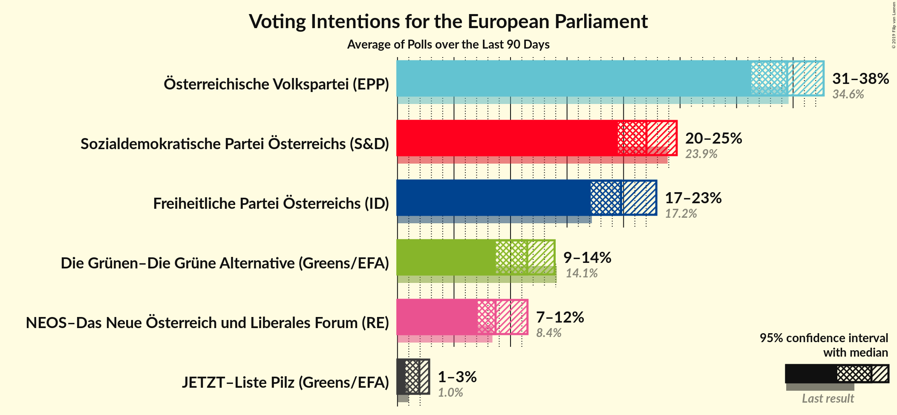

### Confidence Intervals

| Party | Last Result | Median | 80% Confidence Interval | 90% Confidence Interval | 95% Confidence Interval | 99% Confidence Interval |
|:-----:|:-----------:|:------:|:-----------------------:|:-----------------------:|:-----------------------:|:-----------------------:|
| <a href="#österreichische-volkspartei-(epp)">Österreichische Volkspartei (EPP)</a> | 34.6% | 33.9% | 31.7–35.9% |30.9–36.6% | 30.2–37.1% | 28.8–38.3% |
| <a href="#sozialdemokratische-partei-österreichs-(s&d)">Sozialdemokratische Partei Österreichs (S&D)</a> | 23.9% | 22.0% | 19.4–23.9% |18.3–24.5% | 17.6–25.1% | 16.4–26.2% |
| <a href="#freiheitliche-partei-österreichs-(id)">Freiheitliche Partei Österreichs (ID)</a> | 17.2% | 20.2% | 18.9–25.7% |18.4–27.0% | 18.1–27.8% | 17.2–29.3% |
| <a href="#die-grünen–die-grüne-alternative-(greens/efa)">Die Grünen–Die Grüne Alternative (Greens/EFA)</a> | 14.1% | 11.9% | 10.2–13.5% |9.8–13.8% | 9.5–14.1% | 8.8–14.6% |
| <a href="#neos–das-neue-österreich-und-liberales-forum-(re)">NEOS–Das Neue Österreich und Liberales Forum (RE)</a> | 8.4% | 8.2% | 7.2–9.3% |6.9–9.6% | 6.6–9.9% | 6.0–10.5% |
| <a href="#jetzt–liste-pilz-(greens/efa)">JETZT–Liste Pilz (Greens/EFA)</a> | 1.0% | 2.0% | 1.1–3.5% |0.9–4.0% | 0.8–4.4% | 0.7–5.1% |
| <a href="#meine-stimme-gilt!-(*)">Meine Stimme Gilt! (*)</a> | 0.0% | N/A | N/A |N/A | N/A | N/A |

### Österreichische Volkspartei (EPP)

*For a full overview of the results for this party, see the [Österreichische Volkspartei (EPP)](party-österreichischevolksparteiepp.html) page.*

| Voting Intentions | Probability | Accumulated | Special Marks |
|:-----------------:|:-----------:|:-----------:|:-------------:|
| 25.5–26.5% | 0% | 100% |  |
| 26.5–27.5% | 0.1% | 100% |  |
| 27.5–28.5% | 0.3% | 99.9% |  |
| 28.5–29.5% | 1.0% | 99.6% |  |
| 29.5–30.5% | 2% | 98.7% |  |
| 30.5–31.5% | 5% | 96% |  |
| 31.5–32.5% | 12% | 91% |  |
| 32.5–33.5% | 21% | 80% |  |
| 33.5–34.5% | 25% | 59% | Median |
| 34.5–35.5% | 19% | 34% | Last Result |
| 35.5–36.5% | 10% | 15% |  |
| 36.5–37.5% | 4% | 5% |  |
| 37.5–38.5% | 1.1% | 1.4% |  |
| 38.5–39.5% | 0.3% | 0.3% |  |
| 39.5–40.5% | 0.1% | 0.1% |  |
| 40.5–41.5% | 0% | 0% |  |

### Sozialdemokratische Partei Österreichs (S&D)

*For a full overview of the results for this party, see the [Sozialdemokratische Partei Österreichs (S&D)](party-sozialdemokratischeparteiösterreichssd.html) page.*

| Voting Intentions | Probability | Accumulated | Special Marks |
|:-----------------:|:-----------:|:-----------:|:-------------:|
| 13.5–14.5% | 0% | 100% |  |
| 14.5–15.5% | 0.1% | 100% |  |
| 15.5–16.5% | 0.5% | 99.9% |  |
| 16.5–17.5% | 2% | 99.4% |  |
| 17.5–18.5% | 4% | 98% |  |
| 18.5–19.5% | 5% | 94% |  |
| 19.5–20.5% | 6% | 89% |  |
| 20.5–21.5% | 18% | 83% |  |
| 21.5–22.5% | 31% | 65% | Median |
| 22.5–23.5% | 20% | 34% |  |
| 23.5–24.5% | 9% | 14% | Last Result |
| 24.5–25.5% | 3% | 5% |  |
| 25.5–26.5% | 1.1% | 1.3% |  |
| 26.5–27.5% | 0.2% | 0.3% |  |
| 27.5–28.5% | 0% | 0% |  |

### Freiheitliche Partei Österreichs (ID)

*For a full overview of the results for this party, see the [Freiheitliche Partei Österreichs (ID)](party-freiheitlicheparteiösterreichsid.html) page.*

| Voting Intentions | Probability | Accumulated | Special Marks |
|:-----------------:|:-----------:|:-----------:|:-------------:|
| 14.5–15.5% | 0% | 100% |  |
| 15.5–16.5% | 0.1% | 100% |  |
| 16.5–17.5% | 0.8% | 99.9% | Last Result |
| 17.5–18.5% | 5% | 99.0% |  |
| 18.5–19.5% | 20% | 94% |  |
| 19.5–20.5% | 33% | 74% | Median |
| 20.5–21.5% | 18% | 41% |  |
| 21.5–22.5% | 5% | 23% |  |
| 22.5–23.5% | 2% | 18% |  |
| 23.5–24.5% | 2% | 16% |  |
| 24.5–25.5% | 3% | 14% |  |
| 25.5–26.5% | 4% | 11% |  |
| 26.5–27.5% | 3% | 7% |  |
| 27.5–28.5% | 2% | 3% |  |
| 28.5–29.5% | 0.9% | 1.2% |  |
| 29.5–30.5% | 0.3% | 0.3% |  |
| 30.5–31.5% | 0.1% | 0.1% |  |
| 31.5–32.5% | 0% | 0% |  |

### Die Grünen–Die Grüne Alternative (Greens/EFA)

*For a full overview of the results for this party, see the [Die Grünen–Die Grüne Alternative (Greens/EFA)](party-diegrünen–diegrünealternativegreensefa.html) page.*

| Voting Intentions | Probability | Accumulated | Special Marks |
|:-----------------:|:-----------:|:-----------:|:-------------:|
| 6.5–7.5% | 0% | 100% |  |
| 7.5–8.5% | 0.3% | 100% |  |
| 8.5–9.5% | 3% | 99.7% |  |
| 9.5–10.5% | 13% | 97% |  |
| 10.5–11.5% | 25% | 84% |  |
| 11.5–12.5% | 25% | 59% | Median |
| 12.5–13.5% | 26% | 35% |  |
| 13.5–14.5% | 8% | 9% | Last Result |
| 14.5–15.5% | 0.6% | 0.6% |  |
| 15.5–16.5% | 0% | 0% |  |

### NEOS–Das Neue Österreich und Liberales Forum (RE)

*For a full overview of the results for this party, see the [NEOS–Das Neue Österreich und Liberales Forum (RE)](party-neos–dasneueösterreichundliberalesforumre.html) page.*

| Voting Intentions | Probability | Accumulated | Special Marks |
|:-----------------:|:-----------:|:-----------:|:-------------:|
| 3.5–4.5% | 0% | 100% |  |
| 4.5–5.5% | 0.1% | 100% |  |
| 5.5–6.5% | 2% | 99.9% |  |
| 6.5–7.5% | 19% | 98% |  |
| 7.5–8.5% | 44% | 79% | Last Result, Median |
| 8.5–9.5% | 29% | 35% |  |
| 9.5–10.5% | 6% | 6% |  |
| 10.5–11.5% | 0.4% | 0.5% |  |
| 11.5–12.5% | 0% | 0% |  |

### JETZT–Liste Pilz (Greens/EFA)

*For a full overview of the results for this party, see the [JETZT–Liste Pilz (Greens/EFA)](party-jetzt–listepilzgreensefa.html) page.*

| Voting Intentions | Probability | Accumulated | Special Marks |
|:-----------------:|:-----------:|:-----------:|:-------------:|
| 0.0–0.5% | 0% | 100% |  |
| 0.5–1.5% | 22% | 100% | Last Result |
| 1.5–2.5% | 55% | 78% | Median |
| 2.5–3.5% | 14% | 23% |  |
| 3.5–4.5% | 7% | 9% |  |
| 4.5–5.5% | 2% | 2% |  |
| 5.5–6.5% | 0.1% | 0.1% |  |
| 6.5–7.5% | 0% | 0% |  |

## Seats

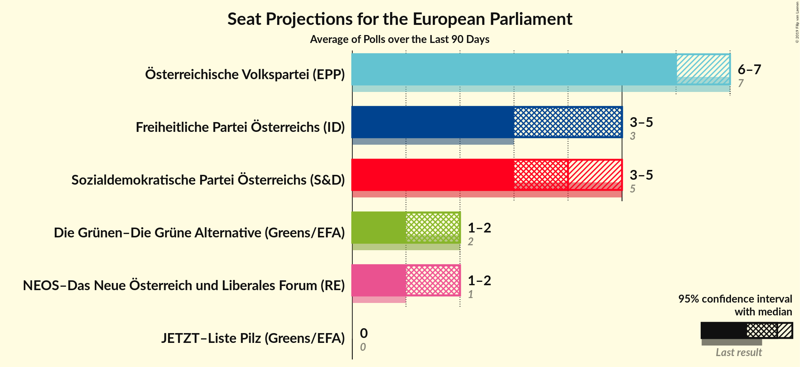

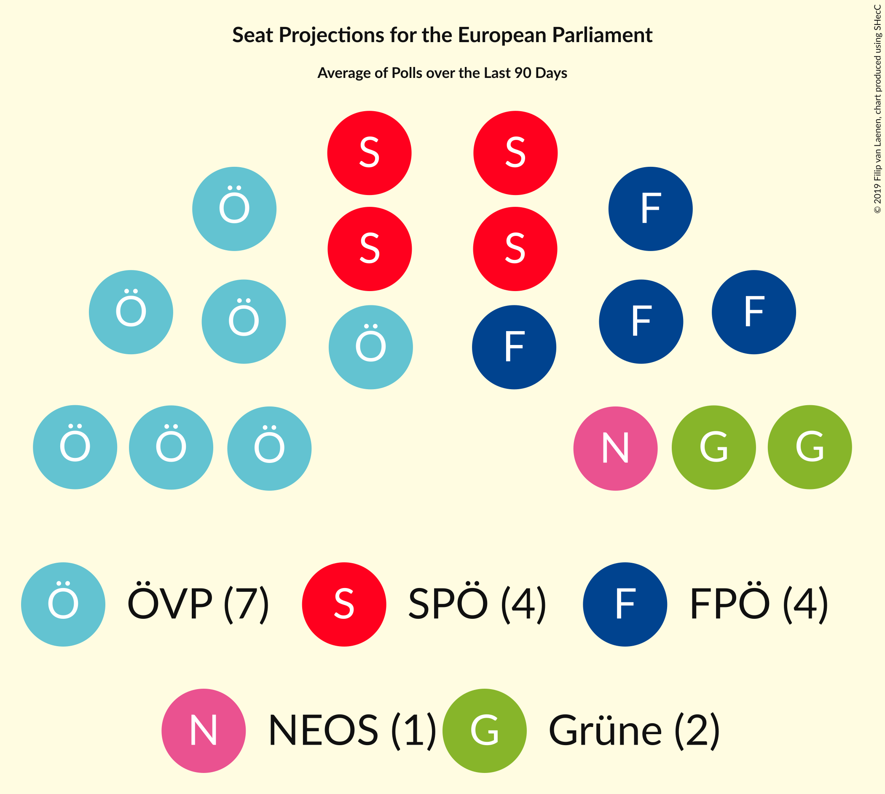

### Confidence Intervals

| Party | Last Result | Median | 80% Confidence Interval | 90% Confidence Interval | 95% Confidence Interval | 99% Confidence Interval |
|:-----:|:-----------:|:------:|:-----------------------:|:-----------------------:|:-----------------------:|:-----------------------:|
| <a href="#österreichische-volkspartei-(epp)">Österreichische Volkspartei (EPP)</a> | 7 | 7 | 6–7 |6–7 | 6–7 | 6–8 |
| <a href="#sozialdemokratische-partei-österreichs-(s&d)">Sozialdemokratische Partei Österreichs (S&D)</a> | 5 | 4 | 4–5 |4–5 | 3–5 | 3–5 |
| <a href="#freiheitliche-partei-österreichs-(id)">Freiheitliche Partei Österreichs (ID)</a> | 3 | 4 | 4–5 |3–5 | 3–5 | 3–6 |
| <a href="#die-grünen–die-grüne-alternative-(greens/efa)">Die Grünen–Die Grüne Alternative (Greens/EFA)</a> | 2 | 2 | 2–3 |2–3 | 2–3 | 1–3 |
| <a href="#neos–das-neue-österreich-und-liberales-forum-(re)">NEOS–Das Neue Österreich und Liberales Forum (RE)</a> | 1 | 1 | 1 |1–2 | 1–2 | 1–2 |
| <a href="#jetzt–liste-pilz-(greens/efa)">JETZT–Liste Pilz (Greens/EFA)</a> | 0 | 0 | 0 |0 | 0 | 0–1 |
| <a href="#meine-stimme-gilt!-(*)">Meine Stimme Gilt! (*)</a> | 0 | N/A | N/A |N/A | N/A | N/A |

### Österreichische Volkspartei (EPP)

*For a full overview of the results for this party, see the [Österreichische Volkspartei (EPP)](party-österreichischevolksparteiepp.html) page.*

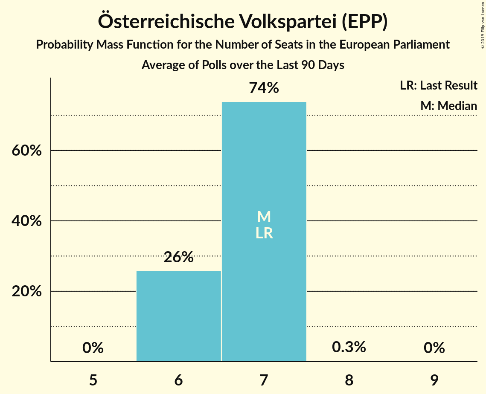

| Number of Seats | Probability | Accumulated | Special Marks |
|:---------------:|:-----------:|:-----------:|:-------------:|
| 5 | 0.1% | 100% |  |
| 6 | 49% | 99.9% |  |
| 7 | 50% | 51% | Last Result, Median |
| 8 | 0.7% | 0.7% |  |
| 9 | 0% | 0% |  |

### Sozialdemokratische Partei Österreichs (S&D)

*For a full overview of the results for this party, see the [Sozialdemokratische Partei Österreichs (S&D)](party-sozialdemokratischeparteiösterreichssd.html) page.*

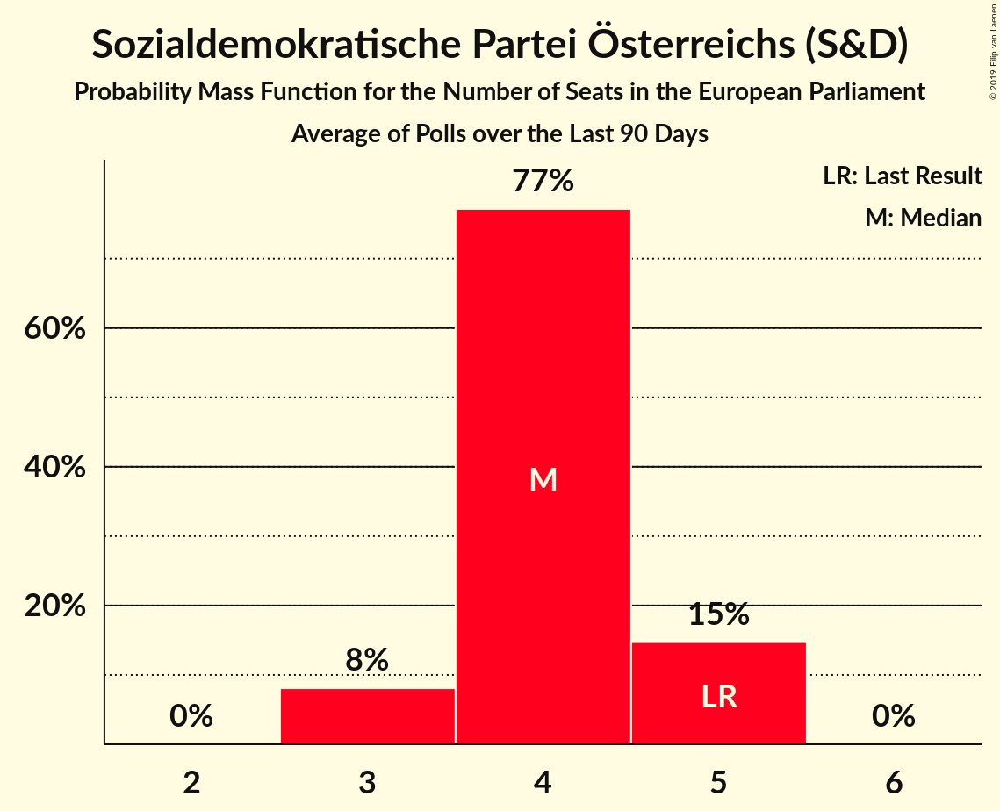

| Number of Seats | Probability | Accumulated | Special Marks |
|:---------------:|:-----------:|:-----------:|:-------------:|
| 3 | 4% | 100% |  |
| 4 | 81% | 96% | Median |
| 5 | 16% | 16% | Last Result |
| 6 | 0% | 0% |  |

### Freiheitliche Partei Österreichs (ID)

*For a full overview of the results for this party, see the [Freiheitliche Partei Österreichs (ID)](party-freiheitlicheparteiösterreichsid.html) page.*

| Number of Seats | Probability | Accumulated | Special Marks |
|:---------------:|:-----------:|:-----------:|:-------------:|
| 3 | 5% | 100% | Last Result |
| 4 | 78% | 95% | Median |
| 5 | 15% | 17% |  |
| 6 | 2% | 2% |  |
| 7 | 0% | 0% |  |

### Die Grünen–Die Grüne Alternative (Greens/EFA)

*For a full overview of the results for this party, see the [Die Grünen–Die Grüne Alternative (Greens/EFA)](party-diegrünen–diegrünealternativegreensefa.html) page.*

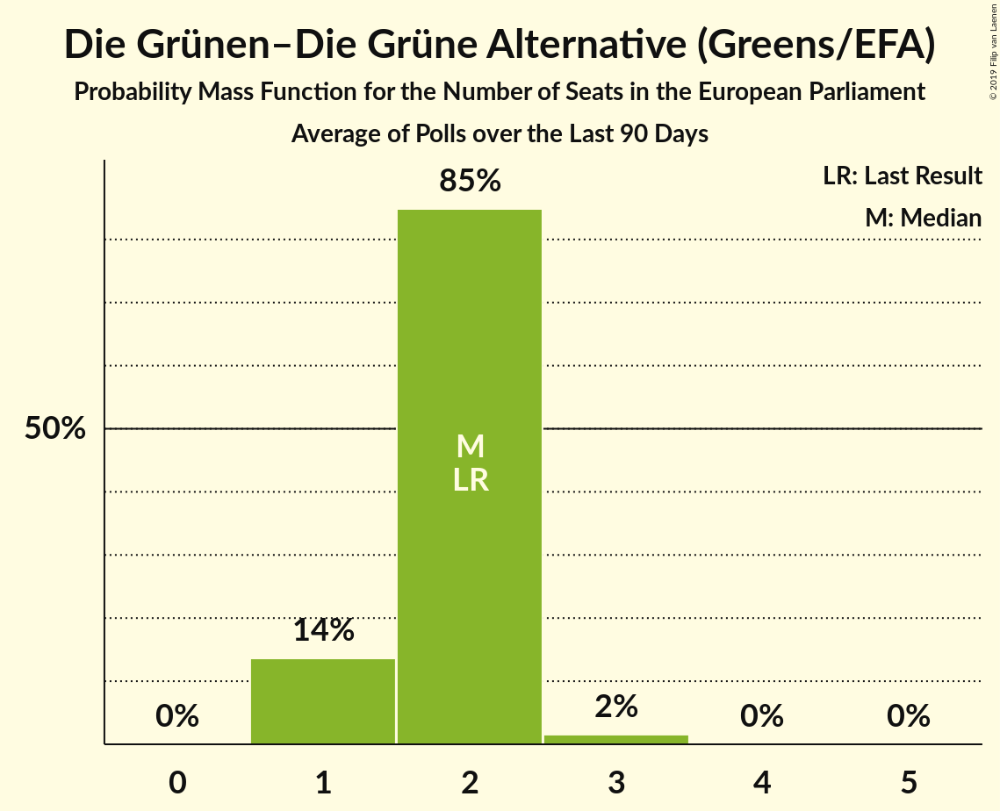

| Number of Seats | Probability | Accumulated | Special Marks |
|:---------------:|:-----------:|:-----------:|:-------------:|
| 1 | 2% | 100% |  |
| 2 | 79% | 98% | Last Result, Median |
| 3 | 18% | 18% |  |
| 4 | 0% | 0% |  |

### NEOS–Das Neue Österreich und Liberales Forum (RE)

*For a full overview of the results for this party, see the [NEOS–Das Neue Österreich und Liberales Forum (RE)](party-neos–dasneueösterreichundliberalesforumre.html) page.*

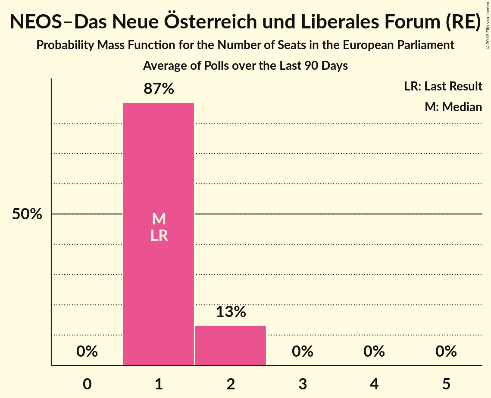

| Number of Seats | Probability | Accumulated | Special Marks |
|:---------------:|:-----------:|:-----------:|:-------------:|
| 1 | 94% | 100% | Last Result, Median |
| 2 | 6% | 6% |  |
| 3 | 0% | 0% |  |

### JETZT–Liste Pilz (Greens/EFA)

*For a full overview of the results for this party, see the [JETZT–Liste Pilz (Greens/EFA)](party-jetzt–listepilzgreensefa.html) page.*

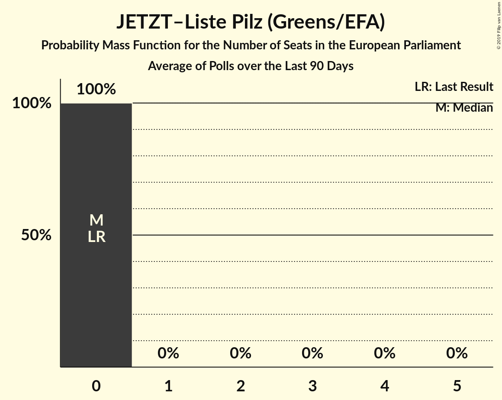

| Number of Seats | Probability | Accumulated | Special Marks |
|:---------------:|:-----------:|:-----------:|:-------------:|
| 0 | 98.8% | 100% | Last Result, Median |
| 1 | 1.2% | 1.2% |  |
| 2 | 0% | 0% |  |

## Coalitions

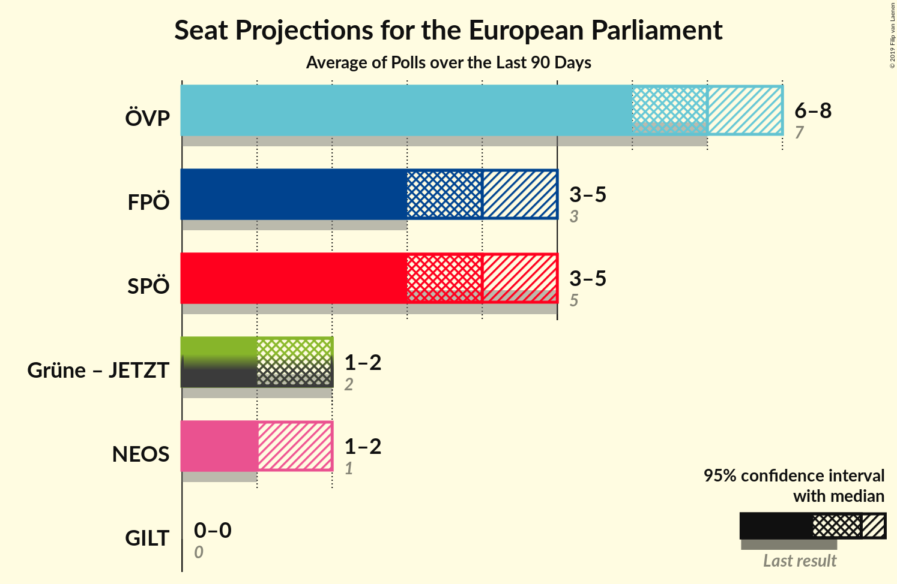

### Confidence Intervals

| Coalition | Last Result | Median | Majority? | 80% Confidence Interval | 90% Confidence Interval | 95% Confidence Interval | 99% Confidence Interval |
|:---------:|:-----------:|:------:|:---------:|:-----------------------:|:-----------------------:|:-----------------------:|:-----------------------:|
| Österreichische Volkspartei (EPP) | 7 | 7 | 0% | 6–7 | 6–7 | 6–7 | 6–8 |
| Freiheitliche Partei Österreichs (ID) | 3 | 4 | 0% | 4–5 | 3–5 | 3–5 | 3–6 |
| Sozialdemokratische Partei Österreichs (S&D) | 5 | 4 | 0% | 4–5 | 4–5 | 3–5 | 3–5 |
| Die Grünen–Die Grüne Alternative (Greens/EFA) – JETZT–Liste Pilz (Greens/EFA) | 2 | 2 | 0% | 2–3 | 2–3 | 2–3 | 1–3 |
| NEOS–Das Neue Österreich und Liberales Forum (RE) | 1 | 1 | 0% | 1 | 1–2 | 1–2 | 1–2 |
| Meine Stimme Gilt! (*) | 0 | 0 | 0% | 0 | 0 | 0 | 0 |

### Österreichische Volkspartei (EPP)

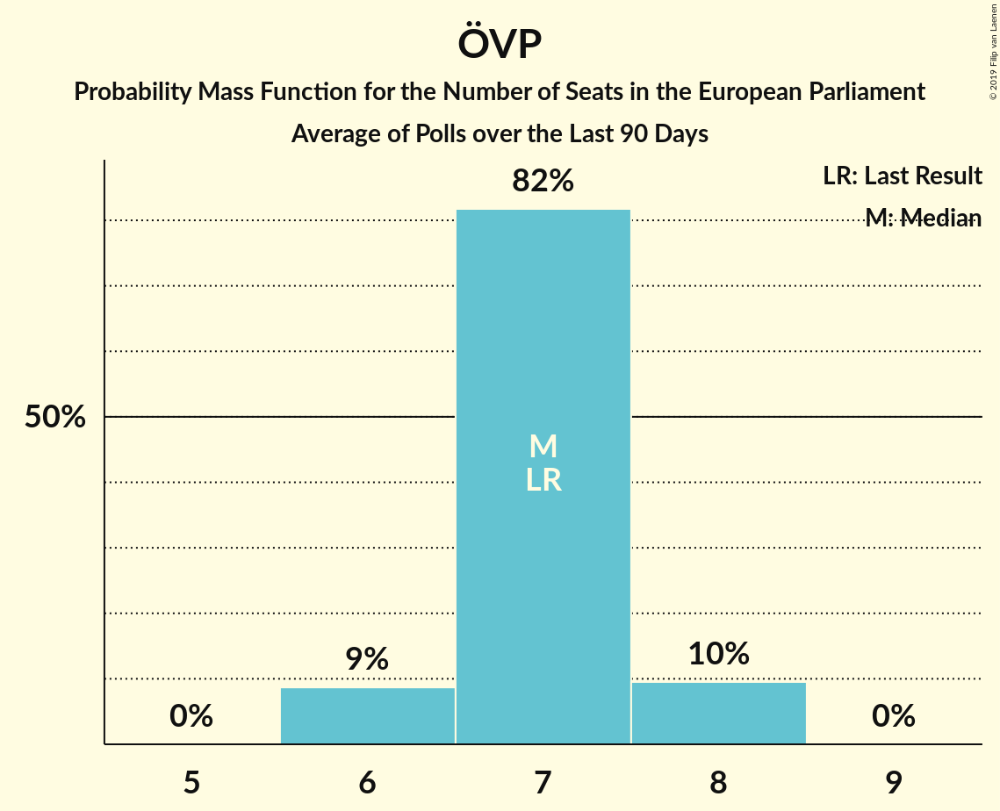

| Number of Seats | Probability | Accumulated | Special Marks |
|:---------------:|:-----------:|:-----------:|:-------------:|
| 5 | 0.1% | 100% |  |
| 6 | 49% | 99.9% |  |
| 7 | 50% | 51% | Last Result, Median |
| 8 | 0.7% | 0.7% |  |
| 9 | 0% | 0% |  |

### Freiheitliche Partei Österreichs (ID)

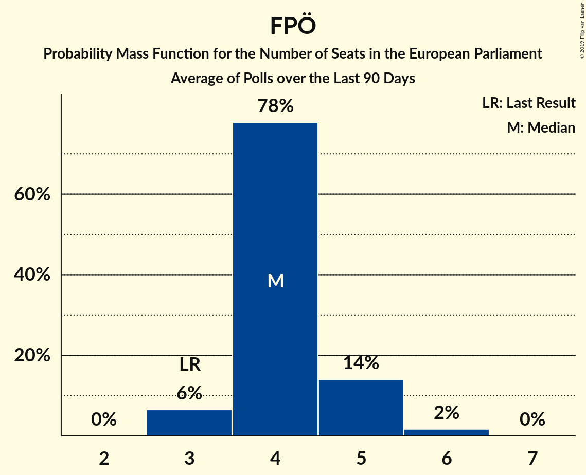

| Number of Seats | Probability | Accumulated | Special Marks |
|:---------------:|:-----------:|:-----------:|:-------------:|
| 3 | 5% | 100% | Last Result |
| 4 | 78% | 95% | Median |
| 5 | 15% | 17% |  |
| 6 | 2% | 2% |  |
| 7 | 0% | 0% |  |

### Sozialdemokratische Partei Österreichs (S&D)

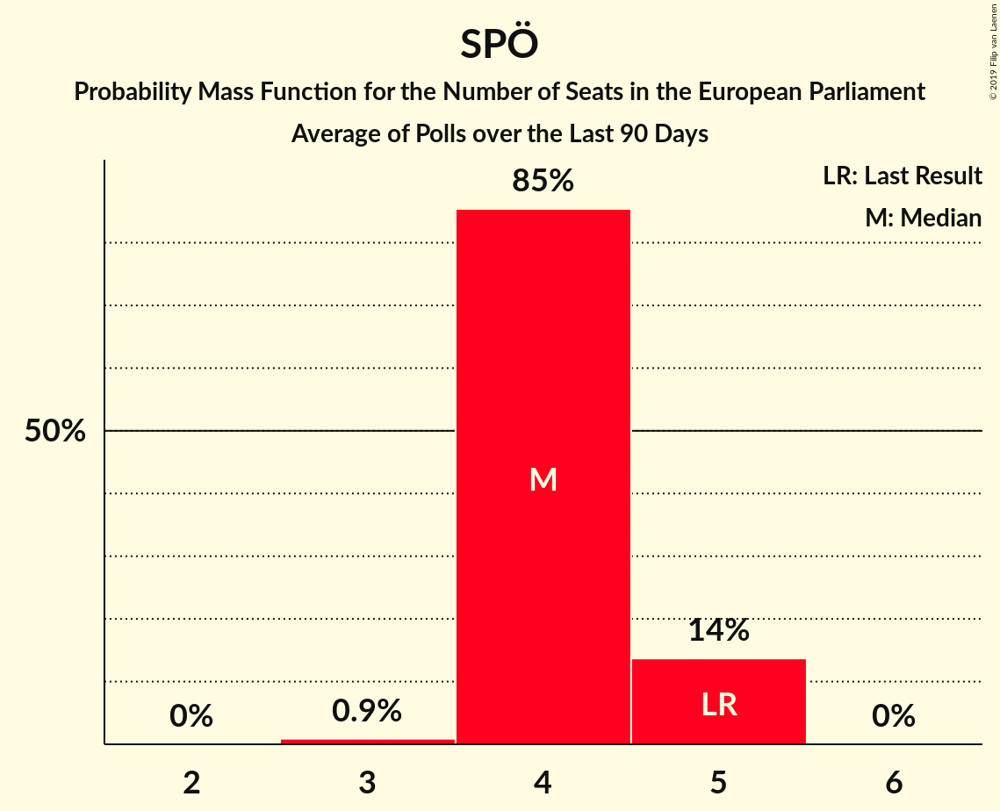

| Number of Seats | Probability | Accumulated | Special Marks |
|:---------------:|:-----------:|:-----------:|:-------------:|
| 3 | 4% | 100% |  |
| 4 | 81% | 96% | Median |
| 5 | 16% | 16% | Last Result |
| 6 | 0% | 0% |  |

### Die Grünen–Die Grüne Alternative (Greens/EFA) – JETZT–Liste Pilz (Greens/EFA)

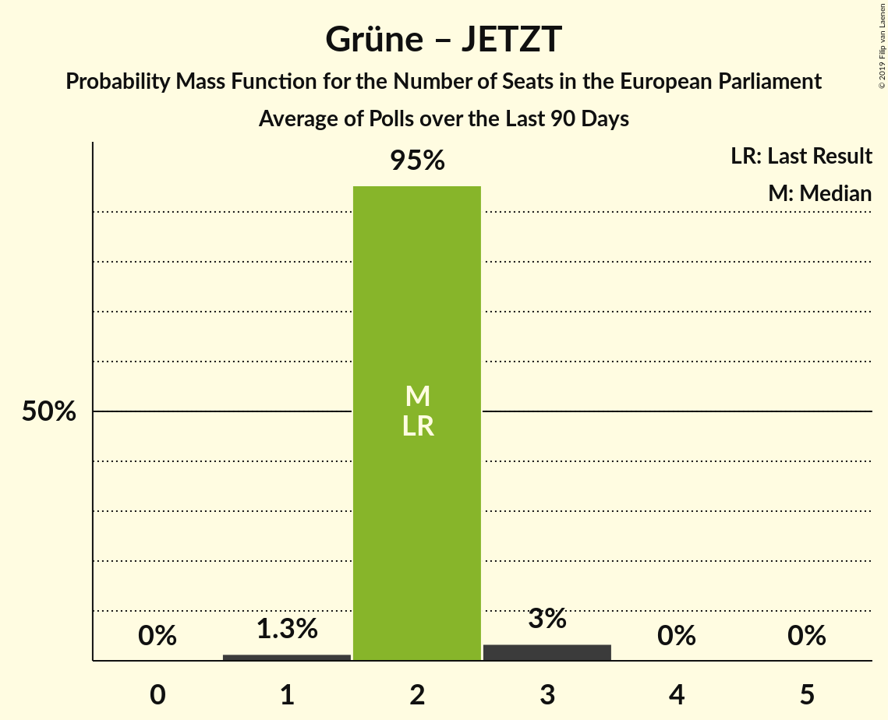

| Number of Seats | Probability | Accumulated | Special Marks |
|:---------------:|:-----------:|:-----------:|:-------------:|
| 1 | 1.2% | 100% |  |
| 2 | 81% | 98.8% | Last Result, Median |
| 3 | 18% | 18% |  |
| 4 | 0% | 0% |  |

### NEOS–Das Neue Österreich und Liberales Forum (RE)

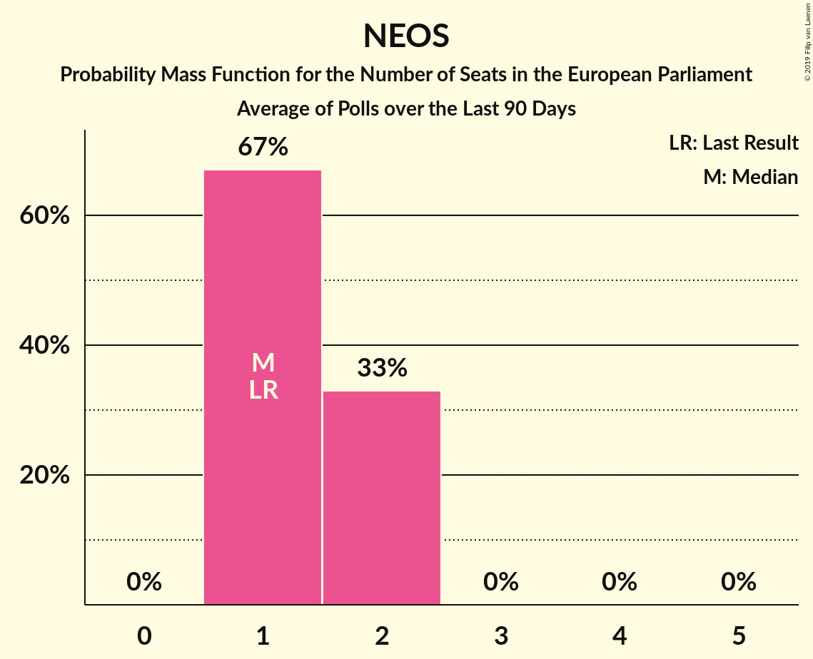

| Number of Seats | Probability | Accumulated | Special Marks |
|:---------------:|:-----------:|:-----------:|:-------------:|
| 1 | 94% | 100% | Last Result, Median |
| 2 | 6% | 6% |  |
| 3 | 0% | 0% |  |

### Meine Stimme Gilt! (*)

| Number of Seats | Probability | Accumulated | Special Marks |
|:---------------:|:-----------:|:-----------:|:-------------:|
| 0 | 100% | 100% | Last Result, Median |

## Technical Information

+ **Number of polls included in this average:** 6
+ **Lowest number of simulations done in a poll included in this average:** 1,024
+ **Total number of simulations done in the polls included in this average:** 266,240
+ **Error estimate:** 5.37%
