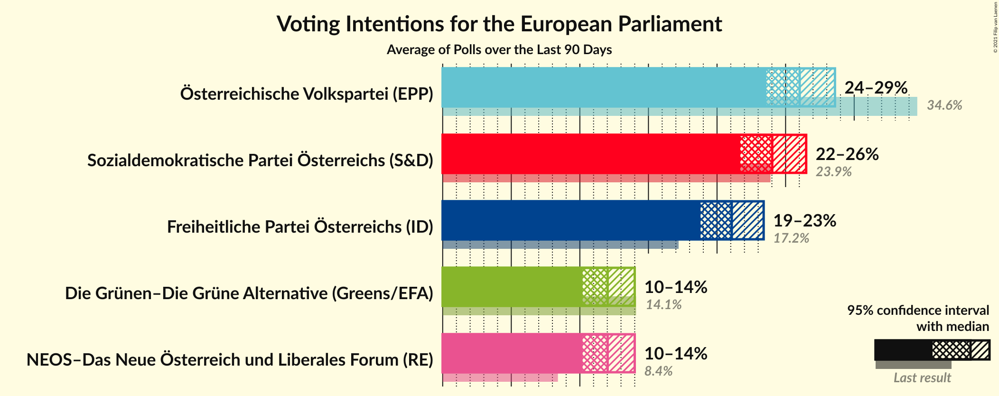

# Poll Average

<a href="#voting-intentions">Voting Intentions</a> | <a href="#seats">Seats</a> | <a href="#coalitions">Coalitions</a> | <a href="#technical-information">Technical Information</a>

## Summary

The table below lists the polls on which the average is based. They are the most recent polls (less than 90 days old) registered and analyzed so far.

| Period     | Polling firm/Commissioner(s) | ÖVP | SPÖ | FPÖ | Grüne | NEOS | JETZT | GILT | HC |
|:----------:|:----------------------------:|:--:|:--:|:--:|:--:|:--:|:--:|:--:|:--:|
| 26 May 2019 | General Election | 34.6%   7 | 23.9%   5 | 17.2%   3 | 14.1%   2 | 8.4%   1 | 1.0%   0 | 0.0%   0 | 0.0%   0 |
| N/A | Poll Average | 22–29%   4–6 | 22–28%   4–6 | 16–23%   3–5 | 10–15%   2–3 | 9–14%   1–3 | N/A   N/A | N/A   N/A | N/A   N/A |
| [15–18 November 2021](2021-11-18-UniqueResearch.html) | Unique Research   profil | 21–27%   4–6 | 22–28%   4–6 | 17–23%   3–5 | 11–16%   2–3 | 8–12%   1–2 | N/A   N/A | N/A   N/A | N/A   N/A |
| [8–11 November 2021](2021-11-11-PeterHajek.html) | Peter Hajek   Heute | 21–27%   4–6 | 22–28%   4–6 | 15–21%   3–4 | 11–16%   2–3 | 9–13%   2–3 | N/A   N/A | N/A   N/A | N/A   N/A |
| [12–15 October 2021](2021-10-15-OGM.html) | OGM   KURIER | 24–29%   5–6 | 22–27%   4–5 | 19–23%   4–5 | 10–14%   2–3 | 10–14%   2–3 | N/A   N/A | N/A   N/A | N/A   N/A |
| [11–12 October 2021](2021-10-12-Market.html) | Market   Der Standard | 24–30%   5–6 | 22–28%   4–6 | 18–24%   4–5 | 9–13%   1–2 | 11–16%   2–3 | N/A   N/A | N/A   N/A | N/A   N/A |
| [7–11 October 2021](2021-10-11-IFDD.html) | IFDD | 24–28%   5–6 | 23–27%   4–5 | 19–23%   4 | 10–13%   2 | 10–13%   2 | N/A   N/A | N/A   N/A | N/A   N/A |
| 26 May 2019 | General Election | 34.6%   7 | 23.9%   5 | 17.2%   3 | 14.1%   2 | 8.4%   1 | 1.0%   0 | 0.0%   0 | 0.0%   0 |

Only polls for which at least the sample size has been published are included in the table above.

**Legend:**
+ **Top half of each row:** Voting intentions (95% confidence interval)
+ **Bottom half of each row:** Seat projections for the European Parliament (95% confidence interval)
+ **ÖVP:** Österreichische Volkspartei (EPP)
+ **SPÖ:** Sozialdemokratische Partei Österreichs (S&D)
+ **FPÖ:** Freiheitliche Partei Österreichs (ID)
+ **Grüne:** Die Grünen–Die Grüne Alternative (Greens/EFA)
+ **NEOS:** NEOS–Das Neue Österreich und Liberales Forum (RE)
+ **JETZT:** JETZT–Liste Pilz (Greens/EFA)
+ **GILT:** Meine Stimme Gilt! (*)
+ **HC:** Team HC Strache–Allianz für Österreich (*)
+ **N/A (single party):** Party not included the published results
+ **N/A (entire row):** Calculation for this opinion poll not started yet

## Voting Intentions

### Confidence Intervals

| Party | Last Result | Median | 80% Confidence Interval | 90% Confidence Interval | 95% Confidence Interval | 99% Confidence Interval |
|:-----:|:-----------:|:------:|:-----------------------:|:-----------------------:|:-----------------------:|:-----------------------:|
| <a href="#österreichische-volkspartei-(epp)">Österreichische Volkspartei (EPP)</a> | 34.6% | 25.5% | 23.0–27.7% |22.3–28.4% | 21.8–29.0% | 20.8–30.2% |
| <a href="#sozialdemokratische-partei-österreichs-(s&d)">Sozialdemokratische Partei Österreichs (S&D)</a> | 23.9% | 24.8% | 23.0–26.7% |22.5–27.3% | 22.1–27.8% | 21.2–28.8% |
| <a href="#freiheitliche-partei-österreichs-(id)">Freiheitliche Partei Österreichs (ID)</a> | 17.2% | 20.4% | 17.8–22.3% |17.1–22.8% | 16.5–23.3% | 15.5–24.2% |
| <a href="#die-grünen–die-grüne-alternative-(greens/efa)">Die Grünen–Die Grüne Alternative (Greens/EFA)</a> | 14.1% | 12.0% | 10.4–13.9% |10.0–14.5% | 9.6–15.0% | 9.0–15.9% |
| <a href="#neos–das-neue-österreich-und-liberales-forum-(re)">NEOS–Das Neue Österreich und Liberales Forum (RE)</a> | 8.4% | 11.4% | 9.7–13.4% |9.2–14.0% | 8.8–14.5% | 8.1–15.5% |
| <a href="#jetzt–liste-pilz-(greens/efa)">JETZT–Liste Pilz (Greens/EFA)</a> | 1.0% | N/A | N/A |N/A | N/A | N/A |
| <a href="#meine-stimme-gilt!-(*)">Meine Stimme Gilt! (*)</a> | 0.0% | N/A | N/A |N/A | N/A | N/A |
| <a href="#team-hc-strache–allianz-für-österreich-(*)">Team HC Strache–Allianz für Österreich (*)</a> | 0.0% | N/A | N/A |N/A | N/A | N/A |

