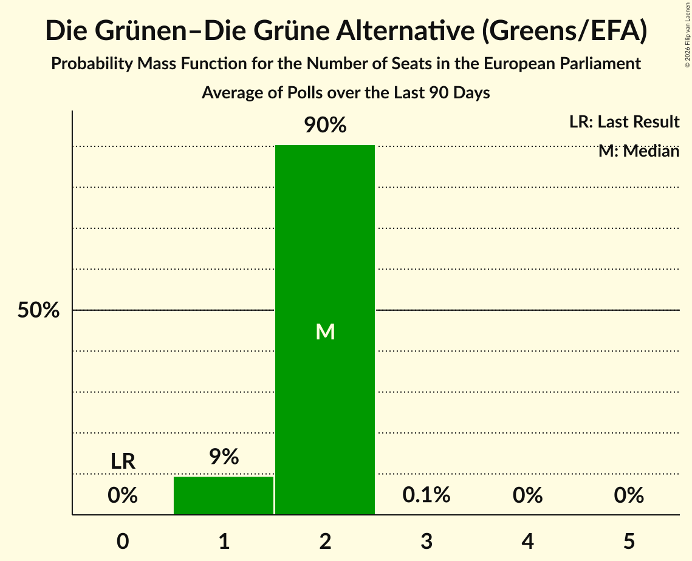

# Die Grünen–Die Grüne Alternative (Greens/EFA)

<a href="#voting-intentions">Voting Intentions</a> | <a href="#seats">Seats</a>

## Voting Intentions

Last result: **0.0%** (General Election of 9 June 2024)

### Confidence Intervals

| Period     | Polling firm/Commissioner(s) | Median | 80% Confidence Interval | 90% Confidence Interval | 95% Confidence Interval | 99% Confidence Interval |
|:----------:|:----------------:|:-----------:|:-----------------------:|:-----------------------:|:-----------------------:|:-----------------------:|
| N/A | [Poll Average](average.html) | 8.1% | 6.7–9.4% | 6.4–9.7% | 6.1–10.0% | 5.5–10.6% |
| [13–14 January 2025](2025-01-14-Market.html) | Market   ÖSTERREICH | 9.0% | 8.2–9.9% | 8.0–10.1% | 7.8–10.3% | 7.5–10.8% |
| [7–8 January 2025](2025-01-08-Market.html) | Market   ÖSTERREICH | 10.0% | 8.9–11.3% | 8.6–11.7% | 8.3–12.0% | 7.8–12.7% |
| [3–4 January 2025](2025-01-04-IFDD.html) | IFDD   Kronen Zeitung | 8.0% | 7.1–9.1% | 6.8–9.4% | 6.6–9.6% | 6.2–10.2% |
| [17–18 December 2024](2024-12-18-IFDD.html) | IFDD   Kronen Zeitung | 8.0% | 7.1–9.1% | 6.8–9.4% | 6.6–9.6% | 6.2–10.2% |
| [16–17 December 2024](2024-12-17-Market.html) | Market   ÖSTERREICH | 8.0% | 7.3–8.8% | 7.1–9.1% | 6.9–9.3% | 6.6–9.7% |
| [9–10 December 2024](2024-12-10-Market.html) | Market   ÖSTERREICH | 8.0% | N/A | N/A | N/A | N/A |
| [2–4 December 2024](2024-12-04-UniqueResearch.html) | Unique Research   Heute | 8.0% | 6.9–9.4% | 6.6–9.8% | 6.3–10.1% | 5.8–10.8% |
| [2–4 December 2024](2024-12-04-INSA.html) | INSA   eXXpress | 8.0% | 7.0–9.2% | 6.7–9.5% | 6.4–9.8% | 6.0–10.4% |
| [2–3 December 2024](2024-12-03-Market.html) | Market   ÖSTERREICH | 8.0% | 7.3–8.8% | 7.1–9.1% | 6.9–9.3% | 6.6–9.7% |
| [25–26 November 2024](2024-11-26-OGM.html) | OGM | 7.0% | 6.1–8.1% | 5.8–8.4% | 5.6–8.7% | 5.2–9.3% |
| [25–26 November 2024](2024-11-26-Market.html) | Market   ÖSTERREICH | 8.0% | 7.3–8.8% | 7.1–9.1% | 6.9–9.3% | 6.6–9.7% |
| [18–19 November 2024](2024-11-19-Market.html) | Market   ÖSTERREICH | 8.0% | N/A | N/A | N/A | N/A |
| [11–13 November 2024](2024-11-13-INSA.html) | INSA   eXXpress | 8.0% | 7.0–9.2% | 6.7–9.6% | 6.5–9.9% | 6.0–10.5% |
| [11–12 November 2024](2024-11-12-Market.html) | Market   ÖSTERREICH | 8.0% | 7.3–8.8% | 7.1–9.1% | 6.9–9.3% | 6.6–9.7% |
| [4–5 November 2024](2024-11-05-Market.html) | Market   ÖSTERREICH | 8.0% | N/A | N/A | N/A | N/A |
| [28–29 October 2024](2024-10-29-Market.html) | Market   ÖSTERREICH | 8.0% | 7.3–8.8% | 7.1–9.1% | 6.9–9.3% | 6.6–9.7% |
| [25–28 October 2024](2024-10-28-OGM.html) | OGM   Servus TV | 8.0% | 7.0–9.2% | 6.8–9.6% | 6.5–9.9% | 6.1–10.5% |
| [21–22 October 2024](2024-10-22-Market.html) | Market   ÖSTERREICH | 8.0% | N/A | N/A | N/A | N/A |
| [14–15 October 2024](2024-10-15-Market.html) | Market   ÖSTERREICH | 8.0% | N/A | N/A | N/A | N/A |
| [7–8 October 2024](2024-10-08-Market.html) | Market   ÖSTERREICH | 7.0% | 6.3–7.8% | 6.1–8.0% | 6.0–8.2% | 5.6–8.6% |
| [30 September–1 October 2024](2024-10-01-Market.html) | Market   ÖSTERREICH | 8.0% | N/A | N/A | N/A | N/A |
| [19–22 September 2024](2024-09-22-IFDD.html) | IFDD   ATV, Kronen Zeitung and PULS 24 | 9.0% | 7.9–10.3% | 7.6–10.6% | 7.4–10.9% | 6.9–11.6% |
| [16–18 September 2024](2024-09-18-OGM.html) | OGM   Servus TV | 10.0% | 8.9–11.3% | 8.6–11.7% | 8.3–12.0% | 7.8–12.6% |
| [9–17 September 2024](2024-09-17-Market.html) | Market   ÖSTERREICH | 8.0% | 7.3–8.8% | 7.1–9.1% | 6.9–9.3% | 6.6–9.7% |
| [5–11 September 2024](2024-09-11-UniqueResearch.html) | Unique Research   Heute | 9.0% | 7.8–10.4% | 7.5–10.8% | 7.2–11.2% | 6.7–11.9% |
| [9–11 September 2024](2024-09-11-INSA.html) | INSA   eXXpress | 8.0% | 7.0–9.2% | 6.7–9.6% | 6.5–9.9% | 6.0–10.5% |
| [9–10 September 2024](2024-09-10-Market.html) | Market   ÖSTERREICH | 7.0% | N/A | N/A | N/A | N/A |
| [2–9 September 2024](2024-09-09-Spectra.html) | Spectra   Kleine Zeitung, OÖNachrichten and Salzburger Nachrichten | 8.0% | 7.0–9.2% | 6.7–9.6% | 6.5–9.9% | 6.0–10.5% |
| [2–6 September 2024](2024-09-06-IFDD.html) | IFDD   Kronen Zeitung | 8.0% | N/A | N/A | N/A | N/A |
| [28 August–4 September 2024](2024-09-04-UniqueResearch.html) | Unique Research   profil | 9.0% | N/A | N/A | N/A | N/A |
| [2–4 September 2024](2024-09-04-Market.html) | Market   ÖSTERREICH | 7.0% | N/A | N/A | N/A | N/A |
| [26 August–3 September 2024](2024-09-03-TripleM.html) | Triple M   News | 8.0% | 7.0–9.2% | 6.7–9.6% | 6.5–9.9% | 6.0–10.5% |
| [1–31 August 2024](2024-08-31-OGM.html) | OGM   Servus TV | 9.1% | 7.6–10.9% | 7.2–11.4% | 6.9–11.8% | 6.2–12.8% |
| [26–27 August 2024](2024-08-27-Market.html) | Market | 8.0% | 7.3–8.8% | 7.1–9.1% | 6.9–9.3% | 6.6–9.7% |
| [23–26 August 2024](2024-08-26-IFDD.html) | IFDD   Radio Content Austria | 9.0% | 7.9–10.2% | 7.6–10.6% | 7.3–10.9% | 6.8–11.6% |
| [19–22 August 2024](2024-08-22-OGM.html) | OGM   Servus TV | 9.0% | N/A | N/A | N/A | N/A |
| [19–20 August 2024](2024-08-20-Market.html) | Market   ÖSTERREICH | 7.0% | 6.3–7.8% | 6.1–8.0% | 6.0–8.2% | 5.6–8.6% |
| [5–7 August 2024](2024-08-07-INSA.html) | INSA   eXXpress | 9.0% | 7.9–10.3% | 7.6–10.6% | 7.4–10.9% | 6.9–11.6% |
| [5–6 August 2024](2024-08-06-Market.html) | Market   ÖSTERREICH | 8.0% | N/A | N/A | N/A | N/A |
| [22–30 July 2024](2024-07-30-Market.html) | Market   ÖSTERREICH | 8.0% | 7.3–8.8% | 7.1–9.1% | 6.9–9.3% | 6.6–9.7% |
| [25–26 July 2024](2024-07-26-IFDD.html) | IFDD   Radio Content Austria | 9.0% | 8.0–10.2% | 7.7–10.5% | 7.4–10.9% | 7.0–11.4% |
| [15–24 July 2024](2024-07-24-Market.html) | Market   ÖSTERREICH | 8.0% | N/A | N/A | N/A | N/A |
| [12–21 July 2024](2024-07-21-Spectra.html) | Spectra   Kleine Zeitung, OÖNachrichten and Salzburger Nachrichten | 9.0% | 7.9–10.3% | 7.6–10.6% | 7.4–10.9% | 6.9–11.6% |
| [8–12 July 2024](2024-07-12-UniqueResearch.html) | Unique Research   Kronen Zeitung | 9.0% | 7.9–10.3% | 7.6–10.6% | 7.4–10.9% | 6.9–11.6% |
| [8–11 July 2024](2024-07-11-Market.html) | Market   Der Standard | 9.0% | N/A | N/A | N/A | N/A |
| [8–10 July 2024](2024-07-10-Market.html) | Market   ÖSTERREICH | 9.0% | N/A | N/A | N/A | N/A |
| [1–2 July 2024](2024-07-02-Market.html) | Market | 9.0% | N/A | N/A | N/A | N/A |
| [24–26 June 2024](2024-06-26-OGM.html) | OGM   KURIER | 11.0% | 9.9–12.4% | 9.5–12.8% | 9.3–13.1% | 8.7–13.8% |
| [24–25 June 2024](2024-06-25-Market.html) | Market   ÖSTERREICH | 10.0% | N/A | N/A | N/A | N/A |
| [12–19 June 2024](2024-06-19-UniqueResearch.html) | Unique Research   profil | 9.0% | N/A | N/A | N/A | N/A |
| [10–19 June 2024](2024-06-19-Market.html) | Market   ÖSTERREICH | 10.0% | N/A | N/A | N/A | N/A |
| [10–13 June 2024](2024-06-13-UniqueResearch.html) | Unique Research   Heute | 10.0% | N/A | N/A | N/A | N/A |
| [10–11 June 2024](2024-06-11-OGM.html) | OGM   Servus TV | 9.0% | N/A | N/A | N/A | N/A |
| [10–11 June 2024](2024-06-11-Market.html) | Market   ÖSTERREICH | 8.0% | N/A | N/A | N/A | N/A |

### Probability Mass Function

The following table shows the probability mass function per percentage block of voting intentions for the [poll average](average.html) for Die Grünen–Die Grüne Alternative (Greens/EFA).

| Voting Intentions | Probability | Accumulated | Special Marks |
|:-----------------:|:-----------:|:-----------:|:-------------:|
| 0.0–0.5% | 0% | 100% | Last Result |
| 0.5–1.5% | 0% | 100% |  |
| 1.5–2.5% | 0% | 100% |  |
| 2.5–3.5% | 0% | 100% |  |
| 3.5–4.5% | 0% | 100% |  |
| 4.5–5.5% | 0.5% | 100% |  |
| 5.5–6.5% | 7% | 99.5% |  |
| 6.5–7.5% | 24% | 93% |  |
| 7.5–8.5% | 35% | 69% | Median |
| 8.5–9.5% | 26% | 33% |  |
| 9.5–10.5% | 7% | 7% |  |
| 10.5–11.5% | 0.5% | 0.5% |  |
| 11.5–12.5% | 0% | 0% |  |

## Seats

Last result: **0** seats (General Election of 9 June 2024)

### Confidence Intervals

| Period     | Polling firm/Commissioner(s) | Median | 80% Confidence Interval | 90% Confidence Interval | 95% Confidence Interval | 99% Confidence Interval |
|:----------:|:----------------:|:------:|:-----------------------:|:-----------------------:|:-----------------------:|:-----------------------:|
| N/A | [Poll Average](average.html) | 1 | 1–2 | 1–2 | 1–2 | 1–2 |
| [13–14 January 2025](2025-01-14-Market.html) | Market   ÖSTERREICH | 2 | 1–2 | 1–2 | 1–2 | 1–2 |
| [7–8 January 2025](2025-01-08-Market.html) | Market   ÖSTERREICH | 2 | 2 | 2 | 1–2 | 1–2 |
| [3–4 January 2025](2025-01-04-IFDD.html) | IFDD   Kronen Zeitung | 1 | 1–2 | 1–2 | 1–2 | 1–2 |
| [17–18 December 2024](2024-12-18-IFDD.html) | IFDD   Kronen Zeitung | 1 | 1–2 | 1–2 | 1–2 | 1–2 |
| [16–17 December 2024](2024-12-17-Market.html) | Market   ÖSTERREICH | 1 | 1–2 | 1–2 | 1–2 | 1–2 |
| [9–10 December 2024](2024-12-10-Market.html) | Market   ÖSTERREICH |  |  |  |  |  |
| [2–4 December 2024](2024-12-04-UniqueResearch.html) | Unique Research   Heute | 1 | 1–2 | 1–2 | 1–2 | 1–2 |
| [2–4 December 2024](2024-12-04-INSA.html) | INSA   eXXpress | 1 | 1–2 | 1–2 | 1–2 | 1–2 |
| [2–3 December 2024](2024-12-03-Market.html) | Market   ÖSTERREICH | 1 | 1–2 | 1–2 | 1–2 | 1–2 |
| [25–26 November 2024](2024-11-26-OGM.html) | OGM | 1 | 1 | 1 | 1 | 1–2 |
| [25–26 November 2024](2024-11-26-Market.html) | Market   ÖSTERREICH | 1 | 1–2 | 1–2 | 1–2 | 1–2 |
| [18–19 November 2024](2024-11-19-Market.html) | Market   ÖSTERREICH |  |  |  |  |  |
| [11–13 November 2024](2024-11-13-INSA.html) | INSA   eXXpress | 1 | 1–2 | 1–2 | 1–2 | 1–2 |
| [11–12 November 2024](2024-11-12-Market.html) | Market   ÖSTERREICH | 1 | 1–2 | 1–2 | 1–2 | 1–2 |
| [4–5 November 2024](2024-11-05-Market.html) | Market   ÖSTERREICH |  |  |  |  |  |
| [28–29 October 2024](2024-10-29-Market.html) | Market   ÖSTERREICH | 1 | 1–2 | 1–2 | 1–2 | 1–2 |
| [25–28 October 2024](2024-10-28-OGM.html) | OGM   Servus TV | 1 | 1–2 | 1–2 | 1–2 | 1–2 |
| [21–22 October 2024](2024-10-22-Market.html) | Market   ÖSTERREICH |  |  |  |  |  |
| [14–15 October 2024](2024-10-15-Market.html) | Market   ÖSTERREICH |  |  |  |  |  |
| [7–8 October 2024](2024-10-08-Market.html) | Market   ÖSTERREICH | 1 | 1 | 1 | 1 | 1–2 |
| [30 September–1 October 2024](2024-10-01-Market.html) | Market   ÖSTERREICH |  |  |  |  |  |
| [19–22 September 2024](2024-09-22-IFDD.html) | IFDD   ATV, Kronen Zeitung and PULS 24 | 2 | 1–2 | 1–2 | 1–2 | 1–2 |
| [16–18 September 2024](2024-09-18-OGM.html) | OGM   Servus TV | 2 | 2 | 2 | 2 | 1–3 |
| [9–17 September 2024](2024-09-17-Market.html) | Market   ÖSTERREICH | 1 | 1–2 | 1–2 | 1–2 | 1–2 |
| [5–11 September 2024](2024-09-11-UniqueResearch.html) | Unique Research   Heute | 2 | 1–2 | 1–2 | 1–2 | 1–2 |
| [9–11 September 2024](2024-09-11-INSA.html) | INSA   eXXpress | 1 | 1–2 | 1–2 | 1–2 | 1–2 |
| [9–10 September 2024](2024-09-10-Market.html) | Market   ÖSTERREICH |  |  |  |  |  |
| [2–9 September 2024](2024-09-09-Spectra.html) | Spectra   Kleine Zeitung, OÖNachrichten and Salzburger Nachrichten | 1 | 1–2 | 1–2 | 1–2 | 1–2 |
| [2–6 September 2024](2024-09-06-IFDD.html) | IFDD   Kronen Zeitung |  |  |  |  |  |
| [28 August–4 September 2024](2024-09-04-UniqueResearch.html) | Unique Research   profil |  |  |  |  |  |
| [2–4 September 2024](2024-09-04-Market.html) | Market   ÖSTERREICH |  |  |  |  |  |
| [26 August–3 September 2024](2024-09-03-TripleM.html) | Triple M   News | 1 | 1–2 | 1–2 | 1–2 | 1–2 |
| [1–31 August 2024](2024-08-31-OGM.html) | OGM   Servus TV | 2 | 1–2 | 1–2 | 1–2 | 1–3 |
| [26–27 August 2024](2024-08-27-Market.html) | Market | 2 | 1–2 | 1–2 | 1–2 | 1–2 |
| [23–26 August 2024](2024-08-26-IFDD.html) | IFDD   Radio Content Austria | 2 | 1–2 | 1–2 | 1–2 | 1–2 |
| [19–22 August 2024](2024-08-22-OGM.html) | OGM   Servus TV |  |  |  |  |  |
| [19–20 August 2024](2024-08-20-Market.html) | Market   ÖSTERREICH | 1 | 1 | 1 | 1 | 1–2 |
| [5–7 August 2024](2024-08-07-INSA.html) | INSA   eXXpress | 2 | 1–2 | 1–2 | 1–2 | 1–2 |
| [5–6 August 2024](2024-08-06-Market.html) | Market   ÖSTERREICH |  |  |  |  |  |
| [22–30 July 2024](2024-07-30-Market.html) | Market   ÖSTERREICH | 1 | 1–2 | 1–2 | 1–2 | 1–2 |
| [25–26 July 2024](2024-07-26-IFDD.html) | IFDD   Radio Content Austria | 2 | 1–2 | 1–2 | 1–2 | 1–2 |
| [15–24 July 2024](2024-07-24-Market.html) | Market   ÖSTERREICH |  |  |  |  |  |
| [12–21 July 2024](2024-07-21-Spectra.html) | Spectra   Kleine Zeitung, OÖNachrichten and Salzburger Nachrichten | 2 | 1–2 | 1–2 | 1–2 | 1–2 |
| [8–12 July 2024](2024-07-12-UniqueResearch.html) | Unique Research   Kronen Zeitung | 2 | 1–2 | 1–2 | 1–2 | 1–2 |
| [8–11 July 2024](2024-07-11-Market.html) | Market   Der Standard |  |  |  |  |  |
| [8–10 July 2024](2024-07-10-Market.html) | Market   ÖSTERREICH |  |  |  |  |  |
| [1–2 July 2024](2024-07-02-Market.html) | Market |  |  |  |  |  |
| [24–26 June 2024](2024-06-26-OGM.html) | OGM   KURIER | 2 | 2 | 2–3 | 2–3 | 2–3 |
| [24–25 June 2024](2024-06-25-Market.html) | Market   ÖSTERREICH |  |  |  |  |  |
| [12–19 June 2024](2024-06-19-UniqueResearch.html) | Unique Research   profil |  |  |  |  |  |
| [10–19 June 2024](2024-06-19-Market.html) | Market   ÖSTERREICH |  |  |  |  |  |
| [10–13 June 2024](2024-06-13-UniqueResearch.html) | Unique Research   Heute |  |  |  |  |  |
| [10–11 June 2024](2024-06-11-OGM.html) | OGM   Servus TV |  |  |  |  |  |
| [10–11 June 2024](2024-06-11-Market.html) | Market   ÖSTERREICH |  |  |  |  |  |

### Probability Mass Function

The following table shows the probability mass function per seat for the [poll average](average.html) for Die Grünen–Die Grüne Alternative (Greens/EFA).

| Number of Seats | Probability | Accumulated | Special Marks |
|:---------------:|:-----------:|:-----------:|:-------------:|
| 0 | 0% | 100% | Last Result |
| 1 | 66% | 100% | Median |
| 2 | 34% | 34% |  |
| 3 | 0% | 0% |  |

