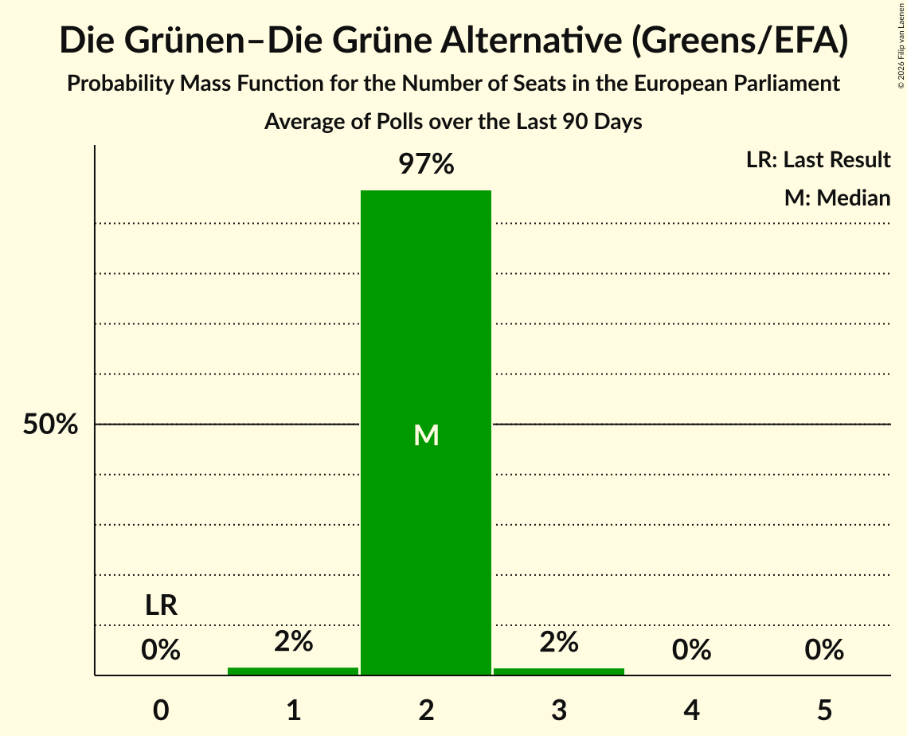

# Die Grünen–Die Grüne Alternative (Greens/EFA)

<a href="#voting-intentions">Voting Intentions</a> | <a href="#seats">Seats</a>

## Voting Intentions

Last result: **0.0%** (General Election of 9 June 2024)

### Confidence Intervals

| Period     | Polling firm/Commissioner(s) | Median | 80% Confidence Interval | 90% Confidence Interval | 95% Confidence Interval | 99% Confidence Interval |
|:----------:|:----------------:|:-----------:|:-----------------------:|:-----------------------:|:-----------------------:|:-----------------------:|
| N/A | [Poll Average](average.html) | 10.1% | 8.6–11.4% | 8.1–11.7% | 7.8–11.9% | 7.2–12.4% |
| [2–3 March 2026](2026-03-03-Market.html) | Market   ÖSTERREICH | 10.0% | 9.2–10.9% | 8.9–11.2% | 8.7–11.4% | 8.4–11.9% |
| [23–25 February 2026](2026-02-25-INSA.html) | INSA   Exxpress | 9.0% | 7.9–10.3% | 7.6–10.6% | 7.4–10.9% | 6.9–11.6% |
| [23–24 February 2026](2026-02-24-Market.html) | Market   ÖSTERREICH | 10.0% | 9.2–10.9% | 8.9–11.2% | 8.7–11.4% | 8.4–11.9% |
| [16–17 February 2026](2026-02-17-Market.html) | Market   ÖSTERREICH | 9.0% | 8.2–9.9% | 8.0–10.1% | 7.8–10.3% | 7.5–10.8% |
| [11–17 February 2026](2026-02-17-IFDD.html) | IFDD   Kronen Zeitung | 11.0% | 10.2–11.8% | 10.0–12.1% | 9.8–12.3% | 9.5–12.7% |
| [9–10 February 2026](2026-02-10-Market.html) | Market   ÖSTERREICH | 9.0% | 8.2–9.9% | 8.0–10.1% | 7.8–10.3% | 7.5–10.8% |
| [2–3 February 2026](2026-02-03-Market.html) | Market   ÖSTERREICH | 9.0% | 8.2–9.9% | 8.0–10.1% | 7.8–10.3% | 7.5–10.8% |
| [29 January–2 February 2026](2026-02-02-Market.html) | Market   Der Standard | 10.0% | N/A | N/A | N/A | N/A |
| [26–27 January 2026](2026-01-27-Market.html) | Market   ÖSTERREICH | 10.0% | 9.2–10.9% | 8.9–11.2% | 8.7–11.4% | 8.4–11.9% |
| [19–20 January 2026](2026-01-20-Market.html) | Market   ÖSTERREICH | 11.0% | 10.1–11.9% | 9.9–12.2% | 9.7–12.5% | 9.3–12.9% |
| [12–14 January 2026](2026-01-14-Market.html) | Market   ÖSTERREICH | 10.0% | 9.2–10.9% | 8.9–11.2% | 8.7–11.4% | 8.4–11.9% |
| [12–14 January 2026](2026-01-14-INSA.html) | INSA   Exxpress | 9.0% | 7.9–10.3% | 7.6–10.6% | 7.4–10.9% | 6.9–11.6% |
| [5–7 January 2026](2026-01-07-Market.html) | Market   ÖSTERREICH | 11.0% | 10.1–11.9% | 9.9–12.2% | 9.7–12.5% | 9.3–12.9% |
| [2–5 January 2026](2026-01-05-IFDD.html) | IFDD   Kronen Zeitung | 11.0% | 10.0–12.1% | 9.8–12.4% | 9.5–12.7% | 9.1–13.2% |
| [16–18 December 2025](2025-12-18-Market.html) | Market   Der Standard | 11.0% | 9.7–12.5% | 9.3–13.0% | 9.0–13.4% | 8.4–14.1% |
| [15–16 December 2025](2025-12-16-Market.html) | Market   ÖSTERREICH | 11.0% | N/A | N/A | N/A | N/A |
| [8–9 December 2025](2025-12-09-Market.html) | Market   ÖSTERREICH | 11.0% | 10.1–11.9% | 9.9–12.2% | 9.7–12.5% | 9.3–12.9% |
| [1–2 December 2025](2025-12-02-Market.html) | Market   ÖSTERREICH | 10.0% | 9.2–10.9% | 8.9–11.2% | 8.7–11.4% | 8.4–11.9% |
| [24–27 November 2025](2025-11-27-OGM.html) | OGM   KURIER | 12.0% | 10.8–13.4% | 10.5–13.8% | 10.2–14.2% | 9.6–14.9% |
| [24–25 November 2025](2025-11-25-Market.html) | Market   ÖSTERREICH | 10.0% | 9.2–10.9% | 8.9–11.2% | 8.7–11.4% | 8.4–11.9% |
| [17–20 November 2025](2025-11-20-Market.html) | Market   Der Standard | 11.0% | 9.7–12.5% | 9.3–13.0% | 9.0–13.3% | 8.4–14.1% |
| [17–18 November 2025](2025-11-18-Market.html) | Market   ÖSTERREICH | 11.0% | 10.1–11.9% | 9.9–12.2% | 9.7–12.5% | 9.3–12.9% |
| [10–11 November 2025](2025-11-11-Market.html) | Market   ÖSTERREICH | 11.0% | 10.1–11.9% | 9.9–12.2% | 9.7–12.5% | 9.3–12.9% |
| [3–4 November 2025](2025-11-04-Market.html) | Market   ÖSTERREICH | 10.0% | 9.2–10.9% | 8.9–11.2% | 8.7–11.4% | 8.4–11.9% |
| [27–28 October 2025](2025-10-28-Market.html) | Market   ÖSTERREICH | 11.0% | 10.1–11.9% | 9.9–12.2% | 9.7–12.5% | 9.3–12.9% |
| [20–23 October 2025](2025-10-23-UniqueResearch.html) | Unique Research   Heute | 11.0% | 9.7–12.5% | 9.4–12.9% | 9.1–13.3% | 8.5–14.1% |
| [20–21 October 2025](2025-10-21-Market.html) | Market   ÖSTERREICH | 11.0% | N/A | N/A | N/A | N/A |
| [17–21 October 2025](2025-10-21-IFDD.html) | IFDD   Kronen Zeitung | 11.0% | 10.0–12.1% | 9.7–12.4% | 9.5–12.7% | 9.1–13.2% |
| [13–14 October 2025](2025-10-14-Market.html) | Market   ÖSTERREICH | 11.0% | 10.1–11.9% | 9.9–12.2% | 9.7–12.5% | 9.3–12.9% |
| [6–7 October 2025](2025-10-07-Market.html) | Market   ÖSTERREICH | 10.0% | 9.2–10.9% | 8.9–11.2% | 8.7–11.4% | 8.4–11.9% |
| [29–30 September 2025](2025-09-30-Market.html) | Market   ÖSTERREICH | 10.0% | 9.2–10.9% | 8.9–11.2% | 8.7–11.4% | 8.4–11.9% |
| [15–16 September 2025](2025-09-16-Market.html) | Market   ÖSTERREICH | 11.0% | 10.1–11.9% | 9.9–12.2% | 9.7–12.5% | 9.3–12.9% |
| [10–12 September 2025](2025-09-12-IFDD.html) | IFDD   Kronen Zeitung | 11.0% | 10.0–12.2% | 9.7–12.5% | 9.5–12.8% | 9.0–13.4% |
| [9–11 September 2025](2025-09-11-OGM.html) | OGM   KURIER | 11.0% | 9.8–12.4% | 9.5–12.7% | 9.2–13.1% | 8.7–13.7% |
| [8–9 September 2025](2025-09-09-Market.html) | Market   ÖSTERREICH | 11.0% | 10.1–11.9% | 9.9–12.2% | 9.7–12.5% | 9.3–12.9% |
| [1–2 September 2025](2025-09-02-Market.html) | Market   ÖSTERREICH | 10.0% | 9.2–10.9% | 8.9–11.2% | 8.7–11.4% | 8.4–11.9% |
| [15–27 August 2025](2025-08-27-INSA.html) | INSA   Exxpress | 9.0% | 7.9–10.3% | 7.6–10.6% | 7.4–10.9% | 6.9–11.6% |
| [24–30 July 2025](2025-07-30-Market.html) | Market   Der Standard | 9.0% | 7.8–10.4% | 7.5–10.8% | 7.2–11.2% | 6.7–11.9% |
| [14–17 July 2025](2025-07-17-INSA.html) | INSA   Exxpress | 10.0% | 8.9–11.3% | 8.6–11.7% | 8.3–12.0% | 7.8–12.7% |
| [6–7 June 2025](2025-06-07-IFDD.html) | IFDD   Kronen Zeitung | 11.0% | 10.0–12.3% | 9.7–12.6% | 9.4–12.9% | 8.9–13.5% |
| [2–5 June 2025](2025-06-05-UniqueResearch.html) | Unique Research   Heute | 10.0% | 8.7–11.5% | 8.4–11.9% | 8.1–12.3% | 7.5–13.0% |
| [28 May–3 June 2025](2025-06-03-Market.html) | Market   Standard | 10.0% | 8.7–11.4% | 8.4–11.8% | 8.1–12.2% | 7.5–12.9% |
| [5–27 May 2025](2025-05-27-Market.html) | Market   ÖSTERREICH | 10.0% | 9.2–10.9% | 8.9–11.2% | 8.7–11.4% | 8.4–11.9% |
| [23–26 May 2025](2025-05-26-OGM.html) | OGM   KURIER | 9.0% | 7.9–10.3% | 7.6–10.6% | 7.4–10.9% | 6.9–11.6% |
| [19–21 May 2025](2025-05-21-INSA.html) | INSA   Exxpress | 9.0% | 7.9–10.3% | 7.6–10.6% | 7.4–10.9% | 6.9–11.6% |
| [12–19 May 2025](2025-05-19-Market.html) | Market   ÖSTERREICH | 9.0% | 8.2–9.9% | 8.0–10.1% | 7.8–10.3% | 7.5–10.8% |
| [5–13 May 2025](2025-05-13-Market.html) | Market   ÖSTERREICH | 9.0% | 8.2–9.9% | 8.0–10.1% | 7.8–10.3% | 7.5–10.8% |
| [18 April–6 May 2025](2025-05-06-Market.html) | Market   ÖSTERREICH | 9.0% | 8.2–9.9% | 8.0–10.1% | 7.8–10.3% | 7.5–10.8% |
| [18–29 April 2025](2025-04-29-Market.html) | Market   ÖSTERREICH | 9.0% | 8.2–9.9% | 8.0–10.1% | 7.8–10.3% | 7.5–10.8% |
| [14–22 April 2025](2025-04-22-Market.html) | Market   ÖSTERREICH | 9.0% | N/A | N/A | N/A | N/A |
| [14–16 April 2025](2025-04-16-INSA.html) | INSA   eXXpress | 9.0% | 7.9–10.3% | 7.6–10.6% | 7.4–10.9% | 6.9–11.6% |
| [7–15 April 2025](2025-04-15-Market.html) | Market   ÖSTERREICH | 9.0% | 8.2–9.9% | 8.0–10.1% | 7.8–10.3% | 7.5–10.8% |
| [4–9 April 2025](2025-04-09-OGM.html) | OGM   KURIER | 9.0% | 8.0–10.3% | 7.7–10.6% | 7.4–10.9% | 7.0–11.5% |
| [31 March–8 April 2025](2025-04-08-Market.html) | Market   ÖSTERREICH | 8.0% | N/A | N/A | N/A | N/A |
| [24 March–1 April 2025](2025-04-01-Market.html) | Market   ÖSTERREICH | 8.0% | N/A | N/A | N/A | N/A |
| [17–25 March 2025](2025-03-25-Market.html) | Market   ÖSTERREICH | 9.0% | N/A | N/A | N/A | N/A |
| [21–23 March 2025](2025-03-23-IFDD.html) | IFDD   NÖN | 10.0% | 8.9–11.3% | 8.6–11.6% | 8.3–12.0% | 7.8–12.6% |
| [17–18 March 2025](2025-03-18-Market.html) | Market   ÖSTERREICH | 8.0% | 7.3–8.8% | 7.1–9.1% | 6.9–9.3% | 6.6–9.7% |
| [3–11 March 2025](2025-03-11-Market.html) | Market   ÖSTERREICH | 9.0% | 8.2–9.9% | 8.0–10.1% | 7.8–10.3% | 7.5–10.8% |
| [5–7 March 2025](2025-03-07-Market.html) | Market   Der Standard | 9.0% | N/A | N/A | N/A | N/A |
| [24 February–4 March 2025](2025-03-04-Market.html) | Market   ÖSTERREICH | 9.0% | N/A | N/A | N/A | N/A |
| [24–26 February 2025](2025-02-26-INSA.html) | INSA   Exxpress | 9.0% | 7.9–10.3% | 7.6–10.6% | 7.4–10.9% | 6.9–11.6% |
| [24–25 February 2025](2025-02-25-Market.html) | Market   ÖSTERREICH | 9.0% | 8.2–9.9% | 8.0–10.1% | 7.8–10.3% | 7.5–10.8% |
| [17–18 February 2025](2025-02-18-OGM.html) | OGM   Servus TV | 10.0% | 8.8–11.4% | 8.5–11.7% | 8.2–12.1% | 7.7–12.8% |
| [17–18 February 2025](2025-02-18-Market.html) | Market   ÖSTERREICH | 10.0% | 9.2–10.9% | 8.9–11.2% | 8.7–11.4% | 8.4–11.9% |
| [13–15 February 2025](2025-02-15-IFDD.html) | IFDD   Puls 24 | 10.0% | 9.0–11.2% | 8.7–11.5% | 8.5–11.8% | 8.0–12.4% |
| [13–14 February 2025](2025-02-14-Spectra.html) | Spectra   Kleine Zeitung | 8.9% | 7.8–10.2% | 7.5–10.5% | 7.3–10.8% | 6.8–11.5% |
| [10–11 February 2025](2025-02-11-Market.html) | Market   ÖSTERREICH | 10.0% | 9.2–10.9% | 8.9–11.2% | 8.7–11.4% | 8.4–11.9% |
| [3–4 February 2025](2025-02-04-Market.html) | Market   ÖSTERREICH | 10.0% | N/A | N/A | N/A | N/A |
| [20–28 January 2025](2025-01-28-Market.html) | Market   ÖSTERREICH | 9.0% | 8.2–9.9% | 8.0–10.1% | 7.8–10.3% | 7.5–10.8% |
| [20–21 January 2025](2025-01-21-Market.html) | Market   ÖSTERREICH | 9.0% | 8.2–9.9% | 8.0–10.1% | 7.8–10.3% | 7.5–10.8% |
| [13–15 January 2025](2025-01-15-INSA.html) | INSA   eXXpress | 8.0% | 7.0–9.2% | 6.7–9.6% | 6.5–9.9% | 6.0–10.5% |
| [13–14 January 2025](2025-01-14-Market.html) | Market   ÖSTERREICH | 9.0% | 8.2–9.9% | 8.0–10.1% | 7.8–10.3% | 7.5–10.8% |
| [7–8 January 2025](2025-01-08-Market.html) | Market   ÖSTERREICH | 10.0% | 8.9–11.3% | 8.6–11.7% | 8.3–12.0% | 7.8–12.7% |
| [3–4 January 2025](2025-01-04-IFDD.html) | IFDD   Kronen Zeitung | 8.0% | 7.1–9.1% | 6.8–9.4% | 6.6–9.6% | 6.2–10.2% |
| [17–18 December 2024](2024-12-18-IFDD.html) | IFDD   Kronen Zeitung | 8.0% | 7.1–9.1% | 6.8–9.4% | 6.6–9.6% | 6.2–10.2% |
| [16–17 December 2024](2024-12-17-Market.html) | Market   ÖSTERREICH | 8.0% | 7.3–8.8% | 7.1–9.1% | 6.9–9.3% | 6.6–9.7% |
| [9–10 December 2024](2024-12-10-Market.html) | Market   ÖSTERREICH | 8.0% | N/A | N/A | N/A | N/A |
| [2–4 December 2024](2024-12-04-UniqueResearch.html) | Unique Research   Heute | 8.0% | 6.9–9.4% | 6.6–9.8% | 6.3–10.1% | 5.8–10.8% |
| [2–4 December 2024](2024-12-04-INSA.html) | INSA   eXXpress | 8.0% | 7.0–9.2% | 6.7–9.5% | 6.4–9.8% | 6.0–10.4% |
| [2–3 December 2024](2024-12-03-Market.html) | Market   ÖSTERREICH | 8.0% | 7.3–8.8% | 7.1–9.1% | 6.9–9.3% | 6.6–9.7% |
| [25–26 November 2024](2024-11-26-OGM.html) | OGM | 7.0% | 6.1–8.1% | 5.8–8.4% | 5.6–8.7% | 5.2–9.3% |
| [25–26 November 2024](2024-11-26-Market.html) | Market   ÖSTERREICH | 8.0% | 7.3–8.8% | 7.1–9.1% | 6.9–9.3% | 6.6–9.7% |
| [18–19 November 2024](2024-11-19-Market.html) | Market   ÖSTERREICH | 8.0% | N/A | N/A | N/A | N/A |
| [11–13 November 2024](2024-11-13-INSA.html) | INSA   eXXpress | 8.0% | 7.0–9.2% | 6.7–9.6% | 6.5–9.9% | 6.0–10.5% |
| [11–12 November 2024](2024-11-12-Market.html) | Market   ÖSTERREICH | 8.0% | 7.3–8.8% | 7.1–9.1% | 6.9–9.3% | 6.6–9.7% |
| [4–5 November 2024](2024-11-05-Market.html) | Market   ÖSTERREICH | 8.0% | N/A | N/A | N/A | N/A |
| [28–29 October 2024](2024-10-29-Market.html) | Market   ÖSTERREICH | 8.0% | 7.3–8.8% | 7.1–9.1% | 6.9–9.3% | 6.6–9.7% |
| [25–28 October 2024](2024-10-28-OGM.html) | OGM   Servus TV | 8.0% | 7.0–9.2% | 6.8–9.6% | 6.5–9.9% | 6.1–10.5% |
| [21–22 October 2024](2024-10-22-Market.html) | Market   ÖSTERREICH | 8.0% | N/A | N/A | N/A | N/A |
| [14–15 October 2024](2024-10-15-Market.html) | Market   ÖSTERREICH | 8.0% | N/A | N/A | N/A | N/A |
| [7–8 October 2024](2024-10-08-Market.html) | Market   ÖSTERREICH | 7.0% | 6.3–7.8% | 6.1–8.0% | 6.0–8.2% | 5.6–8.6% |
| [30 September–1 October 2024](2024-10-01-Market.html) | Market   ÖSTERREICH | 8.0% | N/A | N/A | N/A | N/A |
| [19–22 September 2024](2024-09-22-IFDD.html) | IFDD   ATV, Kronen Zeitung and PULS 24 | 9.0% | 7.9–10.3% | 7.6–10.6% | 7.4–10.9% | 6.9–11.6% |
| [16–18 September 2024](2024-09-18-OGM.html) | OGM   Servus TV | 10.0% | 8.9–11.3% | 8.6–11.7% | 8.3–12.0% | 7.8–12.6% |
| [16–17 September 2024](2024-09-17-Market.html) | Market   Der Standard | 9.0% | 7.3–8.8% | 7.1–9.1% | 6.9–9.3% | 6.6–9.7% |
| [5–11 September 2024](2024-09-11-UniqueResearch.html) | Unique Research   Heute | 9.0% | 7.8–10.4% | 7.5–10.8% | 7.2–11.2% | 6.7–11.9% |
| [9–11 September 2024](2024-09-11-INSA.html) | INSA   eXXpress | 8.0% | 7.0–9.2% | 6.7–9.6% | 6.5–9.9% | 6.0–10.5% |
| [9–10 September 2024](2024-09-10-Market.html) | Market   ÖSTERREICH | 7.0% | N/A | N/A | N/A | N/A |
| [2–9 September 2024](2024-09-09-Spectra.html) | Spectra   Kleine Zeitung, OÖNachrichten and Salzburger Nachrichten | 8.0% | 7.0–9.2% | 6.7–9.6% | 6.5–9.9% | 6.0–10.5% |
| [2–6 September 2024](2024-09-06-IFDD.html) | IFDD   Kronen Zeitung | 8.0% | N/A | N/A | N/A | N/A |
| [28 August–4 September 2024](2024-09-04-UniqueResearch.html) | Unique Research   profil | 9.0% | N/A | N/A | N/A | N/A |
| [2–4 September 2024](2024-09-04-Market.html) | Market   ÖSTERREICH | 7.0% | N/A | N/A | N/A | N/A |
| [26 August–3 September 2024](2024-09-03-TripleM.html) | Triple M   News | 8.0% | 7.0–9.2% | 6.7–9.6% | 6.5–9.9% | 6.0–10.5% |
| [1–31 August 2024](2024-08-31-OGM.html) | OGM   Servus TV | 9.1% | 7.6–10.9% | 7.2–11.4% | 6.9–11.8% | 6.2–12.8% |
| [26–27 August 2024](2024-08-27-Market.html) | Market | 8.0% | 7.3–8.8% | 7.1–9.1% | 6.9–9.3% | 6.6–9.7% |
| [23–26 August 2024](2024-08-26-IFDD.html) | IFDD   Radio Content Austria | 9.0% | 7.9–10.2% | 7.6–10.6% | 7.3–10.9% | 6.8–11.6% |
| [19–22 August 2024](2024-08-22-OGM.html) | OGM   Servus TV | 9.0% | N/A | N/A | N/A | N/A |
| [19–20 August 2024](2024-08-20-Market.html) | Market   ÖSTERREICH | 7.0% | 6.3–7.8% | 6.1–8.0% | 6.0–8.2% | 5.6–8.6% |
| [5–7 August 2024](2024-08-07-INSA.html) | INSA   eXXpress | 9.0% | 7.9–10.3% | 7.6–10.6% | 7.4–10.9% | 6.9–11.6% |
| [5–6 August 2024](2024-08-06-Market.html) | Market   ÖSTERREICH | 8.0% | N/A | N/A | N/A | N/A |
| [22–30 July 2024](2024-07-30-Market.html) | Market   ÖSTERREICH | 8.0% | 7.3–8.8% | 7.1–9.1% | 6.9–9.3% | 6.6–9.7% |
| [25–26 July 2024](2024-07-26-IFDD.html) | IFDD   Radio Content Austria | 9.0% | 8.0–10.2% | 7.7–10.5% | 7.4–10.9% | 7.0–11.4% |
| [15–24 July 2024](2024-07-24-Market.html) | Market   ÖSTERREICH | 8.0% | N/A | N/A | N/A | N/A |
| [12–21 July 2024](2024-07-21-Spectra.html) | Spectra   Kleine Zeitung, OÖNachrichten and Salzburger Nachrichten | 9.0% | 7.9–10.3% | 7.6–10.6% | 7.4–10.9% | 6.9–11.6% |
| [8–12 July 2024](2024-07-12-UniqueResearch.html) | Unique Research   Kronen Zeitung | 9.0% | 7.9–10.3% | 7.6–10.6% | 7.4–10.9% | 6.9–11.6% |
| [8–11 July 2024](2024-07-11-Market.html) | Market   Der Standard | 9.0% | N/A | N/A | N/A | N/A |
| [8–10 July 2024](2024-07-10-Market.html) | Market   ÖSTERREICH | 9.0% | N/A | N/A | N/A | N/A |
| [1–2 July 2024](2024-07-02-Market.html) | Market | 9.0% | N/A | N/A | N/A | N/A |
| [24–26 June 2024](2024-06-26-OGM.html) | OGM   KURIER | 11.0% | 9.9–12.4% | 9.5–12.8% | 9.3–13.1% | 8.7–13.8% |
| [24–25 June 2024](2024-06-25-Market.html) | Market   ÖSTERREICH | 10.0% | N/A | N/A | N/A | N/A |
| [12–19 June 2024](2024-06-19-UniqueResearch.html) | Unique Research   profil | 9.0% | N/A | N/A | N/A | N/A |
| [10–19 June 2024](2024-06-19-Market.html) | Market   ÖSTERREICH | 10.0% | N/A | N/A | N/A | N/A |
| [10–13 June 2024](2024-06-13-UniqueResearch.html) | Unique Research   Heute | 10.0% | N/A | N/A | N/A | N/A |
| [10–11 June 2024](2024-06-11-OGM.html) | OGM   Servus TV | 9.0% | N/A | N/A | N/A | N/A |
| [10–11 June 2024](2024-06-11-Market.html) | Market   ÖSTERREICH | 8.0% | N/A | N/A | N/A | N/A |

### Probability Mass Function

The following table shows the probability mass function per percentage block of voting intentions for the [poll average](average.html) for Die Grünen–Die Grüne Alternative (Greens/EFA).

| Voting Intentions | Probability | Accumulated | Special Marks |
|:-----------------:|:-----------:|:-----------:|:-------------:|
| 0.0–0.5% | 0% | 100% | Last Result |
| 0.5–1.5% | 0% | 100% |  |
| 1.5–2.5% | 0% | 100% |  |
| 2.5–3.5% | 0% | 100% |  |
| 3.5–4.5% | 0% | 100% |  |
| 4.5–5.5% | 0% | 100% |  |
| 5.5–6.5% | 0% | 100% |  |
| 6.5–7.5% | 1.3% | 100% |  |
| 7.5–8.5% | 9% | 98.7% |  |
| 8.5–9.5% | 22% | 90% |  |
| 9.5–10.5% | 33% | 68% | Median |
| 10.5–11.5% | 28% | 35% |  |
| 11.5–12.5% | 7% | 7% |  |
| 12.5–13.5% | 0.3% | 0.3% |  |
| 13.5–14.5% | 0% | 0% |  |

## Seats

Last result: **0** seats (General Election of 9 June 2024)

### Confidence Intervals

| Period     | Polling firm/Commissioner(s) | Median | 80% Confidence Interval | 90% Confidence Interval | 95% Confidence Interval | 99% Confidence Interval |
|:----------:|:----------------:|:------:|:-----------------------:|:-----------------------:|:-----------------------:|:-----------------------:|
| N/A | [Poll Average](average.html) | 2 | 2 | 1–2 | 1–2 | 1–2 |
| [2–3 March 2026](2026-03-03-Market.html) | Market   ÖSTERREICH | 2 | 2 | 2 | 2 | 1–2 |
| [23–25 February 2026](2026-02-25-INSA.html) | INSA   Exxpress | 2 | 1–2 | 1–2 | 1–2 | 1–2 |
| [23–24 February 2026](2026-02-24-Market.html) | Market   ÖSTERREICH | 2 | 2 | 2 | 2 | 1–2 |
| [16–17 February 2026](2026-02-17-Market.html) | Market   ÖSTERREICH | 2 | 1–2 | 1–2 | 1–2 | 1–2 |
| [11–17 February 2026](2026-02-17-IFDD.html) | IFDD   Kronen Zeitung | 2 | 2 | 2 | 2 | 2 |
| [9–10 February 2026](2026-02-10-Market.html) | Market   ÖSTERREICH | 2 | 1–2 | 1–2 | 1–2 | 1–2 |
| [2–3 February 2026](2026-02-03-Market.html) | Market   ÖSTERREICH | 2 | 1–2 | 1–2 | 1–2 | 1–2 |
| [29 January–2 February 2026](2026-02-02-Market.html) | Market   Der Standard |  |  |  |  |  |
| [26–27 January 2026](2026-01-27-Market.html) | Market   ÖSTERREICH | 2 | 2 | 2 | 2 | 1–2 |
| [19–20 January 2026](2026-01-20-Market.html) | Market   ÖSTERREICH | 2 | 2 | 2 | 2–3 | 2–3 |
| [12–14 January 2026](2026-01-14-Market.html) | Market   ÖSTERREICH | 2 | 2 | 2 | 2 | 1–2 |
| [12–14 January 2026](2026-01-14-INSA.html) | INSA   Exxpress | 2 | 1–2 | 1–2 | 1–2 | 1–2 |
| [5–7 January 2026](2026-01-07-Market.html) | Market   ÖSTERREICH | 2 | 2 | 2 | 2 | 2–3 |
| [2–5 January 2026](2026-01-05-IFDD.html) | IFDD   Kronen Zeitung | 2 | 2 | 2 | 2 | 2–3 |
| [16–18 December 2025](2025-12-18-Market.html) | Market   Der Standard | 2 | 2 | 2–3 | 2–3 | 1–3 |
| [15–16 December 2025](2025-12-16-Market.html) | Market   ÖSTERREICH |  |  |  |  |  |
| [8–9 December 2025](2025-12-09-Market.html) | Market   ÖSTERREICH | 2 | 2 | 2 | 2 | 2–3 |
| [1–2 December 2025](2025-12-02-Market.html) | Market   ÖSTERREICH | 2 | 2 | 2 | 2 | 1–2 |
| [24–27 November 2025](2025-11-27-OGM.html) | OGM   KURIER | 2 | 2–3 | 2–3 | 2–3 | 2–3 |
| [24–25 November 2025](2025-11-25-Market.html) | Market   ÖSTERREICH | 2 | 2 | 2 | 2 | 1–2 |
| [17–20 November 2025](2025-11-20-Market.html) | Market   Der Standard | 2 | 2 | 2 | 2–3 | 1–3 |
| [17–18 November 2025](2025-11-18-Market.html) | Market   ÖSTERREICH | 2 | 2 | 2 | 2 | 2–3 |
| [10–11 November 2025](2025-11-11-Market.html) | Market   ÖSTERREICH | 2 | 2 | 2 | 2–3 | 2–3 |
| [3–4 November 2025](2025-11-04-Market.html) | Market   ÖSTERREICH | 2 | 2 | 2 | 2 | 1–2 |
| [27–28 October 2025](2025-10-28-Market.html) | Market   ÖSTERREICH | 2 | 2 | 2 | 2–3 | 2–3 |
| [20–23 October 2025](2025-10-23-UniqueResearch.html) | Unique Research   Heute | 2 | 2 | 2–3 | 2–3 | 1–3 |
| [20–21 October 2025](2025-10-21-Market.html) | Market   ÖSTERREICH |  |  |  |  |  |
| [17–21 October 2025](2025-10-21-IFDD.html) | IFDD   Kronen Zeitung | 2 | 2 | 2 | 2–3 | 2–3 |
| [13–14 October 2025](2025-10-14-Market.html) | Market   ÖSTERREICH | 2 | 2 | 2 | 2 | 2–3 |
| [6–7 October 2025](2025-10-07-Market.html) | Market   ÖSTERREICH | 2 | 2 | 2 | 2 | 1–2 |
| [29–30 September 2025](2025-09-30-Market.html) | Market   ÖSTERREICH | 2 | 2 | 2 | 2 | 1–2 |
| [15–16 September 2025](2025-09-16-Market.html) | Market   ÖSTERREICH | 2 | 2 | 2 | 2–3 | 2–3 |
| [10–12 September 2025](2025-09-12-IFDD.html) | IFDD   Kronen Zeitung | 2 | 2 | 2 | 2 | 2–3 |
| [9–11 September 2025](2025-09-11-OGM.html) | OGM   KURIER | 2 | 2 | 2 | 2–3 | 2–3 |
| [8–9 September 2025](2025-09-09-Market.html) | Market   ÖSTERREICH | 2 | 2 | 2 | 2–3 | 2–3 |
| [1–2 September 2025](2025-09-02-Market.html) | Market   ÖSTERREICH | 2 | 2 | 2 | 2 | 1–2 |
| [15–27 August 2025](2025-08-27-INSA.html) | INSA   Exxpress | 2 | 1–2 | 1–2 | 1–2 | 1–2 |
| [24–30 July 2025](2025-07-30-Market.html) | Market   Der Standard | 2 | 1–2 | 1–2 | 1–2 | 1–2 |
| [14–17 July 2025](2025-07-17-INSA.html) | INSA   Exxpress | 2 | 2 | 1–2 | 1–2 | 1–2 |
| [6–7 June 2025](2025-06-07-IFDD.html) | IFDD   Kronen Zeitung | 2 | 2 | 2 | 2 | 2–3 |
| [2–5 June 2025](2025-06-05-UniqueResearch.html) | Unique Research   Heute | 2 | 2 | 1–2 | 1–2 | 1–3 |
| [28 May–3 June 2025](2025-06-03-Market.html) | Market   Standard | 2 | 2 | 1–2 | 1–2 | 1–3 |
| [5–27 May 2025](2025-05-27-Market.html) | Market   ÖSTERREICH | 2 | 2 | 2 | 2 | 1–2 |
| [23–26 May 2025](2025-05-26-OGM.html) | OGM   KURIER | 2 | 1–2 | 1–2 | 1–2 | 1–2 |
| [19–21 May 2025](2025-05-21-INSA.html) | INSA   Exxpress | 2 | 1–2 | 1–2 | 1–2 | 1–2 |
| [12–19 May 2025](2025-05-19-Market.html) | Market   ÖSTERREICH | 2 | 1–2 | 1–2 | 1–2 | 1–2 |
| [5–13 May 2025](2025-05-13-Market.html) | Market   ÖSTERREICH | 2 | 1–2 | 1–2 | 1–2 | 1–2 |
| [18 April–6 May 2025](2025-05-06-Market.html) | Market   ÖSTERREICH | 2 | 1–2 | 1–2 | 1–2 | 1–2 |
| [18–29 April 2025](2025-04-29-Market.html) | Market   ÖSTERREICH | 2 | 1–2 | 1–2 | 1–2 | 1–2 |
| [14–22 April 2025](2025-04-22-Market.html) | Market   ÖSTERREICH |  |  |  |  |  |
| [14–16 April 2025](2025-04-16-INSA.html) | INSA   eXXpress | 2 | 1–2 | 1–2 | 1–2 | 1–2 |
| [7–15 April 2025](2025-04-15-Market.html) | Market   ÖSTERREICH | 2 | 1–2 | 1–2 | 1–2 | 1–2 |
| [4–9 April 2025](2025-04-09-OGM.html) | OGM   KURIER | 2 | 1–2 | 1–2 | 1–2 | 1–2 |
| [31 March–8 April 2025](2025-04-08-Market.html) | Market   ÖSTERREICH |  |  |  |  |  |
| [24 March–1 April 2025](2025-04-01-Market.html) | Market   ÖSTERREICH |  |  |  |  |  |
| [17–25 March 2025](2025-03-25-Market.html) | Market   ÖSTERREICH |  |  |  |  |  |
| [21–23 March 2025](2025-03-23-IFDD.html) | IFDD   NÖN | 2 | 2 | 1–2 | 1–2 | 1–2 |
| [17–18 March 2025](2025-03-18-Market.html) | Market   ÖSTERREICH | 1 | 1–2 | 1–2 | 1–2 | 1–2 |
| [3–11 March 2025](2025-03-11-Market.html) | Market   ÖSTERREICH | 2 | 1–2 | 1–2 | 1–2 | 1–2 |
| [5–7 March 2025](2025-03-07-Market.html) | Market   Der Standard |  |  |  |  |  |
| [24 February–4 March 2025](2025-03-04-Market.html) | Market   ÖSTERREICH |  |  |  |  |  |
| [24–26 February 2025](2025-02-26-INSA.html) | INSA   Exxpress | 2 | 2 | 2 | 1–2 | 1–2 |
| [24–25 February 2025](2025-02-25-Market.html) | Market   ÖSTERREICH | 2 | 1–2 | 1–2 | 1–2 | 1–2 |
| [17–18 February 2025](2025-02-18-OGM.html) | OGM   Servus TV | 2 | 2 | 1–2 | 1–2 | 1–2 |
| [17–18 February 2025](2025-02-18-Market.html) | Market   ÖSTERREICH | 2 | 2 | 2 | 2 | 1–2 |
| [13–15 February 2025](2025-02-15-IFDD.html) | IFDD   Puls 24 | 2 | 2 | 2 | 1–2 | 1–2 |
| [13–14 February 2025](2025-02-14-Spectra.html) | Spectra   Kleine Zeitung | 2 | 1–2 | 1–2 | 1–2 | 1–2 |
| [10–11 February 2025](2025-02-11-Market.html) | Market   ÖSTERREICH | 2 | 2 | 2 | 2 | 1–2 |
| [3–4 February 2025](2025-02-04-Market.html) | Market   ÖSTERREICH |  |  |  |  |  |
| [20–28 January 2025](2025-01-28-Market.html) | Market   ÖSTERREICH | 2 | 1–2 | 1–2 | 1–2 | 1–2 |
| [20–21 January 2025](2025-01-21-Market.html) | Market   ÖSTERREICH | 2 | 1–2 | 1–2 | 1–2 | 1–2 |
| [13–15 January 2025](2025-01-15-INSA.html) | INSA   eXXpress | 1 | 1–2 | 1–2 | 1–2 | 1–2 |
| [13–14 January 2025](2025-01-14-Market.html) | Market   ÖSTERREICH | 2 | 1–2 | 1–2 | 1–2 | 1–2 |
| [7–8 January 2025](2025-01-08-Market.html) | Market   ÖSTERREICH | 2 | 2 | 2 | 1–2 | 1–2 |
| [3–4 January 2025](2025-01-04-IFDD.html) | IFDD   Kronen Zeitung | 1 | 1–2 | 1–2 | 1–2 | 1–2 |
| [17–18 December 2024](2024-12-18-IFDD.html) | IFDD   Kronen Zeitung | 1 | 1–2 | 1–2 | 1–2 | 1–2 |
| [16–17 December 2024](2024-12-17-Market.html) | Market   ÖSTERREICH | 1 | 1–2 | 1–2 | 1–2 | 1–2 |
| [9–10 December 2024](2024-12-10-Market.html) | Market   ÖSTERREICH |  |  |  |  |  |
| [2–4 December 2024](2024-12-04-UniqueResearch.html) | Unique Research   Heute | 1 | 1–2 | 1–2 | 1–2 | 1–2 |
| [2–4 December 2024](2024-12-04-INSA.html) | INSA   eXXpress | 1 | 1–2 | 1–2 | 1–2 | 1–2 |
| [2–3 December 2024](2024-12-03-Market.html) | Market   ÖSTERREICH | 1 | 1–2 | 1–2 | 1–2 | 1–2 |
| [25–26 November 2024](2024-11-26-OGM.html) | OGM | 1 | 1 | 1 | 1 | 1–2 |
| [25–26 November 2024](2024-11-26-Market.html) | Market   ÖSTERREICH | 1 | 1–2 | 1–2 | 1–2 | 1–2 |
| [18–19 November 2024](2024-11-19-Market.html) | Market   ÖSTERREICH |  |  |  |  |  |
| [11–13 November 2024](2024-11-13-INSA.html) | INSA   eXXpress | 1 | 1–2 | 1–2 | 1–2 | 1–2 |
| [11–12 November 2024](2024-11-12-Market.html) | Market   ÖSTERREICH | 1 | 1–2 | 1–2 | 1–2 | 1–2 |
| [4–5 November 2024](2024-11-05-Market.html) | Market   ÖSTERREICH |  |  |  |  |  |
| [28–29 October 2024](2024-10-29-Market.html) | Market   ÖSTERREICH | 1 | 1–2 | 1–2 | 1–2 | 1–2 |
| [25–28 October 2024](2024-10-28-OGM.html) | OGM   Servus TV | 1 | 1–2 | 1–2 | 1–2 | 1–2 |
| [21–22 October 2024](2024-10-22-Market.html) | Market   ÖSTERREICH |  |  |  |  |  |
| [14–15 October 2024](2024-10-15-Market.html) | Market   ÖSTERREICH |  |  |  |  |  |
| [7–8 October 2024](2024-10-08-Market.html) | Market   ÖSTERREICH | 1 | 1 | 1 | 1 | 1–2 |
| [30 September–1 October 2024](2024-10-01-Market.html) | Market   ÖSTERREICH |  |  |  |  |  |
| [19–22 September 2024](2024-09-22-IFDD.html) | IFDD   ATV, Kronen Zeitung and PULS 24 | 2 | 1–2 | 1–2 | 1–2 | 1–2 |
| [16–18 September 2024](2024-09-18-OGM.html) | OGM   Servus TV | 2 | 2 | 2 | 2 | 1–3 |
| [16–17 September 2024](2024-09-17-Market.html) | Market   Der Standard | 1 | 1–2 | 1–2 | 1–2 | 1–2 |
| [5–11 September 2024](2024-09-11-UniqueResearch.html) | Unique Research   Heute | 2 | 1–2 | 1–2 | 1–2 | 1–2 |
| [9–11 September 2024](2024-09-11-INSA.html) | INSA   eXXpress | 1 | 1–2 | 1–2 | 1–2 | 1–2 |
| [9–10 September 2024](2024-09-10-Market.html) | Market   ÖSTERREICH |  |  |  |  |  |
| [2–9 September 2024](2024-09-09-Spectra.html) | Spectra   Kleine Zeitung, OÖNachrichten and Salzburger Nachrichten | 1 | 1–2 | 1–2 | 1–2 | 1–2 |
| [2–6 September 2024](2024-09-06-IFDD.html) | IFDD   Kronen Zeitung |  |  |  |  |  |
| [28 August–4 September 2024](2024-09-04-UniqueResearch.html) | Unique Research   profil |  |  |  |  |  |
| [2–4 September 2024](2024-09-04-Market.html) | Market   ÖSTERREICH |  |  |  |  |  |
| [26 August–3 September 2024](2024-09-03-TripleM.html) | Triple M   News | 1 | 1–2 | 1–2 | 1–2 | 1–2 |
| [1–31 August 2024](2024-08-31-OGM.html) | OGM   Servus TV | 2 | 1–2 | 1–2 | 1–2 | 1–3 |
| [26–27 August 2024](2024-08-27-Market.html) | Market | 2 | 1–2 | 1–2 | 1–2 | 1–2 |
| [23–26 August 2024](2024-08-26-IFDD.html) | IFDD   Radio Content Austria | 2 | 1–2 | 1–2 | 1–2 | 1–2 |
| [19–22 August 2024](2024-08-22-OGM.html) | OGM   Servus TV |  |  |  |  |  |
| [19–20 August 2024](2024-08-20-Market.html) | Market   ÖSTERREICH | 1 | 1 | 1 | 1 | 1–2 |
| [5–7 August 2024](2024-08-07-INSA.html) | INSA   eXXpress | 2 | 1–2 | 1–2 | 1–2 | 1–2 |
| [5–6 August 2024](2024-08-06-Market.html) | Market   ÖSTERREICH |  |  |  |  |  |
| [22–30 July 2024](2024-07-30-Market.html) | Market   ÖSTERREICH | 1 | 1–2 | 1–2 | 1–2 | 1–2 |
| [25–26 July 2024](2024-07-26-IFDD.html) | IFDD   Radio Content Austria | 2 | 1–2 | 1–2 | 1–2 | 1–2 |
| [15–24 July 2024](2024-07-24-Market.html) | Market   ÖSTERREICH |  |  |  |  |  |
| [12–21 July 2024](2024-07-21-Spectra.html) | Spectra   Kleine Zeitung, OÖNachrichten and Salzburger Nachrichten | 2 | 1–2 | 1–2 | 1–2 | 1–2 |
| [8–12 July 2024](2024-07-12-UniqueResearch.html) | Unique Research   Kronen Zeitung | 2 | 1–2 | 1–2 | 1–2 | 1–2 |
| [8–11 July 2024](2024-07-11-Market.html) | Market   Der Standard |  |  |  |  |  |
| [8–10 July 2024](2024-07-10-Market.html) | Market   ÖSTERREICH |  |  |  |  |  |
| [1–2 July 2024](2024-07-02-Market.html) | Market |  |  |  |  |  |
| [24–26 June 2024](2024-06-26-OGM.html) | OGM   KURIER | 2 | 2 | 2–3 | 2–3 | 2–3 |
| [24–25 June 2024](2024-06-25-Market.html) | Market   ÖSTERREICH |  |  |  |  |  |
| [12–19 June 2024](2024-06-19-UniqueResearch.html) | Unique Research   profil |  |  |  |  |  |
| [10–19 June 2024](2024-06-19-Market.html) | Market   ÖSTERREICH |  |  |  |  |  |
| [10–13 June 2024](2024-06-13-UniqueResearch.html) | Unique Research   Heute |  |  |  |  |  |
| [10–11 June 2024](2024-06-11-OGM.html) | OGM   Servus TV |  |  |  |  |  |
| [10–11 June 2024](2024-06-11-Market.html) | Market   ÖSTERREICH |  |  |  |  |  |

### Probability Mass Function

The following table shows the probability mass function per seat for the [poll average](average.html) for Die Grünen–Die Grüne Alternative (Greens/EFA).

| Number of Seats | Probability | Accumulated | Special Marks |
|:---------------:|:-----------:|:-----------:|:-------------:|
| 0 | 0% | 100% | Last Result |
| 1 | 10% | 100% |  |
| 2 | 90% | 90% | Median |
| 3 | 0.1% | 0.1% |  |
| 4 | 0% | 0% |  |

