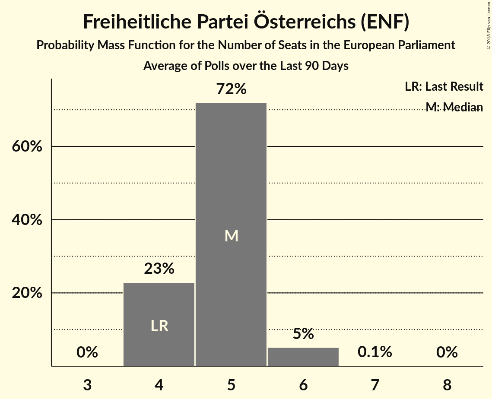

# Freiheitliche Partei Österreichs (ENF)

<a href="#voting-intentions">Voting Intentions</a> | <a href="#seats">Seats</a>

## Voting Intentions

Last result: **19.7%** (General Election of 25 May 2014)

### Confidence Intervals

| Period     | Polling firm/Commissioner(s) | Median | 80% Confidence Interval | 90% Confidence Interval | 95% Confidence Interval | 99% Confidence Interval |
|:----------:|:----------------:|:-----------:|:-----------------------:|:-----------------------:|:-----------------------:|:-----------------------:|
| N/A | [Poll Average](average.html) | 24.6% | 22.5–26.6% | 21.8–27.3% | 21.3–27.8% | 20.1–29.0% |
| [12–18 April 2018](2018-04-18-ResearchAffairs.html) | Research Affairs   ÖSTERREICH | 24.0% | 22.3–25.8% | 21.9–26.3% | 21.5–26.7% | 20.7–27.6% |
| [8–13 April 2018](2018-04-13-UniqueResearch.html) | Unique Research   profil | 24.0% | 21.7–26.6% | 21.0–27.3% | 20.5–27.9% | 19.4–29.2% |
| [29 March–4 April 2018](2018-04-04-ResearchAffairs.html) | Research Affairs   ÖSTERREICH | 23.0% | 21.4–24.8% | 20.9–25.3% | 20.5–25.7% | 19.8–26.6% |
| [26–29 March 2018](2018-03-29-market.html) | market   Der Standard | 25.0% | 23.2–27.1% | 22.6–27.6% | 22.2–28.1% | 21.3–29.1% |
| [19–22 March 2018](2018-03-22-UniqueResearch.html) | Unique Research   Heute | 23.0% | 21.2–25.0% | 20.7–25.6% | 20.2–26.0% | 19.4–27.0% |
| [14–21 March 2018](2018-03-21-ResearchAffairs.html) | Research Affairs   ÖSTERREICH | 22.0% | 20.4–23.8% | 20.0–24.3% | 19.6–24.7% | 18.8–25.5% |
| [19–21 March 2018](2018-03-21-OGM.html) | OGM   ServusTV | 24.1% | 21.8–26.6% | 21.2–27.3% | 20.6–28.0% | 19.5–29.2% |
| [14 February–18 March 2018](2018-03-18-IMAS.html) | IMAS   Kronen Zeitung | 25.0% | 23.8–26.2% | 23.5–26.6% | 23.2–26.9% | 22.6–27.5% |
| [12–15 March 2018](2018-03-15-UniqueResearch.html) | Unique Research   profil | 25.0% | 22.6–27.6% | 22.0–28.3% | 21.4–29.0% | 20.3–30.3% |
| [6–8 March 2018](2018-03-08-market.html) | market   Der Standard | 24.0% | 22.2–26.0% | 21.7–26.6% | 21.2–27.1% | 20.3–28.1% |
| [1–7 March 2018](2018-03-07-ResearchAffairs.html) | Research Affairs   ÖSTERREICH | 24.0% | 22.4–25.8% | 21.9–26.3% | 21.6–26.7% | 20.8–27.6% |
| [15–21 February 2018](2018-02-21-ResearchAffairs.html) | Research Affairs   ÖSTERREICH | 24.0% | 22.3–25.7% | 21.8–26.3% | 21.4–26.7% | 20.7–27.6% |
| [12–20 February 2018](2018-02-20-PeterHajek.html) | Peter Hajek   ATV | 25.1% | 23.1–27.2% | 22.5–27.8% | 22.1–28.3% | 21.1–29.4% |
| [11–16 February 2018](2018-02-16-UniqueResearch.html) | Unique Research   profil | 26.0% | 23.6–28.6% | 22.9–29.4% | 22.3–30.0% | 21.2–31.3% |
| [1–8 February 2018](2018-02-08-ResearchAffairs.html) | Research Affairs   ÖSTERREICH | 25.0% | 23.3–26.8% | 22.8–27.3% | 22.4–27.8% | 21.6–28.6% |
| [18–24 January 2018](2018-01-24-ResearchAffairs.html) | Research Affairs   ÖSTERREICH | 26.0% | 24.2–27.8% | 23.8–28.3% | 23.4–28.8% | 22.5–29.7% |
| [15–19 January 2018](2018-01-19-UniqueResearch.html) | Unique Research   profil | 25.0% | 22.6–27.6% | 22.0–28.3% | 21.4–29.0% | 20.3–30.3% |
| [4–10 January 2018](2018-01-10-ResearchAffairs.html) | Research Affairs   ÖSTERREICH | 27.0% | 25.2–28.8% | 24.7–29.3% | 24.3–29.8% | 23.5–30.7% |
| [18–21 December 2017](2017-12-21-PeterHajek.html) | Peter Hajek   ATV | 26.0% | 24.0–28.2% | 23.4–28.8% | 22.9–29.4% | 21.9–30.5% |
| [18–20 December 2017](2017-12-20-market.html) | market   Der Standard | 26.0% | 24.1–28.1% | 23.5–28.7% | 23.1–29.2% | 22.2–30.2% |

### Probability Mass Function

The following table shows the probability mass function per percentage block of voting intentions for the [poll average](average.html) for Freiheitliche Partei Österreichs (ENF).

| Voting Intentions | Probability | Accumulated | Special Marks |
|:-----------------:|:-----------:|:-----------:|:-------------:|
| 17.5–18.5% | 0% | 100% |  |
| 18.5–19.5% | 0.2% | 100% |  |
| 19.5–20.5% | 0.7% | 99.8% | Last Result |
| 20.5–21.5% | 3% | 99.1% |  |
| 21.5–22.5% | 7% | 96% |  |
| 22.5–23.5% | 14% | 89% |  |
| 23.5–24.5% | 23% | 75% |  |
| 24.5–25.5% | 25% | 52% | Median |
| 25.5–26.5% | 17% | 27% |  |
| 26.5–27.5% | 7% | 11% |  |
| 27.5–28.5% | 3% | 3% |  |
| 28.5–29.5% | 0.7% | 0.9% |  |
| 29.5–30.5% | 0.2% | 0.2% |  |
| 30.5–31.5% | 0% | 0% |  |

## Seats

Last result: **4** seats (General Election of 25 May 2014)

### Confidence Intervals

| Period     | Polling firm/Commissioner(s) | Median | 80% Confidence Interval | 90% Confidence Interval | 95% Confidence Interval | 99% Confidence Interval |
|:----------:|:----------------:|:------:|:-----------------------:|:-----------------------:|:-----------------------:|:-----------------------:|
| N/A | [Poll Average](average.html) | 5 | 4–5 | 4–6 | 4–6 | 4–6 |
| [12–18 April 2018](2018-04-18-ResearchAffairs.html) | Research Affairs   ÖSTERREICH | 5 | 4–5 | 4–5 | 4–6 | 4–6 |
| [8–13 April 2018](2018-04-13-UniqueResearch.html) | Unique Research   profil | 5 | 4–5 | 4–6 | 4–6 | 4–6 |
| [29 March–4 April 2018](2018-04-04-ResearchAffairs.html) | Research Affairs   ÖSTERREICH | 5 | 4–5 | 4–5 | 4–5 | 4–6 |
| [26–29 March 2018](2018-03-29-market.html) | market   Der Standard | 5 | 5–6 | 5–6 | 4–6 | 4–6 |
| [19–22 March 2018](2018-03-22-UniqueResearch.html) | Unique Research   Heute | 5 | 4–5 | 4–5 | 4–5 | 4–6 |
| [14–21 March 2018](2018-03-21-ResearchAffairs.html) | Research Affairs   ÖSTERREICH | 4 | 4–5 | 4–5 | 4–5 | 4–5 |
| [19–21 March 2018](2018-03-21-OGM.html) | OGM   ServusTV | 5 | 4–5 | 4–6 | 4–6 | 4–6 |
| [14 February–18 March 2018](2018-03-18-IMAS.html) | IMAS   Kronen Zeitung | 5 | 5 | 5–6 | 5–6 | 5–6 |
| [12–15 March 2018](2018-03-15-UniqueResearch.html) | Unique Research   profil | 5 | 4–6 | 4–6 | 4–6 | 4–6 |
| [6–8 March 2018](2018-03-08-market.html) | market   Der Standard | 5 | 4–5 | 4–5 | 4–6 | 4–6 |
| [1–7 March 2018](2018-03-07-ResearchAffairs.html) | Research Affairs   ÖSTERREICH | 5 | 5 | 4–6 | 4–6 | 4–6 |
| [15–21 February 2018](2018-02-21-ResearchAffairs.html) | Research Affairs   ÖSTERREICH | 5 | 5 | 4–6 | 4–6 | 4–6 |
| [12–20 February 2018](2018-02-20-PeterHajek.html) | Peter Hajek   ATV | 5 | 5–6 | 4–6 | 4–6 | 4–6 |
| [11–16 February 2018](2018-02-16-UniqueResearch.html) | Unique Research   profil | 5 | 5–6 | 5–6 | 4–6 | 4–6 |
| [1–8 February 2018](2018-02-08-ResearchAffairs.html) | Research Affairs   ÖSTERREICH | 5 | 5–6 | 5–6 | 4–6 | 4–6 |
| [18–24 January 2018](2018-01-24-ResearchAffairs.html) | Research Affairs   ÖSTERREICH | 5 | 5–6 | 5–6 | 5–6 | 5–6 |
| [15–19 January 2018](2018-01-19-UniqueResearch.html) | Unique Research   profil | 5 | 4–6 | 4–6 | 4–6 | 4–6 |
| [4–10 January 2018](2018-01-10-ResearchAffairs.html) | Research Affairs   ÖSTERREICH | 6 | 5–6 | 5–6 | 5–6 | 5–7 |
| [18–21 December 2017](2017-12-21-PeterHajek.html) | Peter Hajek   ATV | 5 | 5–6 | 5–6 | 5–6 | 4–6 |
| [18–20 December 2017](2017-12-20-market.html) | market   Der Standard | 5 | 5–6 | 5–6 | 5–6 | 4–6 |

### Probability Mass Function

The following table shows the probability mass function per seat for the [poll average](average.html) for Freiheitliche Partei Österreichs (ENF).

| Number of Seats | Probability | Accumulated | Special Marks |
|:---------------:|:-----------:|:-----------:|:-------------:|
| 4 | 11% | 100% | Last Result |
| 5 | 80% | 89% | Median |
| 6 | 8% | 8% |  |
| 7 | 0% | 0% |  |

