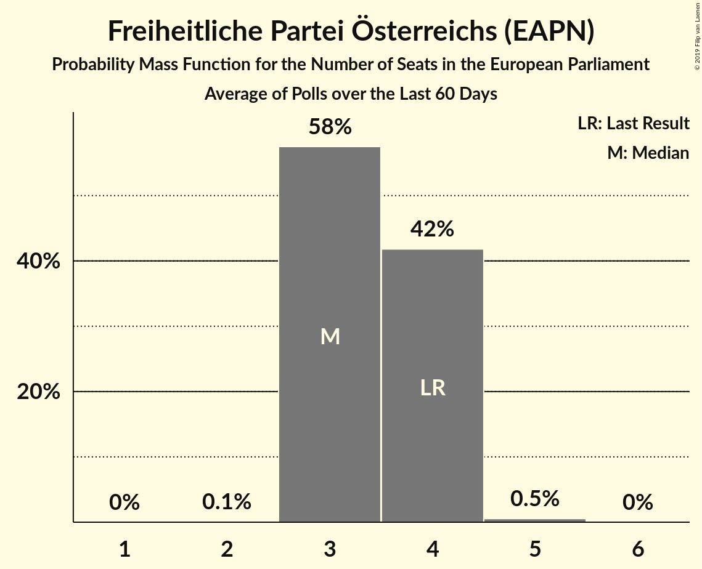

# Freiheitliche Partei Österreichs (EAPN)

<a href="#voting-intentions">Voting Intentions</a> | <a href="#seats">Seats</a>

## Voting Intentions

Last result: **19.7%** (General Election of 26 May 2019)

### Confidence Intervals

| Period     | Polling firm/Commissioner(s) | Median | 80% Confidence Interval | 90% Confidence Interval | 95% Confidence Interval | 99% Confidence Interval |
|:----------:|:----------------:|:-----------:|:-----------------------:|:-----------------------:|:-----------------------:|:-----------------------:|
| N/A | [Poll Average](average.html) | 19.4% | 16.7–22.1% | 16.1–22.7% | 15.6–23.3% | 14.8–24.4% |
| [5–6 June 2019](2019-06-06-Market.html) | Market   Der Standard | 19.0% | 17.4–20.9% | 16.9–21.4% | 16.5–21.9% | 15.7–22.8% |
| [31 May–5 June 2019](2019-06-05-UniqueResearch.html) | Unique Research | 21.0% | 19.2–22.9% | 18.7–23.5% | 18.3–24.0% | 17.5–24.9% |
| [29 May–4 June 2019](2019-06-04-ResearchAffairs.html) | Research Affairs | 17.0% | 15.5–18.6% | 15.2–19.1% | 14.8–19.5% | 14.1–20.3% |
| [29–31 May 2019](2019-05-31-UniqueResearch.html) | Unique Research | 19.0% | 17.4–20.7% | 17.0–21.2% | 16.6–21.6% | 15.9–22.4% |
| [29–31 May 2019](2019-05-31-ResearchAffairs.html) | Research Affairs | 17.0% | 15.0–19.3% | 14.4–20.0% | 14.0–20.5% | 13.0–21.7% |
| [1–31 May 2019](2019-05-31-DemoxResearch.html) | Demox Research | 18.6% | 17.1–20.3% | 16.7–20.7% | 16.3–21.1% | 15.6–21.9% |
| [27–29 May 2019](2019-05-29-OGM.html) | OGM   KURIER | 21.0% | 19.2–22.9% | 18.7–23.5% | 18.3–23.9% | 17.5–24.9% |

### Probability Mass Function

The following table shows the probability mass function per percentage block of voting intentions for the [poll average](average.html) for Freiheitliche Partei Österreichs (EAPN).

| Voting Intentions | Probability | Accumulated | Special Marks |
|:-----------------:|:-----------:|:-----------:|:-------------:|
| 12.5–13.5% | 0% | 100% |  |
| 13.5–14.5% | 0.3% | 100% |  |
| 14.5–15.5% | 2% | 99.7% |  |
| 15.5–16.5% | 6% | 98% |  |
| 16.5–17.5% | 11% | 92% |  |
| 17.5–18.5% | 16% | 80% |  |
| 18.5–19.5% | 18% | 64% | Median |
| 19.5–20.5% | 17% | 47% | Last Result |
| 20.5–21.5% | 14% | 30% |  |
| 21.5–22.5% | 9% | 16% |  |
| 22.5–23.5% | 4% | 6% |  |
| 23.5–24.5% | 1.5% | 2% |  |
| 24.5–25.5% | 0.3% | 0.4% |  |
| 25.5–26.5% | 0.1% | 0.1% |  |
| 26.5–27.5% | 0% | 0% |  |

## Seats

Last result: **4** seats (General Election of 26 May 2019)

### Confidence Intervals

| Period     | Polling firm/Commissioner(s) | Median | 80% Confidence Interval | 90% Confidence Interval | 95% Confidence Interval | 99% Confidence Interval |
|:----------:|:----------------:|:------:|:-----------------------:|:-----------------------:|:-----------------------:|:-----------------------:|
| N/A | [Poll Average](average.html) | 4 | 3–4 | 3–4 | 3–4 | 3–5 |
| [5–6 June 2019](2019-06-06-Market.html) | Market   Der Standard | 3 | 3–4 | 3–4 | 3–4 | 3–4 |
| [31 May–5 June 2019](2019-06-05-UniqueResearch.html) | Unique Research | 4 | 3–4 | 3–4 | 3–5 | 3–5 |
| [29 May–4 June 2019](2019-06-04-ResearchAffairs.html) | Research Affairs | 3 | 3–4 | 3–4 | 3–4 | 2–4 |
| [29–31 May 2019](2019-05-31-UniqueResearch.html) | Unique Research | 3 | 3–4 | 3–4 | 3–4 | 3–4 |
| [29–31 May 2019](2019-05-31-ResearchAffairs.html) | Research Affairs | 3 | 3–4 | 3–4 | 2–4 | 2–4 |
| [1–31 May 2019](2019-05-31-DemoxResearch.html) | Demox Research | 3 | 3–4 | 3–4 | 3–4 | 3–4 |
| [27–29 May 2019](2019-05-29-OGM.html) | OGM   KURIER | 4 | 4 | 3–4 | 3–5 | 3–5 |

### Probability Mass Function

The following table shows the probability mass function per seat for the [poll average](average.html) for Freiheitliche Partei Österreichs (EAPN).

| Number of Seats | Probability | Accumulated | Special Marks |
|:---------------:|:-----------:|:-----------:|:-------------:|
| 2 | 0.1% | 100% |  |
| 3 | 45% | 99.9% |  |
| 4 | 53% | 55% | Last Result, Median |
| 5 | 1.4% | 1.4% |  |
| 6 | 0% | 0% |  |

