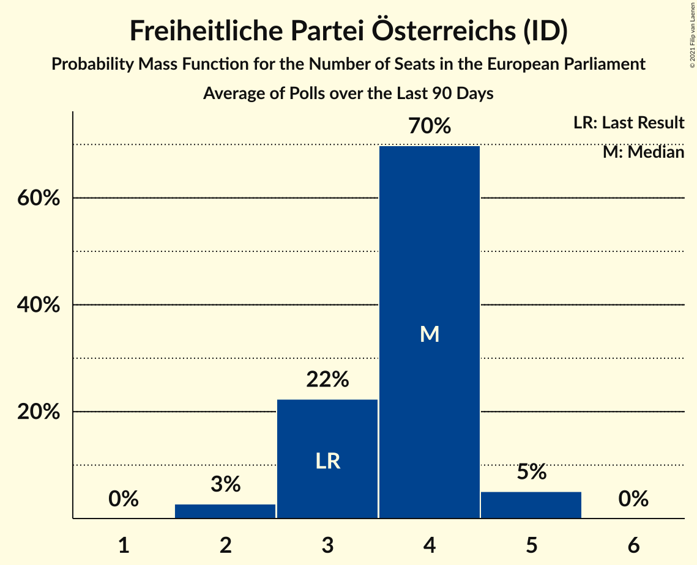

# Freiheitliche Partei Österreichs (ID)

<a href="#voting-intentions">Voting Intentions</a> | <a href="#seats">Seats</a>

## Voting Intentions

Last result: **17.2%** (General Election of 26 May 2019)

### Confidence Intervals

| Period     | Polling firm/Commissioner(s) | Median | 80% Confidence Interval | 90% Confidence Interval | 95% Confidence Interval | 99% Confidence Interval |
|:----------:|:----------------:|:-----------:|:-----------------------:|:-----------------------:|:-----------------------:|:-----------------------:|
| N/A | [Poll Average](average.html) | 17.1% | 14.0–19.2% | 13.3–19.7% | 12.8–20.2% | 12.0–21.1% |
| [30 March–1 April 2021](2021-04-01-ResearchAffairs.html) | Research Affairs   ÖSTERREICH | 18.0% | 16.5–19.6% | 16.1–20.1% | 15.7–20.5% | 15.0–21.3% |
| [30 March–1 April 2021](2021-04-01-OGM.html) | OGM   KURIER | 17.0% | 15.4–18.8% | 14.9–19.3% | 14.5–19.7% | 13.8–20.6% |
| [23–25 March 2021](2021-03-25-UniqueResearch.html) | Unique Research   Heute | 18.0% | 16.4–19.8% | 15.9–20.4% | 15.5–20.8% | 14.7–21.7% |
| [23–25 March 2021](2021-03-25-ResearchAffairs.html) | Research Affairs   ÖSTERREICH | 17.0% | 15.0–19.3% | 14.4–19.9% | 13.9–20.5% | 13.0–21.7% |
| [15–17 March 2021](2021-03-17-ResearchAffairs.html) | Research Affairs   ÖSTERREICH | 16.1% | 14.1–18.3% | 13.6–19.0% | 13.1–19.5% | 12.2–20.7% |
| [8–11 March 2021](2021-03-11-PeterHajek.html) | Peter Hajek   APA and ATV | 17.0% | 15.4–18.8% | 14.9–19.3% | 14.6–19.8% | 13.8–20.7% |
| [1–4 March 2021](2021-03-04-UniqueResearch.html) | Unique Research   profil | 17.0% | 15.4–18.8% | 14.9–19.3% | 14.6–19.8% | 13.8–20.7% |
| [2–4 March 2021](2021-03-04-ResearchAffairs.html) | Research Affairs   ÖSTERREICH | 17.1% | 15.1–19.4% | 14.5–20.0% | 14.0–20.6% | 13.1–21.7% |
| [15–18 February 2021](2021-02-18-ResearchAffairs.html) | Research Affairs   ÖSTERREICH | 16.9% | 15.0–19.2% | 14.4–19.9% | 13.9–20.5% | 13.0–21.6% |
| [15–17 February 2021](2021-02-17-Market.html) | Market   Der Standard | 14.0% | 12.7–15.5% | 12.3–15.9% | 12.0–16.3% | 11.4–17.0% |
| [8–11 February 2021](2021-02-11-UniqueResearch.html) | Unique Research   profil | 17.0% | 15.4–18.8% | 14.9–19.3% | 14.6–19.8% | 13.8–20.7% |
| [8–11 February 2021](2021-02-11-ResearchAffairs.html) | Research Affairs   ÖSTERREICH | 16.0% | 14.1–18.3% | 13.5–18.9% | 13.0–19.5% | 12.2–20.6% |
| [1–4 February 2021](2021-02-04-ResearchAffairs.html) | Research Affairs   ÖSTERREICH | 15.0% | 13.1–17.2% | 12.6–17.8% | 12.1–18.4% | 11.3–19.5% |
| [25 January–1 February 2021](2021-02-01-IFDD.html) | IFDD   Kronen Zeitung | 18.0% | 16.4–19.8% | 15.9–20.4% | 15.5–20.8% | 14.7–21.7% |
| [11–14 January 2021](2021-01-14-UniqueResearch.html) | Unique Research   profil | 16.0% | 14.4–17.8% | 14.0–18.3% | 13.6–18.7% | 12.9–19.6% |
| [4–7 January 2021](2021-01-07-ResearchAffairs.html) | Research Affairs   ÖSTERREICH | 16.0% | 14.6–17.6% | 14.2–18.0% | 13.9–18.4% | 13.2–19.2% |
| [17–21 December 2020](2020-12-21-Market.html) | Market   Der Standard | 13.0% | 11.6–14.6% | 11.2–15.1% | 10.8–15.5% | 10.2–16.3% |
| [15–17 December 2020](2020-12-17-OGM.html) | OGM   KURIER | 13.0% | 11.6–14.6% | 11.1–15.1% | 10.8–15.5% | 10.2–16.3% |
| [8–12 December 2020](2020-12-12-PeterHajek.html) | Peter Hajek   APA and ATV | 16.0% | 14.4–17.8% | 14.0–18.3% | 13.6–18.7% | 12.9–19.6% |
| [5 December 2020](2020-12-05-UniqueResearch.html) | Unique Research   profil | 15.0% | 13.5–16.7% | 13.1–17.2% | 12.7–17.6% | 12.0–18.5% |
| [30 November–3 December 2020](2020-12-03-ResearchAffairs.html) | Research Affairs   ÖSTERREICH | 13.0% | 11.2–15.1% | 10.8–15.7% | 10.3–16.2% | 9.6–17.3% |
| [30 November–2 December 2020](2020-12-02-Market.html) | Market   Der Standard | 14.0% | 12.5–15.7% | 12.1–16.2% | 11.8–16.6% | 11.1–17.4% |
| [17–19 November 2020](2020-11-19-ResearchAffairs.html) | Research Affairs   ÖSTERREICH | 12.0% | 10.3–14.0% | 9.8–14.6% | 9.4–15.1% | 8.7–16.2% |
| [9–12 November 2020](2020-11-12-ResearchAffairs.html) | Research Affairs   ÖSTERREICH | 12.0% | 10.8–13.4% | 10.4–13.8% | 10.1–14.2% | 9.6–14.9% |
| [5–7 November 2020](2020-11-07-ResearchAffairs.html) | Research Affairs   ÖSTERREICH | 10.6% | 9.0–12.6% | 8.6–13.1% | 8.2–13.6% | 7.5–14.6% |
| [2–6 November 2020](2020-11-06-UniqueResearch.html) | Unique Research | 16.0% | 14.5–17.8% | 14.0–18.3% | 13.7–18.7% | 13.0–19.6% |
| [27–29 October 2020](2020-10-29-ResearchAffairs.html) | Research Affairs | 10.0% | 8.5–11.9% | 8.0–12.5% | 7.7–13.0% | 7.0–13.9% |
| [20–22 October 2020](2020-10-22-ResearchAffairs.html) | Research Affairs | 10.0% | 8.5–11.9% | 8.0–12.5% | 7.7–13.0% | 7.0–13.9% |
| [20–22 October 2020](2020-10-22-OGM.html) | OGM | 11.0% | 10.0–12.0% | 9.8–12.3% | 9.6–12.6% | 9.1–13.1% |
| [12–16 October 2020](2020-10-16-UniqueResearch.html) | Unique Research | 13.0% | 11.6–14.7% | 11.2–15.1% | 10.9–15.5% | 10.2–16.4% |
| [6–8 October 2020](2020-10-08-ResearchAffairs.html) | Research Affairs | 11.0% | 9.4–13.0% | 9.0–13.6% | 8.6–14.1% | 7.9–15.1% |
| [28–30 September 2020](2020-09-30-ResearchAffairs.html) | Research Affairs | 11.0% | 9.4–13.0% | 8.9–13.5% | 8.6–14.1% | 7.8–15.1% |
| [21–24 September 2020](2020-09-24-ResearchAffairs.html) | Research Affairs | 12.1% | 10.4–14.1% | 9.9–14.7% | 9.5–15.2% | 8.7–16.2% |
| [14–18 September 2020](2020-09-18-UniqueResearch.html) | Unique Research | 16.0% | 14.5–17.8% | 14.0–18.3% | 13.7–18.7% | 13.0–19.6% |
| [14–16 September 2020](2020-09-16-ResearchAffairs.html) | Research Affairs | 12.1% | 10.9–13.5% | 10.5–13.9% | 10.2–14.3% | 9.6–15.0% |
| [25–27 August 2020](2020-08-27-ResearchAffairs.html) | Research Affairs   ÖSTERREICH | 13.0% | 11.2–15.1% | 10.7–15.7% | 10.3–16.2% | 9.5–17.3% |
| [17–20 August 2020](2020-08-20-ResearchAffairs.html) | Research Affairs   ÖSTERREICH | 13.1% | 11.3–15.2% | 10.8–15.8% | 10.4–16.3% | 9.6–17.4% |
| [10–13 August 2020](2020-08-13-UniqueResearch.html) | Unique Research   profil | 15.0% | 13.5–16.7% | 13.1–17.2% | 12.7–17.6% | 12.0–18.5% |
| [20–22 July 2020](2020-07-22-ResearchAffairs.html) | Research Affairs   ÖSTERREICH | 11.0% | 9.4–13.0% | 8.9–13.5% | 8.6–14.1% | 7.8–15.1% |
| [13–16 July 2020](2020-07-16-UniqueResearch.html) | Unique Research   profil | 15.0% | 13.5–16.7% | 13.0–17.2% | 12.7–17.6% | 12.0–18.5% |
| [6–9 July 2020](2020-07-09-ResearchAffairs.html) | Research Affairs   ÖSTERREICH | 10.9% | 9.3–12.9% | 8.9–13.5% | 8.5–14.0% | 7.8–15.0% |
| [23–25 June 2020](2020-06-25-OGM.html) | OGM | 13.0% | 11.6–14.7% | 11.2–15.2% | 10.9–15.6% | 10.2–16.4% |
| [9–12 June 2020](2020-06-12-UniqueResearch.html) | Unique Research   profil | 14.0% | 12.5–15.7% | 12.1–16.1% | 11.7–16.6% | 11.1–17.4% |
| [5–10 June 2020](2020-06-10-ResearchAffairs.html) | Research Affairs   ÖSTERREICH | 12.0% | 10.8–13.4% | 10.4–13.8% | 10.1–14.2% | 9.6–14.9% |
| [5–9 June 2020](2020-06-09-KarmasinResearchIdentity.html) | Karmasin Research & Identity | 13.0% | 11.7–14.5% | 11.4–14.9% | 11.1–15.2% | 10.5–16.0% |
| [25–28 May 2020](2020-05-28-ResearchAffairs.html) | Research Affairs   ÖSTERREICH | 12.0% | 10.8–13.4% | 10.4–13.8% | 10.1–14.2% | 9.6–14.9% |
| [21–26 May 2020](2020-05-26-Market.html) | Market   Der Standard | 12.0% | 10.6–13.6% | 10.2–14.0% | 9.9–14.4% | 9.3–15.2% |
| [18–19 May 2020](2020-05-19-Market.html) | Market   Der Standard | 12.0% | 10.8–13.4% | 10.4–13.8% | 10.1–14.2% | 9.6–14.9% |
| [11–14 May 2020](2020-05-14-UniqueResearch.html) | Unique Research   profil | 14.0% | 12.5–15.7% | 12.1–16.1% | 11.7–16.6% | 11.1–17.4% |
| [11–13 May 2020](2020-05-13-Market.html) | Market   Der Standard | 11.0% | 9.8–12.4% | 9.5–12.8% | 9.2–13.1% | 8.7–13.8% |
| [20–22 April 2020](2020-04-22-Market.html) | Market | 10.0% | 8.9–11.3% | 8.6–11.7% | 8.3–12.0% | 7.8–12.7% |
| [13–16 April 2020](2020-04-16-UniqueResearch.html) | Unique Research   profil | 13.0% | 11.6–14.7% | 11.2–15.1% | 10.9–15.5% | 10.2–16.4% |
| [3–7 April 2020](2020-04-07-Market.html) | Market   Der Standard | 11.0% | 10.1–12.0% | 9.8–12.3% | 9.6–12.5% | 9.2–13.0% |
| [31 March–2 April 2020](2020-04-02-OGM.html) | OGM | 12.0% | 10.6–13.6% | 10.2–14.1% | 9.9–14.4% | 9.3–15.2% |
| [24–31 March 2020](2020-03-31-Market.html) | Market   Der Standard | 11.0% | 9.8–12.4% | 9.5–12.8% | 9.2–13.1% | 8.7–13.8% |
| [9–13 March 2020](2020-03-13-UniqueResearch.html) | Unique Research | 17.0% | 15.4–18.8% | 15.0–19.3% | 14.6–19.8% | 13.8–20.7% |
| [11–12 March 2020](2020-03-12-Market.html) | Market   Der Standard | 13.0% | 11.7–14.5% | 11.4–14.9% | 11.1–15.2% | 10.5–16.0% |
| [5–11 March 2020](2020-03-11-ResearchAffairs.html) | Research Affairs   ÖSTERREICH | 12.3% | 11.0–13.7% | 10.7–14.1% | 10.4–14.5% | 9.8–15.2% |
| [24–27 February 2020](2020-02-27-ResearchAffairs.html) | Research Affairs   ÖSTERREICH | 11.1% | 9.9–12.4% | 9.6–12.8% | 9.3–13.2% | 8.7–13.9% |
| [10–14 February 2020](2020-02-14-UniqueResearch.html) | Unique Research   profil | 16.0% | 14.5–17.8% | 14.0–18.3% | 13.7–18.7% | 13.0–19.6% |
| [7–12 February 2020](2020-02-12-ResearchAffairs.html) | Research Affairs | 13.0% | 11.5–14.8% | 11.0–15.3% | 10.7–15.8% | 10.0–16.7% |
| [4–6 February 2020](2020-02-06-Market.html) | Market | 15.0% | 13.5–16.7% | 13.1–17.2% | 12.7–17.6% | 12.0–18.5% |
| [28–31 January 2020](2020-01-31-ResearchAffairs.html) | Research Affairs   ÖSTERREICH | 13.0% | 11.2–15.1% | 10.7–15.7% | 10.3–16.2% | 9.5–17.3% |
| [17–23 January 2020](2020-01-23-ResearchAffairs.html) | Research Affairs | 13.0% | 11.6–14.6% | 11.2–15.0% | 10.9–15.4% | 10.3–16.2% |
| [10–16 January 2020](2020-01-16-ResearchAffairs.html) | Research Affairs   ÖSTERREICH | 13.0% | 11.7–14.4% | 11.3–14.8% | 11.0–15.2% | 10.4–15.9% |
| [10–15 January 2020](2020-01-15-KarmasinResearchIdentity.html) | Karmasin Research & Identity | 15.0% | 13.6–16.5% | 13.2–17.0% | 12.9–17.4% | 12.3–18.1% |
| [6–10 January 2020](2020-01-10-UniqueResearch.html) | Unique Research   profil | 16.0% | 14.4–17.8% | 14.0–18.3% | 13.6–18.7% | 12.9–19.6% |
| [3–9 January 2020](2020-01-09-ResearchAffairs.html) | Research Affairs   ÖSTERREICH | 13.0% | 11.7–14.6% | 11.3–15.1% | 10.9–15.5% | 10.3–16.2% |
| [12–19 December 2019](2019-12-19-ResearchAffairs.html) | Research Affairs   ÖSTERREICH | 15.1% | 13.6–16.7% | 13.2–17.2% | 12.8–17.6% | 12.2–18.4% |
| [16–19 December 2019](2019-12-19-Market.html) | Market   Der Standard | 14.0% | 12.6–15.7% | 12.1–16.2% | 11.8–16.6% | 11.1–17.4% |
| [9–13 December 2019](2019-12-13-UniqueResearch.html) | Unique Research   profil | 15.0% | 13.5–16.7% | 13.1–17.2% | 12.7–17.6% | 12.0–18.5% |
| [6–12 December 2019](2019-12-12-ResearchAffairs.html) | Research Affairs   ÖSTERREICH | 14.1% | 12.6–15.7% | 12.2–16.1% | 11.9–16.5% | 11.3–17.3% |
| [29 November–5 December 2019](2019-12-05-ResearchAffairs.html) | Research Affairs   ÖSTERREICH | 14.0% | 12.5–15.6% | 12.1–16.1% | 11.8–16.5% | 11.1–17.3% |
| [29 November–4 December 2019](2019-12-04-Market.html) | Market   Der Standard | 15.0% | 13.5–16.8% | 13.1–17.3% | 12.7–17.7% | 12.0–18.5% |
| [22–28 November 2019](2019-11-28-ResearchAffairs.html) | Research Affairs   ÖSTERREICH | 14.0% | 12.5–15.6% | 12.1–16.0% | 11.8–16.4% | 11.2–17.2% |
| [15–21 November 2019](2019-11-21-ResearchAffairs.html) | Research Affairs   ÖSTERREICH | 14.0% | 12.6–15.6% | 12.2–16.1% | 11.9–16.5% | 11.2–17.3% |
| [11–15 November 2019](2019-11-15-UniqueResearch.html) | Unique Research   profil | 17.0% | 15.4–18.8% | 15.0–19.3% | 14.6–19.8% | 13.9–20.6% |
| [8–14 November 2019](2019-11-14-ResearchAffairs.html) | Research Affairs   ÖSTERREICH | 15.0% | 13.6–16.7% | 13.1–17.2% | 12.8–17.6% | 12.1–18.5% |
| [8–13 November 2019](2019-11-13-KarmasinResearchIdentity.html) | Karmasin Research & Identity | 15.0% | 14.2–15.9% | 14.0–16.1% | 13.8–16.3% | 13.4–16.8% |
| [2–7 November 2019](2019-11-07-ResearchAffairs.html) | Research Affairs   ÖSTERREICH | 15.0% | 13.6–16.5% | 13.2–16.9% | 12.9–17.3% | 12.3–18.1% |
| [26–31 October 2019](2019-10-31-ResearchAffairs.html) | Research Affairs   ÖSTERREICH | 15.0% | 13.4–16.7% | 13.0–17.2% | 12.7–17.6% | 11.9–18.5% |
| [22–25 October 2019](2019-10-25-ResearchAffairs.html) | Research Affairs   ÖSTERREICH | 15.0% | 13.6–16.5% | 13.2–17.0% | 12.9–17.4% | 12.3–18.1% |
| [15–17 October 2019](2019-10-17-Market.html) | Market   Der Standard | 16.0% | 14.4–17.7% | 14.0–18.2% | 13.6–18.7% | 12.9–19.5% |
| [10–16 October 2019](2019-10-16-ResearchAffairs.html) | Research Affairs   ÖSTERREICH | 15.0% | 13.6–16.5% | 13.2–17.0% | 12.9–17.3% | 12.3–18.1% |
| [7–11 October 2019](2019-10-11-UniqueResearch.html) | Unique Research   profil | 17.0% | 15.4–18.8% | 14.9–19.3% | 14.5–19.7% | 13.8–20.6% |
| [16–23 September 2019](2019-09-23-OGM.html) | OGM   Servus TV | 20.0% | 18.4–21.7% | 18.0–22.1% | 17.6–22.6% | 16.9–23.4% |
| [19–22 September 2019](2019-09-22-ResearchAffairs.html) | Research Affairs   ÖSTERREICH | 21.0% | 19.4–22.7% | 19.0–23.2% | 18.6–23.6% | 17.8–24.5% |
| [12–20 September 2019](2019-09-20-PeterHajek.html) | Peter Hajek   ATV, PULS 4 and Servus TV | 20.0% | 19.1–21.0% | 18.8–21.2% | 18.6–21.5% | 18.2–21.9% |
| [13–18 September 2019](2019-09-18-ResearchAffairs.html) | Research Affairs   ÖSTERREICH | 20.0% | 18.4–21.7% | 18.0–22.2% | 17.6–22.6% | 16.9–23.4% |
| [16–18 September 2019](2019-09-18-Market.html) | Market   Der Standard | 20.0% | 18.3–21.9% | 17.8–22.4% | 17.4–22.9% | 16.6–23.8% |
| [1–18 September 2019](2019-09-18-InstitutfürGrundlagenforschung.html) | Institut für Grundlagenforschung | 26.1% | 24.0–28.3% | 23.4–28.9% | 23.0–29.4% | 22.0–30.5% |
| [11–17 September 2019](2019-09-17-KarmasinResearchIdentity.html) | Karmasin Research & Identity | 20.0% | 19.1–21.0% | 18.8–21.2% | 18.6–21.5% | 18.2–21.9% |
| [2–13 September 2019](2019-09-13-UniqueResearch.html) | Unique Research   profil | 20.0% | 19.0–21.1% | 18.7–21.4% | 18.4–21.6% | 18.0–22.2% |
| [6–13 September 2019](2019-09-13-OGM.html) | OGM   KURIER | 20.0% | 18.9–21.1% | 18.6–21.4% | 18.4–21.7% | 17.8–22.3% |
| [6–11 September 2019](2019-09-11-ResearchAffairs.html) | Research Affairs   ÖSTERREICH | 19.0% | 16.9–21.4% | 16.3–22.0% | 15.8–22.6% | 14.9–23.8% |
| [5–10 September 2019](2019-09-10-KarmasinResearchIdentity.html) | Karmasin Research & Identity   PULS 24 | 19.0% | 18.1–20.0% | 17.8–20.2% | 17.6–20.5% | 17.2–20.9% |
| [5–8 September 2019](2019-09-08-Market.html) | Market   Der Standard | 21.0% | 19.3–23.0% | 18.8–23.5% | 18.4–24.0% | 17.5–25.0% |
| [30 August–4 September 2019](2019-09-04-ResearchAffairs.html) | Research Affairs   ÖSTERREICH | 20.0% | 17.9–22.5% | 17.3–23.2% | 16.8–23.8% | 15.8–25.0% |
| [2–4 September 2019](2019-09-04-Market.html) | Market   Der Standard | 21.0% | 19.2–22.9% | 18.7–23.5% | 18.3–24.0% | 17.5–24.9% |
| [29 August–3 September 2019](2019-09-03-KarmasinResearchIdentity.html) | Karmasin Research & Identity   PULS 24 | 20.0% | 19.1–21.0% | 18.8–21.2% | 18.6–21.5% | 18.2–21.9% |
| [22–28 August 2019](2019-08-28-ResearchAffairs.html) | Research Affairs   ÖSTERREICH | 19.8% | 17.7–22.3% | 17.1–23.0% | 16.6–23.6% | 15.6–24.8% |
| [19–22 August 2019](2019-08-22-UniqueResearch.html) | Unique Research   profil | 20.0% | 18.3–21.9% | 17.8–22.5% | 17.4–22.9% | 16.6–23.9% |
| [16–21 August 2019](2019-08-21-ResearchAffairs.html) | Research Affairs   ÖSTERREICH | 19.0% | 16.9–21.4% | 16.3–22.1% | 15.8–22.7% | 14.9–23.9% |
| [9–14 August 2019](2019-08-14-ResearchAffairs.html) | Research Affairs   ÖSTERREICH | 19.0% | 16.9–21.4% | 16.3–22.0% | 15.8–22.6% | 14.8–23.8% |
| [8–12 August 2019](2019-08-12-OGM.html) | OGM   KURIER | 20.0% | 18.2–21.8% | 17.8–22.4% | 17.3–22.8% | 16.6–23.8% |
| [26 July–9 August 2019](2019-08-09-KowarczMarktforschung.html) | Kowarcz Marktforschung | 22.0% | 20.7–23.4% | 20.3–23.8% | 20.0–24.1% | 19.4–24.8% |
| [1–7 August 2019](2019-08-07-ResearchAffairs.html) | Research Affairs   ÖSTERREICH | 20.0% | 17.9–22.4% | 17.3–23.1% | 16.7–23.7% | 15.8–24.9% |
| [2–5 August 2019](2019-08-05-Market.html) | Market   Der Standard | 20.0% | 18.3–21.9% | 17.8–22.5% | 17.4–22.9% | 16.6–23.9% |
| [25–31 July 2019](2019-07-31-ResearchAffairs.html) | Research Affairs   ÖSTERREICH | 19.9% | 17.8–22.4% | 17.2–23.0% | 16.7–23.7% | 15.7–24.8% |
| [18–24 July 2019](2019-07-24-ResearchAffairs.html) | Research Affairs   ÖSTERREICH | 20.0% | 17.9–22.5% | 17.3–23.2% | 16.8–23.8% | 15.8–25.0% |
| [5–17 July 2019](2019-07-17-ResearchAffairs.html) | Research Affairs   ÖSTERREICH | 19.0% | 17.4–20.6% | 17.0–21.1% | 16.6–21.5% | 15.9–22.3% |
| [8–12 July 2019](2019-07-12-UniqueResearch.html) | Unique Research   profil | 21.0% | 19.2–22.9% | 18.7–23.5% | 18.3–24.0% | 17.5–24.9% |
| [5–10 July 2019](2019-07-10-ResearchAffairs.html) | Research Affairs   ÖSTERREICH | 18.0% | 15.9–20.3% | 15.3–21.0% | 14.8–21.6% | 13.9–22.7% |
| [8–9 July 2019](2019-07-09-Market.html) | Market   Der Standard | 20.0% | 18.2–21.9% | 17.7–22.4% | 17.3–22.9% | 16.5–23.8% |
| [27 June–4 July 2019](2019-07-04-ResearchAffairs.html) | Research Affairs   ÖSTERREICH | 18.0% | 16.5–19.6% | 16.1–20.1% | 15.7–20.5% | 15.0–21.3% |
| [24–28 June 2019](2019-06-28-PeterHajek.html) | Peter Hajek   ATV | 20.0% | 18.3–21.9% | 17.8–22.5% | 17.4–22.9% | 16.6–23.9% |
| [14–20 June 2019](2019-06-20-ResearchAffairs.html) | Research Affairs   ÖSTERREICH | 17.0% | 15.6–18.7% | 15.2–19.1% | 14.8–19.5% | 14.2–20.3% |
| [31 May–10 June 2019](2019-06-10-SORA.html) | SORA   ORF | 18.0% | 16.6–19.6% | 16.2–20.0% | 15.8–20.4% | 15.2–21.2% |
| [5–6 June 2019](2019-06-06-Market.html) | Market   Der Standard | 19.0% | 17.4–20.9% | 16.9–21.4% | 16.5–21.9% | 15.7–22.8% |
| [31 May–5 June 2019](2019-06-05-UniqueResearch.html) | Unique Research | 21.0% | 19.2–22.9% | 18.7–23.5% | 18.3–24.0% | 17.5–24.9% |
| [29 May–4 June 2019](2019-06-04-ResearchAffairs.html) | Research Affairs   ÖSTERREICH | 17.0% | 15.5–18.6% | 15.2–19.1% | 14.8–19.5% | 14.1–20.3% |
| [29–31 May 2019](2019-05-31-UniqueResearch.html) | Unique Research | 19.0% | 17.4–20.7% | 17.0–21.2% | 16.6–21.6% | 15.9–22.4% |
| [29–31 May 2019](2019-05-31-ResearchAffairs.html) | Research Affairs   ÖSTERREICH | 17.0% | 15.0–19.3% | 14.4–20.0% | 14.0–20.5% | 13.0–21.7% |
| [1–31 May 2019](2019-05-31-DemoxResearch.html) | Demox Research | 18.6% | 17.1–20.3% | 16.7–20.7% | 16.3–21.1% | 15.6–21.9% |
| [27–29 May 2019](2019-05-29-OGM.html) | OGM   KURIER | 21.0% | 19.2–22.9% | 18.7–23.5% | 18.3–23.9% | 17.5–24.9% |

### Probability Mass Function

The following table shows the probability mass function per percentage block of voting intentions for the [poll average](average.html) for Freiheitliche Partei Österreichs (ID).

| Voting Intentions | Probability | Accumulated | Special Marks |
|:-----------------:|:-----------:|:-----------:|:-------------:|
| 9.5–10.5% | 0% | 100% |  |
| 10.5–11.5% | 0.2% | 100% |  |
| 11.5–12.5% | 1.4% | 99.8% |  |
| 12.5–13.5% | 5% | 98% |  |
| 13.5–14.5% | 8% | 93% |  |
| 14.5–15.5% | 9% | 85% |  |
| 15.5–16.5% | 15% | 76% |  |
| 16.5–17.5% | 21% | 61% | Last Result, Median |
| 17.5–18.5% | 21% | 40% |  |
| 18.5–19.5% | 13% | 19% |  |
| 19.5–20.5% | 5% | 6% |  |
| 20.5–21.5% | 1.2% | 1.5% |  |
| 21.5–22.5% | 0.2% | 0.2% |  |
| 22.5–23.5% | 0% | 0% |  |

## Seats

Last result: **3** seats (General Election of 26 May 2019)

### Confidence Intervals

| Period     | Polling firm/Commissioner(s) | Median | 80% Confidence Interval | 90% Confidence Interval | 95% Confidence Interval | 99% Confidence Interval |
|:----------:|:----------------:|:------:|:-----------------------:|:-----------------------:|:-----------------------:|:-----------------------:|
| N/A | [Poll Average](average.html) | 3 | 3–4 | 2–4 | 2–4 | 2–4 |
| [30 March–1 April 2021](2021-04-01-ResearchAffairs.html) | Research Affairs   ÖSTERREICH | 4 | 3–4 | 3–4 | 3–4 | 3–4 |
| [30 March–1 April 2021](2021-04-01-OGM.html) | OGM   KURIER | 3 | 3–4 | 3–4 | 3–4 | 3–4 |
| [23–25 March 2021](2021-03-25-UniqueResearch.html) | Unique Research   Heute | 3 | 3–4 | 3–4 | 3–4 | 3–4 |
| [23–25 March 2021](2021-03-25-ResearchAffairs.html) | Research Affairs   ÖSTERREICH | 3 | 3–4 | 3–4 | 3–4 | 2–4 |
| [15–17 March 2021](2021-03-17-ResearchAffairs.html) | Research Affairs   ÖSTERREICH | 3 | 3–4 | 2–4 | 2–4 | 2–4 |
| [8–11 March 2021](2021-03-11-PeterHajek.html) | Peter Hajek   APA and ATV | 3 | 3–4 | 3–4 | 3–4 | 2–4 |
| [1–4 March 2021](2021-03-04-UniqueResearch.html) | Unique Research   profil | 3 | 3–4 | 3–4 | 3–4 | 2–4 |
| [2–4 March 2021](2021-03-04-ResearchAffairs.html) | Research Affairs   ÖSTERREICH | 3 | 3–4 | 3–4 | 3–4 | 2–4 |
| [15–18 February 2021](2021-02-18-ResearchAffairs.html) | Research Affairs   ÖSTERREICH | 3 | 3–4 | 3–4 | 3–4 | 2–4 |
| [15–17 February 2021](2021-02-17-Market.html) | Market   Der Standard | 3 | 2–3 | 2–3 | 2–3 | 2–3 |
| [8–11 February 2021](2021-02-11-UniqueResearch.html) | Unique Research   profil | 3 | 3–4 | 3–4 | 3–4 | 3–4 |
| [8–11 February 2021](2021-02-11-ResearchAffairs.html) | Research Affairs   ÖSTERREICH | 3 | 3–4 | 2–4 | 2–4 | 2–4 |
| [1–4 February 2021](2021-02-04-ResearchAffairs.html) | Research Affairs   ÖSTERREICH | 3 | 2–3 | 2–3 | 2–4 | 2–4 |
| [25 January–1 February 2021](2021-02-01-IFDD.html) | IFDD   Kronen Zeitung | 3 | 3–4 | 3–4 | 3–4 | 3–4 |
| [11–14 January 2021](2021-01-14-UniqueResearch.html) | Unique Research   profil | 3 | 3 | 3 | 2–4 | 2–4 |
| [4–7 January 2021](2021-01-07-ResearchAffairs.html) | Research Affairs   ÖSTERREICH | 3 | 3 | 3 | 3–4 | 2–4 |
| [17–21 December 2020](2020-12-21-Market.html) | Market   Der Standard | 2 | 2–3 | 2–3 | 2–3 | 2–3 |
| [15–17 December 2020](2020-12-17-OGM.html) | OGM   KURIER | 2 | 2–3 | 2–3 | 2–3 | 2–3 |
| [8–12 December 2020](2020-12-12-PeterHajek.html) | Peter Hajek   APA and ATV | 3 | 3 | 3–4 | 2–4 | 2–4 |
| [5 December 2020](2020-12-05-UniqueResearch.html) | Unique Research   profil | 3 | 2–3 | 2–3 | 2–3 | 2–4 |
| [30 November–3 December 2020](2020-12-03-ResearchAffairs.html) | Research Affairs   ÖSTERREICH | 2 | 2–3 | 2–3 | 2–3 | 2–3 |
| [30 November–2 December 2020](2020-12-02-Market.html) | Market   Der Standard | 3 | 2–3 | 2–3 | 2–3 | 2–3 |
| [17–19 November 2020](2020-11-19-ResearchAffairs.html) | Research Affairs   ÖSTERREICH | 2 | 2–3 | 2–3 | 2–3 | 1–3 |
| [9–12 November 2020](2020-11-12-ResearchAffairs.html) | Research Affairs   ÖSTERREICH | 2 | 2 | 2–3 | 2–3 | 2–3 |
| [5–7 November 2020](2020-11-07-ResearchAffairs.html) | Research Affairs   ÖSTERREICH | 2 | 2 | 1–2 | 1–3 | 1–3 |
| [2–6 November 2020](2020-11-06-UniqueResearch.html) | Unique Research | 3 | 3 | 3–4 | 3–4 | 2–4 |
| [27–29 October 2020](2020-10-29-ResearchAffairs.html) | Research Affairs | 2 | 1–2 | 1–2 | 1–2 | 1–3 |
| [20–22 October 2020](2020-10-22-ResearchAffairs.html) | Research Affairs | 2 | 1–2 | 1–2 | 1–2 | 1–3 |
| [20–22 October 2020](2020-10-22-OGM.html) | OGM | 2 | 2 | 2 | 2 | 2 |
| [12–16 October 2020](2020-10-16-UniqueResearch.html) | Unique Research | 2 | 2–3 | 2–3 | 2–3 | 2–3 |
| [6–8 October 2020](2020-10-08-ResearchAffairs.html) | Research Affairs | 2 | 2 | 1–3 | 1–3 | 1–3 |
| [28–30 September 2020](2020-09-30-ResearchAffairs.html) | Research Affairs | 2 | 2 | 1–3 | 1–3 | 1–3 |
| [21–24 September 2020](2020-09-24-ResearchAffairs.html) | Research Affairs | 2 | 2–3 | 2–3 | 2–3 | 1–3 |
| [14–18 September 2020](2020-09-18-UniqueResearch.html) | Unique Research | 3 | 3 | 3 | 2–4 | 2–4 |
| [14–16 September 2020](2020-09-16-ResearchAffairs.html) | Research Affairs | 2 | 2 | 2–3 | 2–3 | 2–3 |
| [25–27 August 2020](2020-08-27-ResearchAffairs.html) | Research Affairs   ÖSTERREICH | 2 | 2–3 | 2–3 | 2–3 | 2–3 |
| [17–20 August 2020](2020-08-20-ResearchAffairs.html) | Research Affairs   ÖSTERREICH | 2 | 2–3 | 2–3 | 2–3 | 2–3 |
| [10–13 August 2020](2020-08-13-UniqueResearch.html) | Unique Research   profil | 3 | 2–3 | 2–3 | 2–3 | 2–4 |
| [20–22 July 2020](2020-07-22-ResearchAffairs.html) | Research Affairs   ÖSTERREICH | 2 | 2 | 1–3 | 1–3 | 1–3 |
| [13–16 July 2020](2020-07-16-UniqueResearch.html) | Unique Research   profil | 3 | 2–3 | 2–3 | 2–3 | 2–4 |
| [6–9 July 2020](2020-07-09-ResearchAffairs.html) | Research Affairs   ÖSTERREICH | 2 | 2 | 1–3 | 1–3 | 1–3 |
| [23–25 June 2020](2020-06-25-OGM.html) | OGM | 2 | 2–3 | 2–3 | 2–3 | 2–3 |
| [9–12 June 2020](2020-06-12-UniqueResearch.html) | Unique Research   profil | 3 | 2–3 | 2–3 | 2–3 | 2–3 |
| [5–10 June 2020](2020-06-10-ResearchAffairs.html) | Research Affairs   ÖSTERREICH | 2 | 2 | 2–3 | 2–3 | 2–3 |
| [5–9 June 2020](2020-06-09-KarmasinResearchIdentity.html) | Karmasin Research & Identity | 2 | 2–3 | 2–3 | 2–3 | 2–3 |
| [25–28 May 2020](2020-05-28-ResearchAffairs.html) | Research Affairs   ÖSTERREICH | 2 | 2–3 | 2–3 | 2–3 | 2–3 |
| [21–26 May 2020](2020-05-26-Market.html) | Market   Der Standard | 2 | 2 | 2–3 | 2–3 | 2–3 |
| [18–19 May 2020](2020-05-19-Market.html) | Market   Der Standard | 2 | 2 | 2 | 2–3 | 2–3 |
| [11–14 May 2020](2020-05-14-UniqueResearch.html) | Unique Research   profil | 3 | 2–3 | 2–3 | 2–3 | 2–3 |
| [11–13 May 2020](2020-05-13-Market.html) | Market   Der Standard | 2 | 2 | 2 | 1–2 | 1–2 |
| [20–22 April 2020](2020-04-22-Market.html) | Market | 2 | 1–2 | 1–2 | 1–2 | 1–2 |
| [13–16 April 2020](2020-04-16-UniqueResearch.html) | Unique Research   profil | 2 | 2–3 | 2–3 | 2–3 | 2–3 |
| [3–7 April 2020](2020-04-07-Market.html) | Market   Der Standard | 2 | 2 | 2 | 2 | 1–2 |
| [31 March–2 April 2020](2020-04-02-OGM.html) | OGM | 2 | 2 | 2–3 | 2–3 | 2–3 |
| [24–31 March 2020](2020-03-31-Market.html) | Market   Der Standard | 2 | 2 | 2 | 1–2 | 1–3 |
| [9–13 March 2020](2020-03-13-UniqueResearch.html) | Unique Research | 3 | 3–4 | 3–4 | 3–4 | 3–4 |
| [11–12 March 2020](2020-03-12-Market.html) | Market   Der Standard | 2 | 2–3 | 2–3 | 2–3 | 2–3 |
| [5–11 March 2020](2020-03-11-ResearchAffairs.html) | Research Affairs   ÖSTERREICH | 2 | 2–3 | 2–3 | 2–3 | 2–3 |
| [24–27 February 2020](2020-02-27-ResearchAffairs.html) | Research Affairs   ÖSTERREICH | 2 | 2 | 2 | 2 | 1–3 |
| [10–14 February 2020](2020-02-14-UniqueResearch.html) | Unique Research   profil | 3 | 3 | 3–4 | 2–4 | 2–4 |
| [7–12 February 2020](2020-02-12-ResearchAffairs.html) | Research Affairs | 2 | 2–3 | 2–3 | 2–3 | 2–3 |
| [4–6 February 2020](2020-02-06-Market.html) | Market | 3 | 2–3 | 2–3 | 2–3 | 2–4 |
| [28–31 January 2020](2020-01-31-ResearchAffairs.html) | Research Affairs   ÖSTERREICH | 2 | 2–3 | 2–3 | 2–3 | 2–3 |
| [17–23 January 2020](2020-01-23-ResearchAffairs.html) | Research Affairs | 2 | 2–3 | 2–3 | 2–3 | 2–3 |
| [10–16 January 2020](2020-01-16-ResearchAffairs.html) | Research Affairs   ÖSTERREICH | 2 | 2–3 | 2–3 | 2–3 | 2–3 |
| [10–15 January 2020](2020-01-15-KarmasinResearchIdentity.html) | Karmasin Research & Identity | 3 | 3 | 2–3 | 2–3 | 2–4 |
| [6–10 January 2020](2020-01-10-UniqueResearch.html) | Unique Research   profil | 3 | 3 | 3–4 | 2–4 | 2–4 |
| [3–9 January 2020](2020-01-09-ResearchAffairs.html) | Research Affairs   ÖSTERREICH | 2 | 2–3 | 2–3 | 2–3 | 2–3 |
| [12–19 December 2019](2019-12-19-ResearchAffairs.html) | Research Affairs   ÖSTERREICH | 3 | 2–3 | 2–3 | 2–3 | 2–4 |
| [16–19 December 2019](2019-12-19-Market.html) | Market   Der Standard | 3 | 2–3 | 2–3 | 2–3 | 2–3 |
| [9–13 December 2019](2019-12-13-UniqueResearch.html) | Unique Research   profil | 3 | 2–3 | 2–3 | 2–3 | 2–4 |
| [6–12 December 2019](2019-12-12-ResearchAffairs.html) | Research Affairs   ÖSTERREICH | 3 | 2–3 | 2–3 | 2–3 | 2–3 |
| [29 November–5 December 2019](2019-12-05-ResearchAffairs.html) | Research Affairs   ÖSTERREICH | 3 | 2–3 | 2–3 | 2–3 | 2–3 |
| [29 November–4 December 2019](2019-12-04-Market.html) | Market   Der Standard | 3 | 2–3 | 2–3 | 2–3 | 2–4 |
| [22–28 November 2019](2019-11-28-ResearchAffairs.html) | Research Affairs   ÖSTERREICH | 3 | 2–3 | 2–3 | 2–3 | 2–3 |
| [15–21 November 2019](2019-11-21-ResearchAffairs.html) | Research Affairs   ÖSTERREICH | 3 | 2–3 | 2–3 | 2–3 | 2–3 |
| [11–15 November 2019](2019-11-15-UniqueResearch.html) | Unique Research   profil | 3 | 3–4 | 3–4 | 3–4 | 2–4 |
| [8–14 November 2019](2019-11-14-ResearchAffairs.html) | Research Affairs   ÖSTERREICH | 3 | 3 | 2–3 | 2–3 | 2–4 |
| [8–13 November 2019](2019-11-13-KarmasinResearchIdentity.html) | Karmasin Research & Identity | 3 | 3 | 3 | 2–3 | 2–3 |
| [2–7 November 2019](2019-11-07-ResearchAffairs.html) | Research Affairs   ÖSTERREICH | 3 | 2–3 | 2–3 | 2–3 | 2–4 |
| [26–31 October 2019](2019-10-31-ResearchAffairs.html) | Research Affairs   ÖSTERREICH | 3 | 2–3 | 2–3 | 2–3 | 2–4 |
| [22–25 October 2019](2019-10-25-ResearchAffairs.html) | Research Affairs   ÖSTERREICH | 3 | 2–3 | 2–3 | 2–3 | 2–4 |
| [15–17 October 2019](2019-10-17-Market.html) | Market   Der Standard | 3 | 3 | 3–4 | 2–4 | 2–4 |
| [10–16 October 2019](2019-10-16-ResearchAffairs.html) | Research Affairs   ÖSTERREICH | 3 | 3 | 2–3 | 2–3 | 2–4 |
| [7–11 October 2019](2019-10-11-UniqueResearch.html) | Unique Research   profil | 3 | 3–4 | 3–4 | 3–4 | 2–4 |
| [16–23 September 2019](2019-09-23-OGM.html) | OGM   Servus TV | 4 | 4 | 4–5 | 3–5 | 3–5 |
| [19–22 September 2019](2019-09-22-ResearchAffairs.html) | Research Affairs   ÖSTERREICH | 4 | 4–5 | 4–5 | 4–5 | 3–5 |
| [12–20 September 2019](2019-09-20-PeterHajek.html) | Peter Hajek   ATV, PULS 4 and Servus TV | 4 | 4 | 4 | 4 | 4–5 |
| [13–18 September 2019](2019-09-18-ResearchAffairs.html) | Research Affairs   ÖSTERREICH | 4 | 4 | 4 | 3–5 | 3–5 |
| [16–18 September 2019](2019-09-18-Market.html) | Market   Der Standard | 4 | 4 | 3–5 | 3–5 | 3–5 |
| [1–18 September 2019](2019-09-18-InstitutfürGrundlagenforschung.html) | Institut für Grundlagenforschung | 5 | 5–6 | 5–6 | 5–6 | 4–6 |
| [11–17 September 2019](2019-09-17-KarmasinResearchIdentity.html) | Karmasin Research & Identity | 4 | 4 | 4 | 4 | 3–4 |
| [2–13 September 2019](2019-09-13-UniqueResearch.html) | Unique Research   profil | 4 | 4 | 4 | 4 | 4–5 |
| [6–13 September 2019](2019-09-13-OGM.html) | OGM   KURIER | 4 | 4 | 4 | 4 | 4–5 |
| [6–11 September 2019](2019-09-11-ResearchAffairs.html) | Research Affairs   ÖSTERREICH | 4 | 3–4 | 3–4 | 3–5 | 3–5 |
| [5–10 September 2019](2019-09-10-KarmasinResearchIdentity.html) | Karmasin Research & Identity   PULS 24 | 4 | 4 | 3–4 | 3–4 | 3–4 |
| [5–8 September 2019](2019-09-08-Market.html) | Market   Der Standard | 4 | 4–5 | 4–5 | 3–5 | 3–5 |
| [30 August–4 September 2019](2019-09-04-ResearchAffairs.html) | Research Affairs   ÖSTERREICH | 4 | 3–4 | 3–5 | 3–5 | 3–5 |
| [2–4 September 2019](2019-09-04-Market.html) | Market   Der Standard | 4 | 4–5 | 4–5 | 4–5 | 3–5 |
| [29 August–3 September 2019](2019-09-03-KarmasinResearchIdentity.html) | Karmasin Research & Identity   PULS 24 | 4 | 4 | 4 | 4 | 4–5 |
| [22–28 August 2019](2019-08-28-ResearchAffairs.html) | Research Affairs   ÖSTERREICH | 4 | 3–4 | 3–5 | 3–5 | 3–5 |
| [19–22 August 2019](2019-08-22-UniqueResearch.html) | Unique Research   profil | 4 | 4 | 3–5 | 3–5 | 3–5 |
| [16–21 August 2019](2019-08-21-ResearchAffairs.html) | Research Affairs   ÖSTERREICH | 4 | 3–4 | 3–4 | 3–5 | 3–5 |
| [9–14 August 2019](2019-08-14-ResearchAffairs.html) | Research Affairs   ÖSTERREICH | 4 | 3–4 | 3–4 | 3–5 | 3–5 |
| [8–12 August 2019](2019-08-12-OGM.html) | OGM   KURIER | 4 | 4 | 3–4 | 3–5 | 3–5 |
| [26 July–9 August 2019](2019-08-09-KowarczMarktforschung.html) | Kowarcz Marktforschung | 4 | 4–5 | 4–5 | 4–5 | 4–5 |
| [1–7 August 2019](2019-08-07-ResearchAffairs.html) | Research Affairs   ÖSTERREICH | 4 | 3–5 | 3–5 | 3–5 | 3–5 |
| [2–5 August 2019](2019-08-05-Market.html) | Market   Der Standard | 4 | 3–4 | 3–4 | 3–5 | 3–5 |
| [25–31 July 2019](2019-07-31-ResearchAffairs.html) | Research Affairs   ÖSTERREICH | 4 | 3–4 | 3–5 | 3–5 | 3–5 |
| [18–24 July 2019](2019-07-24-ResearchAffairs.html) | Research Affairs   ÖSTERREICH | 4 | 3–4 | 3–5 | 3–5 | 3–5 |
| [5–17 July 2019](2019-07-17-ResearchAffairs.html) | Research Affairs   ÖSTERREICH | 4 | 3–4 | 3–4 | 3–4 | 3–5 |
| [8–12 July 2019](2019-07-12-UniqueResearch.html) | Unique Research   profil | 4 | 4–5 | 4–5 | 3–5 | 3–5 |
| [5–10 July 2019](2019-07-10-ResearchAffairs.html) | Research Affairs   ÖSTERREICH | 4 | 3–4 | 3–4 | 3–4 | 3–5 |
| [8–9 July 2019](2019-07-09-Market.html) | Market   Der Standard | 4 | 3–4 | 3–4 | 3–4 | 3–5 |
| [27 June–4 July 2019](2019-07-04-ResearchAffairs.html) | Research Affairs   ÖSTERREICH | 4 | 3–4 | 3–4 | 3–4 | 3–4 |
| [24–28 June 2019](2019-06-28-PeterHajek.html) | Peter Hajek   ATV | 4 | 3–4 | 3–4 | 3–5 | 3–5 |
| [14–20 June 2019](2019-06-20-ResearchAffairs.html) | Research Affairs   ÖSTERREICH | 3 | 3–4 | 3–4 | 3–4 | 3–4 |
| [31 May–10 June 2019](2019-06-10-SORA.html) | SORA   ORF | 4 | 3–4 | 3–4 | 3–4 | 3–4 |
| [5–6 June 2019](2019-06-06-Market.html) | Market   Der Standard | 4 | 3–4 | 3–4 | 3–4 | 3–5 |
| [31 May–5 June 2019](2019-06-05-UniqueResearch.html) | Unique Research | 4 | 4 | 4–5 | 3–5 | 3–5 |
| [29 May–4 June 2019](2019-06-04-ResearchAffairs.html) | Research Affairs   ÖSTERREICH | 3 | 3–4 | 3–4 | 3–4 | 3–4 |
| [29–31 May 2019](2019-05-31-UniqueResearch.html) | Unique Research | 4 | 3–4 | 3–4 | 3–4 | 3–4 |
| [29–31 May 2019](2019-05-31-ResearchAffairs.html) | Research Affairs   ÖSTERREICH | 3 | 3–4 | 3–4 | 3–4 | 2–4 |
| [1–31 May 2019](2019-05-31-DemoxResearch.html) | Demox Research | 4 | 3–4 | 3–4 | 3–4 | 3–4 |
| [27–29 May 2019](2019-05-29-OGM.html) | OGM   KURIER | 4 | 4–5 | 4–5 | 4–5 | 3–5 |

### Probability Mass Function

The following table shows the probability mass function per seat for the [poll average](average.html) for Freiheitliche Partei Österreichs (ID).

| Number of Seats | Probability | Accumulated | Special Marks |
|:---------------:|:-----------:|:-----------:|:-------------:|
| 2 | 8% | 100% |  |
| 3 | 68% | 92% | Last Result, Median |
| 4 | 24% | 24% |  |
| 5 | 0% | 0% |  |

