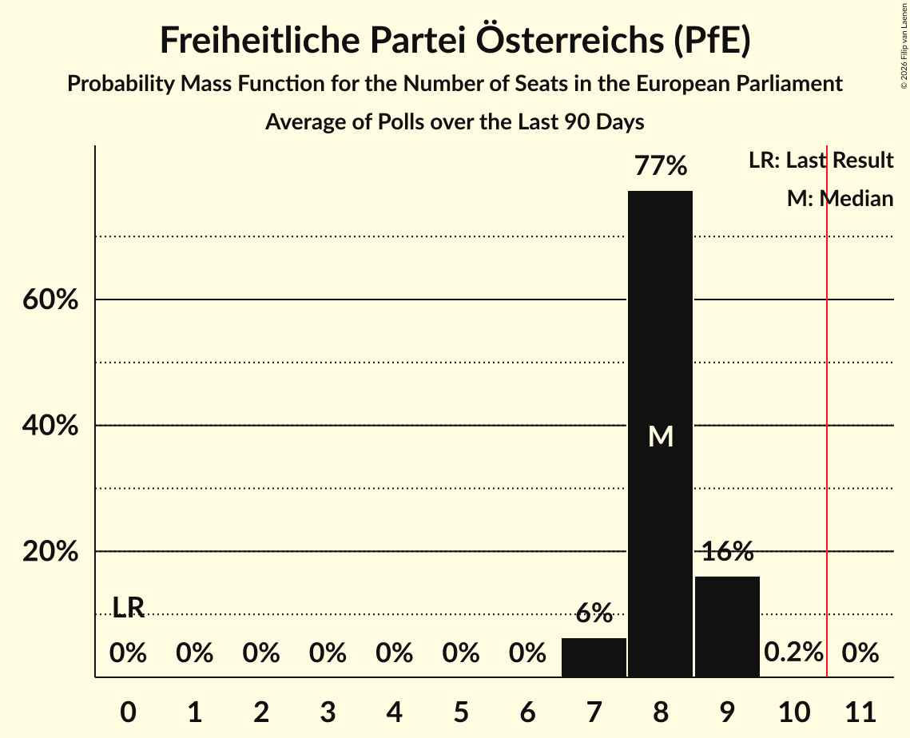

# Freiheitliche Partei Österreichs (PfE)

<a href="#voting-intentions">Voting Intentions</a> | <a href="#seats">Seats</a>

## Voting Intentions

Last result: **0.0%** (General Election of 9 June 2024)

### Confidence Intervals

| Period     | Polling firm/Commissioner(s) | Median | 80% Confidence Interval | 90% Confidence Interval | 95% Confidence Interval | 99% Confidence Interval |
|:----------:|:----------------:|:-----------:|:-----------------------:|:-----------------------:|:-----------------------:|:-----------------------:|
| N/A | [Poll Average](average.html) | 35.7% | 32.4–38.0% | 31.7–38.6% | 31.1–39.1% | 30.0–40.1% |
| [3–4 November 2025](2025-11-04-Market.html) | Market   ÖSTERREICH | 37.0% | 35.6–38.4% | 35.2–38.8% | 34.9–39.1% | 34.2–39.8% |
| [27–28 October 2025](2025-10-28-Market.html) | Market   ÖSTERREICH | 38.0% | 36.6–39.4% | 36.2–39.8% | 35.9–40.2% | 35.2–40.8% |
| [20–23 October 2025](2025-10-23-UniqueResearch.html) | Unique Research   Heute | 34.0% | 31.9–36.1% | 31.3–36.7% | 30.8–37.3% | 29.9–38.3% |
| [20–21 October 2025](2025-10-21-Market.html) | Market   ÖSTERREICH | 38.0% | N/A | N/A | N/A | N/A |
| [17–21 October 2025](2025-10-21-IFDD.html) | IFDD   Kronen Zeitung | 36.0% | 34.4–37.6% | 34.0–38.1% | 33.6–38.5% | 32.9–39.2% |
| [13–14 October 2025](2025-10-14-Market.html) | Market   ÖSTERREICH | 38.0% | 36.6–39.4% | 36.2–39.8% | 35.9–40.2% | 35.2–40.8% |
| [6–7 October 2025](2025-10-07-Market.html) | Market   ÖSTERREICH | 38.0% | 36.6–39.4% | 36.2–39.8% | 35.9–40.2% | 35.2–40.8% |
| [29–30 September 2025](2025-09-30-Market.html) | Market   ÖSTERREICH | 36.0% | 34.6–37.4% | 34.2–37.8% | 33.9–38.1% | 33.3–38.8% |
| [15–16 September 2025](2025-09-16-Market.html) | Market   ÖSTERREICH | 36.0% | 34.6–37.4% | 34.2–37.8% | 33.9–38.1% | 33.3–38.8% |
| [10–12 September 2025](2025-09-12-IFDD.html) | IFDD   Kronen Zeitung | 36.0% | 34.3–37.7% | 33.9–38.2% | 33.5–38.6% | 32.7–39.4% |
| [11 September 2025](2025-09-11-OGM.html) | OGM   Servus TV | 32.9% | 31.2–34.9% | 30.6–35.5% | 30.2–36.0% | 29.3–36.9% |
| [8–9 September 2025](2025-09-09-Market.html) | Market   ÖSTERREICH | 36.0% | 34.6–37.4% | 34.2–37.8% | 33.9–38.1% | 33.3–38.8% |
| [1–2 September 2025](2025-09-02-Market.html) | Market   ÖSTERREICH | 36.0% | 34.6–37.4% | 34.2–37.8% | 33.9–38.1% | 33.3–38.8% |
| [15–27 August 2025](2025-08-27-INSA.html) | INSA   Exxpress | 37.0% | 35.1–39.0% | 34.5–39.6% | 34.0–40.0% | 33.2–41.0% |
| [24–30 July 2025](2025-07-30-Market.html) | Market   Der Standard | 35.1% | 33.0–37.3% | 32.4–37.9% | 31.8–38.4% | 30.8–39.5% |
| [14–17 July 2025](2025-07-17-INSA.html) | INSA   Exxpress | 37.0% | 35.1–39.0% | 34.5–39.6% | 34.0–40.0% | 33.2–41.0% |
| [6–7 June 2025](2025-06-07-IFDD.html) | IFDD   Kronen Zeitung | 32.0% | 30.3–33.7% | 29.9–34.2% | 29.5–34.6% | 28.7–35.5% |
| [2–5 June 2025](2025-06-05-UniqueResearch.html) | Unique Research   Heute | 31.0% | 29.0–33.2% | 28.4–33.8% | 27.9–34.3% | 26.9–35.3% |
| [28 May–3 June 2025](2025-06-03-Market.html) | Market   Standard | 34.0% | 31.9–36.2% | 31.3–36.8% | 30.8–37.3% | 29.8–38.3% |
| [5–27 May 2025](2025-05-27-Market.html) | Market   ÖSTERREICH | 34.0% | 32.7–35.4% | 32.3–35.8% | 31.9–36.1% | 31.3–36.8% |
| [23–26 May 2025](2025-05-26-OGM.html) | OGM   KURIER | 32.0% | 30.2–34.0% | 29.7–34.5% | 29.2–35.0% | 28.4–35.9% |
| [19–21 May 2025](2025-05-21-INSA.html) | INSA   Exxpress | 36.0% | 34.1–38.0% | 33.5–38.5% | 33.1–39.0% | 32.2–40.0% |
| [12–19 May 2025](2025-05-19-Market.html) | Market   ÖSTERREICH | 34.0% | 32.7–35.4% | 32.3–35.8% | 31.9–36.1% | 31.3–36.8% |
| [5–13 May 2025](2025-05-13-Market.html) | Market   ÖSTERREICH | 34.0% | 32.7–35.4% | 32.3–35.8% | 31.9–36.1% | 31.3–36.8% |
| [18 April–6 May 2025](2025-05-06-Market.html) | Market   ÖSTERREICH | 33.0% | 31.7–34.4% | 31.3–34.8% | 31.0–35.1% | 30.3–35.8% |
| [18–29 April 2025](2025-04-29-Market.html) | Market   ÖSTERREICH | 33.0% | 31.7–34.4% | 31.3–34.8% | 31.0–35.1% | 30.3–35.8% |
| [14–22 April 2025](2025-04-22-Market.html) | Market   ÖSTERREICH | 34.0% | N/A | N/A | N/A | N/A |
| [14–16 April 2025](2025-04-16-INSA.html) | INSA   eXXpress | 34.0% | 32.1–36.0% | 31.6–36.5% | 31.1–37.0% | 30.2–38.0% |
| [7–15 April 2025](2025-04-15-Market.html) | Market   ÖSTERREICH | 34.0% | 32.7–35.4% | 32.3–35.8% | 31.9–36.1% | 31.3–36.8% |
| [4–9 April 2025](2025-04-09-OGM.html) | OGM   KURIER | 32.0% | 30.1–33.9% | 29.6–34.4% | 29.2–34.9% | 28.3–35.8% |
| [31 March–8 April 2025](2025-04-08-Market.html) | Market   ÖSTERREICH | 33.0% | N/A | N/A | N/A | N/A |
| [24 March–1 April 2025](2025-04-01-Market.html) | Market   ÖSTERREICH | 34.0% | N/A | N/A | N/A | N/A |
| [17–25 March 2025](2025-03-25-Market.html) | Market   ÖSTERREICH | 34.0% | N/A | N/A | N/A | N/A |
| [21–23 March 2025](2025-03-23-IFDD.html) | IFDD   NÖN | 32.0% | 30.2–33.9% | 29.7–34.4% | 29.2–34.9% | 28.4–35.8% |
| [17–18 March 2025](2025-03-18-Market.html) | Market   ÖSTERREICH | 33.0% | 31.7–34.4% | 31.3–34.8% | 31.0–35.1% | 30.3–35.8% |
| [3–11 March 2025](2025-03-11-Market.html) | Market   ÖSTERREICH | 33.0% | 31.7–34.4% | 31.3–34.8% | 31.0–35.1% | 30.3–35.8% |
| [5–7 March 2025](2025-03-07-Market.html) | Market   Der Standard | 32.0% | N/A | N/A | N/A | N/A |
| [24 February–4 March 2025](2025-03-04-Market.html) | Market   ÖSTERREICH | 34.0% | N/A | N/A | N/A | N/A |
| [24–26 February 2025](2025-02-26-INSA.html) | INSA   Exxpress | 34.0% | 32.1–36.0% | 31.6–36.5% | 31.1–37.0% | 30.2–38.0% |
| [24–25 February 2025](2025-02-25-Market.html) | Market   ÖSTERREICH | 35.0% | 33.6–36.4% | 33.3–36.8% | 32.9–37.1% | 32.3–37.8% |
| [17–18 February 2025](2025-02-18-OGM.html) | OGM   Servus TV | 34.0% | 32.1–36.0% | 31.5–36.6% | 31.0–37.1% | 30.1–38.1% |
| [17–18 February 2025](2025-02-18-Market.html) | Market   ÖSTERREICH | 34.0% | 32.7–35.4% | 32.3–35.8% | 31.9–36.1% | 31.3–36.8% |
| [13–15 February 2025](2025-02-15-IFDD.html) | IFDD   Puls 24 | 33.0% | 31.4–34.8% | 30.9–35.3% | 30.5–35.7% | 29.7–36.5% |
| [13–14 February 2025](2025-02-14-Spectra.html) | Spectra   Kleine Zeitung | 34.7% | 32.8–36.6% | 32.2–37.2% | 31.8–37.7% | 30.9–38.6% |
| [10–11 February 2025](2025-02-11-Market.html) | Market   ÖSTERREICH | 33.0% | 31.7–34.4% | 31.3–34.8% | 31.0–35.1% | 30.3–35.8% |
| [3–4 February 2025](2025-02-04-Market.html) | Market   ÖSTERREICH | 34.0% | N/A | N/A | N/A | N/A |
| [20–28 January 2025](2025-01-28-Market.html) | Market   ÖSTERREICH | 34.0% | 32.7–35.4% | 32.3–35.8% | 31.9–36.1% | 31.3–36.8% |
| [20–21 January 2025](2025-01-21-Market.html) | Market   ÖSTERREICH | 35.0% | 33.6–36.4% | 33.3–36.8% | 32.9–37.1% | 32.3–37.8% |
| [13–15 January 2025](2025-01-15-INSA.html) | INSA   eXXpress | 35.0% | 33.1–37.0% | 32.6–37.5% | 32.1–38.0% | 31.2–39.0% |
| [13–14 January 2025](2025-01-14-Market.html) | Market   ÖSTERREICH | 38.0% | 36.6–39.4% | 36.2–39.8% | 35.9–40.2% | 35.2–40.8% |
| [7–8 January 2025](2025-01-08-Market.html) | Market   ÖSTERREICH | 39.0% | 37.1–41.0% | 36.5–41.6% | 36.0–42.1% | 35.1–43.0% |
| [3–4 January 2025](2025-01-04-IFDD.html) | IFDD   Kronen Zeitung | 37.0% | 35.3–38.8% | 34.8–39.3% | 34.4–39.8% | 33.6–40.6% |
| [17–18 December 2024](2024-12-18-IFDD.html) | IFDD   Kronen Zeitung | 37.0% | 35.3–38.8% | 34.8–39.3% | 34.4–39.8% | 33.6–40.6% |
| [16–17 December 2024](2024-12-17-Market.html) | Market   ÖSTERREICH | 36.0% | 34.6–37.4% | 34.2–37.8% | 33.9–38.1% | 33.3–38.8% |
| [9–10 December 2024](2024-12-10-Market.html) | Market   ÖSTERREICH | 36.0% | N/A | N/A | N/A | N/A |
| [2–4 December 2024](2024-12-04-UniqueResearch.html) | Unique Research   Heute | 35.0% | 32.9–37.2% | 32.3–37.8% | 31.8–38.4% | 30.8–39.4% |
| [2–4 December 2024](2024-12-04-INSA.html) | INSA   eXXpress | 34.0% | 32.1–35.9% | 31.6–36.5% | 31.1–37.0% | 30.2–37.9% |
| [2–3 December 2024](2024-12-03-Market.html) | Market   ÖSTERREICH | 35.0% | 33.6–36.4% | 33.3–36.8% | 32.9–37.1% | 32.3–37.8% |
| [25–26 November 2024](2024-11-26-OGM.html) | OGM | 32.0% | 30.2–33.9% | 29.7–34.5% | 29.2–35.0% | 28.4–35.9% |
| [25–26 November 2024](2024-11-26-Market.html) | Market   ÖSTERREICH | 33.0% | 31.7–34.4% | 31.3–34.8% | 31.0–35.1% | 30.3–35.8% |
| [18–19 November 2024](2024-11-19-Market.html) | Market   ÖSTERREICH | 32.0% | N/A | N/A | N/A | N/A |
| [11–13 November 2024](2024-11-13-INSA.html) | INSA   eXXpress | 32.0% | 30.1–33.9% | 29.6–34.5% | 29.2–35.0% | 28.3–35.9% |
| [11–12 November 2024](2024-11-12-Market.html) | Market   ÖSTERREICH | 33.0% | 31.7–34.4% | 31.3–34.8% | 31.0–35.1% | 30.3–35.8% |
| [4–5 November 2024](2024-11-05-Market.html) | Market   ÖSTERREICH | 34.0% | N/A | N/A | N/A | N/A |
| [28–29 October 2024](2024-10-29-Market.html) | Market   ÖSTERREICH | 33.0% | 31.7–34.4% | 31.3–34.8% | 31.0–35.1% | 30.3–35.8% |
| [25–28 October 2024](2024-10-28-OGM.html) | OGM   Servus TV | 32.0% | 30.2–34.0% | 29.7–34.5% | 29.2–35.0% | 28.4–35.9% |
| [21–22 October 2024](2024-10-22-Market.html) | Market   ÖSTERREICH | 33.0% | N/A | N/A | N/A | N/A |
| [14–15 October 2024](2024-10-15-Market.html) | Market   ÖSTERREICH | 32.0% | N/A | N/A | N/A | N/A |
| [7–8 October 2024](2024-10-08-Market.html) | Market   ÖSTERREICH | 33.0% | 31.7–34.4% | 31.3–34.8% | 31.0–35.1% | 30.3–35.8% |
| [30 September–1 October 2024](2024-10-01-Market.html) | Market   ÖSTERREICH | 30.0% | N/A | N/A | N/A | N/A |
| [19–22 September 2024](2024-09-22-IFDD.html) | IFDD   ATV, Kronen Zeitung and PULS 24 | 27.0% | 25.3–28.9% | 24.8–29.4% | 24.3–29.8% | 23.5–30.7% |
| [16–18 September 2024](2024-09-18-OGM.html) | OGM   Servus TV | 26.0% | 24.3–27.8% | 23.8–28.4% | 23.4–28.8% | 22.6–29.7% |
| [16–17 September 2024](2024-09-17-Market.html) | Market   Der Standard | 27.0% | 25.7–28.3% | 25.3–28.6% | 25.0–28.9% | 24.5–29.6% |
| [5–11 September 2024](2024-09-11-UniqueResearch.html) | Unique Research   Heute | 28.0% | 26.0–30.1% | 25.5–30.7% | 25.0–31.2% | 24.1–32.3% |
| [9–11 September 2024](2024-09-11-INSA.html) | INSA   eXXpress | 29.0% | 27.2–30.9% | 26.7–31.4% | 26.3–31.9% | 25.4–32.8% |
| [9–10 September 2024](2024-09-10-Market.html) | Market   ÖSTERREICH | 28.0% | N/A | N/A | N/A | N/A |
| [2–9 September 2024](2024-09-09-Spectra.html) | Spectra   Kleine Zeitung, OÖNachrichten and Salzburger Nachrichten | 27.0% | 25.3–28.9% | 24.8–29.4% | 24.3–29.8% | 23.5–30.7% |
| [2–6 September 2024](2024-09-06-IFDD.html) | IFDD   Kronen Zeitung | 27.0% | N/A | N/A | N/A | N/A |
| [28 August–4 September 2024](2024-09-04-UniqueResearch.html) | Unique Research   profil | 27.9% | N/A | N/A | N/A | N/A |
| [2–4 September 2024](2024-09-04-Market.html) | Market   ÖSTERREICH | 28.0% | N/A | N/A | N/A | N/A |
| [26 August–3 September 2024](2024-09-03-TripleM.html) | Triple M   News | 28.0% | 26.2–29.9% | 25.7–30.4% | 25.3–30.9% | 24.5–31.8% |
| [1–31 August 2024](2024-08-31-OGM.html) | OGM   Servus TV | 27.0% | 24.6–29.6% | 23.9–30.3% | 23.3–31.0% | 22.2–32.2% |
| [26–27 August 2024](2024-08-27-Market.html) | Market | 27.0% | 25.7–28.3% | 25.4–28.7% | 25.1–29.0% | 24.5–29.6% |
| [23–26 August 2024](2024-08-26-IFDD.html) | IFDD   Radio Content Austria | 27.0% | 25.2–28.8% | 24.7–29.4% | 24.2–29.8% | 23.4–30.8% |
| [19–22 August 2024](2024-08-22-OGM.html) | OGM   Servus TV | 27.0% | N/A | N/A | N/A | N/A |
| [19–20 August 2024](2024-08-20-Market.html) | Market   ÖSTERREICH | 29.0% | 27.7–30.3% | 27.4–30.7% | 27.1–31.0% | 26.4–31.7% |
| [5–7 August 2024](2024-08-07-INSA.html) | INSA   eXXpress | 31.0% | 29.2–32.9% | 28.7–33.5% | 28.2–33.9% | 27.3–34.9% |
| [5–6 August 2024](2024-08-06-Market.html) | Market   ÖSTERREICH | 27.0% | N/A | N/A | N/A | N/A |
| [22–30 July 2024](2024-07-30-Market.html) | Market   ÖSTERREICH | 27.0% | 25.7–28.3% | 25.4–28.7% | 25.1–29.0% | 24.5–29.6% |
| [25–26 July 2024](2024-07-26-IFDD.html) | IFDD   Radio Content Austria | 25.9% | 24.3–27.7% | 23.8–28.2% | 23.4–28.6% | 22.6–29.4% |
| [15–24 July 2024](2024-07-24-Market.html) | Market   ÖSTERREICH | 27.0% | N/A | N/A | N/A | N/A |
| [12–21 July 2024](2024-07-21-Spectra.html) | Spectra   Kleine Zeitung, OÖNachrichten and Salzburger Nachrichten | 27.0% | 25.3–28.9% | 24.8–29.4% | 24.3–29.8% | 23.5–30.7% |
| [8–12 July 2024](2024-07-12-UniqueResearch.html) | Unique Research   Kronen Zeitung | 28.0% | 26.2–29.9% | 25.7–30.4% | 25.3–30.9% | 24.5–31.8% |
| [8–11 July 2024](2024-07-11-Market.html) | Market   Der Standard | 27.0% | N/A | N/A | N/A | N/A |
| [8–10 July 2024](2024-07-10-Market.html) | Market   ÖSTERREICH | 28.0% | N/A | N/A | N/A | N/A |
| [1–2 July 2024](2024-07-02-Market.html) | Market | 27.0% | N/A | N/A | N/A | N/A |
| [24–26 June 2024](2024-06-26-OGM.html) | OGM   KURIER | 27.0% | 25.3–28.8% | 24.8–29.3% | 24.3–29.8% | 23.5–30.7% |
| [24–25 June 2024](2024-06-25-Market.html) | Market   ÖSTERREICH | 27.0% | N/A | N/A | N/A | N/A |
| [12–19 June 2024](2024-06-19-UniqueResearch.html) | Unique Research   profil | 27.0% | N/A | N/A | N/A | N/A |
| [10–19 June 2024](2024-06-19-Market.html) | Market   ÖSTERREICH | 25.0% | N/A | N/A | N/A | N/A |
| [10–13 June 2024](2024-06-13-UniqueResearch.html) | Unique Research   Heute | 28.0% | N/A | N/A | N/A | N/A |
| [10–11 June 2024](2024-06-11-OGM.html) | OGM   Servus TV | 27.0% | N/A | N/A | N/A | N/A |
| [10–11 June 2024](2024-06-11-Market.html) | Market   ÖSTERREICH | 26.0% | N/A | N/A | N/A | N/A |

### Probability Mass Function

The following table shows the probability mass function per percentage block of voting intentions for the [poll average](average.html) for Freiheitliche Partei Österreichs (PfE).

| Voting Intentions | Probability | Accumulated | Special Marks |
|:-----------------:|:-----------:|:-----------:|:-------------:|
| 0.0–0.5% | 0% | 100% | Last Result |
| 0.5–1.5% | 0% | 100% |  |
| 1.5–2.5% | 0% | 100% |  |
| 2.5–3.5% | 0% | 100% |  |
| 3.5–4.5% | 0% | 100% |  |
| 4.5–5.5% | 0% | 100% |  |
| 5.5–6.5% | 0% | 100% |  |
| 6.5–7.5% | 0% | 100% |  |
| 7.5–8.5% | 0% | 100% |  |
| 8.5–9.5% | 0% | 100% |  |
| 9.5–10.5% | 0% | 100% |  |
| 10.5–11.5% | 0% | 100% |  |
| 11.5–12.5% | 0% | 100% |  |
| 12.5–13.5% | 0% | 100% |  |
| 13.5–14.5% | 0% | 100% |  |
| 14.5–15.5% | 0% | 100% |  |
| 15.5–16.5% | 0% | 100% |  |
| 16.5–17.5% | 0% | 100% |  |
| 17.5–18.5% | 0% | 100% |  |
| 18.5–19.5% | 0% | 100% |  |
| 19.5–20.5% | 0% | 100% |  |
| 20.5–21.5% | 0% | 100% |  |
| 21.5–22.5% | 0% | 100% |  |
| 22.5–23.5% | 0% | 100% |  |
| 23.5–24.5% | 0% | 100% |  |
| 24.5–25.5% | 0% | 100% |  |
| 25.5–26.5% | 0% | 100% |  |
| 26.5–27.5% | 0% | 100% |  |
| 27.5–28.5% | 0% | 100% |  |
| 28.5–29.5% | 0.2% | 100% |  |
| 29.5–30.5% | 1.0% | 99.8% |  |
| 30.5–31.5% | 3% | 98.8% |  |
| 31.5–32.5% | 7% | 96% |  |
| 32.5–33.5% | 10% | 89% |  |
| 33.5–34.5% | 12% | 79% |  |
| 34.5–35.5% | 14% | 67% |  |
| 35.5–36.5% | 19% | 52% | Median |
| 36.5–37.5% | 18% | 34% |  |
| 37.5–38.5% | 11% | 16% |  |
| 38.5–39.5% | 4% | 5% |  |
| 39.5–40.5% | 1.0% | 1.2% |  |
| 40.5–41.5% | 0.2% | 0.2% |  |
| 41.5–42.5% | 0% | 0% |  |

## Seats

Last result: **0** seats (General Election of 9 June 2024)

### Confidence Intervals

| Period     | Polling firm/Commissioner(s) | Median | 80% Confidence Interval | 90% Confidence Interval | 95% Confidence Interval | 99% Confidence Interval |
|:----------:|:----------------:|:------:|:-----------------------:|:-----------------------:|:-----------------------:|:-----------------------:|
| N/A | [Poll Average](average.html) | 8 | 7–9 | 7–9 | 7–9 | 6–9 |
| [3–4 November 2025](2025-11-04-Market.html) | Market   ÖSTERREICH | 8 | 8–9 | 8–9 | 8–9 | 7–9 |
| [27–28 October 2025](2025-10-28-Market.html) | Market   ÖSTERREICH | 9 | 8–9 | 8–9 | 8–9 | 8–10 |
| [20–23 October 2025](2025-10-23-UniqueResearch.html) | Unique Research   Heute | 7 | 7–8 | 7–8 | 7–8 | 6–9 |
| [20–21 October 2025](2025-10-21-Market.html) | Market   ÖSTERREICH |  |  |  |  |  |
| [17–21 October 2025](2025-10-21-IFDD.html) | IFDD   Kronen Zeitung | 8 | 7–8 | 7–9 | 7–9 | 7–9 |
| [13–14 October 2025](2025-10-14-Market.html) | Market   ÖSTERREICH | 9 | 8–9 | 8–9 | 8–9 | 8–9 |
| [6–7 October 2025](2025-10-07-Market.html) | Market   ÖSTERREICH | 9 | 8–9 | 8–9 | 8–9 | 8–9 |
| [29–30 September 2025](2025-09-30-Market.html) | Market   ÖSTERREICH | 8 | 8 | 8–9 | 8–9 | 7–9 |
| [15–16 September 2025](2025-09-16-Market.html) | Market   ÖSTERREICH | 8 | 8–9 | 8–9 | 8–9 | 7–9 |
| [10–12 September 2025](2025-09-12-IFDD.html) | IFDD   Kronen Zeitung | 8 | 7–8 | 7–8 | 7–9 | 7–9 |
| [11 September 2025](2025-09-11-OGM.html) | OGM   Servus TV | 7 | 7–8 | 7–8 | 7–8 | 6–8 |
| [8–9 September 2025](2025-09-09-Market.html) | Market   ÖSTERREICH | 8 | 8–9 | 8–9 | 8–9 | 7–9 |
| [1–2 September 2025](2025-09-02-Market.html) | Market   ÖSTERREICH | 8 | 8 | 7–8 | 7–8 | 7–9 |
| [15–27 August 2025](2025-08-27-INSA.html) | INSA   Exxpress | 8 | 8–9 | 7–9 | 7–9 | 7–9 |
| [24–30 July 2025](2025-07-30-Market.html) | Market   Der Standard | 8 | 7–8 | 7–8 | 7–9 | 7–9 |
| [14–17 July 2025](2025-07-17-INSA.html) | INSA   Exxpress | 8 | 8–9 | 7–9 | 7–9 | 7–9 |
| [6–7 June 2025](2025-06-07-IFDD.html) | IFDD   Kronen Zeitung | 7 | 7 | 6–7 | 6–8 | 6–8 |
| [2–5 June 2025](2025-06-05-UniqueResearch.html) | Unique Research   Heute | 7 | 6–7 | 6–7 | 6–8 | 6–8 |
| [28 May–3 June 2025](2025-06-03-Market.html) | Market   Standard | 7 | 7–8 | 7–8 | 7–8 | 6–9 |
| [5–27 May 2025](2025-05-27-Market.html) | Market   ÖSTERREICH | 8 | 7–8 | 7–8 | 7–8 | 7–8 |
| [23–26 May 2025](2025-05-26-OGM.html) | OGM   KURIER | 7 | 6–7 | 6–8 | 6–8 | 6–8 |
| [19–21 May 2025](2025-05-21-INSA.html) | INSA   Exxpress | 8 | 7–8 | 7–9 | 7–9 | 7–9 |
| [12–19 May 2025](2025-05-19-Market.html) | Market   ÖSTERREICH | 8 | 7–8 | 7–8 | 7–8 | 7–8 |
| [5–13 May 2025](2025-05-13-Market.html) | Market   ÖSTERREICH | 7 | 7–8 | 7–8 | 7–8 | 7–8 |
| [18 April–6 May 2025](2025-05-06-Market.html) | Market   ÖSTERREICH | 7 | 7–8 | 7–8 | 7–8 | 7–8 |
| [18–29 April 2025](2025-04-29-Market.html) | Market   ÖSTERREICH | 7 | 7–8 | 7–8 | 7–8 | 6–8 |
| [14–22 April 2025](2025-04-22-Market.html) | Market   ÖSTERREICH |  |  |  |  |  |
| [14–16 April 2025](2025-04-16-INSA.html) | INSA   eXXpress | 8 | 7–8 | 7–8 | 7–8 | 7–9 |
| [7–15 April 2025](2025-04-15-Market.html) | Market   ÖSTERREICH | 8 | 7–8 | 7–8 | 7–8 | 7–8 |
| [4–9 April 2025](2025-04-09-OGM.html) | OGM   KURIER | 7 | 6–7 | 6–8 | 6–8 | 6–8 |
| [31 March–8 April 2025](2025-04-08-Market.html) | Market   ÖSTERREICH |  |  |  |  |  |
| [24 March–1 April 2025](2025-04-01-Market.html) | Market   ÖSTERREICH |  |  |  |  |  |
| [17–25 March 2025](2025-03-25-Market.html) | Market   ÖSTERREICH |  |  |  |  |  |
| [21–23 March 2025](2025-03-23-IFDD.html) | IFDD   NÖN | 7 | 6–7 | 6–7 | 6–8 | 6–8 |
| [17–18 March 2025](2025-03-18-Market.html) | Market   ÖSTERREICH | 7 | 7–8 | 7–8 | 7–8 | 7–8 |
| [3–11 March 2025](2025-03-11-Market.html) | Market   ÖSTERREICH | 7 | 7–8 | 7–8 | 7–8 | 7–8 |
| [5–7 March 2025](2025-03-07-Market.html) | Market   Der Standard |  |  |  |  |  |
| [24 February–4 March 2025](2025-03-04-Market.html) | Market   ÖSTERREICH |  |  |  |  |  |
| [24–26 February 2025](2025-02-26-INSA.html) | INSA   Exxpress | 7 | 7–8 | 6–8 | 6–8 | 6–8 |
| [24–25 February 2025](2025-02-25-Market.html) | Market   ÖSTERREICH | 8 | 7–8 | 7–8 | 7–8 | 7–9 |
| [17–18 February 2025](2025-02-18-OGM.html) | OGM   Servus TV | 7 | 7–8 | 7–8 | 7–8 | 6–8 |
| [17–18 February 2025](2025-02-18-Market.html) | Market   ÖSTERREICH | 7 | 7–8 | 7–8 | 7–8 | 7–8 |
| [13–15 February 2025](2025-02-15-IFDD.html) | IFDD   Puls 24 | 7 | 7–8 | 7–8 | 7–8 | 6–8 |
| [13–14 February 2025](2025-02-14-Spectra.html) | Spectra   Kleine Zeitung | 8 | 7–8 | 7–8 | 7–8 | 7–9 |
| [10–11 February 2025](2025-02-11-Market.html) | Market   ÖSTERREICH | 7 | 7 | 7–8 | 7–8 | 7–8 |
| [3–4 February 2025](2025-02-04-Market.html) | Market   ÖSTERREICH |  |  |  |  |  |
| [20–28 January 2025](2025-01-28-Market.html) | Market   ÖSTERREICH | 7 | 7–8 | 7–8 | 7–8 | 7–8 |
| [20–21 January 2025](2025-01-21-Market.html) | Market   ÖSTERREICH | 8 | 7–8 | 7–8 | 7–8 | 7–9 |
| [13–15 January 2025](2025-01-15-INSA.html) | INSA   eXXpress | 8 | 7–8 | 7–8 | 7–8 | 7–8 |
| [13–14 January 2025](2025-01-14-Market.html) | Market   ÖSTERREICH | 8 | 8–9 | 8–9 | 8–9 | 8–9 |
| [7–8 January 2025](2025-01-08-Market.html) | Market   ÖSTERREICH | 9 | 8–9 | 8–9 | 8–9 | 8–10 |
| [3–4 January 2025](2025-01-04-IFDD.html) | IFDD   Kronen Zeitung | 8 | 8–9 | 8–9 | 7–9 | 7–9 |
| [17–18 December 2024](2024-12-18-IFDD.html) | IFDD   Kronen Zeitung | 8 | 8–9 | 8–9 | 7–9 | 7–9 |
| [16–17 December 2024](2024-12-17-Market.html) | Market   ÖSTERREICH | 8 | 8–9 | 8–9 | 7–9 | 7–9 |
| [9–10 December 2024](2024-12-10-Market.html) | Market   ÖSTERREICH |  |  |  |  |  |
| [2–4 December 2024](2024-12-04-UniqueResearch.html) | Unique Research   Heute | 8 | 7–8 | 7–9 | 7–9 | 7–9 |
| [2–4 December 2024](2024-12-04-INSA.html) | INSA   eXXpress | 8 | 7–8 | 7–8 | 7–8 | 7–9 |
| [2–3 December 2024](2024-12-03-Market.html) | Market   ÖSTERREICH | 8 | 8 | 7–9 | 7–9 | 7–9 |
| [25–26 November 2024](2024-11-26-OGM.html) | OGM | 7 | 6–7 | 6–7 | 6–8 | 6–8 |
| [25–26 November 2024](2024-11-26-Market.html) | Market   ÖSTERREICH | 7 | 7–8 | 7–8 | 7–8 | 7–8 |
| [18–19 November 2024](2024-11-19-Market.html) | Market   ÖSTERREICH |  |  |  |  |  |
| [11–13 November 2024](2024-11-13-INSA.html) | INSA   eXXpress | 7 | 7–8 | 6–8 | 6–8 | 6–8 |
| [11–12 November 2024](2024-11-12-Market.html) | Market   ÖSTERREICH | 7 | 7–8 | 7–8 | 7–8 | 7–8 |
| [4–5 November 2024](2024-11-05-Market.html) | Market   ÖSTERREICH |  |  |  |  |  |
| [28–29 October 2024](2024-10-29-Market.html) | Market   ÖSTERREICH | 7 | 7–8 | 7–8 | 7–8 | 7–8 |
| [25–28 October 2024](2024-10-28-OGM.html) | OGM   Servus TV | 7 | 7–8 | 6–8 | 6–8 | 6–8 |
| [21–22 October 2024](2024-10-22-Market.html) | Market   ÖSTERREICH |  |  |  |  |  |
| [14–15 October 2024](2024-10-15-Market.html) | Market   ÖSTERREICH |  |  |  |  |  |
| [7–8 October 2024](2024-10-08-Market.html) | Market   ÖSTERREICH | 7 | 7–8 | 7–8 | 7–8 | 7–8 |
| [30 September–1 October 2024](2024-10-01-Market.html) | Market   ÖSTERREICH |  |  |  |  |  |
| [19–22 September 2024](2024-09-22-IFDD.html) | IFDD   ATV, Kronen Zeitung and PULS 24 | 6 | 6–7 | 5–7 | 5–7 | 5–7 |
| [16–18 September 2024](2024-09-18-OGM.html) | OGM   Servus TV | 6 | 5–6 | 5–6 | 5–7 | 5–7 |
| [16–17 September 2024](2024-09-17-Market.html) | Market   Der Standard | 6 | 6–7 | 6–7 | 6–7 | 5–7 |
| [5–11 September 2024](2024-09-11-UniqueResearch.html) | Unique Research   Heute | 6 | 6–7 | 6–7 | 5–7 | 5–7 |
| [9–11 September 2024](2024-09-11-INSA.html) | INSA   eXXpress | 7 | 6–7 | 6–7 | 6–7 | 6–8 |
| [9–10 September 2024](2024-09-10-Market.html) | Market   ÖSTERREICH |  |  |  |  |  |
| [2–9 September 2024](2024-09-09-Spectra.html) | Spectra   Kleine Zeitung, OÖNachrichten and Salzburger Nachrichten | 6 | 5–6 | 5–7 | 5–7 | 5–7 |
| [2–6 September 2024](2024-09-06-IFDD.html) | IFDD   Kronen Zeitung |  |  |  |  |  |
| [28 August–4 September 2024](2024-09-04-UniqueResearch.html) | Unique Research   profil |  |  |  |  |  |
| [2–4 September 2024](2024-09-04-Market.html) | Market   ÖSTERREICH |  |  |  |  |  |
| [26 August–3 September 2024](2024-09-03-TripleM.html) | Triple M   News | 6 | 6–7 | 6–7 | 5–7 | 5–7 |
| [1–31 August 2024](2024-08-31-OGM.html) | OGM   Servus TV | 6 | 5–7 | 5–7 | 5–7 | 5–7 |
| [26–27 August 2024](2024-08-27-Market.html) | Market | 6 | 6–7 | 6–7 | 6–7 | 5–7 |
| [23–26 August 2024](2024-08-26-IFDD.html) | IFDD   Radio Content Austria | 6 | 5–6 | 5–7 | 5–7 | 5–7 |
| [19–22 August 2024](2024-08-22-OGM.html) | OGM   Servus TV |  |  |  |  |  |
| [19–20 August 2024](2024-08-20-Market.html) | Market   ÖSTERREICH | 7 | 6–7 | 6–7 | 6–7 | 6–7 |
| [5–7 August 2024](2024-08-07-INSA.html) | INSA   eXXpress | 7 | 6–8 | 6–8 | 6–8 | 6–8 |
| [5–6 August 2024](2024-08-06-Market.html) | Market   ÖSTERREICH |  |  |  |  |  |
| [22–30 July 2024](2024-07-30-Market.html) | Market   ÖSTERREICH | 6 | 6 | 5–6 | 5–6 | 5–7 |
| [25–26 July 2024](2024-07-26-IFDD.html) | IFDD   Radio Content Austria | 6 | 5–6 | 5–6 | 5–6 | 5–6 |
| [15–24 July 2024](2024-07-24-Market.html) | Market   ÖSTERREICH |  |  |  |  |  |
| [12–21 July 2024](2024-07-21-Spectra.html) | Spectra   Kleine Zeitung, OÖNachrichten and Salzburger Nachrichten | 6 | 5–6 | 5–6 | 5–7 | 5–7 |
| [8–12 July 2024](2024-07-12-UniqueResearch.html) | Unique Research   Kronen Zeitung | 6 | 6–7 | 5–7 | 5–7 | 5–7 |
| [8–11 July 2024](2024-07-11-Market.html) | Market   Der Standard |  |  |  |  |  |
| [8–10 July 2024](2024-07-10-Market.html) | Market   ÖSTERREICH |  |  |  |  |  |
| [1–2 July 2024](2024-07-02-Market.html) | Market |  |  |  |  |  |
| [24–26 June 2024](2024-06-26-OGM.html) | OGM   KURIER | 6 | 5–6 | 5–7 | 5–7 | 5–7 |
| [24–25 June 2024](2024-06-25-Market.html) | Market   ÖSTERREICH |  |  |  |  |  |
| [12–19 June 2024](2024-06-19-UniqueResearch.html) | Unique Research   profil |  |  |  |  |  |
| [10–19 June 2024](2024-06-19-Market.html) | Market   ÖSTERREICH |  |  |  |  |  |
| [10–13 June 2024](2024-06-13-UniqueResearch.html) | Unique Research   Heute |  |  |  |  |  |
| [10–11 June 2024](2024-06-11-OGM.html) | OGM   Servus TV |  |  |  |  |  |
| [10–11 June 2024](2024-06-11-Market.html) | Market   ÖSTERREICH |  |  |  |  |  |

### Probability Mass Function

The following table shows the probability mass function per seat for the [poll average](average.html) for Freiheitliche Partei Österreichs (PfE).

| Number of Seats | Probability | Accumulated | Special Marks |
|:---------------:|:-----------:|:-----------:|:-------------:|
| 0 | 0% | 100% | Last Result |
| 1 | 0% | 100% |  |
| 2 | 0% | 100% |  |
| 3 | 0% | 100% |  |
| 4 | 0% | 100% |  |
| 5 | 0% | 100% |  |
| 6 | 0.8% | 100% |  |
| 7 | 32% | 99.2% |  |
| 8 | 55% | 67% | Median |
| 9 | 12% | 12% |  |
| 10 | 0% | 0% |  |

