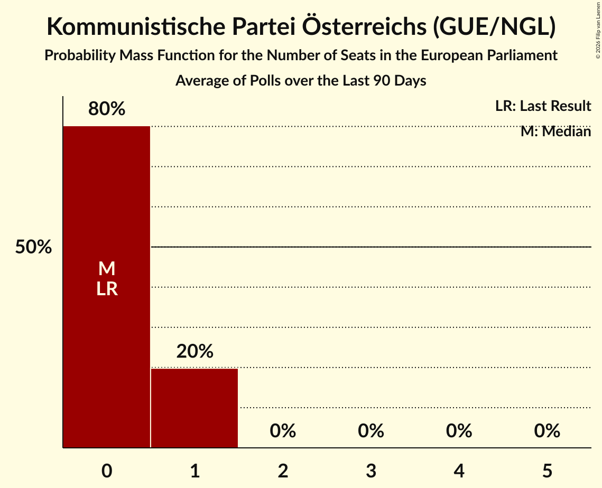

# Kommunistische Partei Österreichs (GUE/NGL)

<a href="#voting-intentions">Voting Intentions</a> | <a href="#seats">Seats</a>

## Voting Intentions

Last result: **0.0%** (General Election of 9 June 2024)

### Confidence Intervals

| Period     | Polling firm/Commissioner(s) | Median | 80% Confidence Interval | 90% Confidence Interval | 95% Confidence Interval | 99% Confidence Interval |
|:----------:|:----------------:|:-----------:|:-----------------------:|:-----------------------:|:-----------------------:|:-----------------------:|
| N/A | [Poll Average](average.html) | 2.8% | 1.8–3.5% | 1.6–3.7% | 1.4–3.9% | 1.2–4.3% |
| [13–15 January 2025](2025-01-15-INSA.html) | INSA   eXXpress | 0.0% | N/A | N/A | N/A | N/A |
| [13–14 January 2025](2025-01-14-Market.html) | Market   ÖSTERREICH | 3.0% | 2.6–3.6% | 2.4–3.7% | 2.3–3.9% | 2.1–4.1% |
| [7–8 January 2025](2025-01-08-Market.html) | Market   ÖSTERREICH | 3.0% | 2.4–3.8% | 2.2–4.1% | 2.1–4.3% | 1.9–4.7% |
| [3–4 January 2025](2025-01-04-IFDD.html) | IFDD   Kronen Zeitung | 3.0% | 2.5–3.8% | 2.3–4.0% | 2.2–4.1% | 2.0–4.5% |
| [17–18 December 2024](2024-12-18-IFDD.html) | IFDD   Kronen Zeitung | 3.0% | 2.5–3.8% | 2.3–4.0% | 2.2–4.1% | 2.0–4.5% |
| [16–17 December 2024](2024-12-17-Market.html) | Market   ÖSTERREICH | 3.0% | 2.6–3.6% | 2.4–3.7% | 2.3–3.9% | 2.1–4.1% |
| [9–10 December 2024](2024-12-10-Market.html) | Market   ÖSTERREICH | 3.0% | N/A | N/A | N/A | N/A |
| [2–4 December 2024](2024-12-04-UniqueResearch.html) | Unique Research   Heute | 2.0% | 1.5–2.8% | 1.4–3.0% | 1.2–3.2% | 1.0–3.7% |
| [2–4 December 2024](2024-12-04-INSA.html) | INSA   eXXpress | 3.0% | 2.4–3.8% | 2.2–4.0% | 2.1–4.2% | 1.8–4.7% |
| [2–3 December 2024](2024-12-03-Market.html) | Market   ÖSTERREICH | 4.0% | 3.5–4.6% | 3.3–4.8% | 3.2–5.0% | 3.0–5.3% |
| [25–26 November 2024](2024-11-26-OGM.html) | OGM | 0.0% | N/A | N/A | N/A | N/A |
| [25–26 November 2024](2024-11-26-Market.html) | Market   ÖSTERREICH | 4.0% | 3.5–4.6% | 3.3–4.8% | 3.2–5.0% | 3.0–5.3% |
| [18–19 November 2024](2024-11-19-Market.html) | Market   ÖSTERREICH | 3.0% | N/A | N/A | N/A | N/A |
| [11–13 November 2024](2024-11-13-INSA.html) | INSA   eXXpress | 2.0% | 1.5–2.7% | 1.4–2.9% | 1.3–3.1% | 1.1–3.4% |
| [11–12 November 2024](2024-11-12-Market.html) | Market   ÖSTERREICH | 3.0% | 2.6–3.6% | 2.4–3.7% | 2.3–3.9% | 2.1–4.1% |
| [4–5 November 2024](2024-11-05-Market.html) | Market   ÖSTERREICH | 3.0% | N/A | N/A | N/A | N/A |
| [28–29 October 2024](2024-10-29-Market.html) | Market   ÖSTERREICH | 3.0% | 2.6–3.6% | 2.4–3.7% | 2.3–3.9% | 2.1–4.1% |
| [25–28 October 2024](2024-10-28-OGM.html) | OGM   Servus TV | 2.0% | 1.5–2.7% | 1.4–2.9% | 1.3–3.0% | 1.1–3.4% |
| [21–22 October 2024](2024-10-22-Market.html) | Market   ÖSTERREICH | 4.0% | N/A | N/A | N/A | N/A |
| [14–15 October 2024](2024-10-15-Market.html) | Market   ÖSTERREICH | 3.0% | N/A | N/A | N/A | N/A |
| [7–8 October 2024](2024-10-08-Market.html) | Market   ÖSTERREICH | 2.0% | 1.6–2.5% | 1.6–2.6% | 1.5–2.7% | 1.3–3.0% |
| [30 September–1 October 2024](2024-10-01-Market.html) | Market   ÖSTERREICH | 2.0% | N/A | N/A | N/A | N/A |
| [19–22 September 2024](2024-09-22-IFDD.html) | IFDD   ATV, Kronen Zeitung and PULS 24 | 3.0% | 2.4–3.8% | 2.2–4.1% | 2.1–4.3% | 1.9–4.7% |
| [16–18 September 2024](2024-09-18-OGM.html) | OGM   Servus TV | 3.0% | 2.4–3.8% | 2.3–4.1% | 2.1–4.3% | 1.9–4.7% |
| [16–17 September 2024](2024-09-17-Market.html) | Market   Der Standard | 3.0% | 3.5–4.6% | 3.3–4.8% | 3.2–5.0% | 3.0–5.3% |
| [5–11 September 2024](2024-09-11-UniqueResearch.html) | Unique Research   Heute | 3.0% | 2.3–3.9% | 2.2–4.2% | 2.0–4.4% | 1.8–4.9% |
| [9–11 September 2024](2024-09-11-INSA.html) | INSA   eXXpress | 3.0% | 2.4–3.8% | 2.2–4.1% | 2.1–4.3% | 1.9–4.7% |
| [9–10 September 2024](2024-09-10-Market.html) | Market   ÖSTERREICH | 3.0% | N/A | N/A | N/A | N/A |
| [2–9 September 2024](2024-09-09-Spectra.html) | Spectra   Kleine Zeitung, OÖNachrichten and Salzburger Nachrichten | 3.0% | 2.4–3.8% | 2.2–4.1% | 2.1–4.3% | 1.9–4.7% |
| [2–6 September 2024](2024-09-06-IFDD.html) | IFDD   Kronen Zeitung | 3.0% | N/A | N/A | N/A | N/A |
| [28 August–4 September 2024](2024-09-04-UniqueResearch.html) | Unique Research   profil | 3.0% | N/A | N/A | N/A | N/A |
| [2–4 September 2024](2024-09-04-Market.html) | Market   ÖSTERREICH | 3.0% | N/A | N/A | N/A | N/A |
| [26 August–3 September 2024](2024-09-03-TripleM.html) | Triple M   News | 3.5% | 2.9–4.4% | 2.7–4.6% | 2.5–4.8% | 2.2–5.3% |
| [1–31 August 2024](2024-08-31-OGM.html) | OGM   Servus TV | 3.1% | 2.3–4.3% | 2.1–4.6% | 1.9–5.0% | 1.6–5.6% |
| [26–27 August 2024](2024-08-27-Market.html) | Market | 3.0% | 2.6–3.6% | 2.4–3.7% | 2.3–3.9% | 2.1–4.1% |
| [23–26 August 2024](2024-08-26-IFDD.html) | IFDD   Radio Content Austria | 2.0% | 1.5–2.7% | 1.4–2.9% | 1.2–3.0% | 1.1–3.4% |
| [19–22 August 2024](2024-08-22-OGM.html) | OGM   Servus TV | 2.0% | N/A | N/A | N/A | N/A |
| [19–20 August 2024](2024-08-20-Market.html) | Market   ÖSTERREICH | 2.0% | 1.6–2.5% | 1.6–2.6% | 1.5–2.7% | 1.3–3.0% |
| [5–7 August 2024](2024-08-07-INSA.html) | INSA   eXXpress | 2.0% | 1.5–2.7% | 1.4–2.9% | 1.3–3.1% | 1.1–3.4% |
| [5–6 August 2024](2024-08-06-Market.html) | Market   ÖSTERREICH | 2.0% | N/A | N/A | N/A | N/A |
| [22–30 July 2024](2024-07-30-Market.html) | Market   ÖSTERREICH | 3.0% | 2.6–3.6% | 2.4–3.7% | 2.3–3.9% | 2.1–4.1% |
| [25–26 July 2024](2024-07-26-IFDD.html) | IFDD   Radio Content Austria | 3.0% | 2.4–3.8% | 2.3–4.0% | 2.1–4.2% | 1.9–4.6% |
| [15–24 July 2024](2024-07-24-Market.html) | Market   ÖSTERREICH | 3.0% | N/A | N/A | N/A | N/A |
| [12–21 July 2024](2024-07-21-Spectra.html) | Spectra   Kleine Zeitung, OÖNachrichten and Salzburger Nachrichten | 4.0% | 3.3–4.9% | 3.1–5.2% | 2.9–5.4% | 2.7–5.9% |
| [8–12 July 2024](2024-07-12-UniqueResearch.html) | Unique Research   Kronen Zeitung | 4.0% | 3.3–4.9% | 3.1–5.2% | 2.9–5.4% | 2.7–5.9% |
| [8–11 July 2024](2024-07-11-Market.html) | Market   Der Standard | 2.9% | N/A | N/A | N/A | N/A |
| [8–10 July 2024](2024-07-10-Market.html) | Market   ÖSTERREICH | 3.0% | N/A | N/A | N/A | N/A |
| [1–2 July 2024](2024-07-02-Market.html) | Market | 2.0% | N/A | N/A | N/A | N/A |
| [24–26 June 2024](2024-06-26-OGM.html) | OGM   KURIER | 3.0% | 2.4–3.8% | 2.3–4.1% | 2.1–4.3% | 1.9–4.7% |
| [24–25 June 2024](2024-06-25-Market.html) | Market   ÖSTERREICH | 2.0% | N/A | N/A | N/A | N/A |
| [12–19 June 2024](2024-06-19-UniqueResearch.html) | Unique Research   profil | 2.0% | N/A | N/A | N/A | N/A |
| [10–19 June 2024](2024-06-19-Market.html) | Market   ÖSTERREICH | 3.0% | N/A | N/A | N/A | N/A |
| [10–13 June 2024](2024-06-13-UniqueResearch.html) | Unique Research   Heute | 2.0% | N/A | N/A | N/A | N/A |
| [10–11 June 2024](2024-06-11-OGM.html) | OGM   Servus TV | 3.0% | N/A | N/A | N/A | N/A |
| [10–11 June 2024](2024-06-11-Market.html) | Market   ÖSTERREICH | 3.0% | N/A | N/A | N/A | N/A |

### Probability Mass Function

The following table shows the probability mass function per percentage block of voting intentions for the [poll average](average.html) for Kommunistische Partei Österreichs (GUE/NGL).

| Voting Intentions | Probability | Accumulated | Special Marks |
|:-----------------:|:-----------:|:-----------:|:-------------:|
| 0.0–0.5% | 0% | 100% | Last Result |
| 0.5–1.5% | 4% | 100% |  |
| 1.5–2.5% | 30% | 96% |  |
| 2.5–3.5% | 57% | 66% | Median |
| 3.5–4.5% | 10% | 10% |  |
| 4.5–5.5% | 0.1% | 0.1% |  |
| 5.5–6.5% | 0% | 0% |  |

## Seats

Last result: **0** seats (General Election of 9 June 2024)

### Confidence Intervals

| Period     | Polling firm/Commissioner(s) | Median | 80% Confidence Interval | 90% Confidence Interval | 95% Confidence Interval | 99% Confidence Interval |
|:----------:|:----------------:|:------:|:-----------------------:|:-----------------------:|:-----------------------:|:-----------------------:|
| N/A | [Poll Average](average.html) | 0 | 0 | 0 | 0 | 0–1 |
| [13–15 January 2025](2025-01-15-INSA.html) | INSA   eXXpress |  |  |  |  |  |
| [13–14 January 2025](2025-01-14-Market.html) | Market   ÖSTERREICH | 0 | 0 | 0 | 0 | 0 |
| [7–8 January 2025](2025-01-08-Market.html) | Market   ÖSTERREICH | 0 | 0 | 0 | 0 | 0–1 |
| [3–4 January 2025](2025-01-04-IFDD.html) | IFDD   Kronen Zeitung | 0 | 0 | 0 | 0 | 0–1 |
| [17–18 December 2024](2024-12-18-IFDD.html) | IFDD   Kronen Zeitung | 0 | 0 | 0 | 0 | 0–1 |
| [16–17 December 2024](2024-12-17-Market.html) | Market   ÖSTERREICH | 0 | 0 | 0 | 0 | 0 |
| [9–10 December 2024](2024-12-10-Market.html) | Market   ÖSTERREICH |  |  |  |  |  |
| [2–4 December 2024](2024-12-04-UniqueResearch.html) | Unique Research   Heute | 0 | 0 | 0 | 0 | 0 |
| [2–4 December 2024](2024-12-04-INSA.html) | INSA   eXXpress | 0 | 0 | 0 | 0–1 | 0–1 |
| [2–3 December 2024](2024-12-03-Market.html) | Market   ÖSTERREICH | 0 | 0–1 | 0–1 | 0–1 | 0–1 |
| [25–26 November 2024](2024-11-26-OGM.html) | OGM |  |  |  |  |  |
| [25–26 November 2024](2024-11-26-Market.html) | Market   ÖSTERREICH | 0 | 0–1 | 0–1 | 0–1 | 0–1 |
| [18–19 November 2024](2024-11-19-Market.html) | Market   ÖSTERREICH |  |  |  |  |  |
| [11–13 November 2024](2024-11-13-INSA.html) | INSA   eXXpress | 0 | 0 | 0 | 0 | 0 |
| [11–12 November 2024](2024-11-12-Market.html) | Market   ÖSTERREICH | 0 | 0 | 0 | 0 | 0 |
| [4–5 November 2024](2024-11-05-Market.html) | Market   ÖSTERREICH |  |  |  |  |  |
| [28–29 October 2024](2024-10-29-Market.html) | Market   ÖSTERREICH | 0 | 0 | 0 | 0 | 0 |
| [25–28 October 2024](2024-10-28-OGM.html) | OGM   Servus TV | 0 | 0 | 0 | 0 | 0 |
| [21–22 October 2024](2024-10-22-Market.html) | Market   ÖSTERREICH |  |  |  |  |  |
| [14–15 October 2024](2024-10-15-Market.html) | Market   ÖSTERREICH |  |  |  |  |  |
| [7–8 October 2024](2024-10-08-Market.html) | Market   ÖSTERREICH | 0 | 0 | 0 | 0 | 0 |
| [30 September–1 October 2024](2024-10-01-Market.html) | Market   ÖSTERREICH |  |  |  |  |  |
| [19–22 September 2024](2024-09-22-IFDD.html) | IFDD   ATV, Kronen Zeitung and PULS 24 | 0 | 0 | 0–1 | 0–1 | 0–1 |
| [16–18 September 2024](2024-09-18-OGM.html) | OGM   Servus TV | 0 | 0 | 0 | 0–1 | 0–1 |
| [16–17 September 2024](2024-09-17-Market.html) | Market   Der Standard | 0 | 0–1 | 0–1 | 0–1 | 0–1 |
| [5–11 September 2024](2024-09-11-UniqueResearch.html) | Unique Research   Heute | 0 | 0 | 0 | 0–1 | 0–1 |
| [9–11 September 2024](2024-09-11-INSA.html) | INSA   eXXpress | 0 | 0 | 0 | 0–1 | 0–1 |
| [9–10 September 2024](2024-09-10-Market.html) | Market   ÖSTERREICH |  |  |  |  |  |
| [2–9 September 2024](2024-09-09-Spectra.html) | Spectra   Kleine Zeitung, OÖNachrichten and Salzburger Nachrichten | 0 | 0 | 0 | 0–1 | 0–1 |
| [2–6 September 2024](2024-09-06-IFDD.html) | IFDD   Kronen Zeitung |  |  |  |  |  |
| [28 August–4 September 2024](2024-09-04-UniqueResearch.html) | Unique Research   profil |  |  |  |  |  |
| [2–4 September 2024](2024-09-04-Market.html) | Market   ÖSTERREICH |  |  |  |  |  |
| [26 August–3 September 2024](2024-09-03-TripleM.html) | Triple M   News | 0 | 0–1 | 0–1 | 0–1 | 0–1 |
| [1–31 August 2024](2024-08-31-OGM.html) | OGM   Servus TV | 0 | 0 | 0–1 | 0–1 | 0–1 |
| [26–27 August 2024](2024-08-27-Market.html) | Market | 0 | 0 | 0 | 0 | 0–1 |
| [23–26 August 2024](2024-08-26-IFDD.html) | IFDD   Radio Content Austria | 0 | 0 | 0 | 0 | 0 |
| [19–22 August 2024](2024-08-22-OGM.html) | OGM   Servus TV |  |  |  |  |  |
| [19–20 August 2024](2024-08-20-Market.html) | Market   ÖSTERREICH | 0 | 0 | 0 | 0 | 0 |
| [5–7 August 2024](2024-08-07-INSA.html) | INSA   eXXpress | 0 | 0 | 0 | 0 | 0 |
| [5–6 August 2024](2024-08-06-Market.html) | Market   ÖSTERREICH |  |  |  |  |  |
| [22–30 July 2024](2024-07-30-Market.html) | Market   ÖSTERREICH | 0 | 0 | 0 | 0 | 0 |
| [25–26 July 2024](2024-07-26-IFDD.html) | IFDD   Radio Content Austria | 0 | 0 | 0 | 0 | 0–1 |
| [15–24 July 2024](2024-07-24-Market.html) | Market   ÖSTERREICH |  |  |  |  |  |
| [12–21 July 2024](2024-07-21-Spectra.html) | Spectra   Kleine Zeitung, OÖNachrichten and Salzburger Nachrichten | 0 | 0–1 | 0–1 | 0–1 | 0–1 |
| [8–12 July 2024](2024-07-12-UniqueResearch.html) | Unique Research   Kronen Zeitung | 0 | 0–1 | 0–1 | 0–1 | 0–1 |
| [8–11 July 2024](2024-07-11-Market.html) | Market   Der Standard |  |  |  |  |  |
| [8–10 July 2024](2024-07-10-Market.html) | Market   ÖSTERREICH |  |  |  |  |  |
| [1–2 July 2024](2024-07-02-Market.html) | Market |  |  |  |  |  |
| [24–26 June 2024](2024-06-26-OGM.html) | OGM   KURIER | 0 | 0 | 0 | 0–1 | 0–1 |
| [24–25 June 2024](2024-06-25-Market.html) | Market   ÖSTERREICH |  |  |  |  |  |
| [12–19 June 2024](2024-06-19-UniqueResearch.html) | Unique Research   profil |  |  |  |  |  |
| [10–19 June 2024](2024-06-19-Market.html) | Market   ÖSTERREICH |  |  |  |  |  |
| [10–13 June 2024](2024-06-13-UniqueResearch.html) | Unique Research   Heute |  |  |  |  |  |
| [10–11 June 2024](2024-06-11-OGM.html) | OGM   Servus TV |  |  |  |  |  |
| [10–11 June 2024](2024-06-11-Market.html) | Market   ÖSTERREICH |  |  |  |  |  |

### Probability Mass Function

The following table shows the probability mass function per seat for the [poll average](average.html) for Kommunistische Partei Österreichs (GUE/NGL).

| Number of Seats | Probability | Accumulated | Special Marks |
|:---------------:|:-----------:|:-----------:|:-------------:|
| 0 | 99.4% | 100% | Last Result, Median |
| 1 | 0.6% | 0.6% |  |
| 2 | 0% | 0% |  |

