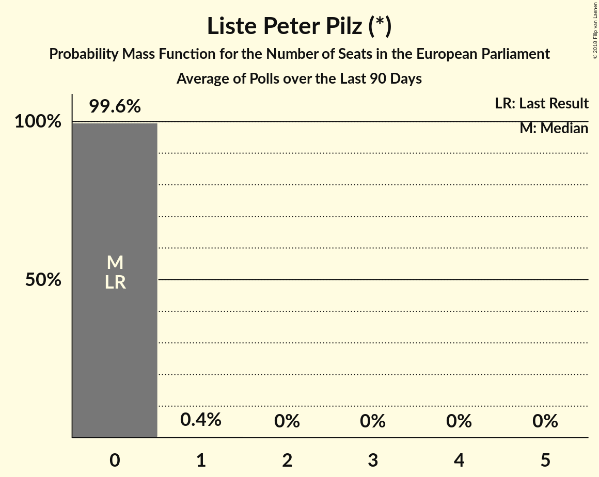

# Liste Peter Pilz (*)

<a href="#voting-intentions">Voting Intentions</a> | <a href="#seats">Seats</a>

## Voting Intentions

Last result: **0.0%** (General Election of 25 May 2014)

### Confidence Intervals

| Period     | Polling firm/Commissioner(s) | Median | 80% Confidence Interval | 90% Confidence Interval | 95% Confidence Interval | 99% Confidence Interval |
|:----------:|:----------------:|:-----------:|:-----------------------:|:-----------------------:|:-----------------------:|:-----------------------:|
| N/A | [Poll Average](average.html) | 2.1% | 1.2–3.7% | 0.9–4.3% | 0.8–4.8% | 0.5–5.5% |
| [19–25 July 2018](2018-07-25-ResearchAffairs.html) | Research Affairs   ÖSTERREICH | 2.0% | 1.5–2.7% | 1.4–2.9% | 1.3–3.1% | 1.1–3.4% |
| [9–13 July 2018](2018-07-13-UniqueResearch.html) | Unique Research   profil | 2.0% | 1.5–2.8% | 1.4–3.0% | 1.2–3.2% | 1.0–3.7% |
| [5–11 July 2018](2018-07-11-ResearchAffairs.html) | Research Affairs   ÖSTERREICH | 2.0% | 1.5–2.7% | 1.4–2.9% | 1.3–3.0% | 1.1–3.4% |
| [6–29 June 2018](2018-06-29-Spectra.html) | Spectra   OÖNachrichten | 3.9% | 3.2–5.1% | 2.9–5.4% | 2.7–5.7% | 2.4–6.2% |
| [26–28 June 2018](2018-06-28-OGM.html) | OGM   ServusTV | 2.0% | 1.5–2.8% | 1.3–3.0% | 1.2–3.2% | 1.0–3.6% |
| [21–27 June 2018](2018-06-27-ResearchAffairs.html) | Research Affairs   ÖSTERREICH | 2.0% | 1.5–2.7% | 1.4–2.9% | 1.3–3.1% | 1.1–3.4% |
| [18–21 June 2018](2018-06-21-UniqueResearch.html) | Unique Research   profil | 3.0% | 2.3–3.9% | 2.2–4.2% | 2.0–4.4% | 1.8–4.9% |
| [12–15 June 2018](2018-06-15-market.html) | market   Der Standard | 2.0% | 1.5–2.8% | 1.4–3.0% | 1.2–3.2% | 1.0–3.7% |
| [7–13 June 2018](2018-06-13-ResearchAffairs.html) | Research Affairs   ÖSTERREICH | 2.0% | 1.5–2.7% | 1.4–2.9% | 1.3–3.1% | 1.1–3.4% |
| [4–11 June 2018](2018-06-11-PeterHajek.html) | Peter Hajek   ATV | 1.0% | 0.7–1.7% | 0.6–1.9% | 0.5–2.1% | 0.4–2.4% |
| [4–6 June 2018](2018-06-06-UniqueResearch.html) | Unique Research   Heute | 1.0% | 0.7–1.6% | 0.6–1.8% | 0.5–2.0% | 0.4–2.3% |
| [9 May–5 June 2018](2018-06-05-Spectra.html) | Spectra   OÖNachrichten | 4.0% | 3.2–5.1% | 3.0–5.4% | 2.8–5.6% | 2.4–6.2% |
| [24–30 May 2018](2018-05-30-ResearchAffairs.html) | Research Affairs   ÖSTERREICH | 3.0% | 2.4–3.8% | 2.2–4.0% | 2.1–4.3% | 1.8–4.7% |
| [22–25 May 2018](2018-05-25-UniqueResearch.html) | Unique Research   profil | 4.0% | 3.2–5.0% | 3.0–5.3% | 2.9–5.6% | 2.5–6.1% |
| [10–16 May 2018](2018-05-16-ResearchAffairs.html) | Research Affairs   ÖSTERREICH | 3.0% | 2.4–3.8% | 2.2–4.0% | 2.1–4.2% | 1.8–4.6% |
| [18 April–9 May 2018](2018-05-09-IMAS.html) | IMAS   Kronen Zeitung | 2.0% | 1.5–2.7% | 1.4–2.9% | 1.3–3.0% | 1.1–3.4% |
| [26 April–2 May 2018](2018-05-02-ResearchAffairs.html) | Research Affairs   ÖSTERREICH | 2.0% | 1.5–2.7% | 1.4–2.9% | 1.3–3.1% | 1.1–3.4% |
| [9–30 April 2018](2018-04-30-Spectra.html) | Spectra   OÖNachrichten | 4.1% | 3.3–5.2% | 3.0–5.5% | 2.9–5.7% | 2.5–6.3% |
| [19–25 April 2018](2018-04-25-PeterHajek.html) | Peter Hajek   ATV | 2.0% | 1.5–2.9% | 1.3–3.1% | 1.2–3.3% | 1.0–3.8% |
| [12–18 April 2018](2018-04-18-ResearchAffairs.html) | Research Affairs   ÖSTERREICH | 2.0% | 1.5–2.7% | 1.4–2.9% | 1.3–3.1% | 1.1–3.4% |
| [8–13 April 2018](2018-04-13-UniqueResearch.html) | Unique Research   profil | 2.0% | 1.4–3.1% | 1.2–3.4% | 1.1–3.6% | 0.9–4.2% |
| [29 March–4 April 2018](2018-04-04-ResearchAffairs.html) | Research Affairs   ÖSTERREICH | 3.0% | 2.4–3.8% | 2.2–4.0% | 2.1–4.2% | 1.8–4.6% |
| [26–29 March 2018](2018-03-29-market.html) | market   Der Standard | 2.0% | 1.5–2.8% | 1.3–3.0% | 1.2–3.2% | 1.0–3.6% |
| [6–26 March 2018](2018-03-26-Spectra.html) | Spectra   OÖNachrichten | 6.0% | 5.0–7.3% | 4.7–7.7% | 4.5–8.0% | 4.0–8.7% |
| [19–22 March 2018](2018-03-22-UniqueResearch.html) | Unique Research   Heute | 2.0% | 1.5–2.8% | 1.4–3.0% | 1.2–3.2% | 1.0–3.7% |
| [14–21 March 2018](2018-03-21-ResearchAffairs.html) | Research Affairs   ÖSTERREICH | 3.0% | 2.4–3.8% | 2.2–4.0% | 2.1–4.2% | 1.8–4.6% |
| [19–21 March 2018](2018-03-21-OGM.html) | OGM   ServusTV | 3.1% | 2.3–4.3% | 2.1–4.6% | 1.9–5.0% | 1.6–5.6% |
| [14 February–18 March 2018](2018-03-18-IMAS.html) | IMAS   Kronen Zeitung | 2.0% | 1.6–2.4% | 1.5–2.6% | 1.5–2.7% | 1.3–2.9% |
| [12–15 March 2018](2018-03-15-UniqueResearch.html) | Unique Research   profil | 3.0% | 2.2–4.2% | 2.0–4.6% | 1.8–4.9% | 1.5–5.5% |
| [6–8 March 2018](2018-03-08-market.html) | market   Der Standard | 2.0% | 1.5–2.8% | 1.3–3.0% | 1.2–3.2% | 1.0–3.6% |
| [1–7 March 2018](2018-03-07-ResearchAffairs.html) | Research Affairs   ÖSTERREICH | 3.0% | 2.4–3.7% | 2.2–4.0% | 2.1–4.2% | 1.8–4.6% |
| [15–21 February 2018](2018-02-21-ResearchAffairs.html) | Research Affairs   ÖSTERREICH | 3.0% | 2.4–3.8% | 2.2–4.0% | 2.1–4.2% | 1.8–4.6% |
| [12–20 February 2018](2018-02-20-PeterHajek.html) | Peter Hajek   ATV | 2.1% | 1.5–2.9% | 1.4–3.2% | 1.2–3.4% | 1.0–3.8% |
| [25 January–19 February 2018](2018-02-19-Spectra.html) | Spectra   OÖNachrichten | 5.9% | 4.9–7.2% | 4.6–7.6% | 4.4–7.9% | 4.0–8.6% |
| [11–16 February 2018](2018-02-16-UniqueResearch.html) | Unique Research   profil | 2.0% | 1.4–3.1% | 1.2–3.4% | 1.1–3.6% | 0.9–4.2% |
| [1–8 February 2018](2018-02-08-ResearchAffairs.html) | Research Affairs   ÖSTERREICH | 3.0% | 2.4–3.8% | 2.2–4.0% | 2.1–4.3% | 1.9–4.7% |
| [18–24 January 2018](2018-01-24-ResearchAffairs.html) | Research Affairs   ÖSTERREICH | 3.0% | 2.4–3.8% | 2.3–4.1% | 2.1–4.3% | 1.9–4.7% |
| [15–19 January 2018](2018-01-19-UniqueResearch.html) | Unique Research   profil | 3.0% | 2.2–4.2% | 2.0–4.6% | 1.8–4.9% | 1.5–5.5% |
| [4–10 January 2018](2018-01-10-ResearchAffairs.html) | Research Affairs   ÖSTERREICH | 2.0% | 1.5–2.7% | 1.4–2.8% | 1.3–3.0% | 1.1–3.4% |
| [18–21 December 2017](2017-12-21-PeterHajek.html) | Peter Hajek   ATV | 2.0% | 1.5–2.9% | 1.3–3.1% | 1.2–3.3% | 1.0–3.8% |
| [18–20 December 2017](2017-12-20-market.html) | market   Der Standard | 2.0% | 1.5–2.8% | 1.4–3.0% | 1.2–3.2% | 1.0–3.7% |

### Probability Mass Function

The following table shows the probability mass function per percentage block of voting intentions for the [poll average](average.html) for Liste Peter Pilz (*).

| Voting Intentions | Probability | Accumulated | Special Marks |
|:-----------------:|:-----------:|:-----------:|:-------------:|
| 0.0–0.5% | 0.6% | 100% | Last Result |
| 0.5–1.5% | 20% | 99.4% |  |
| 1.5–2.5% | 52% | 79% | Median |
| 2.5–3.5% | 16% | 27% |  |
| 3.5–4.5% | 8% | 11% |  |
| 4.5–5.5% | 3% | 4% |  |
| 5.5–6.5% | 0.4% | 0.5% |  |
| 6.5–7.5% | 0% | 0% |  |

## Seats

Last result: **0** seats (General Election of 25 May 2014)

### Confidence Intervals

| Period     | Polling firm/Commissioner(s) | Median | 80% Confidence Interval | 90% Confidence Interval | 95% Confidence Interval | 99% Confidence Interval |
|:----------:|:----------------:|:------:|:-----------------------:|:-----------------------:|:-----------------------:|:-----------------------:|
| N/A | [Poll Average](average.html) | 0 | 0 | 0 | 0–1 | 0–1 |
| [19–25 July 2018](2018-07-25-ResearchAffairs.html) | Research Affairs   ÖSTERREICH | 0 | 0 | 0 | 0 | 0 |
| [9–13 July 2018](2018-07-13-UniqueResearch.html) | Unique Research   profil | 0 | 0 | 0 | 0 | 0 |
| [5–11 July 2018](2018-07-11-ResearchAffairs.html) | Research Affairs   ÖSTERREICH | 0 | 0 | 0 | 0 | 0 |
| [6–29 June 2018](2018-06-29-Spectra.html) | Spectra   OÖNachrichten | 0 | 0–1 | 0–1 | 0–1 | 0–1 |
| [26–28 June 2018](2018-06-28-OGM.html) | OGM   ServusTV | 0 | 0 | 0 | 0 | 0 |
| [21–27 June 2018](2018-06-27-ResearchAffairs.html) | Research Affairs   ÖSTERREICH | 0 | 0 | 0 | 0 | 0 |
| [18–21 June 2018](2018-06-21-UniqueResearch.html) | Unique Research   profil | 0 | 0 | 0 | 0 | 0–1 |
| [12–15 June 2018](2018-06-15-market.html) | market   Der Standard | 0 | 0 | 0 | 0 | 0 |
| [7–13 June 2018](2018-06-13-ResearchAffairs.html) | Research Affairs   ÖSTERREICH | 0 | 0 | 0 | 0 | 0 |
| [4–11 June 2018](2018-06-11-PeterHajek.html) | Peter Hajek   ATV | 0 | 0 | 0 | 0 | 0 |
| [4–6 June 2018](2018-06-06-UniqueResearch.html) | Unique Research   Heute | 0 | 0 | 0 | 0 | 0 |
| [9 May–5 June 2018](2018-06-05-Spectra.html) | Spectra   OÖNachrichten | 0 | 0–1 | 0–1 | 0–1 | 0–1 |
| [24–30 May 2018](2018-05-30-ResearchAffairs.html) | Research Affairs   ÖSTERREICH | 0 | 0 | 0 | 0 | 0–1 |
| [22–25 May 2018](2018-05-25-UniqueResearch.html) | Unique Research   profil | 0 | 0–1 | 0–1 | 0–1 | 0–1 |
| [10–16 May 2018](2018-05-16-ResearchAffairs.html) | Research Affairs   ÖSTERREICH | 0 | 0 | 0 | 0 | 0–1 |
| [18 April–9 May 2018](2018-05-09-IMAS.html) | IMAS   Kronen Zeitung | 0 | 0 | 0 | 0 | 0 |
| [26 April–2 May 2018](2018-05-02-ResearchAffairs.html) | Research Affairs   ÖSTERREICH | 0 | 0 | 0 | 0 | 0 |
| [9–30 April 2018](2018-04-30-Spectra.html) | Spectra   OÖNachrichten | 0 | 0–1 | 0–1 | 0–1 | 0–1 |
| [19–25 April 2018](2018-04-25-PeterHajek.html) | Peter Hajek   ATV | 0 | 0 | 0 | 0 | 0 |
| [12–18 April 2018](2018-04-18-ResearchAffairs.html) | Research Affairs   ÖSTERREICH | 0 | 0 | 0 | 0 | 0 |
| [8–13 April 2018](2018-04-13-UniqueResearch.html) | Unique Research   profil | 0 | 0 | 0 | 0 | 0 |
| [29 March–4 April 2018](2018-04-04-ResearchAffairs.html) | Research Affairs   ÖSTERREICH | 0 | 0 | 0 | 0 | 0–1 |
| [26–29 March 2018](2018-03-29-market.html) | market   Der Standard | 0 | 0 | 0 | 0 | 0 |
| [6–26 March 2018](2018-03-26-Spectra.html) | Spectra   OÖNachrichten | 1 | 1 | 1 | 1 | 0–1 |
| [19–22 March 2018](2018-03-22-UniqueResearch.html) | Unique Research   Heute | 0 | 0 | 0 | 0 | 0 |
| [14–21 March 2018](2018-03-21-ResearchAffairs.html) | Research Affairs   ÖSTERREICH | 0 | 0 | 0 | 0 | 0–1 |
| [19–21 March 2018](2018-03-21-OGM.html) | OGM   ServusTV | 0 | 0 | 0–1 | 0–1 | 0–1 |
| [14 February–18 March 2018](2018-03-18-IMAS.html) | IMAS   Kronen Zeitung | 0 | 0 | 0 | 0 | 0 |
| [12–15 March 2018](2018-03-15-UniqueResearch.html) | Unique Research   profil | 0 | 0 | 0 | 0–1 | 0–1 |
| [6–8 March 2018](2018-03-08-market.html) | market   Der Standard | 0 | 0 | 0 | 0 | 0 |
| [1–7 March 2018](2018-03-07-ResearchAffairs.html) | Research Affairs   ÖSTERREICH | 0 | 0 | 0 | 0 | 0–1 |
| [15–21 February 2018](2018-02-21-ResearchAffairs.html) | Research Affairs   ÖSTERREICH | 0 | 0 | 0 | 0 | 0–1 |
| [12–20 February 2018](2018-02-20-PeterHajek.html) | Peter Hajek   ATV | 0 | 0 | 0 | 0 | 0 |
| [25 January–19 February 2018](2018-02-19-Spectra.html) | Spectra   OÖNachrichten | 1 | 1 | 1 | 0–1 | 0–1 |
| [11–16 February 2018](2018-02-16-UniqueResearch.html) | Unique Research   profil | 0 | 0 | 0 | 0 | 0 |
| [1–8 February 2018](2018-02-08-ResearchAffairs.html) | Research Affairs   ÖSTERREICH | 0 | 0 | 0 | 0 | 0–1 |
| [18–24 January 2018](2018-01-24-ResearchAffairs.html) | Research Affairs   ÖSTERREICH | 0 | 0 | 0 | 0 | 0–1 |
| [15–19 January 2018](2018-01-19-UniqueResearch.html) | Unique Research   profil | 0 | 0 | 0–1 | 0–1 | 0–1 |
| [4–10 January 2018](2018-01-10-ResearchAffairs.html) | Research Affairs   ÖSTERREICH | 0 | 0 | 0 | 0 | 0 |
| [18–21 December 2017](2017-12-21-PeterHajek.html) | Peter Hajek   ATV | 0 | 0 | 0 | 0 | 0 |
| [18–20 December 2017](2017-12-20-market.html) | market   Der Standard | 0 | 0 | 0 | 0 | 0 |

### Probability Mass Function

The following table shows the probability mass function per seat for the [poll average](average.html) for Liste Peter Pilz (*).

| Number of Seats | Probability | Accumulated | Special Marks |
|:---------------:|:-----------:|:-----------:|:-------------:|
| 0 | 96% | 100% | Last Result, Median |
| 1 | 4% | 4% |  |
| 2 | 0% | 0% |  |

