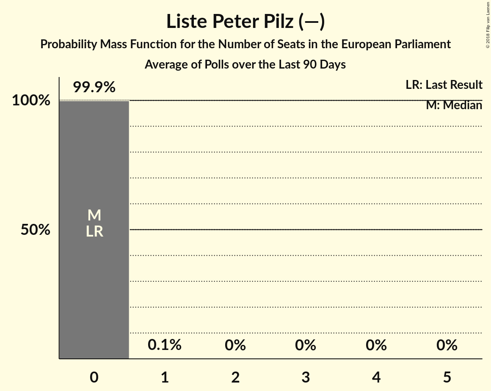

# Liste Peter Pilz (—)

<a href="#voting-intentions">Voting Intentions</a> | <a href="#seats">Seats</a>

## Voting Intentions

Last result: **0.0%** (General Election of 25 May 2014)

### Confidence Intervals

| Period     | Polling firm/Commissioner(s) | Median | 80% Confidence Interval | 90% Confidence Interval | 95% Confidence Interval | 99% Confidence Interval |
|:----------:|:----------------:|:-----------:|:-----------------------:|:-----------------------:|:-----------------------:|:-----------------------:|
| N/A | [Poll Average](average.html) | 2.6% | 1.7–3.5% | 1.5–3.8% | 1.4–4.0% | 1.1–4.4% |
| [1–7 March 2018](2018-03-07-ResearchAffairs.html) | Research Affairs   ÖSTERREICH | 3.0% | 2.4–3.7% | 2.2–4.0% | 2.1–4.2% | 1.8–4.6% |
| [15–21 February 2018](2018-02-21-ResearchAffairs.html) | Research Affairs   ÖSTERREICH | 3.0% | 2.4–3.8% | 2.2–4.0% | 2.1–4.2% | 1.8–4.6% |
| [12–20 February 2018](2018-02-20-PeterHajek.html) | Peter Hajek   ATV | 2.1% | 1.5–2.9% | 1.4–3.2% | 1.2–3.4% | 1.0–3.8% |
| [11–16 February 2018](2018-02-16-UniqueResearch.html) | Unique Research   profil | 2.0% | N/A | N/A | N/A | N/A |
| [1–8 February 2018](2018-02-08-ResearchAffairs.html) | Research Affairs   ÖSTERREICH | 3.0% | N/A | N/A | N/A | N/A |
| [18–24 January 2018](2018-01-24-ResearchAffairs.html) | Research Affairs   ÖSTERREICH | 3.0% | N/A | N/A | N/A | N/A |
| [15–19 January 2018](2018-01-19-UniqueResearch.html) | Unique Research   profil | 3.0% | N/A | N/A | N/A | N/A |
| [4–10 January 2018](2018-01-10-ResearchAffairs.html) | Research Affairs   ÖSTERREICH | 2.0% | N/A | N/A | N/A | N/A |
| [18–21 December 2017](2017-12-21-PeterHajek.html) | Peter Hajek   ATV | 2.0% | N/A | N/A | N/A | N/A |
| [18–20 December 2017](2017-12-20-market.html) | market   Der Standard | 2.0% | N/A | N/A | N/A | N/A |

### Probability Mass Function

The following table shows the probability mass function per percentage block of voting intentions for the [poll average](average.html) for Liste Peter Pilz (—).

| Voting Intentions | Probability | Accumulated | Special Marks |
|:-----------------:|:-----------:|:-----------:|:-------------:|
| 0.0–0.5% | 0% | 100% | Last Result |
| 0.5–1.5% | 5% | 100% |  |
| 1.5–2.5% | 41% | 95% |  |
| 2.5–3.5% | 45% | 54% | Median |
| 3.5–4.5% | 9% | 9% |  |
| 4.5–5.5% | 0.3% | 0.3% |  |
| 5.5–6.5% | 0% | 0% |  |

## Seats

Last result: **0** seats (General Election of 25 May 2014)

### Confidence Intervals

| Period     | Polling firm/Commissioner(s) | Median | 80% Confidence Interval | 90% Confidence Interval | 95% Confidence Interval | 99% Confidence Interval |
|:----------:|:----------------:|:------:|:-----------------------:|:-----------------------:|:-----------------------:|:-----------------------:|
| N/A | [Poll Average](average.html) | 0 | 0 | 0 | 0 | 0–1 |
| [1–7 March 2018](2018-03-07-ResearchAffairs.html) | Research Affairs   ÖSTERREICH | 0 | 0 | 0 | 0–1 | 0–1 |
| [15–21 February 2018](2018-02-21-ResearchAffairs.html) | Research Affairs   ÖSTERREICH | 0 | 0 | 0 | 0 | 0–1 |
| [12–20 February 2018](2018-02-20-PeterHajek.html) | Peter Hajek   ATV | 0 | 0 | 0 | 0 | 0 |
| [11–16 February 2018](2018-02-16-UniqueResearch.html) | Unique Research   profil |  |  |  |  |  |
| [1–8 February 2018](2018-02-08-ResearchAffairs.html) | Research Affairs   ÖSTERREICH |  |  |  |  |  |
| [18–24 January 2018](2018-01-24-ResearchAffairs.html) | Research Affairs   ÖSTERREICH |  |  |  |  |  |
| [15–19 January 2018](2018-01-19-UniqueResearch.html) | Unique Research   profil |  |  |  |  |  |
| [4–10 January 2018](2018-01-10-ResearchAffairs.html) | Research Affairs   ÖSTERREICH |  |  |  |  |  |
| [18–21 December 2017](2017-12-21-PeterHajek.html) | Peter Hajek   ATV |  |  |  |  |  |
| [18–20 December 2017](2017-12-20-market.html) | market   Der Standard |  |  |  |  |  |

### Probability Mass Function

The following table shows the probability mass function per seat for the [poll average](average.html) for Liste Peter Pilz (—).

| Number of Seats | Probability | Accumulated | Special Marks |
|:---------------:|:-----------:|:-----------:|:-------------:|
| 0 | 98% | 100% | Last Result, Median |
| 1 | 2% | 2% |  |
| 2 | 0% | 0% |  |

