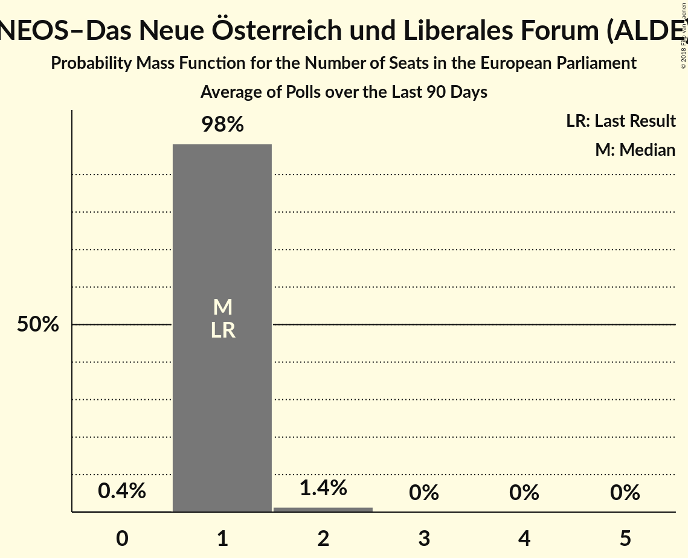

# NEOS–Das Neue Österreich und Liberales Forum (ALDE)

<a href="#voting-intentions">Voting Intentions</a> | <a href="#seats">Seats</a>

## Voting Intentions

Last result: **8.1%** (General Election of 25 May 2014)

### Confidence Intervals

| Period     | Polling firm/Commissioner(s) | Median | 80% Confidence Interval | 90% Confidence Interval | 95% Confidence Interval | 99% Confidence Interval |
|:----------:|:----------------:|:-----------:|:-----------------------:|:-----------------------:|:-----------------------:|:-----------------------:|
| N/A | [Poll Average](average.html) | 6.7% | 5.5–8.3% | 5.2–8.7% | 4.9–9.1% | 4.5–10.0% |
| [12–15 March 2018](2018-03-15-UniqueResearch.html) | Unique Research   profil | 7.0% | 5.7–8.7% | 5.4–9.2% | 5.1–9.6% | 4.5–10.5% |
| [6–8 March 2018](2018-03-08-market.html) | market   Der Standard | 8.1% | N/A | N/A | N/A | N/A |
| [1–7 March 2018](2018-03-07-ResearchAffairs.html) | Research Affairs   ÖSTERREICH | 6.0% | 5.2–7.1% | 4.9–7.4% | 4.7–7.6% | 4.3–8.2% |
| [15–21 February 2018](2018-02-21-ResearchAffairs.html) | Research Affairs   ÖSTERREICH | 7.0% | 6.1–8.2% | 5.8–8.5% | 5.6–8.8% | 5.2–9.4% |
| [12–20 February 2018](2018-02-20-PeterHajek.html) | Peter Hajek   ATV | 7.0% | 5.9–8.4% | 5.6–8.8% | 5.4–9.1% | 4.9–9.8% |
| [11–16 February 2018](2018-02-16-UniqueResearch.html) | Unique Research   profil | 7.0% | 5.7–8.7% | 5.4–9.2% | 5.1–9.6% | 4.5–10.5% |
| [1–8 February 2018](2018-02-08-ResearchAffairs.html) | Research Affairs   ÖSTERREICH | 6.0% | 5.1–7.1% | 4.9–7.4% | 4.7–7.7% | 4.3–8.2% |
| [18–24 January 2018](2018-01-24-ResearchAffairs.html) | Research Affairs   ÖSTERREICH | 6.0% | 5.2–7.1% | 4.9–7.4% | 4.7–7.7% | 4.3–8.2% |
| [15–19 January 2018](2018-01-19-UniqueResearch.html) | Unique Research   profil | 6.0% | 4.8–7.6% | 4.5–8.0% | 4.2–8.4% | 3.7–9.3% |
| [4–10 January 2018](2018-01-10-ResearchAffairs.html) | Research Affairs   ÖSTERREICH | 6.0% | 5.1–7.0% | 4.9–7.3% | 4.7–7.6% | 4.3–8.2% |
| [18–21 December 2017](2017-12-21-PeterHajek.html) | Peter Hajek   ATV | 6.0% | 5.0–7.3% | 4.7–7.7% | 4.5–8.0% | 4.0–8.7% |
| [18–20 December 2017](2017-12-20-market.html) | market   Der Standard | 6.0% | 5.0–7.2% | 4.8–7.6% | 4.6–7.9% | 4.1–8.5% |

### Probability Mass Function

The following table shows the probability mass function per percentage block of voting intentions for the [poll average](average.html) for NEOS–Das Neue Österreich und Liberales Forum (ALDE).

| Voting Intentions | Probability | Accumulated | Special Marks |
|:-----------------:|:-----------:|:-----------:|:-------------:|
| 2.5–3.5% | 0% | 100% |  |
| 3.5–4.5% | 0.6% | 100% |  |
| 4.5–5.5% | 11% | 99.4% |  |
| 5.5–6.5% | 33% | 89% |  |
| 6.5–7.5% | 32% | 56% | Median |
| 7.5–8.5% | 17% | 24% | Last Result |
| 8.5–9.5% | 5% | 7% |  |
| 9.5–10.5% | 1.0% | 1.2% |  |
| 10.5–11.5% | 0.1% | 0.2% |  |
| 11.5–12.5% | 0% | 0% |  |

## Seats

Last result: **1** seats (General Election of 25 May 2014)

### Confidence Intervals

| Period     | Polling firm/Commissioner(s) | Median | 80% Confidence Interval | 90% Confidence Interval | 95% Confidence Interval | 99% Confidence Interval |
|:----------:|:----------------:|:------:|:-----------------------:|:-----------------------:|:-----------------------:|:-----------------------:|
| N/A | [Poll Average](average.html) | 1 | 1 | 1 | 1 | 1–2 |
| [12–15 March 2018](2018-03-15-UniqueResearch.html) | Unique Research   profil | 1 | 1 | 1 | 1 | 1–2 |
| [6–8 March 2018](2018-03-08-market.html) | market   Der Standard |  |  |  |  |  |
| [1–7 March 2018](2018-03-07-ResearchAffairs.html) | Research Affairs   ÖSTERREICH | 1 | 1 | 1 | 1 | 0–1 |
| [15–21 February 2018](2018-02-21-ResearchAffairs.html) | Research Affairs   ÖSTERREICH | 1 | 1 | 1 | 1 | 1 |
| [12–20 February 2018](2018-02-20-PeterHajek.html) | Peter Hajek   ATV | 1 | 1 | 1 | 1–2 | 1–2 |
| [11–16 February 2018](2018-02-16-UniqueResearch.html) | Unique Research   profil | 1 | 1 | 1 | 1 | 1–2 |
| [1–8 February 2018](2018-02-08-ResearchAffairs.html) | Research Affairs   ÖSTERREICH | 1 | 1 | 1 | 1 | 0–1 |
| [18–24 January 2018](2018-01-24-ResearchAffairs.html) | Research Affairs   ÖSTERREICH | 1 | 1 | 1 | 1 | 1 |
| [15–19 January 2018](2018-01-19-UniqueResearch.html) | Unique Research   profil | 1 | 0–2 | 0–2 | 0–2 | 0–2 |
| [4–10 January 2018](2018-01-10-ResearchAffairs.html) | Research Affairs   ÖSTERREICH | 1 | 0–1 | 0–1 | 0–1 | 0–1 |
| [18–21 December 2017](2017-12-21-PeterHajek.html) | Peter Hajek   ATV | 1 | 1 | 1 | 1 | 0–1 |
| [18–20 December 2017](2017-12-20-market.html) | market   Der Standard | 1 | 1 | 1 | 1 | 1 |

### Probability Mass Function

The following table shows the probability mass function per seat for the [poll average](average.html) for NEOS–Das Neue Österreich und Liberales Forum (ALDE).

| Number of Seats | Probability | Accumulated | Special Marks |
|:---------------:|:-----------:|:-----------:|:-------------:|
| 0 | 0.3% | 100% |  |
| 1 | 98.5% | 99.7% | Last Result, Median |
| 2 | 1.2% | 1.2% |  |
| 3 | 0% | 0% |  |

