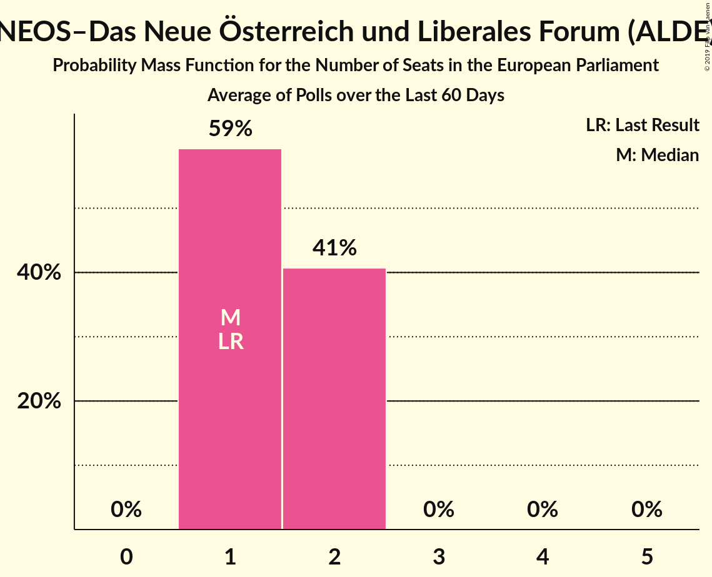

# NEOS–Das Neue Österreich und Liberales Forum (ALDE)

<a href="#voting-intentions">Voting Intentions</a> | <a href="#seats">Seats</a>

## Voting Intentions

Last result: **8.1%** (General Election of 25 May 2014)

### Confidence Intervals

| Period     | Polling firm/Commissioner(s) | Median | 80% Confidence Interval | 90% Confidence Interval | 95% Confidence Interval | 99% Confidence Interval |
|:----------:|:----------------:|:-----------:|:-----------------------:|:-----------------------:|:-----------------------:|:-----------------------:|
| N/A | [Poll Average](average.html) | 6.3% | 4.1–8.3% | 3.6–8.8% | 3.3–9.3% | 2.8–10.2% |
| [6–10 August 2018](2018-08-10-UniqueResearch.html) | Unique Research   profil | 5.0% | 4.1–6.1% | 3.9–6.5% | 3.7–6.8% | 3.3–7.3% |
| [2–8 August 2018](2018-08-08-ResearchAffairs.html) | Research Affairs   ÖSTERREICH | 7.0% | 6.1–8.1% | 5.8–8.5% | 5.6–8.7% | 5.1–9.3% |
| [19–25 July 2018](2018-07-25-ResearchAffairs.html) | Research Affairs   ÖSTERREICH | 6.0% | 5.1–7.1% | 4.9–7.4% | 4.7–7.7% | 4.3–8.2% |
| [9–13 July 2018](2018-07-13-UniqueResearch.html) | Unique Research   profil | 5.0% | 4.1–6.1% | 3.9–6.5% | 3.7–6.8% | 3.3–7.3% |
| [5–11 July 2018](2018-07-11-ResearchAffairs.html) | Research Affairs   ÖSTERREICH | 7.0% | 6.1–8.2% | 5.8–8.5% | 5.6–8.8% | 5.2–9.4% |
| [6–29 June 2018](2018-06-29-Spectra.html) | Spectra   OÖNachrichten | 3.9% | 3.2–5.1% | 2.9–5.4% | 2.7–5.7% | 2.4–6.2% |
| [26–28 June 2018](2018-06-28-OGM.html) | OGM   ServusTV | 6.0% | 5.0–7.2% | 4.7–7.5% | 4.5–7.8% | 4.1–8.4% |
| [21–27 June 2018](2018-06-27-ResearchAffairs.html) | Research Affairs   ÖSTERREICH | 6.0% | 5.1–7.1% | 4.9–7.4% | 4.7–7.6% | 4.3–8.2% |
| [18–21 June 2018](2018-06-21-UniqueResearch.html) | Unique Research   profil | 7.0% | 6.0–8.3% | 5.7–8.7% | 5.4–9.0% | 5.0–9.6% |
| [12–15 June 2018](2018-06-15-market.html) | market   Der Standard | 7.0% | 6.0–8.3% | 5.7–8.7% | 5.4–9.0% | 5.0–9.6% |
| [7–13 June 2018](2018-06-13-ResearchAffairs.html) | Research Affairs   ÖSTERREICH | 5.0% | 4.2–6.0% | 4.0–6.3% | 3.8–6.5% | 3.4–7.0% |
| [4–11 June 2018](2018-06-11-PeterHajek.html) | Peter Hajek   ATV | 8.0% | 6.8–9.5% | 6.5–9.9% | 6.2–10.3% | 5.7–11.0% |
| [4–6 June 2018](2018-06-06-UniqueResearch.html) | Unique Research   Heute | 8.0% | 6.9–9.4% | 6.6–9.8% | 6.3–10.1% | 5.8–10.8% |
| [9 May–5 June 2018](2018-06-05-Spectra.html) | Spectra   OÖNachrichten | 4.0% | 3.2–5.1% | 3.0–5.4% | 2.8–5.6% | 2.4–6.2% |
| [24–30 May 2018](2018-05-30-ResearchAffairs.html) | Research Affairs   ÖSTERREICH | 5.0% | 4.2–6.0% | 4.0–6.3% | 3.8–6.5% | 3.5–7.0% |
| [22–25 May 2018](2018-05-25-UniqueResearch.html) | Unique Research   profil | 7.0% | 6.0–8.3% | 5.7–8.7% | 5.4–9.0% | 5.0–9.6% |
| [10–16 May 2018](2018-05-16-ResearchAffairs.html) | Research Affairs   ÖSTERREICH | 6.0% | 5.1–7.0% | 4.8–7.3% | 4.6–7.6% | 4.3–8.1% |
| [18 April–9 May 2018](2018-05-09-IMAS.html) | IMAS   Kronen Zeitung | 5.0% | 4.2–6.0% | 4.0–6.2% | 3.8–6.5% | 3.4–7.0% |
| [26 April–2 May 2018](2018-05-02-ResearchAffairs.html) | Research Affairs   ÖSTERREICH | 7.0% | 6.0–8.1% | 5.8–8.4% | 5.5–8.7% | 5.1–9.3% |
| [9–30 April 2018](2018-04-30-Spectra.html) | Spectra   OÖNachrichten | 5.0% | 4.1–6.2% | 3.9–6.5% | 3.7–6.8% | 3.3–7.5% |
| [19–25 April 2018](2018-04-25-PeterHajek.html) | Peter Hajek   ATV | 8.0% | 6.8–9.5% | 6.5–9.9% | 6.2–10.3% | 5.7–11.0% |
| [12–18 April 2018](2018-04-18-ResearchAffairs.html) | Research Affairs   ÖSTERREICH | 7.0% | 6.0–8.1% | 5.8–8.4% | 5.5–8.7% | 5.1–9.3% |
| [8–13 April 2018](2018-04-13-UniqueResearch.html) | Unique Research   profil | 6.0% | 4.8–7.6% | 4.5–8.0% | 4.2–8.4% | 3.7–9.3% |
| [29 March–4 April 2018](2018-04-04-ResearchAffairs.html) | Research Affairs   ÖSTERREICH | 7.0% | 6.1–8.2% | 5.8–8.5% | 5.6–8.8% | 5.2–9.4% |
| [26–29 March 2018](2018-03-29-market.html) | market   Der Standard | 8.0% | 6.9–9.4% | 6.6–9.8% | 6.3–10.1% | 5.8–10.8% |
| [6–26 March 2018](2018-03-26-Spectra.html) | Spectra   OÖNachrichten | 4.0% | 3.2–5.2% | 3.0–5.5% | 2.8–5.8% | 2.5–6.3% |
| [19–22 March 2018](2018-03-22-UniqueResearch.html) | Unique Research   Heute | 8.0% | 6.9–9.4% | 6.6–9.8% | 6.3–10.1% | 5.8–10.8% |
| [14–21 March 2018](2018-03-21-ResearchAffairs.html) | Research Affairs   ÖSTERREICH | 6.0% | 5.1–7.0% | 4.8–7.3% | 4.6–7.6% | 4.3–8.1% |
| [19–21 March 2018](2018-03-21-OGM.html) | OGM   ServusTV | 6.9% | 5.7–8.6% | 5.3–9.1% | 5.0–9.5% | 4.5–10.3% |
| [14 February–18 March 2018](2018-03-18-IMAS.html) | IMAS   Kronen Zeitung | 7.0% | 6.3–7.8% | 6.1–8.0% | 6.0–8.2% | 5.7–8.6% |
| [12–15 March 2018](2018-03-15-UniqueResearch.html) | Unique Research   profil | 7.0% | 5.7–8.7% | 5.4–9.2% | 5.1–9.6% | 4.5–10.5% |
| [6–8 March 2018](2018-03-08-market.html) | market   Der Standard | 8.1% | 6.9–9.4% | 6.6–9.8% | 6.4–10.2% | 5.9–10.8% |
| [1–7 March 2018](2018-03-07-ResearchAffairs.html) | Research Affairs   ÖSTERREICH | 6.0% | 5.2–7.1% | 4.9–7.4% | 4.7–7.6% | 4.3–8.2% |
| [15–21 February 2018](2018-02-21-ResearchAffairs.html) | Research Affairs   ÖSTERREICH | 7.0% | 6.1–8.2% | 5.8–8.5% | 5.6–8.8% | 5.2–9.4% |
| [12–20 February 2018](2018-02-20-PeterHajek.html) | Peter Hajek   ATV | 7.0% | 5.9–8.4% | 5.6–8.8% | 5.4–9.1% | 4.9–9.8% |
| [25 January–19 February 2018](2018-02-19-Spectra.html) | Spectra   OÖNachrichten | 4.9% | 4.0–6.1% | 3.8–6.5% | 3.6–6.8% | 3.2–7.4% |
| [11–16 February 2018](2018-02-16-UniqueResearch.html) | Unique Research   profil | 7.0% | 5.7–8.7% | 5.4–9.2% | 5.1–9.6% | 4.5–10.5% |
| [1–8 February 2018](2018-02-08-ResearchAffairs.html) | Research Affairs   ÖSTERREICH | 6.0% | 5.1–7.1% | 4.9–7.4% | 4.7–7.7% | 4.3–8.2% |
| [18–24 January 2018](2018-01-24-ResearchAffairs.html) | Research Affairs   ÖSTERREICH | 6.0% | 5.2–7.1% | 4.9–7.4% | 4.7–7.7% | 4.3–8.2% |
| [15–19 January 2018](2018-01-19-UniqueResearch.html) | Unique Research   profil | 6.0% | 4.8–7.6% | 4.5–8.0% | 4.2–8.4% | 3.7–9.3% |
| [4–10 January 2018](2018-01-10-ResearchAffairs.html) | Research Affairs   ÖSTERREICH | 6.0% | 5.1–7.0% | 4.9–7.3% | 4.7–7.6% | 4.3–8.2% |
| [18–21 December 2017](2017-12-21-PeterHajek.html) | Peter Hajek   ATV | 6.0% | 5.0–7.3% | 4.7–7.7% | 4.5–8.0% | 4.0–8.7% |
| [18–20 December 2017](2017-12-20-market.html) | market   Der Standard | 6.0% | 5.0–7.2% | 4.8–7.6% | 4.6–7.9% | 4.1–8.5% |

### Probability Mass Function

The following table shows the probability mass function per percentage block of voting intentions for the [poll average](average.html) for NEOS–Das Neue Österreich und Liberales Forum (ALDE).

| Voting Intentions | Probability | Accumulated | Special Marks |
|:-----------------:|:-----------:|:-----------:|:-------------:|
| 0.5–1.5% | 0% | 100% |  |
| 1.5–2.5% | 0.2% | 100% |  |
| 2.5–3.5% | 4% | 99.8% |  |
| 3.5–4.5% | 13% | 96% |  |
| 4.5–5.5% | 17% | 83% |  |
| 5.5–6.5% | 21% | 66% | Median |
| 6.5–7.5% | 23% | 45% |  |
| 7.5–8.5% | 15% | 22% | Last Result |
| 8.5–9.5% | 6% | 7% |  |
| 9.5–10.5% | 1.4% | 2% |  |
| 10.5–11.5% | 0.2% | 0.2% |  |
| 11.5–12.5% | 0% | 0% |  |

## Seats

Last result: **1** seats (General Election of 25 May 2014)

### Confidence Intervals

| Period     | Polling firm/Commissioner(s) | Median | 80% Confidence Interval | 90% Confidence Interval | 95% Confidence Interval | 99% Confidence Interval |
|:----------:|:----------------:|:------:|:-----------------------:|:-----------------------:|:-----------------------:|:-----------------------:|
| N/A | [Poll Average](average.html) | 1 | 0–1 | 0–1 | 0–2 | 0–2 |
| [6–10 August 2018](2018-08-10-UniqueResearch.html) | Unique Research   profil | 1 | 0–1 | 0–1 | 0–1 | 0–1 |
| [2–8 August 2018](2018-08-08-ResearchAffairs.html) | Research Affairs   ÖSTERREICH | 1 | 1 | 1 | 1 | 1–2 |
| [19–25 July 2018](2018-07-25-ResearchAffairs.html) | Research Affairs   ÖSTERREICH | 1 | 1 | 1 | 1 | 0–1 |
| [9–13 July 2018](2018-07-13-UniqueResearch.html) | Unique Research   profil | 1 | 0–1 | 0–1 | 0–1 | 0–1 |
| [5–11 July 2018](2018-07-11-ResearchAffairs.html) | Research Affairs   ÖSTERREICH | 1 | 1 | 1 | 1 | 1–2 |
| [6–29 June 2018](2018-06-29-Spectra.html) | Spectra   OÖNachrichten | 0 | 0–1 | 0–1 | 0–1 | 0–1 |
| [26–28 June 2018](2018-06-28-OGM.html) | OGM   ServusTV | 1 | 1 | 1 | 0–1 | 0–1 |
| [21–27 June 2018](2018-06-27-ResearchAffairs.html) | Research Affairs   ÖSTERREICH | 1 | 1 | 1 | 1 | 0–1 |
| [18–21 June 2018](2018-06-21-UniqueResearch.html) | Unique Research   profil | 1 | 1 | 1 | 1–2 | 1–2 |
| [12–15 June 2018](2018-06-15-market.html) | market   Der Standard | 1 | 1 | 1 | 1 | 1–2 |
| [7–13 June 2018](2018-06-13-ResearchAffairs.html) | Research Affairs   ÖSTERREICH | 1 | 0–1 | 0–1 | 0–1 | 0–1 |
| [4–11 June 2018](2018-06-11-PeterHajek.html) | Peter Hajek   ATV | 1 | 1–2 | 1–2 | 1–2 | 1–2 |
| [4–6 June 2018](2018-06-06-UniqueResearch.html) | Unique Research   Heute | 1 | 1–2 | 1–2 | 1–2 | 1–2 |
| [9 May–5 June 2018](2018-06-05-Spectra.html) | Spectra   OÖNachrichten | 0 | 0–1 | 0–1 | 0–1 | 0–1 |
| [24–30 May 2018](2018-05-30-ResearchAffairs.html) | Research Affairs   ÖSTERREICH | 1 | 0–1 | 0–1 | 0–1 | 0–1 |
| [22–25 May 2018](2018-05-25-UniqueResearch.html) | Unique Research   profil | 1 | 1 | 1 | 1 | 1–2 |
| [10–16 May 2018](2018-05-16-ResearchAffairs.html) | Research Affairs   ÖSTERREICH | 1 | 1 | 1 | 1 | 0–1 |
| [18 April–9 May 2018](2018-05-09-IMAS.html) | IMAS   Kronen Zeitung | 1 | 0–1 | 0–1 | 0–1 | 0–1 |
| [26 April–2 May 2018](2018-05-02-ResearchAffairs.html) | Research Affairs   ÖSTERREICH | 1 | 1 | 1 | 1 | 1–2 |
| [9–30 April 2018](2018-04-30-Spectra.html) | Spectra   OÖNachrichten | 1 | 0–1 | 0–1 | 0–1 | 0–1 |
| [19–25 April 2018](2018-04-25-PeterHajek.html) | Peter Hajek   ATV | 1 | 1–2 | 1–2 | 1–2 | 1–2 |
| [12–18 April 2018](2018-04-18-ResearchAffairs.html) | Research Affairs   ÖSTERREICH | 1 | 1 | 1 | 1 | 1–2 |
| [8–13 April 2018](2018-04-13-UniqueResearch.html) | Unique Research   profil | 1 | 1 | 1 | 0–1 | 0–2 |
| [29 March–4 April 2018](2018-04-04-ResearchAffairs.html) | Research Affairs   ÖSTERREICH | 1 | 1 | 1 | 1–2 | 1–2 |
| [26–29 March 2018](2018-03-29-market.html) | market   Der Standard | 1 | 1–2 | 1–2 | 1–2 | 1–2 |
| [6–26 March 2018](2018-03-26-Spectra.html) | Spectra   OÖNachrichten | 0 | 0–1 | 0–1 | 0–1 | 0–1 |
| [19–22 March 2018](2018-03-22-UniqueResearch.html) | Unique Research   Heute | 1 | 1–2 | 1–2 | 1–2 | 1–2 |
| [14–21 March 2018](2018-03-21-ResearchAffairs.html) | Research Affairs   ÖSTERREICH | 1 | 1 | 1 | 1 | 0–1 |
| [19–21 March 2018](2018-03-21-OGM.html) | OGM   ServusTV | 1 | 1 | 1–2 | 1–2 | 0–2 |
| [14 February–18 March 2018](2018-03-18-IMAS.html) | IMAS   Kronen Zeitung | 1 | 1 | 1 | 1 | 1 |
| [12–15 March 2018](2018-03-15-UniqueResearch.html) | Unique Research   profil | 1 | 1 | 1–2 | 1–2 | 0–2 |
| [6–8 March 2018](2018-03-08-market.html) | market   Der Standard | 1 | 1–2 | 1–2 | 1–2 | 1–2 |
| [1–7 March 2018](2018-03-07-ResearchAffairs.html) | Research Affairs   ÖSTERREICH | 1 | 1 | 1 | 1 | 0–1 |
| [15–21 February 2018](2018-02-21-ResearchAffairs.html) | Research Affairs   ÖSTERREICH | 1 | 1 | 1 | 1 | 1–2 |
| [12–20 February 2018](2018-02-20-PeterHajek.html) | Peter Hajek   ATV | 1 | 1 | 1 | 1–2 | 1–2 |
| [25 January–19 February 2018](2018-02-19-Spectra.html) | Spectra   OÖNachrichten | 1 | 0–1 | 0–1 | 0–1 | 0–1 |
| [11–16 February 2018](2018-02-16-UniqueResearch.html) | Unique Research   profil | 1 | 1 | 1–2 | 1–2 | 0–2 |
| [1–8 February 2018](2018-02-08-ResearchAffairs.html) | Research Affairs   ÖSTERREICH | 1 | 1 | 1 | 1 | 0–1 |
| [18–24 January 2018](2018-01-24-ResearchAffairs.html) | Research Affairs   ÖSTERREICH | 1 | 1 | 1 | 1 | 0–1 |
| [15–19 January 2018](2018-01-19-UniqueResearch.html) | Unique Research   profil | 1 | 1 | 1 | 0–1 | 0–2 |
| [4–10 January 2018](2018-01-10-ResearchAffairs.html) | Research Affairs   ÖSTERREICH | 1 | 1 | 1 | 1 | 0–1 |
| [18–21 December 2017](2017-12-21-PeterHajek.html) | Peter Hajek   ATV | 1 | 1 | 1 | 0–1 | 0–1 |
| [18–20 December 2017](2017-12-20-market.html) | market   Der Standard | 1 | 1 | 1 | 1 | 0–1 |

### Probability Mass Function

The following table shows the probability mass function per seat for the [poll average](average.html) for NEOS–Das Neue Österreich und Liberales Forum (ALDE).

| Number of Seats | Probability | Accumulated | Special Marks |
|:---------------:|:-----------:|:-----------:|:-------------:|
| 0 | 15% | 100% |  |
| 1 | 81% | 85% | Last Result, Median |
| 2 | 4% | 4% |  |
| 3 | 0% | 0% |  |

