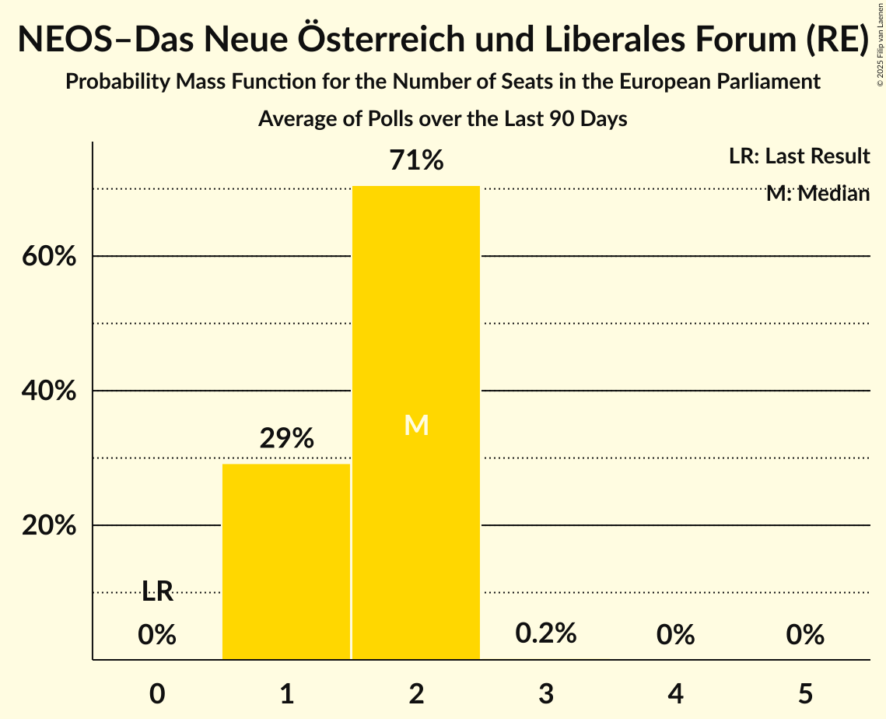

# NEOS–Das Neue Österreich und Liberales Forum (RE)

<a href="#voting-intentions">Voting Intentions</a> | <a href="#seats">Seats</a>

## Voting Intentions

Last result: **0.0%** (General Election of 9 June 2024)

### Confidence Intervals

| Period     | Polling firm/Commissioner(s) | Median | 80% Confidence Interval | 90% Confidence Interval | 95% Confidence Interval | 99% Confidence Interval |
|:----------:|:----------------:|:-----------:|:-----------------------:|:-----------------------:|:-----------------------:|:-----------------------:|
| N/A | [Poll Average](average.html) | 9.9% | 7.6–11.8% | 7.2–12.3% | 6.9–12.8% | 6.3–13.6% |
| [5–6 August 2024](2024-08-06-Market.html) | Market   ÖSTERREICH | 10.0% | 9.2–10.9% | 8.9–11.2% | 8.7–11.4% | 8.4–11.9% |
| [8–11 July 2024](2024-07-11-Market.html) | Market   Der Standard | 11.0% | 9.7–12.6% | 9.4–13.0% | 9.1–13.4% | 8.5–14.2% |
| [8–10 July 2024](2024-07-10-Market.html) | Market   ÖSTERREICH | 11.0% | N/A | N/A | N/A | N/A |
| [1–2 July 2024](2024-07-02-Market.html) | Market | 11.0% | 10.1–11.9% | 9.9–12.2% | 9.7–12.5% | 9.3–12.9% |
| [24–26 June 2024](2024-06-26-OGM.html) | OGM   KURIER | 8.0% | 7.0–9.2% | 6.7–9.6% | 6.5–9.8% | 6.1–10.5% |
| [24–25 June 2024](2024-06-25-Market.html) | Market   ÖSTERREICH | 9.0% | 8.2–9.9% | 8.0–10.1% | 7.8–10.3% | 7.5–10.8% |
| [12–19 June 2024](2024-06-19-UniqueResearch.html) | Unique Research   profil | 10.0% | 8.9–11.3% | 8.6–11.7% | 8.3–12.0% | 7.8–12.7% |
| [10–19 June 2024](2024-06-19-Market.html) | Market   ÖSTERREICH | 10.0% | N/A | N/A | N/A | N/A |
| [10–13 June 2024](2024-06-13-UniqueResearch.html) | Unique Research   Heute | 8.0% | N/A | N/A | N/A | N/A |
| [10–11 June 2024](2024-06-11-OGM.html) | OGM   Servus TV | 8.0% | N/A | N/A | N/A | N/A |
| [10–11 June 2024](2024-06-11-Market.html) | Market   ÖSTERREICH | 10.0% | N/A | N/A | N/A | N/A |

### Probability Mass Function

The following table shows the probability mass function per percentage block of voting intentions for the [poll average](average.html) for NEOS–Das Neue Österreich und Liberales Forum (RE).

| Voting Intentions | Probability | Accumulated | Special Marks |
|:-----------------:|:-----------:|:-----------:|:-------------:|
| 0.0–0.5% | 0% | 100% | Last Result |
| 0.5–1.5% | 0% | 100% |  |
| 1.5–2.5% | 0% | 100% |  |
| 2.5–3.5% | 0% | 100% |  |
| 3.5–4.5% | 0% | 100% |  |
| 4.5–5.5% | 0% | 100% |  |
| 5.5–6.5% | 0.9% | 100% |  |
| 6.5–7.5% | 8% | 99.0% |  |
| 7.5–8.5% | 17% | 91% |  |
| 8.5–9.5% | 18% | 75% |  |
| 9.5–10.5% | 23% | 56% | Median |
| 10.5–11.5% | 20% | 34% |  |
| 11.5–12.5% | 10% | 14% |  |
| 12.5–13.5% | 3% | 4% |  |
| 13.5–14.5% | 0.6% | 0.6% |  |
| 14.5–15.5% | 0.1% | 0.1% |  |
| 15.5–16.5% | 0% | 0% |  |

## Seats

Last result: **0** seats (General Election of 9 June 2024)

### Confidence Intervals

| Period     | Polling firm/Commissioner(s) | Median | 80% Confidence Interval | 90% Confidence Interval | 95% Confidence Interval | 99% Confidence Interval |
|:----------:|:----------------:|:------:|:-----------------------:|:-----------------------:|:-----------------------:|:-----------------------:|
| N/A | [Poll Average](average.html) | 2 | 1–2 | 1–2 | 1–3 | 1–3 |
| [5–6 August 2024](2024-08-06-Market.html) | Market   ÖSTERREICH | 2 | 2 | 2 | 2 | 1–2 |
| [8–11 July 2024](2024-07-11-Market.html) | Market   Der Standard | 2 | 2 | 2–3 | 2–3 | 1–3 |
| [8–10 July 2024](2024-07-10-Market.html) | Market   ÖSTERREICH |  |  |  |  |  |
| [1–2 July 2024](2024-07-02-Market.html) | Market | 2 | 2 | 2 | 2 | 2–3 |
| [24–26 June 2024](2024-06-26-OGM.html) | OGM   KURIER | 1 | 1–2 | 1–2 | 1–2 | 1–2 |
| [24–25 June 2024](2024-06-25-Market.html) | Market   ÖSTERREICH | 2 | 1–2 | 1–2 | 1–2 | 1–2 |
| [12–19 June 2024](2024-06-19-UniqueResearch.html) | Unique Research   profil | 2 | 2 | 1–2 | 1–2 | 1–3 |
| [10–19 June 2024](2024-06-19-Market.html) | Market   ÖSTERREICH |  |  |  |  |  |
| [10–13 June 2024](2024-06-13-UniqueResearch.html) | Unique Research   Heute |  |  |  |  |  |
| [10–11 June 2024](2024-06-11-OGM.html) | OGM   Servus TV |  |  |  |  |  |
| [10–11 June 2024](2024-06-11-Market.html) | Market   ÖSTERREICH |  |  |  |  |  |

### Probability Mass Function

The following table shows the probability mass function per seat for the [poll average](average.html) for NEOS–Das Neue Österreich und Liberales Forum (RE).

| Number of Seats | Probability | Accumulated | Special Marks |
|:---------------:|:-----------:|:-----------:|:-------------:|
| 0 | 0% | 100% | Last Result |
| 1 | 24% | 100% |  |
| 2 | 73% | 76% | Median |
| 3 | 3% | 3% |  |
| 4 | 0% | 0% |  |

