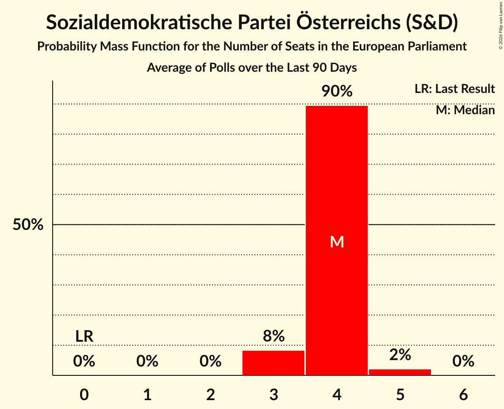

# Sozialdemokratische Partei Österreichs (S&D)

<a href="#voting-intentions">Voting Intentions</a> | <a href="#seats">Seats</a>

## Voting Intentions

Last result: **23.9%** (General Election of 26 May 2019)

### Confidence Intervals

| Period     | Polling firm/Commissioner(s) | Median | 80% Confidence Interval | 90% Confidence Interval | 95% Confidence Interval | 99% Confidence Interval |
|:----------:|:----------------:|:-----------:|:-----------------------:|:-----------------------:|:-----------------------:|:-----------------------:|
| N/A | [Poll Average](average.html) | 25.7% | 23.6–27.9% | 23.0–28.5% | 22.5–29.1% | 21.5–30.3% |
| [7–10 February 2022](2022-02-10-UniqueResearch.html) | Unique Research   profil | 25.0% | 23.1–27.0% | 22.6–27.6% | 22.1–28.1% | 21.2–29.1% |
| [10–13 January 2022](2022-01-13-UniqueResearch.html) | Unique Research   profil | 25.0% | 22.6–27.6% | 22.0–28.3% | 21.4–29.0% | 20.3–30.3% |
| [23–28 December 2021](2021-12-28-Market.html) | Market   Der Standard | 26.0% | 24.1–28.1% | 23.5–28.7% | 23.1–29.2% | 22.2–30.2% |
| [13–16 December 2021](2021-12-16-PeterHajek.html) | Peter Hajek   APA and ATV | 25.0% | 23.1–27.0% | 22.6–27.6% | 22.1–28.1% | 21.2–29.1% |
| [6–9 December 2021](2021-12-09-UniqueResearch.html) | Unique Research   profil | 27.0% | 25.1–29.1% | 24.5–29.7% | 24.0–30.2% | 23.1–31.2% |
| [6–9 December 2021](2021-12-09-Market.html) | Market   Der Standard | 26.0% | 24.1–28.1% | 23.5–28.7% | 23.1–29.2% | 22.2–30.2% |
| [6–9 December 2021](2021-12-09-IFDD.html) | IFDD   PULS 24 | 26.1% | 23.8–28.6% | 23.2–29.3% | 22.6–29.9% | 21.5–31.1% |
| [23–25 November 2021](2021-11-25-OGM.html) | OGM   KURIER | 26.0% | 24.2–28.1% | 23.6–28.6% | 23.2–29.1% | 22.3–30.1% |
| [15–18 November 2021](2021-11-18-UniqueResearch.html) | Unique Research   profil | 25.0% | 23.1–27.0% | 22.6–27.6% | 22.1–28.1% | 21.2–29.1% |
| [8–11 November 2021](2021-11-11-UniqueResearch.html) | Unique Research   Heute | 25.0% | N/A | N/A | N/A | N/A |
| [18–21 October 2021](2021-10-21-PeterHajek.html) | Peter Hajek   APA and ATV | 23.0% | 21.2–25.0% | 20.7–25.6% | 20.2–26.0% | 19.4–27.0% |
| [12–15 October 2021](2021-10-15-UniqueResearch.html) | Unique Research   profil | 25.0% | N/A | N/A | N/A | N/A |
| [12–15 October 2021](2021-10-15-OGM.html) | OGM   KURIER | 24.0% | 22.5–25.7% | 22.0–26.1% | 21.6–26.6% | 20.9–27.4% |
| [11–12 October 2021](2021-10-12-Market.html) | Market   Der Standard | 25.0% | 23.1–27.0% | 22.6–27.6% | 22.1–28.1% | 21.2–29.1% |
| [7–11 October 2021](2021-10-11-IFDD.html) | IFDD | 25.0% | 23.6–26.5% | 23.3–26.9% | 22.9–27.3% | 22.3–28.0% |
| [28–30 September 2021](2021-09-30-ResearchAffairs.html) | Research Affairs   ÖSTERREICH | 21.9% | 19.7–24.4% | 19.1–25.1% | 18.5–25.8% | 17.5–27.0% |
| [7–9 September 2021](2021-09-09-OGM.html) | OGM   KURIER | 24.0% | N/A | N/A | N/A | N/A |
| [30 August–1 September 2021](2021-09-01-ResearchAffairs.html) | Research Affairs   ÖSTERREICH | 22.0% | N/A | N/A | N/A | N/A |
| [24–26 August 2021](2021-08-26-ResearchAffairs.html) | Research Affairs   ÖSTERREICH | 21.0% | N/A | N/A | N/A | N/A |
| [17–19 August 2021](2021-08-19-ResearchAffairs.html) | Research Affairs   ÖSTERREICH | 21.0% | N/A | N/A | N/A | N/A |
| [10–12 August 2021](2021-08-12-ResearchAffairs.html) | Research Affairs   ÖSTERREICH | 20.9% | N/A | N/A | N/A | N/A |
| [6–11 August 2021](2021-08-11-Market.html) | Market   Der Standard | 25.0% | N/A | N/A | N/A | N/A |
| [2–5 August 2021](2021-08-05-UniqueResearch.html) | Unique Research   profil | 21.0% | 19.2–22.9% | 18.7–23.5% | 18.3–24.0% | 17.5–24.9% |
| [3–5 August 2021](2021-08-05-ResearchAffairs.html) | Research Affairs   ÖSTERREICH | 21.0% | N/A | N/A | N/A | N/A |
| [27–29 July 2021](2021-07-29-ResearchAffairs.html) | Research Affairs   ÖSTERREICH | 20.0% | N/A | N/A | N/A | N/A |
| [20–22 July 2021](2021-07-22-ResearchAffairs.html) | Research Affairs   ÖSTERREICH | 20.0% | 17.9–22.5% | 17.3–23.2% | 16.8–23.8% | 15.8–25.0% |
| [15–21 July 2021](2021-07-21-IFDD.html) | IFDD   PULS 24 | 22.0% | 20.2–24.0% | 19.7–24.5% | 19.3–25.0% | 18.4–26.0% |
| [13–15 July 2021](2021-07-15-ResearchAffairs.html) | Research Affairs   PULS | 20.0% | 18.4–21.7% | 18.0–22.2% | 17.6–22.6% | 16.9–23.4% |
| [5–8 July 2021](2021-07-08-UniqueResearch.html) | Unique Research   profil | 22.0% | 20.2–24.0% | 19.7–24.5% | 19.3–25.0% | 18.4–26.0% |
| [5–8 July 2021](2021-07-08-ResearchAffairs.html) | Research Affairs   ÖSTERREICH | 21.0% | 19.4–22.7% | 19.0–23.2% | 18.6–23.6% | 17.8–24.5% |
| [28 June–2 July 2021](2021-07-02-IFDD.html) | IFDD   PULS 24 | 23.9% | 22.1–26.0% | 21.6–26.5% | 21.1–27.0% | 20.3–28.0% |
| [28 June–1 July 2021](2021-07-01-UniqueResearch.html) | Unique Research   Heute | 22.0% | 20.2–24.0% | 19.7–24.5% | 19.3–25.0% | 18.4–26.0% |
| [28 June–1 July 2021](2021-07-01-ResearchAffairs.html) | Research Affairs   ÖSTERREICH | 22.0% | 19.8–24.5% | 19.2–25.2% | 18.7–25.9% | 17.6–27.1% |
| [29–30 June 2021](2021-06-30-Market.html) | Market   Der Standard | 26.0% | 24.1–28.0% | 23.5–28.6% | 23.1–29.1% | 22.2–30.1% |
| [22–24 June 2021](2021-06-24-ResearchAffairs.html) | Research Affairs   ÖSTERREICH | 23.0% | 20.7–25.5% | 20.1–26.3% | 19.5–26.9% | 18.5–28.2% |
| [21–24 June 2021](2021-06-24-PeterHajek.html) | Peter Hajek | 23.0% | 21.2–25.0% | 20.7–25.6% | 20.2–26.0% | 19.4–27.0% |
| [22–24 June 2021](2021-06-24-OGM.html) | OGM   KURIER | 25.0% | 23.1–27.0% | 22.5–27.6% | 22.1–28.1% | 21.2–29.1% |
| [15–17 June 2021](2021-06-17-ResearchAffairs.html) | Research Affairs   ÖSTERREICH | 22.0% | 20.4–23.7% | 19.9–24.2% | 19.5–24.7% | 18.8–25.5% |
| [10–15 June 2021](2021-06-15-IFDD.html) | IFDD   PULS 24 | 27.0% | 25.1–29.1% | 24.5–29.7% | 24.1–30.2% | 23.2–31.2% |
| [7–10 June 2021](2021-06-10-UniqueResearch.html) | Unique Research   profil | 23.0% | 21.2–25.0% | 20.7–25.6% | 20.2–26.0% | 19.4–27.0% |
| [8–10 June 2021](2021-06-10-ResearchAffairs.html) | Research Affairs   ÖSTERREICH | 22.9% | 20.6–25.5% | 20.0–26.2% | 19.4–26.8% | 18.4–28.0% |
| [8–10 June 2021](2021-06-10-Market.html) | Market   Der Standard | 27.0% | 25.1–29.0% | 24.6–29.6% | 24.1–30.1% | 23.2–31.1% |
| [31 May–2 June 2021](2021-06-02-ResearchAffairs.html) | Research Affairs   ÖSTERREICH | 23.9% | 21.6–26.5% | 21.0–27.2% | 20.4–27.8% | 19.3–29.1% |
| [24–30 May 2021](2021-05-30-Market.html) | Market | 28.0% | 26.2–29.9% | 25.7–30.4% | 25.3–30.9% | 24.5–31.8% |
| [25–27 May 2021](2021-05-27-ResearchAffairs.html) | Research Affairs   ÖSTERREICH | 23.0% | 20.7–25.5% | 20.1–26.3% | 19.5–26.9% | 18.5–28.2% |
| [18–20 May 2021](2021-05-20-ResearchAffairs.html) | Research Affairs   ÖSTERREICH | 22.0% | 19.8–24.4% | 19.2–25.1% | 18.6–25.7% | 17.6–26.9% |
| [14 May 2021](2021-05-14-DemoxResearch.html) | Demox Research | 23.0% | 21.4–24.8% | 20.9–25.3% | 20.5–25.7% | 19.7–26.6% |
| [11–13 May 2021](2021-05-13-ResearchAffairs.html) | Research Affairs   ÖSTERREICH | 22.0% | 19.8–24.5% | 19.1–25.2% | 18.6–25.8% | 17.6–27.1% |
| [10–12 May 2021](2021-05-12-UniqueResearch.html) | Unique Research   profil | 23.0% | 21.2–25.0% | 20.7–25.6% | 20.2–26.0% | 19.4–27.0% |
| [4–6 May 2021](2021-05-06-ResearchAffairs.html) | Research Affairs   ÖSTERREICH | 21.0% | 18.8–23.5% | 18.2–24.2% | 17.7–24.8% | 16.7–26.0% |
| [27–29 April 2021](2021-04-29-ResearchAffairs.html) | Research Affairs   ÖSTERREICH | 20.0% | 17.8–22.4% | 17.2–23.1% | 16.7–23.7% | 15.7–24.8% |
| [26–29 April 2021](2021-04-29-PeterHajek.html) | Peter Hajek   APA and ATV | 25.0% | 23.1–27.0% | 22.6–27.6% | 22.1–28.1% | 21.2–29.1% |
| [20–22 April 2021](2021-04-22-ResearchAffairs.html) | Research Affairs   ÖSTERREICH | 20.9% | 18.7–23.4% | 18.1–24.1% | 17.6–24.7% | 16.6–25.9% |
| [5–8 April 2021](2021-04-08-UniqueResearch.html) | Unique Research   profil | 24.0% | 22.1–26.0% | 21.6–26.6% | 21.2–27.1% | 20.3–28.1% |
| [30 March–1 April 2021](2021-04-01-ResearchAffairs.html) | Research Affairs   ÖSTERREICH | 21.0% | 19.4–22.7% | 19.0–23.2% | 18.6–23.6% | 17.8–24.5% |
| [30 March–1 April 2021](2021-04-01-OGM.html) | OGM   KURIER | 24.0% | 22.1–26.0% | 21.6–26.6% | 21.1–27.1% | 20.3–28.0% |
| [26–30 March 2021](2021-03-30-Market.html) | Market   Der Standard | 26.0% | 24.1–28.1% | 23.5–28.7% | 23.1–29.2% | 22.2–30.2% |
| [23–25 March 2021](2021-03-25-UniqueResearch.html) | Unique Research   Heute | 23.0% | 21.2–25.0% | 20.7–25.6% | 20.2–26.0% | 19.4–27.0% |
| [23–25 March 2021](2021-03-25-ResearchAffairs.html) | Research Affairs   ÖSTERREICH | 22.0% | 19.7–24.5% | 19.1–25.2% | 18.5–25.8% | 17.5–27.0% |
| [15–17 March 2021](2021-03-17-ResearchAffairs.html) | Research Affairs   ÖSTERREICH | 24.0% | 21.7–26.6% | 21.0–27.3% | 20.5–27.9% | 19.4–29.2% |
| [8–11 March 2021](2021-03-11-PeterHajek.html) | Peter Hajek   APA and ATV | 25.0% | 23.1–27.0% | 22.6–27.6% | 22.1–28.1% | 21.2–29.1% |
| [1–4 March 2021](2021-03-04-UniqueResearch.html) | Unique Research   profil | 24.0% | 22.1–26.0% | 21.6–26.6% | 21.2–27.1% | 20.3–28.1% |
| [2–4 March 2021](2021-03-04-ResearchAffairs.html) | Research Affairs   ÖSTERREICH | 22.9% | 20.7–25.5% | 20.0–26.2% | 19.5–26.8% | 18.5–28.0% |
| [15–18 February 2021](2021-02-18-ResearchAffairs.html) | Research Affairs   ÖSTERREICH | 24.0% | 21.7–26.6% | 21.0–27.3% | 20.5–27.9% | 19.4–29.2% |
| [15–17 February 2021](2021-02-17-Market.html) | Market   Der Standard | 25.0% | 23.3–26.8% | 22.8–27.3% | 22.4–27.8% | 21.6–28.7% |
| [8–11 February 2021](2021-02-11-UniqueResearch.html) | Unique Research   profil | 23.0% | 21.2–25.0% | 20.7–25.6% | 20.2–26.0% | 19.4–27.0% |
| [8–11 February 2021](2021-02-11-ResearchAffairs.html) | Research Affairs   ÖSTERREICH | 24.0% | 21.7–26.6% | 21.0–27.3% | 20.5–27.9% | 19.4–29.2% |
| [1–4 February 2021](2021-02-04-ResearchAffairs.html) | Research Affairs   ÖSTERREICH | 24.0% | 21.7–26.6% | 21.0–27.3% | 20.5–27.9% | 19.4–29.2% |
| [25 January–1 February 2021](2021-02-01-IFDD.html) | IFDD   Kronen Zeitung | 24.0% | 22.1–26.0% | 21.6–26.6% | 21.2–27.1% | 20.3–28.1% |
| [11–14 January 2021](2021-01-14-UniqueResearch.html) | Unique Research   profil | 22.0% | 20.2–24.0% | 19.7–24.5% | 19.3–25.0% | 18.4–26.0% |
| [4–7 January 2021](2021-01-07-ResearchAffairs.html) | Research Affairs   ÖSTERREICH | 23.0% | 21.4–24.8% | 20.9–25.3% | 20.5–25.7% | 19.7–26.6% |
| [17–21 December 2020](2020-12-21-Market.html) | Market   Der Standard | 23.0% | 21.2–25.0% | 20.7–25.5% | 20.2–26.0% | 19.4–27.0% |
| [15–17 December 2020](2020-12-17-OGM.html) | OGM   KURIER | 23.0% | 21.2–25.1% | 20.7–25.6% | 20.2–26.1% | 19.4–27.1% |
| [8–12 December 2020](2020-12-12-PeterHajek.html) | Peter Hajek   APA and ATV | 22.0% | 20.2–24.0% | 19.7–24.5% | 19.3–25.0% | 18.4–26.0% |
| [5 December 2020](2020-12-05-UniqueResearch.html) | Unique Research   profil | 20.0% | 18.3–21.9% | 17.8–22.5% | 17.4–22.9% | 16.6–23.9% |
| [30 November–3 December 2020](2020-12-03-ResearchAffairs.html) | Research Affairs   ÖSTERREICH | 22.0% | 19.8–24.5% | 19.2–25.2% | 18.7–25.9% | 17.6–27.1% |
| [30 November–2 December 2020](2020-12-02-Market.html) | Market   Der Standard | 23.0% | 21.2–25.0% | 20.7–25.6% | 20.2–26.0% | 19.4–27.0% |
| [17–19 November 2020](2020-11-19-ResearchAffairs.html) | Research Affairs   ÖSTERREICH | 22.0% | 19.7–24.5% | 19.1–25.2% | 18.5–25.8% | 17.5–27.0% |
| [9–12 November 2020](2020-11-12-ResearchAffairs.html) | Research Affairs   ÖSTERREICH | 22.0% | 20.4–23.7% | 19.9–24.2% | 19.5–24.7% | 18.8–25.5% |
| [5–7 November 2020](2020-11-07-ResearchAffairs.html) | Research Affairs   ÖSTERREICH | 21.4% | 19.2–23.9% | 18.6–24.6% | 18.0–25.2% | 17.0–26.4% |
| [2–6 November 2020](2020-11-06-UniqueResearch.html) | Unique Research | 21.0% | 19.3–23.0% | 18.8–23.5% | 18.3–24.0% | 17.5–24.9% |
| [27–29 October 2020](2020-10-29-ResearchAffairs.html) | Research Affairs | 22.0% | 19.8–24.5% | 19.1–25.2% | 18.6–25.8% | 17.6–27.1% |
| [20–22 October 2020](2020-10-22-ResearchAffairs.html) | Research Affairs | 21.0% | 18.8–23.5% | 18.2–24.2% | 17.6–24.8% | 16.6–26.0% |
| [20–22 October 2020](2020-10-22-OGM.html) | OGM | 23.0% | 21.7–24.4% | 21.4–24.8% | 21.0–25.1% | 20.4–25.8% |
| [12–16 October 2020](2020-10-16-UniqueResearch.html) | Unique Research | 22.0% | 20.2–23.9% | 19.7–24.5% | 19.2–25.0% | 18.4–25.9% |
| [6–8 October 2020](2020-10-08-ResearchAffairs.html) | Research Affairs | 18.9% | 16.8–21.3% | 16.3–22.0% | 15.8–22.6% | 14.8–23.8% |
| [28–30 September 2020](2020-09-30-ResearchAffairs.html) | Research Affairs | 20.0% | 17.8–22.5% | 17.2–23.1% | 16.7–23.7% | 15.7–25.0% |
| [21–24 September 2020](2020-09-24-ResearchAffairs.html) | Research Affairs | 20.0% | 17.8–22.4% | 17.2–23.1% | 16.7–23.7% | 15.7–24.9% |
| [14–18 September 2020](2020-09-18-UniqueResearch.html) | Unique Research | 20.0% | 18.3–21.9% | 17.8–22.5% | 17.4–22.9% | 16.6–23.9% |
| [14–16 September 2020](2020-09-16-ResearchAffairs.html) | Research Affairs | 19.2% | 17.7–20.9% | 17.2–21.4% | 16.9–21.8% | 16.2–22.6% |
| [25–27 August 2020](2020-08-27-ResearchAffairs.html) | Research Affairs   ÖSTERREICH | 19.0% | 16.9–21.4% | 16.3–22.1% | 15.8–22.7% | 14.8–23.9% |
| [17–20 August 2020](2020-08-20-ResearchAffairs.html) | Research Affairs   ÖSTERREICH | 19.0% | 16.9–21.4% | 16.3–22.1% | 15.8–22.7% | 14.9–23.9% |
| [10–13 August 2020](2020-08-13-UniqueResearch.html) | Unique Research   profil | 18.0% | 16.3–19.8% | 15.9–20.3% | 15.5–20.8% | 14.7–21.7% |
| [20–22 July 2020](2020-07-22-ResearchAffairs.html) | Research Affairs   ÖSTERREICH | 19.0% | 16.9–21.4% | 16.3–22.1% | 15.8–22.7% | 14.8–23.9% |
| [13–16 July 2020](2020-07-16-UniqueResearch.html) | Unique Research   profil | 19.0% | 17.3–20.9% | 16.8–21.4% | 16.4–21.8% | 15.6–22.8% |
| [6–9 July 2020](2020-07-09-ResearchAffairs.html) | Research Affairs   ÖSTERREICH | 20.1% | 17.9–22.5% | 17.3–23.2% | 16.8–23.8% | 15.8–25.0% |
| [23–25 June 2020](2020-06-25-OGM.html) | OGM | 19.0% | 17.3–20.9% | 16.8–21.4% | 16.4–21.9% | 15.7–22.8% |
| [9–12 June 2020](2020-06-12-UniqueResearch.html) | Unique Research   profil | 17.0% | 15.3–18.8% | 14.9–19.3% | 14.5–19.7% | 13.8–20.6% |
| [5–10 June 2020](2020-06-10-ResearchAffairs.html) | Research Affairs   ÖSTERREICH | 19.0% | 17.5–20.7% | 17.1–21.1% | 16.7–21.6% | 16.0–22.4% |
| [5–9 June 2020](2020-06-09-KarmasinResearchIdentity.html) | Karmasin Research & Identity | 19.0% | 17.5–20.7% | 17.1–21.1% | 16.7–21.6% | 16.0–22.4% |
| [25–28 May 2020](2020-05-28-ResearchAffairs.html) | Research Affairs   ÖSTERREICH | 18.0% | 16.5–19.6% | 16.1–20.1% | 15.7–20.5% | 15.0–21.3% |
| [21–26 May 2020](2020-05-26-Market.html) | Market   Der Standard | 20.0% | 18.3–21.9% | 17.8–22.5% | 17.4–22.9% | 16.6–23.9% |
| [18–19 May 2020](2020-05-19-Market.html) | Market   Der Standard | 21.0% | 19.4–22.7% | 19.0–23.2% | 18.6–23.6% | 17.8–24.5% |
| [11–14 May 2020](2020-05-14-UniqueResearch.html) | Unique Research   profil | 17.0% | 15.3–18.8% | 14.9–19.3% | 14.5–19.7% | 13.8–20.6% |
| [11–13 May 2020](2020-05-13-Market.html) | Market   Der Standard | 21.0% | 19.4–22.7% | 19.0–23.2% | 18.6–23.6% | 17.8–24.5% |
| [20–22 April 2020](2020-04-22-Market.html) | Market | 20.0% | 18.4–21.7% | 18.0–22.2% | 17.6–22.6% | 16.9–23.4% |
| [13–16 April 2020](2020-04-16-UniqueResearch.html) | Unique Research   profil | 16.0% | 14.4–17.8% | 14.0–18.3% | 13.6–18.7% | 12.9–19.6% |
| [3–7 April 2020](2020-04-07-Market.html) | Market   Der Standard | 19.0% | 17.8–20.2% | 17.5–20.6% | 17.3–20.9% | 16.7–21.5% |
| [31 March–2 April 2020](2020-04-02-OGM.html) | OGM | 16.0% | 14.4–17.8% | 14.0–18.3% | 13.6–18.7% | 12.9–19.6% |
| [24–31 March 2020](2020-03-31-Market.html) | Market   Der Standard | 19.0% | 17.5–20.7% | 17.1–21.1% | 16.7–21.6% | 16.0–22.4% |
| [9–13 March 2020](2020-03-13-UniqueResearch.html) | Unique Research | 16.0% | 14.5–17.8% | 14.0–18.3% | 13.7–18.7% | 12.9–19.6% |
| [11–12 March 2020](2020-03-12-Market.html) | Market   Der Standard | 20.0% | 18.4–21.7% | 18.0–22.2% | 17.6–22.6% | 16.9–23.4% |
| [5–11 March 2020](2020-03-11-ResearchAffairs.html) | Research Affairs   ÖSTERREICH | 17.4% | 15.9–19.0% | 15.5–19.4% | 15.1–19.8% | 14.5–20.6% |
| [24–27 February 2020](2020-02-27-ResearchAffairs.html) | Research Affairs   ÖSTERREICH | 17.1% | 15.7–18.8% | 15.3–19.2% | 14.9–19.6% | 14.3–20.4% |
| [10–14 February 2020](2020-02-14-UniqueResearch.html) | Unique Research   profil | 15.0% | 13.5–16.8% | 13.1–17.3% | 12.7–17.7% | 12.0–18.5% |
| [7–12 February 2020](2020-02-12-ResearchAffairs.html) | Research Affairs | 18.0% | 16.2–20.0% | 15.7–20.6% | 15.3–21.1% | 14.4–22.1% |
| [4–6 February 2020](2020-02-06-Market.html) | Market | 18.9% | 17.3–20.8% | 16.8–21.3% | 16.4–21.8% | 15.6–22.7% |
| [28–31 January 2020](2020-01-31-ResearchAffairs.html) | Research Affairs   ÖSTERREICH | 17.0% | 15.0–19.3% | 14.4–20.0% | 14.0–20.5% | 13.0–21.7% |
| [17–23 January 2020](2020-01-23-ResearchAffairs.html) | Research Affairs | 16.0% | 14.5–17.6% | 14.0–18.1% | 13.7–18.5% | 13.0–19.4% |
| [10–16 January 2020](2020-01-16-ResearchAffairs.html) | Research Affairs   ÖSTERREICH | 16.0% | 14.6–17.5% | 14.2–18.0% | 13.8–18.4% | 13.2–19.1% |
| [10–15 January 2020](2020-01-15-KarmasinResearchIdentity.html) | Karmasin Research & Identity | 17.0% | 15.5–18.6% | 15.2–19.1% | 14.8–19.5% | 14.1–20.3% |
| [6–10 January 2020](2020-01-10-UniqueResearch.html) | Unique Research   profil | 16.0% | 14.4–17.8% | 14.0–18.3% | 13.6–18.7% | 12.9–19.6% |
| [3–9 January 2020](2020-01-09-ResearchAffairs.html) | Research Affairs   ÖSTERREICH | 17.0% | 15.4–18.7% | 15.0–19.2% | 14.6–19.7% | 13.9–20.5% |
| [12–19 December 2019](2019-12-19-ResearchAffairs.html) | Research Affairs   ÖSTERREICH | 17.0% | 15.5–18.7% | 15.0–19.2% | 14.6–19.6% | 13.9–20.5% |
| [16–19 December 2019](2019-12-19-Market.html) | Market   Der Standard | 19.0% | 17.3–20.9% | 16.8–21.4% | 16.4–21.8% | 15.6–22.8% |
| [9–13 December 2019](2019-12-13-UniqueResearch.html) | Unique Research   profil | 18.0% | 16.3–19.8% | 15.9–20.3% | 15.5–20.8% | 14.7–21.7% |
| [6–12 December 2019](2019-12-12-ResearchAffairs.html) | Research Affairs   ÖSTERREICH | 17.0% | 15.5–18.8% | 15.0–19.3% | 14.7–19.7% | 14.0–20.5% |
| [29 November–5 December 2019](2019-12-05-ResearchAffairs.html) | Research Affairs   ÖSTERREICH | 17.0% | 15.4–18.7% | 14.9–19.2% | 14.6–19.7% | 13.8–20.5% |
| [29 November–4 December 2019](2019-12-04-Market.html) | Market   Der Standard | 18.1% | 16.4–19.9% | 15.9–20.4% | 15.5–20.9% | 14.8–21.8% |
| [22–28 November 2019](2019-11-28-ResearchAffairs.html) | Research Affairs   ÖSTERREICH | 18.0% | 16.4–19.8% | 16.0–20.3% | 15.6–20.7% | 14.8–21.6% |
| [15–21 November 2019](2019-11-21-ResearchAffairs.html) | Research Affairs   ÖSTERREICH | 20.0% | 18.4–21.9% | 17.9–22.4% | 17.5–22.8% | 16.8–23.7% |
| [11–15 November 2019](2019-11-15-UniqueResearch.html) | Unique Research   profil | 19.0% | 17.3–20.8% | 16.8–21.4% | 16.4–21.8% | 15.7–22.7% |
| [8–14 November 2019](2019-11-14-ResearchAffairs.html) | Research Affairs   ÖSTERREICH | 20.0% | 18.3–21.9% | 17.9–22.4% | 17.5–22.9% | 16.7–23.8% |
| [8–13 November 2019](2019-11-13-KarmasinResearchIdentity.html) | Karmasin Research & Identity | 20.0% | 19.1–21.0% | 18.8–21.2% | 18.6–21.5% | 18.2–21.9% |
| [2–7 November 2019](2019-11-07-ResearchAffairs.html) | Research Affairs   ÖSTERREICH | 20.0% | 18.4–21.7% | 18.0–22.1% | 17.6–22.6% | 16.9–23.4% |
| [26–31 October 2019](2019-10-31-ResearchAffairs.html) | Research Affairs   ÖSTERREICH | 19.0% | 17.3–20.9% | 16.9–21.5% | 16.4–21.9% | 15.7–22.9% |
| [22–25 October 2019](2019-10-25-ResearchAffairs.html) | Research Affairs   ÖSTERREICH | 19.0% | 17.5–20.7% | 17.1–21.1% | 16.7–21.6% | 16.0–22.4% |
| [15–17 October 2019](2019-10-17-Market.html) | Market   Der Standard | 20.0% | 18.2–21.9% | 17.7–22.4% | 17.3–22.9% | 16.5–23.8% |
| [10–16 October 2019](2019-10-16-ResearchAffairs.html) | Research Affairs   ÖSTERREICH | 20.0% | 18.4–21.7% | 18.0–22.2% | 17.6–22.6% | 16.9–23.4% |
| [7–11 October 2019](2019-10-11-UniqueResearch.html) | Unique Research   profil | 20.0% | 18.2–21.9% | 17.7–22.4% | 17.3–22.9% | 16.5–23.8% |
| [16–23 September 2019](2019-09-23-OGM.html) | OGM   Servus TV | 22.0% | 20.4–23.7% | 19.9–24.2% | 19.5–24.6% | 18.8–25.5% |
| [19–22 September 2019](2019-09-22-ResearchAffairs.html) | Research Affairs   ÖSTERREICH | 23.0% | 21.4–24.8% | 20.9–25.3% | 20.5–25.7% | 19.7–26.6% |
| [12–20 September 2019](2019-09-20-PeterHajek.html) | Peter Hajek   ATV, PULS 4 and Servus TV | 22.0% | 21.1–23.0% | 20.8–23.3% | 20.6–23.5% | 20.1–24.0% |
| [13–18 September 2019](2019-09-18-ResearchAffairs.html) | Research Affairs   ÖSTERREICH | 23.0% | 21.4–24.8% | 20.9–25.3% | 20.5–25.7% | 19.7–26.6% |
| [16–18 September 2019](2019-09-18-Market.html) | Market   Der Standard | 23.0% | 21.1–24.9% | 20.6–25.5% | 20.2–26.0% | 19.3–27.0% |
| [1–18 September 2019](2019-09-18-InstitutfürGrundlagenforschung.html) | Institut für Grundlagenforschung | 19.0% | 17.2–21.0% | 16.7–21.6% | 16.3–22.1% | 15.5–23.1% |
| [11–17 September 2019](2019-09-17-KarmasinResearchIdentity.html) | Karmasin Research & Identity | 22.0% | 21.0–23.0% | 20.8–23.3% | 20.5–23.5% | 20.1–24.0% |
| [2–13 September 2019](2019-09-13-UniqueResearch.html) | Unique Research   profil | 22.0% | 20.9–23.1% | 20.6–23.4% | 20.4–23.7% | 19.9–24.2% |
| [6–13 September 2019](2019-09-13-OGM.html) | OGM   KURIER | 22.0% | 20.9–23.2% | 20.6–23.5% | 20.3–23.8% | 19.8–24.4% |
| [6–11 September 2019](2019-09-11-ResearchAffairs.html) | Research Affairs   ÖSTERREICH | 21.9% | 19.7–24.4% | 19.1–25.1% | 18.5–25.7% | 17.5–26.9% |
| [5–10 September 2019](2019-09-10-KarmasinResearchIdentity.html) | Karmasin Research & Identity   PULS 24 | 22.0% | 21.0–23.0% | 20.8–23.3% | 20.5–23.5% | 20.1–24.0% |
| [5–8 September 2019](2019-09-08-Market.html) | Market   Der Standard | 22.0% | 20.2–24.0% | 19.7–24.6% | 19.3–25.0% | 18.5–26.0% |
| [30 August–4 September 2019](2019-09-04-ResearchAffairs.html) | Research Affairs   ÖSTERREICH | 22.0% | 19.8–24.5% | 19.2–25.2% | 18.6–25.8% | 17.6–27.1% |
| [2–4 September 2019](2019-09-04-Market.html) | Market   Der Standard | 22.0% | 20.2–24.0% | 19.7–24.5% | 19.3–25.0% | 18.4–26.0% |
| [29 August–3 September 2019](2019-09-03-KarmasinResearchIdentity.html) | Karmasin Research & Identity   PULS 24 | 21.0% | 20.1–22.0% | 19.8–22.3% | 19.6–22.5% | 19.1–23.0% |
| [22–28 August 2019](2019-08-28-ResearchAffairs.html) | Research Affairs   ÖSTERREICH | 21.8% | 19.6–24.3% | 19.0–25.0% | 18.4–25.7% | 17.4–26.9% |
| [19–22 August 2019](2019-08-22-UniqueResearch.html) | Unique Research   profil | 20.0% | 18.3–21.9% | 17.8–22.5% | 17.4–22.9% | 16.6–23.9% |
| [16–21 August 2019](2019-08-21-ResearchAffairs.html) | Research Affairs   ÖSTERREICH | 21.0% | 18.8–23.5% | 18.2–24.2% | 17.7–24.8% | 16.7–26.0% |
| [9–14 August 2019](2019-08-14-ResearchAffairs.html) | Research Affairs   ÖSTERREICH | 20.9% | 18.8–23.4% | 18.2–24.1% | 17.6–24.7% | 16.6–25.9% |
| [8–12 August 2019](2019-08-12-OGM.html) | OGM   KURIER | 23.0% | 21.2–25.0% | 20.7–25.6% | 20.3–26.1% | 19.4–27.0% |
| [26 July–9 August 2019](2019-08-09-KowarczMarktforschung.html) | Kowarcz Marktforschung | 20.0% | 18.8–21.3% | 18.4–21.7% | 18.1–22.0% | 17.5–22.7% |
| [1–7 August 2019](2019-08-07-ResearchAffairs.html) | Research Affairs   ÖSTERREICH | 22.0% | 19.8–24.5% | 19.1–25.2% | 18.6–25.8% | 17.6–27.0% |
| [2–5 August 2019](2019-08-05-Market.html) | Market   Der Standard | 22.0% | 20.2–24.0% | 19.7–24.5% | 19.3–25.0% | 18.4–26.0% |
| [25–31 July 2019](2019-07-31-ResearchAffairs.html) | Research Affairs   ÖSTERREICH | 21.9% | 19.7–24.4% | 19.1–25.1% | 18.5–25.7% | 17.5–27.0% |
| [18–24 July 2019](2019-07-24-ResearchAffairs.html) | Research Affairs   ÖSTERREICH | 22.0% | 19.8–24.5% | 19.2–25.2% | 18.6–25.8% | 17.6–27.1% |
| [5–17 July 2019](2019-07-17-ResearchAffairs.html) | Research Affairs   ÖSTERREICH | 22.0% | 20.3–23.7% | 19.9–24.2% | 19.5–24.6% | 18.7–25.5% |
| [8–12 July 2019](2019-07-12-UniqueResearch.html) | Unique Research   profil | 20.0% | 18.3–21.9% | 17.8–22.5% | 17.4–22.9% | 16.6–23.9% |
| [5–10 July 2019](2019-07-10-ResearchAffairs.html) | Research Affairs   ÖSTERREICH | 22.0% | 19.7–24.5% | 19.1–25.2% | 18.5–25.8% | 17.5–27.0% |
| [8–9 July 2019](2019-07-09-Market.html) | Market   Der Standard | 20.9% | 19.2–22.9% | 18.7–23.4% | 18.3–23.9% | 17.5–24.8% |
| [27 June–4 July 2019](2019-07-04-ResearchAffairs.html) | Research Affairs   ÖSTERREICH | 22.0% | 20.3–23.7% | 19.9–24.2% | 19.5–24.6% | 18.7–25.5% |
| [24–28 June 2019](2019-06-28-PeterHajek.html) | Peter Hajek   ATV | 20.0% | 18.3–21.9% | 17.8–22.5% | 17.4–22.9% | 16.6–23.9% |
| [14–20 June 2019](2019-06-20-ResearchAffairs.html) | Research Affairs   ÖSTERREICH | 23.0% | 21.4–24.8% | 20.9–25.3% | 20.5–25.7% | 19.8–26.6% |
| [31 May–10 June 2019](2019-06-10-SORA.html) | SORA   ORF | 21.0% | 19.5–22.7% | 19.1–23.2% | 18.7–23.6% | 18.0–24.4% |
| [5–6 June 2019](2019-06-06-Market.html) | Market   Der Standard | 22.0% | 20.2–24.0% | 19.7–24.5% | 19.3–25.0% | 18.4–26.0% |
| [31 May–5 June 2019](2019-06-05-UniqueResearch.html) | Unique Research | 20.0% | 18.3–21.9% | 17.8–22.5% | 17.4–22.9% | 16.6–23.9% |
| [29 May–4 June 2019](2019-06-04-ResearchAffairs.html) | Research Affairs   ÖSTERREICH | 23.0% | 21.4–24.8% | 20.9–25.3% | 20.5–25.7% | 19.7–26.6% |
| [29–31 May 2019](2019-05-31-UniqueResearch.html) | Unique Research | 21.0% | 19.3–22.7% | 18.9–23.2% | 18.5–23.7% | 17.7–24.5% |
| [29–31 May 2019](2019-05-31-ResearchAffairs.html) | Research Affairs   ÖSTERREICH | 23.0% | 20.7–25.5% | 20.1–26.3% | 19.5–26.9% | 18.5–28.2% |
| [1–31 May 2019](2019-05-31-DemoxResearch.html) | Demox Research | 22.6% | 21.0–24.4% | 20.5–24.9% | 20.1–25.3% | 19.3–26.2% |
| [27–29 May 2019](2019-05-29-OGM.html) | OGM   KURIER | 22.0% | 20.2–23.9% | 19.7–24.5% | 19.3–25.0% | 18.4–25.9% |

### Probability Mass Function

The following table shows the probability mass function per percentage block of voting intentions for the [poll average](average.html) for Sozialdemokratische Partei Österreichs (S&D).

| Voting Intentions | Probability | Accumulated | Special Marks |
|:-----------------:|:-----------:|:-----------:|:-------------:|
| 19.5–20.5% | 0.1% | 100% |  |
| 20.5–21.5% | 0.5% | 99.9% |  |
| 21.5–22.5% | 2% | 99.5% |  |
| 22.5–23.5% | 7% | 97% |  |
| 23.5–24.5% | 15% | 90% | Last Result |
| 24.5–25.5% | 22% | 75% |  |
| 25.5–26.5% | 23% | 53% | Median |
| 26.5–27.5% | 17% | 30% |  |
| 27.5–28.5% | 9% | 13% |  |
| 28.5–29.5% | 3% | 5% |  |
| 29.5–30.5% | 1.0% | 1.4% |  |
| 30.5–31.5% | 0.3% | 0.3% |  |
| 31.5–32.5% | 0.1% | 0.1% |  |
| 32.5–33.5% | 0% | 0% |  |

## Seats

Last result: **5** seats (General Election of 26 May 2019)

### Confidence Intervals

| Period     | Polling firm/Commissioner(s) | Median | 80% Confidence Interval | 90% Confidence Interval | 95% Confidence Interval | 99% Confidence Interval |
|:----------:|:----------------:|:------:|:-----------------------:|:-----------------------:|:-----------------------:|:-----------------------:|
| N/A | [Poll Average](average.html) | 5 | 5–6 | 5–6 | 4–6 | 4–6 |
| [7–10 February 2022](2022-02-10-UniqueResearch.html) | Unique Research   profil | 5 | 5–6 | 5–6 | 4–6 | 4–6 |
| [10–13 January 2022](2022-01-13-UniqueResearch.html) | Unique Research   profil | 5 | 5–6 | 4–6 | 4–6 | 4–6 |
| [23–28 December 2021](2021-12-28-Market.html) | Market   Der Standard | 5 | 5–6 | 5–6 | 5–6 | 4–6 |
| [13–16 December 2021](2021-12-16-PeterHajek.html) | Peter Hajek   APA and ATV | 5 | 5–6 | 5–6 | 4–6 | 4–6 |
| [6–9 December 2021](2021-12-09-UniqueResearch.html) | Unique Research   profil | 6 | 5–6 | 5–6 | 5–6 | 5–7 |
| [6–9 December 2021](2021-12-09-Market.html) | Market   Der Standard | 5 | 5–6 | 5–6 | 5–6 | 4–6 |
| [6–9 December 2021](2021-12-09-IFDD.html) | IFDD   PULS 24 | 5 | 5–6 | 5–6 | 4–6 | 4–6 |
| [23–25 November 2021](2021-11-25-OGM.html) | OGM   KURIER | 5 | 5–6 | 5–6 | 5–6 | 4–6 |
| [15–18 November 2021](2021-11-18-UniqueResearch.html) | Unique Research   profil | 5 | 5–6 | 4–6 | 4–6 | 4–6 |
| [8–11 November 2021](2021-11-11-UniqueResearch.html) | Unique Research   Heute |  |  |  |  |  |
| [18–21 October 2021](2021-10-21-PeterHajek.html) | Peter Hajek   APA and ATV | 5 | 4–5 | 4–5 | 4–5 | 4–6 |
| [12–15 October 2021](2021-10-15-UniqueResearch.html) | Unique Research   profil |  |  |  |  |  |
| [12–15 October 2021](2021-10-15-OGM.html) | OGM   KURIER | 5 | 4–5 | 4–5 | 4–5 | 4–6 |
| [11–12 October 2021](2021-10-12-Market.html) | Market   Der Standard | 5 | 5–6 | 4–6 | 4–6 | 4–6 |
| [7–11 October 2021](2021-10-11-IFDD.html) | IFDD | 5 | 5 | 5 | 4–5 | 4–6 |
| [28–30 September 2021](2021-09-30-ResearchAffairs.html) | Research Affairs   ÖSTERREICH | 4 | 4–5 | 4–5 | 4–5 | 3–6 |
| [7–9 September 2021](2021-09-09-OGM.html) | OGM   KURIER |  |  |  |  |  |
| [30 August–1 September 2021](2021-09-01-ResearchAffairs.html) | Research Affairs   ÖSTERREICH |  |  |  |  |  |
| [24–26 August 2021](2021-08-26-ResearchAffairs.html) | Research Affairs   ÖSTERREICH |  |  |  |  |  |
| [17–19 August 2021](2021-08-19-ResearchAffairs.html) | Research Affairs   ÖSTERREICH |  |  |  |  |  |
| [10–12 August 2021](2021-08-12-ResearchAffairs.html) | Research Affairs   ÖSTERREICH |  |  |  |  |  |
| [6–11 August 2021](2021-08-11-Market.html) | Market   Der Standard |  |  |  |  |  |
| [2–5 August 2021](2021-08-05-UniqueResearch.html) | Unique Research   profil | 4 | 4–5 | 4–5 | 3–5 | 3–5 |
| [3–5 August 2021](2021-08-05-ResearchAffairs.html) | Research Affairs   ÖSTERREICH |  |  |  |  |  |
| [27–29 July 2021](2021-07-29-ResearchAffairs.html) | Research Affairs   ÖSTERREICH |  |  |  |  |  |
| [20–22 July 2021](2021-07-22-ResearchAffairs.html) | Research Affairs   ÖSTERREICH | 4 | 3–4 | 3–5 | 3–5 | 3–5 |
| [15–21 July 2021](2021-07-21-IFDD.html) | IFDD   PULS 24 | 4 | 4–5 | 4–5 | 4–5 | 3–5 |
| [13–15 July 2021](2021-07-15-ResearchAffairs.html) | Research Affairs   PULS | 4 | 4 | 3–4 | 3–5 | 3–5 |
| [5–8 July 2021](2021-07-08-UniqueResearch.html) | Unique Research   profil | 4 | 4–5 | 4–5 | 4–5 | 4–5 |
| [5–8 July 2021](2021-07-08-ResearchAffairs.html) | Research Affairs   ÖSTERREICH | 4 | 4–5 | 4–5 | 4–5 | 3–5 |
| [28 June–2 July 2021](2021-07-02-IFDD.html) | IFDD   PULS 24 | 5 | 4–5 | 4–5 | 4–5 | 4–6 |
| [28 June–1 July 2021](2021-07-01-UniqueResearch.html) | Unique Research   Heute | 4 | 4–5 | 4–5 | 4–5 | 3–5 |
| [28 June–1 July 2021](2021-07-01-ResearchAffairs.html) | Research Affairs   ÖSTERREICH | 4 | 4–5 | 4–5 | 4–5 | 3–5 |
| [29–30 June 2021](2021-06-30-Market.html) | Market   Der Standard | 5 | 5–6 | 5–6 | 5–6 | 4–6 |
| [22–24 June 2021](2021-06-24-ResearchAffairs.html) | Research Affairs   ÖSTERREICH | 5 | 4–5 | 4–5 | 4–5 | 4–6 |
| [21–24 June 2021](2021-06-24-PeterHajek.html) | Peter Hajek | 5 | 4–5 | 4–5 | 4–5 | 4–5 |
| [22–24 June 2021](2021-06-24-OGM.html) | OGM   KURIER | 5 | 5 | 4–6 | 4–6 | 4–6 |
| [15–17 June 2021](2021-06-17-ResearchAffairs.html) | Research Affairs   ÖSTERREICH | 4 | 4–5 | 4–5 | 4–5 | 4–5 |
| [10–15 June 2021](2021-06-15-IFDD.html) | IFDD   PULS 24 | 5 | 5–6 | 5–6 | 5–6 | 4–6 |
| [7–10 June 2021](2021-06-10-UniqueResearch.html) | Unique Research   profil | 5 | 4–5 | 4–5 | 4–5 | 4–5 |
| [8–10 June 2021](2021-06-10-ResearchAffairs.html) | Research Affairs   ÖSTERREICH | 5 | 4–5 | 4–5 | 4–5 | 4–6 |
| [8–10 June 2021](2021-06-10-Market.html) | Market   Der Standard | 5 | 5–6 | 5–6 | 5–6 | 4–6 |
| [31 May–2 June 2021](2021-06-02-ResearchAffairs.html) | Research Affairs   ÖSTERREICH | 5 | 4–5 | 4–5 | 4–6 | 4–6 |
| [24–30 May 2021](2021-05-30-Market.html) | Market | 6 | 5–6 | 5–6 | 5–6 | 5–6 |
| [25–27 May 2021](2021-05-27-ResearchAffairs.html) | Research Affairs   ÖSTERREICH | 5 | 4–5 | 4–5 | 4–5 | 4–6 |
| [18–20 May 2021](2021-05-20-ResearchAffairs.html) | Research Affairs   ÖSTERREICH | 4 | 4–5 | 4–5 | 4–5 | 3–5 |
| [14 May 2021](2021-05-14-DemoxResearch.html) | Demox Research | 5 | 4–5 | 4–5 | 4–5 | 4–5 |
| [11–13 May 2021](2021-05-13-ResearchAffairs.html) | Research Affairs   ÖSTERREICH | 4 | 4–5 | 4–5 | 4–5 | 3–5 |
| [10–12 May 2021](2021-05-12-UniqueResearch.html) | Unique Research   profil | 5 | 4–5 | 4–5 | 4–5 | 4–6 |
| [4–6 May 2021](2021-05-06-ResearchAffairs.html) | Research Affairs   ÖSTERREICH | 4 | 4–5 | 3–5 | 3–5 | 3–5 |
| [27–29 April 2021](2021-04-29-ResearchAffairs.html) | Research Affairs   ÖSTERREICH | 4 | 3–4 | 3–5 | 3–5 | 3–5 |
| [26–29 April 2021](2021-04-29-PeterHajek.html) | Peter Hajek   APA and ATV | 5 | 5 | 4–6 | 4–6 | 4–6 |
| [20–22 April 2021](2021-04-22-ResearchAffairs.html) | Research Affairs   ÖSTERREICH | 4 | 4–5 | 3–5 | 3–5 | 3–5 |
| [5–8 April 2021](2021-04-08-UniqueResearch.html) | Unique Research   profil | 5 | 4–5 | 4–5 | 4–5 | 4–6 |
| [30 March–1 April 2021](2021-04-01-ResearchAffairs.html) | Research Affairs   ÖSTERREICH | 4 | 4–5 | 4–5 | 4–5 | 3–5 |
| [30 March–1 April 2021](2021-04-01-OGM.html) | OGM   KURIER | 5 | 4–5 | 4–5 | 4–5 | 4–6 |
| [26–30 March 2021](2021-03-30-Market.html) | Market   Der Standard | 5 | 5–6 | 5–6 | 4–6 | 4–6 |
| [23–25 March 2021](2021-03-25-UniqueResearch.html) | Unique Research   Heute | 4 | 4–5 | 4–5 | 4–5 | 4–5 |
| [23–25 March 2021](2021-03-25-ResearchAffairs.html) | Research Affairs   ÖSTERREICH | 4 | 4–5 | 4–5 | 3–5 | 3–5 |
| [15–17 March 2021](2021-03-17-ResearchAffairs.html) | Research Affairs   ÖSTERREICH | 5 | 4–5 | 4–6 | 4–6 | 4–6 |
| [8–11 March 2021](2021-03-11-PeterHajek.html) | Peter Hajek   APA and ATV | 5 | 5 | 4–6 | 4–6 | 4–6 |
| [1–4 March 2021](2021-03-04-UniqueResearch.html) | Unique Research   profil | 5 | 4–5 | 4–5 | 4–5 | 4–6 |
| [2–4 March 2021](2021-03-04-ResearchAffairs.html) | Research Affairs   ÖSTERREICH | 5 | 4–5 | 4–5 | 4–5 | 3–6 |
| [15–18 February 2021](2021-02-18-ResearchAffairs.html) | Research Affairs   ÖSTERREICH | 5 | 4–5 | 4–6 | 4–6 | 4–6 |
| [15–17 February 2021](2021-02-17-Market.html) | Market   Der Standard | 5 | 5 | 4–6 | 4–6 | 4–6 |
| [8–11 February 2021](2021-02-11-UniqueResearch.html) | Unique Research   profil | 5 | 4–5 | 4–5 | 4–5 | 4–5 |
| [8–11 February 2021](2021-02-11-ResearchAffairs.html) | Research Affairs   ÖSTERREICH | 5 | 4–5 | 4–6 | 4–6 | 4–6 |
| [1–4 February 2021](2021-02-04-ResearchAffairs.html) | Research Affairs   ÖSTERREICH | 5 | 4–5 | 4–6 | 4–6 | 4–6 |
| [25 January–1 February 2021](2021-02-01-IFDD.html) | IFDD   Kronen Zeitung | 5 | 4–5 | 4–5 | 4–5 | 4–6 |
| [11–14 January 2021](2021-01-14-UniqueResearch.html) | Unique Research   profil | 4 | 4–5 | 4–5 | 4–5 | 3–5 |
| [4–7 January 2021](2021-01-07-ResearchAffairs.html) | Research Affairs   ÖSTERREICH | 5 | 4–5 | 4–5 | 4–5 | 4–5 |
| [17–21 December 2020](2020-12-21-Market.html) | Market   Der Standard | 5 | 4–5 | 4–5 | 4–5 | 4–6 |
| [15–17 December 2020](2020-12-17-OGM.html) | OGM   KURIER | 5 | 4–5 | 4–5 | 4–5 | 4–6 |
| [8–12 December 2020](2020-12-12-PeterHajek.html) | Peter Hajek   APA and ATV | 4 | 4–5 | 4–5 | 4–5 | 3–5 |
| [5 December 2020](2020-12-05-UniqueResearch.html) | Unique Research   profil | 4 | 3–4 | 3–4 | 3–5 | 3–5 |
| [30 November–3 December 2020](2020-12-03-ResearchAffairs.html) | Research Affairs   ÖSTERREICH | 4 | 4–5 | 4–5 | 4–5 | 3–6 |
| [30 November–2 December 2020](2020-12-02-Market.html) | Market   Der Standard | 5 | 4–5 | 4–5 | 4–5 | 4–6 |
| [17–19 November 2020](2020-11-19-ResearchAffairs.html) | Research Affairs   ÖSTERREICH | 4 | 4–5 | 4–5 | 4–5 | 3–6 |
| [9–12 November 2020](2020-11-12-ResearchAffairs.html) | Research Affairs   ÖSTERREICH | 4 | 4–5 | 4–5 | 4–5 | 4–5 |
| [5–7 November 2020](2020-11-07-ResearchAffairs.html) | Research Affairs   ÖSTERREICH | 4 | 4–5 | 4–5 | 3–5 | 3–5 |
| [2–6 November 2020](2020-11-06-UniqueResearch.html) | Unique Research | 4 | 4–5 | 4–5 | 4–5 | 3–5 |
| [27–29 October 2020](2020-10-29-ResearchAffairs.html) | Research Affairs | 4 | 4–5 | 4–5 | 4–5 | 3–6 |
| [20–22 October 2020](2020-10-22-ResearchAffairs.html) | Research Affairs | 4 | 4–5 | 4–5 | 3–5 | 3–5 |
| [20–22 October 2020](2020-10-22-OGM.html) | OGM | 5 | 4–5 | 4–5 | 4–5 | 4–5 |
| [12–16 October 2020](2020-10-16-UniqueResearch.html) | Unique Research | 4 | 4–5 | 4–5 | 4–5 | 4–5 |
| [6–8 October 2020](2020-10-08-ResearchAffairs.html) | Research Affairs | 4 | 3–4 | 3–4 | 3–5 | 3–5 |
| [28–30 September 2020](2020-09-30-ResearchAffairs.html) | Research Affairs | 4 | 3–5 | 3–5 | 3–5 | 3–5 |
| [21–24 September 2020](2020-09-24-ResearchAffairs.html) | Research Affairs | 4 | 3–5 | 3–5 | 3–5 | 3–5 |
| [14–18 September 2020](2020-09-18-UniqueResearch.html) | Unique Research | 4 | 3–4 | 3–4 | 3–4 | 3–5 |
| [14–16 September 2020](2020-09-16-ResearchAffairs.html) | Research Affairs | 4 | 3–4 | 3–4 | 3–4 | 3–5 |
| [25–27 August 2020](2020-08-27-ResearchAffairs.html) | Research Affairs   ÖSTERREICH | 4 | 3–4 | 3–4 | 3–5 | 3–5 |
| [17–20 August 2020](2020-08-20-ResearchAffairs.html) | Research Affairs   ÖSTERREICH | 4 | 3–4 | 3–4 | 3–5 | 3–5 |
| [10–13 August 2020](2020-08-13-UniqueResearch.html) | Unique Research   profil | 3 | 3–4 | 3–4 | 3–4 | 3–4 |
| [20–22 July 2020](2020-07-22-ResearchAffairs.html) | Research Affairs   ÖSTERREICH | 4 | 3–4 | 3–4 | 3–5 | 3–5 |
| [13–16 July 2020](2020-07-16-UniqueResearch.html) | Unique Research   profil | 4 | 3–4 | 3–4 | 3–4 | 3–4 |
| [6–9 July 2020](2020-07-09-ResearchAffairs.html) | Research Affairs   ÖSTERREICH | 4 | 3–5 | 3–5 | 3–5 | 3–5 |
| [23–25 June 2020](2020-06-25-OGM.html) | OGM | 4 | 3–4 | 3–4 | 3–4 | 3–5 |
| [9–12 June 2020](2020-06-12-UniqueResearch.html) | Unique Research   profil | 3 | 3–4 | 3–4 | 3–4 | 2–4 |
| [5–10 June 2020](2020-06-10-ResearchAffairs.html) | Research Affairs   ÖSTERREICH | 4 | 3–4 | 3–4 | 3–4 | 3–5 |
| [5–9 June 2020](2020-06-09-KarmasinResearchIdentity.html) | Karmasin Research & Identity | 4 | 3–4 | 3–4 | 3–4 | 3–5 |
| [25–28 May 2020](2020-05-28-ResearchAffairs.html) | Research Affairs   ÖSTERREICH | 4 | 3–4 | 3–4 | 3–4 | 3–4 |
| [21–26 May 2020](2020-05-26-Market.html) | Market   Der Standard | 4 | 3–4 | 3–4 | 3–4 | 3–5 |
| [18–19 May 2020](2020-05-19-Market.html) | Market   Der Standard | 4 | 4 | 4–5 | 4–5 | 3–5 |
| [11–14 May 2020](2020-05-14-UniqueResearch.html) | Unique Research   profil | 3 | 3–4 | 3–4 | 3–4 | 2–4 |
| [11–13 May 2020](2020-05-13-Market.html) | Market   Der Standard | 4 | 4 | 4 | 3–5 | 3–5 |
| [20–22 April 2020](2020-04-22-Market.html) | Market | 4 | 3–4 | 3–4 | 3–4 | 3–5 |
| [13–16 April 2020](2020-04-16-UniqueResearch.html) | Unique Research   profil | 3 | 3 | 2–3 | 2–4 | 2–4 |
| [3–7 April 2020](2020-04-07-Market.html) | Market   Der Standard | 4 | 3–4 | 3–4 | 3–4 | 3–4 |
| [31 March–2 April 2020](2020-04-02-OGM.html) | OGM | 3 | 3 | 3–4 | 2–4 | 2–4 |
| [24–31 March 2020](2020-03-31-Market.html) | Market   Der Standard | 4 | 3–4 | 3–4 | 3–4 | 3–4 |
| [9–13 March 2020](2020-03-13-UniqueResearch.html) | Unique Research | 3 | 3 | 3–4 | 3–4 | 2–4 |
| [11–12 March 2020](2020-03-12-Market.html) | Market   Der Standard | 4 | 4 | 3–4 | 3–4 | 3–5 |
| [5–11 March 2020](2020-03-11-ResearchAffairs.html) | Research Affairs   ÖSTERREICH | 3 | 3–4 | 3–4 | 3–4 | 3–4 |
| [24–27 February 2020](2020-02-27-ResearchAffairs.html) | Research Affairs   ÖSTERREICH | 3 | 3–4 | 3–4 | 3–4 | 3–4 |
| [10–14 February 2020](2020-02-14-UniqueResearch.html) | Unique Research   profil | 3 | 2–3 | 2–3 | 2–3 | 2–4 |
| [7–12 February 2020](2020-02-12-ResearchAffairs.html) | Research Affairs | 3 | 3–4 | 3–4 | 3–4 | 3–4 |
| [4–6 February 2020](2020-02-06-Market.html) | Market | 4 | 3–4 | 3–4 | 3–4 | 3–4 |
| [28–31 January 2020](2020-01-31-ResearchAffairs.html) | Research Affairs   ÖSTERREICH | 3 | 3–4 | 3–4 | 3–4 | 2–4 |
| [17–23 January 2020](2020-01-23-ResearchAffairs.html) | Research Affairs | 3 | 3 | 3–4 | 2–4 | 2–4 |
| [10–16 January 2020](2020-01-16-ResearchAffairs.html) | Research Affairs   ÖSTERREICH | 3 | 3 | 3 | 2–4 | 2–4 |
| [10–15 January 2020](2020-01-15-KarmasinResearchIdentity.html) | Karmasin Research & Identity | 3 | 3–4 | 3–4 | 3–4 | 3–4 |
| [6–10 January 2020](2020-01-10-UniqueResearch.html) | Unique Research   profil | 3 | 3 | 3–4 | 2–4 | 2–4 |
| [3–9 January 2020](2020-01-09-ResearchAffairs.html) | Research Affairs   ÖSTERREICH | 3 | 3–4 | 3–4 | 3–4 | 3–4 |
| [12–19 December 2019](2019-12-19-ResearchAffairs.html) | Research Affairs   ÖSTERREICH | 3 | 3–4 | 3–4 | 3–4 | 3–4 |
| [16–19 December 2019](2019-12-19-Market.html) | Market   Der Standard | 4 | 3–4 | 3–4 | 3–4 | 3–4 |
| [9–13 December 2019](2019-12-13-UniqueResearch.html) | Unique Research   profil | 3 | 3–4 | 3–4 | 3–4 | 3–4 |
| [6–12 December 2019](2019-12-12-ResearchAffairs.html) | Research Affairs   ÖSTERREICH | 3 | 3–4 | 3–4 | 3–4 | 2–4 |
| [29 November–5 December 2019](2019-12-05-ResearchAffairs.html) | Research Affairs   ÖSTERREICH | 3 | 3–4 | 3–4 | 3–4 | 2–4 |
| [29 November–4 December 2019](2019-12-04-Market.html) | Market   Der Standard | 3 | 3–4 | 3–4 | 3–4 | 3–4 |
| [22–28 November 2019](2019-11-28-ResearchAffairs.html) | Research Affairs   ÖSTERREICH | 3 | 3–4 | 3–4 | 3–4 | 3–4 |
| [15–21 November 2019](2019-11-21-ResearchAffairs.html) | Research Affairs   ÖSTERREICH | 4 | 4 | 3–4 | 3–5 | 3–5 |
| [11–15 November 2019](2019-11-15-UniqueResearch.html) | Unique Research   profil | 4 | 3–4 | 3–4 | 3–4 | 3–4 |
| [8–14 November 2019](2019-11-14-ResearchAffairs.html) | Research Affairs   ÖSTERREICH | 4 | 4 | 3–4 | 3–5 | 3–5 |
| [8–13 November 2019](2019-11-13-KarmasinResearchIdentity.html) | Karmasin Research & Identity | 4 | 4 | 4 | 3–4 | 3–4 |
| [2–7 November 2019](2019-11-07-ResearchAffairs.html) | Research Affairs   ÖSTERREICH | 4 | 4 | 3–4 | 3–5 | 3–5 |
| [26–31 October 2019](2019-10-31-ResearchAffairs.html) | Research Affairs   ÖSTERREICH | 4 | 3–4 | 3–4 | 3–4 | 3–5 |
| [22–25 October 2019](2019-10-25-ResearchAffairs.html) | Research Affairs   ÖSTERREICH | 4 | 3–4 | 3–4 | 3–4 | 3–4 |
| [15–17 October 2019](2019-10-17-Market.html) | Market   Der Standard | 4 | 3–4 | 3–4 | 3–5 | 3–5 |
| [10–16 October 2019](2019-10-16-ResearchAffairs.html) | Research Affairs   ÖSTERREICH | 4 | 4 | 3–4 | 3–5 | 3–5 |
| [7–11 October 2019](2019-10-11-UniqueResearch.html) | Unique Research   profil | 4 | 3–4 | 3–4 | 3–5 | 3–5 |
| [16–23 September 2019](2019-09-23-OGM.html) | OGM   Servus TV | 4 | 4–5 | 4–5 | 4–5 | 4–5 |
| [19–22 September 2019](2019-09-22-ResearchAffairs.html) | Research Affairs   ÖSTERREICH | 5 | 4–5 | 4–5 | 4–5 | 4–5 |
| [12–20 September 2019](2019-09-20-PeterHajek.html) | Peter Hajek   ATV, PULS 4 and Servus TV | 4 | 4–5 | 4–5 | 4–5 | 4–5 |
| [13–18 September 2019](2019-09-18-ResearchAffairs.html) | Research Affairs   ÖSTERREICH | 5 | 4–5 | 4–5 | 4–5 | 4–5 |
| [16–18 September 2019](2019-09-18-Market.html) | Market   Der Standard | 5 | 4–5 | 4–5 | 4–5 | 4–5 |
| [1–18 September 2019](2019-09-18-InstitutfürGrundlagenforschung.html) | Institut für Grundlagenforschung | 4 | 3–4 | 3–4 | 3–4 | 3–5 |
| [11–17 September 2019](2019-09-17-KarmasinResearchIdentity.html) | Karmasin Research & Identity | 4 | 4–5 | 4–5 | 4–5 | 4–5 |
| [2–13 September 2019](2019-09-13-UniqueResearch.html) | Unique Research   profil | 5 | 4–5 | 4–5 | 4–5 | 4–5 |
| [6–13 September 2019](2019-09-13-OGM.html) | OGM   KURIER | 5 | 4–5 | 4–5 | 4–5 | 4–5 |
| [6–11 September 2019](2019-09-11-ResearchAffairs.html) | Research Affairs   ÖSTERREICH | 4 | 4–5 | 4–5 | 4–5 | 3–6 |
| [5–10 September 2019](2019-09-10-KarmasinResearchIdentity.html) | Karmasin Research & Identity   PULS 24 | 4 | 4–5 | 4–5 | 4–5 | 4–5 |
| [5–8 September 2019](2019-09-08-Market.html) | Market   Der Standard | 4 | 4–5 | 4–5 | 4–5 | 4–5 |
| [30 August–4 September 2019](2019-09-04-ResearchAffairs.html) | Research Affairs   ÖSTERREICH | 4 | 4–5 | 4–5 | 4–5 | 3–5 |
| [2–4 September 2019](2019-09-04-Market.html) | Market   Der Standard | 4 | 4–5 | 4–5 | 4–5 | 4–5 |
| [29 August–3 September 2019](2019-09-03-KarmasinResearchIdentity.html) | Karmasin Research & Identity   PULS 24 | 4 | 4 | 4–5 | 4–5 | 4–5 |
| [22–28 August 2019](2019-08-28-ResearchAffairs.html) | Research Affairs   ÖSTERREICH | 4 | 4–5 | 4–5 | 4–5 | 3–6 |
| [19–22 August 2019](2019-08-22-UniqueResearch.html) | Unique Research   profil | 4 | 4 | 3–4 | 3–5 | 3–5 |
| [16–21 August 2019](2019-08-21-ResearchAffairs.html) | Research Affairs   ÖSTERREICH | 4 | 4–5 | 4–5 | 3–5 | 3–5 |
| [9–14 August 2019](2019-08-14-ResearchAffairs.html) | Research Affairs   ÖSTERREICH | 4 | 4–5 | 4–5 | 3–5 | 3–5 |
| [8–12 August 2019](2019-08-12-OGM.html) | OGM   KURIER | 5 | 4–5 | 4–5 | 4–5 | 4–5 |
| [26 July–9 August 2019](2019-08-09-KowarczMarktforschung.html) | Kowarcz Marktforschung | 4 | 4 | 4 | 4–5 | 3–5 |
| [1–7 August 2019](2019-08-07-ResearchAffairs.html) | Research Affairs   ÖSTERREICH | 4 | 4–5 | 4–5 | 4–5 | 3–6 |
| [2–5 August 2019](2019-08-05-Market.html) | Market   Der Standard | 4 | 4–5 | 4–5 | 4–5 | 3–5 |
| [25–31 July 2019](2019-07-31-ResearchAffairs.html) | Research Affairs   ÖSTERREICH | 4 | 4–5 | 4–5 | 4–5 | 3–5 |
| [18–24 July 2019](2019-07-24-ResearchAffairs.html) | Research Affairs   ÖSTERREICH | 4 | 4–5 | 4–5 | 4–5 | 3–5 |
| [5–17 July 2019](2019-07-17-ResearchAffairs.html) | Research Affairs   ÖSTERREICH | 4 | 4–5 | 4–5 | 4–5 | 4–5 |
| [8–12 July 2019](2019-07-12-UniqueResearch.html) | Unique Research   profil | 4 | 3–4 | 3–4 | 3–5 | 3–5 |
| [5–10 July 2019](2019-07-10-ResearchAffairs.html) | Research Affairs   ÖSTERREICH | 4 | 4–5 | 4–5 | 4–5 | 3–6 |
| [8–9 July 2019](2019-07-09-Market.html) | Market   Der Standard | 4 | 4 | 4–5 | 3–5 | 3–5 |
| [27 June–4 July 2019](2019-07-04-ResearchAffairs.html) | Research Affairs   ÖSTERREICH | 4 | 4–5 | 4–5 | 4–5 | 4–5 |
| [24–28 June 2019](2019-06-28-PeterHajek.html) | Peter Hajek   ATV | 4 | 3–4 | 3–4 | 3–5 | 3–5 |
| [14–20 June 2019](2019-06-20-ResearchAffairs.html) | Research Affairs   ÖSTERREICH | 5 | 4–5 | 4–5 | 4–5 | 4–6 |
| [31 May–10 June 2019](2019-06-10-SORA.html) | SORA   ORF | 4 | 4–5 | 4–5 | 4–5 | 3–5 |
| [5–6 June 2019](2019-06-06-Market.html) | Market   Der Standard | 4 | 4–5 | 4–5 | 4–5 | 3–5 |
| [31 May–5 June 2019](2019-06-05-UniqueResearch.html) | Unique Research | 4 | 3–4 | 3–4 | 3–4 | 3–5 |
| [29 May–4 June 2019](2019-06-04-ResearchAffairs.html) | Research Affairs   ÖSTERREICH | 5 | 4–5 | 4–5 | 4–5 | 4–6 |
| [29–31 May 2019](2019-05-31-UniqueResearch.html) | Unique Research | 4 | 4 | 4–5 | 3–5 | 3–5 |
| [29–31 May 2019](2019-05-31-ResearchAffairs.html) | Research Affairs   ÖSTERREICH | 5 | 4–5 | 4–5 | 4–6 | 4–6 |
| [1–31 May 2019](2019-05-31-DemoxResearch.html) | Demox Research | 4 | 4–5 | 4–5 | 4–5 | 4–5 |
| [27–29 May 2019](2019-05-29-OGM.html) | OGM   KURIER | 4 | 4–5 | 4–5 | 4–5 | 4–5 |

### Probability Mass Function

The following table shows the probability mass function per seat for the [poll average](average.html) for Sozialdemokratische Partei Österreichs (S&D).

| Number of Seats | Probability | Accumulated | Special Marks |
|:---------------:|:-----------:|:-----------:|:-------------:|
| 4 | 3% | 100% |  |
| 5 | 73% | 97% | Last Result, Median |
| 6 | 24% | 24% |  |
| 7 | 0.1% | 0.1% |  |
| 8 | 0% | 0% |  |

