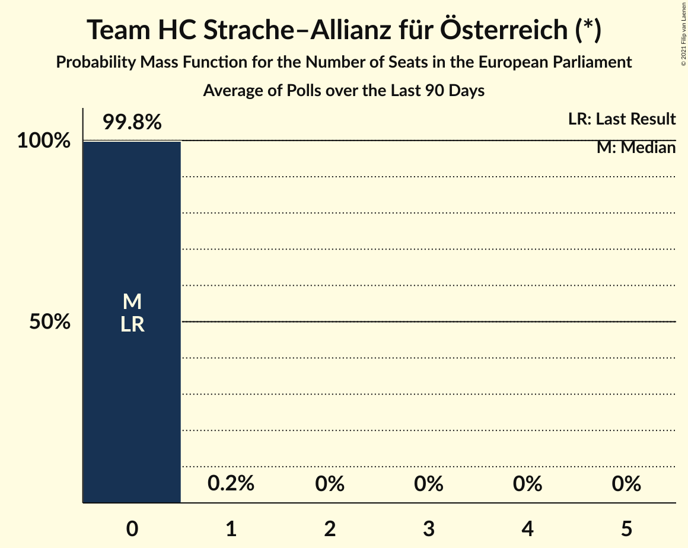

# Team HC Strache–Allianz für Österreich (*)

<a href="#voting-intentions">Voting Intentions</a> | <a href="#seats">Seats</a>

## Voting Intentions

Last result: **0.0%** (General Election of 26 May 2019)

### Confidence Intervals

| Period     | Polling firm/Commissioner(s) | Median | 80% Confidence Interval | 90% Confidence Interval | 95% Confidence Interval | 99% Confidence Interval |
|:----------:|:----------------:|:-----------:|:-----------------------:|:-----------------------:|:-----------------------:|:-----------------------:|
| N/A | [Poll Average](average.html) | 4.1% | 3.0–5.3% | 2.8–5.7% | 2.6–6.0% | 2.2–6.7% |
| [21–24 September 2020](2020-09-24-ResearchAffairs.html) | Research Affairs | 4.0% | 3.0–5.3% | 2.8–5.7% | 2.6–6.0% | 2.2–6.8% |
| [14–18 September 2020](2020-09-18-UniqueResearch.html) | Unique Research | 0.0% | N/A | N/A | N/A | N/A |
| [14–16 September 2020](2020-09-16-ResearchAffairs.html) | Research Affairs | 0.0% | N/A | N/A | N/A | N/A |
| [25–27 August 2020](2020-08-27-ResearchAffairs.html) | Research Affairs   ÖSTERREICH | 4.0% | 3.1–5.4% | 2.8–5.8% | 2.6–6.1% | 2.2–6.8% |
| [17–20 August 2020](2020-08-20-ResearchAffairs.html) | Research Affairs   ÖSTERREICH | 3.0% | 2.2–4.2% | 2.0–4.5% | 1.8–4.8% | 1.5–5.5% |
| [10–13 August 2020](2020-08-13-UniqueResearch.html) | Unique Research   profil | 0.0% | N/A | N/A | N/A | N/A |
| [20–22 July 2020](2020-07-22-ResearchAffairs.html) | Research Affairs   ÖSTERREICH | 4.0% | 3.1–5.4% | 2.8–5.8% | 2.6–6.1% | 2.2–6.8% |
| [13–16 July 2020](2020-07-16-UniqueResearch.html) | Unique Research   profil | 0.0% | N/A | N/A | N/A | N/A |
| [6–9 July 2020](2020-07-09-ResearchAffairs.html) | Research Affairs   ÖSTERREICH | 3.0% | 2.2–4.2% | 2.0–4.6% | 1.8–4.9% | 1.5–5.5% |
| [23–25 June 2020](2020-06-25-OGM.html) | OGM | 0.0% | N/A | N/A | N/A | N/A |
| [9–12 June 2020](2020-06-12-UniqueResearch.html) | Unique Research   profil | 0.0% | N/A | N/A | N/A | N/A |
| [5–10 June 2020](2020-06-10-ResearchAffairs.html) | Research Affairs   ÖSTERREICH | 3.0% | 2.4–3.8% | 2.2–4.1% | 2.1–4.3% | 1.9–4.7% |
| [5–9 June 2020](2020-06-09-KarmasinResearchIdentity.html) | Karmasin Research & Identity | 0.0% | N/A | N/A | N/A | N/A |
| [25–28 May 2020](2020-05-28-ResearchAffairs.html) | Research Affairs   ÖSTERREICH | 3.0% | 2.4–3.8% | 2.2–4.1% | 2.1–4.3% | 1.9–4.7% |
| [21–26 May 2020](2020-05-26-Market.html) | Market   Der Standard | 0.0% | N/A | N/A | N/A | N/A |
| [18–19 May 2020](2020-05-19-Market.html) | Market   Der Standard | 0.0% | N/A | N/A | N/A | N/A |
| [11–14 May 2020](2020-05-14-UniqueResearch.html) | Unique Research   profil | 0.0% | N/A | N/A | N/A | N/A |
| [11–13 May 2020](2020-05-13-Market.html) | Market   Der Standard | 0.0% | N/A | N/A | N/A | N/A |
| [20–22 April 2020](2020-04-22-Market.html) | Market | 0.0% | N/A | N/A | N/A | N/A |
| [13–16 April 2020](2020-04-16-UniqueResearch.html) | Unique Research   profil | 0.0% | N/A | N/A | N/A | N/A |
| [3–7 April 2020](2020-04-07-Market.html) | Market   Der Standard | 0.0% | N/A | N/A | N/A | N/A |
| [31 March–2 April 2020](2020-04-02-OGM.html) | OGM | 0.0% | N/A | N/A | N/A | N/A |
| [24–31 March 2020](2020-03-31-Market.html) | Market   Der Standard | 0.0% | N/A | N/A | N/A | N/A |
| [9–13 March 2020](2020-03-13-UniqueResearch.html) | Unique Research | 0.0% | N/A | N/A | N/A | N/A |
| [11–12 March 2020](2020-03-12-Market.html) | Market   Der Standard | 0.0% | N/A | N/A | N/A | N/A |
| [5–11 March 2020](2020-03-11-ResearchAffairs.html) | Research Affairs   ÖSTERREICH | 0.0% | N/A | N/A | N/A | N/A |
| [24–27 February 2020](2020-02-27-ResearchAffairs.html) | Research Affairs   ÖSTERREICH | 0.0% | N/A | N/A | N/A | N/A |
| [10–14 February 2020](2020-02-14-UniqueResearch.html) | Unique Research   profil | 0.0% | N/A | N/A | N/A | N/A |
| [7–12 February 2020](2020-02-12-ResearchAffairs.html) | Research Affairs | 0.0% | N/A | N/A | N/A | N/A |
| [4–6 February 2020](2020-02-06-Market.html) | Market | 0.0% | N/A | N/A | N/A | N/A |
| [28–31 January 2020](2020-01-31-ResearchAffairs.html) | Research Affairs   ÖSTERREICH | 0.0% | N/A | N/A | N/A | N/A |
| [17–23 January 2020](2020-01-23-ResearchAffairs.html) | Research Affairs | 0.0% | N/A | N/A | N/A | N/A |
| [10–16 January 2020](2020-01-16-ResearchAffairs.html) | Research Affairs   ÖSTERREICH | 0.0% | N/A | N/A | N/A | N/A |
| [10–15 January 2020](2020-01-15-KarmasinResearchIdentity.html) | Karmasin Research & Identity | 0.0% | N/A | N/A | N/A | N/A |
| [6–10 January 2020](2020-01-10-UniqueResearch.html) | Unique Research   profil | 0.0% | N/A | N/A | N/A | N/A |
| [3–9 January 2020](2020-01-09-ResearchAffairs.html) | Research Affairs   ÖSTERREICH | 0.0% | N/A | N/A | N/A | N/A |
| [12–19 December 2019](2019-12-19-ResearchAffairs.html) | Research Affairs   ÖSTERREICH | 0.0% | N/A | N/A | N/A | N/A |
| [16–19 December 2019](2019-12-19-Market.html) | Market   Der Standard | 0.0% | N/A | N/A | N/A | N/A |
| [9–13 December 2019](2019-12-13-UniqueResearch.html) | Unique Research   profil | 0.0% | N/A | N/A | N/A | N/A |
| [6–12 December 2019](2019-12-12-ResearchAffairs.html) | Research Affairs   ÖSTERREICH | 0.0% | N/A | N/A | N/A | N/A |
| [29 November–5 December 2019](2019-12-05-ResearchAffairs.html) | Research Affairs   ÖSTERREICH | 0.0% | N/A | N/A | N/A | N/A |
| [29 November–4 December 2019](2019-12-04-Market.html) | Market   Der Standard | 0.0% | N/A | N/A | N/A | N/A |
| [22–28 November 2019](2019-11-28-ResearchAffairs.html) | Research Affairs   ÖSTERREICH | 0.0% | N/A | N/A | N/A | N/A |
| [15–21 November 2019](2019-11-21-ResearchAffairs.html) | Research Affairs   ÖSTERREICH | 0.0% | N/A | N/A | N/A | N/A |
| [11–15 November 2019](2019-11-15-UniqueResearch.html) | Unique Research   profil | 0.0% | N/A | N/A | N/A | N/A |
| [8–14 November 2019](2019-11-14-ResearchAffairs.html) | Research Affairs   ÖSTERREICH | 0.0% | N/A | N/A | N/A | N/A |
| [8–13 November 2019](2019-11-13-KarmasinResearchIdentity.html) | Karmasin Research & Identity | 0.0% | N/A | N/A | N/A | N/A |
| [2–7 November 2019](2019-11-07-ResearchAffairs.html) | Research Affairs   ÖSTERREICH | 0.0% | N/A | N/A | N/A | N/A |
| [26–31 October 2019](2019-10-31-ResearchAffairs.html) | Research Affairs   ÖSTERREICH | 0.0% | N/A | N/A | N/A | N/A |
| [22–25 October 2019](2019-10-25-ResearchAffairs.html) | Research Affairs   ÖSTERREICH | 0.0% | N/A | N/A | N/A | N/A |
| [15–17 October 2019](2019-10-17-Market.html) | Market   Der Standard | 0.0% | N/A | N/A | N/A | N/A |
| [10–16 October 2019](2019-10-16-ResearchAffairs.html) | Research Affairs   ÖSTERREICH | 0.0% | N/A | N/A | N/A | N/A |
| [7–11 October 2019](2019-10-11-UniqueResearch.html) | Unique Research   profil | 0.0% | N/A | N/A | N/A | N/A |
| [16–23 September 2019](2019-09-23-OGM.html) | OGM   Servus TV | 0.0% | N/A | N/A | N/A | N/A |
| [19–22 September 2019](2019-09-22-ResearchAffairs.html) | Research Affairs   ÖSTERREICH | 0.0% | N/A | N/A | N/A | N/A |
| [12–20 September 2019](2019-09-20-PeterHajek.html) | Peter Hajek   ATV, PULS 4 and Servus TV | 0.0% | N/A | N/A | N/A | N/A |
| [13–18 September 2019](2019-09-18-ResearchAffairs.html) | Research Affairs   ÖSTERREICH | 0.0% | N/A | N/A | N/A | N/A |
| [16–18 September 2019](2019-09-18-Market.html) | Market   Der Standard | 0.0% | N/A | N/A | N/A | N/A |
| [1–18 September 2019](2019-09-18-InstitutfürGrundlagenforschung.html) | Institut für Grundlagenforschung | 0.0% | N/A | N/A | N/A | N/A |
| [11–17 September 2019](2019-09-17-KarmasinResearchIdentity.html) | Karmasin Research & Identity | 0.0% | N/A | N/A | N/A | N/A |
| [2–13 September 2019](2019-09-13-UniqueResearch.html) | Unique Research   profil | 0.0% | N/A | N/A | N/A | N/A |
| [6–13 September 2019](2019-09-13-OGM.html) | OGM   KURIER | 0.0% | N/A | N/A | N/A | N/A |
| [6–11 September 2019](2019-09-11-ResearchAffairs.html) | Research Affairs   ÖSTERREICH | 0.0% | N/A | N/A | N/A | N/A |
| [5–10 September 2019](2019-09-10-KarmasinResearchIdentity.html) | Karmasin Research & Identity   PULS 24 | 0.0% | N/A | N/A | N/A | N/A |
| [5–8 September 2019](2019-09-08-Market.html) | Market   Der Standard | 0.0% | N/A | N/A | N/A | N/A |
| [30 August–4 September 2019](2019-09-04-ResearchAffairs.html) | Research Affairs   ÖSTERREICH | 0.0% | N/A | N/A | N/A | N/A |
| [2–4 September 2019](2019-09-04-Market.html) | Market   Der Standard | 0.0% | N/A | N/A | N/A | N/A |
| [29 August–3 September 2019](2019-09-03-KarmasinResearchIdentity.html) | Karmasin Research & Identity   PULS 24 | 0.0% | N/A | N/A | N/A | N/A |
| [22–28 August 2019](2019-08-28-ResearchAffairs.html) | Research Affairs   ÖSTERREICH | 0.0% | N/A | N/A | N/A | N/A |
| [19–22 August 2019](2019-08-22-UniqueResearch.html) | Unique Research   profil | 0.0% | N/A | N/A | N/A | N/A |
| [16–21 August 2019](2019-08-21-ResearchAffairs.html) | Research Affairs   ÖSTERREICH | 0.0% | N/A | N/A | N/A | N/A |
| [9–14 August 2019](2019-08-14-ResearchAffairs.html) | Research Affairs   ÖSTERREICH | 0.0% | N/A | N/A | N/A | N/A |
| [8–12 August 2019](2019-08-12-OGM.html) | OGM   KURIER | 0.0% | N/A | N/A | N/A | N/A |
| [26 July–9 August 2019](2019-08-09-KowarczMarktforschung.html) | Kowarcz Marktforschung | 0.0% | N/A | N/A | N/A | N/A |
| [1–7 August 2019](2019-08-07-ResearchAffairs.html) | Research Affairs   ÖSTERREICH | 0.0% | N/A | N/A | N/A | N/A |
| [2–5 August 2019](2019-08-05-Market.html) | Market   Der Standard | 0.0% | N/A | N/A | N/A | N/A |
| [25–31 July 2019](2019-07-31-ResearchAffairs.html) | Research Affairs   ÖSTERREICH | 0.0% | N/A | N/A | N/A | N/A |
| [18–24 July 2019](2019-07-24-ResearchAffairs.html) | Research Affairs   ÖSTERREICH | 0.0% | N/A | N/A | N/A | N/A |
| [5–17 July 2019](2019-07-17-ResearchAffairs.html) | Research Affairs   ÖSTERREICH | 0.0% | N/A | N/A | N/A | N/A |
| [8–12 July 2019](2019-07-12-UniqueResearch.html) | Unique Research   profil | 0.0% | N/A | N/A | N/A | N/A |
| [5–10 July 2019](2019-07-10-ResearchAffairs.html) | Research Affairs   ÖSTERREICH | 0.0% | N/A | N/A | N/A | N/A |
| [8–9 July 2019](2019-07-09-Market.html) | Market   Der Standard | 0.0% | N/A | N/A | N/A | N/A |
| [27 June–4 July 2019](2019-07-04-ResearchAffairs.html) | Research Affairs   ÖSTERREICH | 0.0% | N/A | N/A | N/A | N/A |
| [24–28 June 2019](2019-06-28-PeterHajek.html) | Peter Hajek   ATV | 0.0% | N/A | N/A | N/A | N/A |
| [14–20 June 2019](2019-06-20-ResearchAffairs.html) | Research Affairs   ÖSTERREICH | 0.0% | N/A | N/A | N/A | N/A |
| [31 May–10 June 2019](2019-06-10-SORA.html) | SORA   ORF | 0.0% | N/A | N/A | N/A | N/A |
| [5–6 June 2019](2019-06-06-Market.html) | Market   Der Standard | 0.0% | N/A | N/A | N/A | N/A |
| [31 May–5 June 2019](2019-06-05-UniqueResearch.html) | Unique Research | 0.0% | N/A | N/A | N/A | N/A |
| [29 May–4 June 2019](2019-06-04-ResearchAffairs.html) | Research Affairs   ÖSTERREICH | 0.0% | N/A | N/A | N/A | N/A |
| [29–31 May 2019](2019-05-31-UniqueResearch.html) | Unique Research | 0.0% | N/A | N/A | N/A | N/A |
| [29–31 May 2019](2019-05-31-ResearchAffairs.html) | Research Affairs   ÖSTERREICH | 0.0% | N/A | N/A | N/A | N/A |
| [1–31 May 2019](2019-05-31-DemoxResearch.html) | Demox Research | 0.0% | N/A | N/A | N/A | N/A |
| [27–29 May 2019](2019-05-29-OGM.html) | OGM   KURIER | 0.0% | N/A | N/A | N/A | N/A |

### Probability Mass Function

The following table shows the probability mass function per percentage block of voting intentions for the [poll average](average.html) for Team HC Strache–Allianz für Österreich (*).

| Voting Intentions | Probability | Accumulated | Special Marks |
|:-----------------:|:-----------:|:-----------:|:-------------:|
| 0.0–0.5% | 0% | 100% | Last Result |
| 0.5–1.5% | 0% | 100% |  |
| 1.5–2.5% | 2% | 100% |  |
| 2.5–3.5% | 24% | 98% |  |
| 3.5–4.5% | 44% | 73% | Median |
| 4.5–5.5% | 23% | 30% |  |
| 5.5–6.5% | 6% | 6% |  |
| 6.5–7.5% | 0.7% | 0.8% |  |
| 7.5–8.5% | 0.1% | 0.1% |  |
| 8.5–9.5% | 0% | 0% |  |

## Seats

Last result: **0** seats (General Election of 26 May 2019)

### Confidence Intervals

| Period     | Polling firm/Commissioner(s) | Median | 80% Confidence Interval | 90% Confidence Interval | 95% Confidence Interval | 99% Confidence Interval |
|:----------:|:----------------:|:------:|:-----------------------:|:-----------------------:|:-----------------------:|:-----------------------:|
| N/A | [Poll Average](average.html) | 0 | 0–1 | 0–1 | 0–1 | 0–1 |
| [21–24 September 2020](2020-09-24-ResearchAffairs.html) | Research Affairs | 0 | 0–1 | 0–1 | 0–1 | 0–1 |
| [14–18 September 2020](2020-09-18-UniqueResearch.html) | Unique Research |  |  |  |  |  |
| [14–16 September 2020](2020-09-16-ResearchAffairs.html) | Research Affairs |  |  |  |  |  |
| [25–27 August 2020](2020-08-27-ResearchAffairs.html) | Research Affairs   ÖSTERREICH | 0 | 0–1 | 0–1 | 0–1 | 0–1 |
| [17–20 August 2020](2020-08-20-ResearchAffairs.html) | Research Affairs   ÖSTERREICH | 0 | 0 | 0–1 | 0–1 | 0–1 |
| [10–13 August 2020](2020-08-13-UniqueResearch.html) | Unique Research   profil |  |  |  |  |  |
| [20–22 July 2020](2020-07-22-ResearchAffairs.html) | Research Affairs   ÖSTERREICH | 0 | 0–1 | 0–1 | 0–1 | 0–1 |
| [13–16 July 2020](2020-07-16-UniqueResearch.html) | Unique Research   profil |  |  |  |  |  |
| [6–9 July 2020](2020-07-09-ResearchAffairs.html) | Research Affairs   ÖSTERREICH | 0 | 0 | 0–1 | 0–1 | 0–1 |
| [23–25 June 2020](2020-06-25-OGM.html) | OGM |  |  |  |  |  |
| [9–12 June 2020](2020-06-12-UniqueResearch.html) | Unique Research   profil |  |  |  |  |  |
| [5–10 June 2020](2020-06-10-ResearchAffairs.html) | Research Affairs   ÖSTERREICH | 0 | 0 | 0 | 0 | 0–1 |
| [5–9 June 2020](2020-06-09-KarmasinResearchIdentity.html) | Karmasin Research & Identity |  |  |  |  |  |
| [25–28 May 2020](2020-05-28-ResearchAffairs.html) | Research Affairs   ÖSTERREICH | 0 | 0 | 0 | 0 | 0–1 |
| [21–26 May 2020](2020-05-26-Market.html) | Market   Der Standard |  |  |  |  |  |
| [18–19 May 2020](2020-05-19-Market.html) | Market   Der Standard |  |  |  |  |  |
| [11–14 May 2020](2020-05-14-UniqueResearch.html) | Unique Research   profil |  |  |  |  |  |
| [11–13 May 2020](2020-05-13-Market.html) | Market   Der Standard |  |  |  |  |  |
| [20–22 April 2020](2020-04-22-Market.html) | Market |  |  |  |  |  |
| [13–16 April 2020](2020-04-16-UniqueResearch.html) | Unique Research   profil |  |  |  |  |  |
| [3–7 April 2020](2020-04-07-Market.html) | Market   Der Standard |  |  |  |  |  |
| [31 March–2 April 2020](2020-04-02-OGM.html) | OGM |  |  |  |  |  |
| [24–31 March 2020](2020-03-31-Market.html) | Market   Der Standard |  |  |  |  |  |
| [9–13 March 2020](2020-03-13-UniqueResearch.html) | Unique Research |  |  |  |  |  |
| [11–12 March 2020](2020-03-12-Market.html) | Market   Der Standard |  |  |  |  |  |
| [5–11 March 2020](2020-03-11-ResearchAffairs.html) | Research Affairs   ÖSTERREICH |  |  |  |  |  |
| [24–27 February 2020](2020-02-27-ResearchAffairs.html) | Research Affairs   ÖSTERREICH |  |  |  |  |  |
| [10–14 February 2020](2020-02-14-UniqueResearch.html) | Unique Research   profil |  |  |  |  |  |
| [7–12 February 2020](2020-02-12-ResearchAffairs.html) | Research Affairs |  |  |  |  |  |
| [4–6 February 2020](2020-02-06-Market.html) | Market |  |  |  |  |  |
| [28–31 January 2020](2020-01-31-ResearchAffairs.html) | Research Affairs   ÖSTERREICH |  |  |  |  |  |
| [17–23 January 2020](2020-01-23-ResearchAffairs.html) | Research Affairs |  |  |  |  |  |
| [10–16 January 2020](2020-01-16-ResearchAffairs.html) | Research Affairs   ÖSTERREICH |  |  |  |  |  |
| [10–15 January 2020](2020-01-15-KarmasinResearchIdentity.html) | Karmasin Research & Identity |  |  |  |  |  |
| [6–10 January 2020](2020-01-10-UniqueResearch.html) | Unique Research   profil |  |  |  |  |  |
| [3–9 January 2020](2020-01-09-ResearchAffairs.html) | Research Affairs   ÖSTERREICH |  |  |  |  |  |
| [12–19 December 2019](2019-12-19-ResearchAffairs.html) | Research Affairs   ÖSTERREICH |  |  |  |  |  |
| [16–19 December 2019](2019-12-19-Market.html) | Market   Der Standard |  |  |  |  |  |
| [9–13 December 2019](2019-12-13-UniqueResearch.html) | Unique Research   profil |  |  |  |  |  |
| [6–12 December 2019](2019-12-12-ResearchAffairs.html) | Research Affairs   ÖSTERREICH |  |  |  |  |  |
| [29 November–5 December 2019](2019-12-05-ResearchAffairs.html) | Research Affairs   ÖSTERREICH |  |  |  |  |  |
| [29 November–4 December 2019](2019-12-04-Market.html) | Market   Der Standard |  |  |  |  |  |
| [22–28 November 2019](2019-11-28-ResearchAffairs.html) | Research Affairs   ÖSTERREICH |  |  |  |  |  |
| [15–21 November 2019](2019-11-21-ResearchAffairs.html) | Research Affairs   ÖSTERREICH |  |  |  |  |  |
| [11–15 November 2019](2019-11-15-UniqueResearch.html) | Unique Research   profil |  |  |  |  |  |
| [8–14 November 2019](2019-11-14-ResearchAffairs.html) | Research Affairs   ÖSTERREICH |  |  |  |  |  |
| [8–13 November 2019](2019-11-13-KarmasinResearchIdentity.html) | Karmasin Research & Identity |  |  |  |  |  |
| [2–7 November 2019](2019-11-07-ResearchAffairs.html) | Research Affairs   ÖSTERREICH |  |  |  |  |  |
| [26–31 October 2019](2019-10-31-ResearchAffairs.html) | Research Affairs   ÖSTERREICH |  |  |  |  |  |
| [22–25 October 2019](2019-10-25-ResearchAffairs.html) | Research Affairs   ÖSTERREICH |  |  |  |  |  |
| [15–17 October 2019](2019-10-17-Market.html) | Market   Der Standard |  |  |  |  |  |
| [10–16 October 2019](2019-10-16-ResearchAffairs.html) | Research Affairs   ÖSTERREICH |  |  |  |  |  |
| [7–11 October 2019](2019-10-11-UniqueResearch.html) | Unique Research   profil |  |  |  |  |  |
| [16–23 September 2019](2019-09-23-OGM.html) | OGM   Servus TV |  |  |  |  |  |
| [19–22 September 2019](2019-09-22-ResearchAffairs.html) | Research Affairs   ÖSTERREICH |  |  |  |  |  |
| [12–20 September 2019](2019-09-20-PeterHajek.html) | Peter Hajek   ATV, PULS 4 and Servus TV |  |  |  |  |  |
| [13–18 September 2019](2019-09-18-ResearchAffairs.html) | Research Affairs   ÖSTERREICH |  |  |  |  |  |
| [16–18 September 2019](2019-09-18-Market.html) | Market   Der Standard |  |  |  |  |  |
| [1–18 September 2019](2019-09-18-InstitutfürGrundlagenforschung.html) | Institut für Grundlagenforschung |  |  |  |  |  |
| [11–17 September 2019](2019-09-17-KarmasinResearchIdentity.html) | Karmasin Research & Identity |  |  |  |  |  |
| [2–13 September 2019](2019-09-13-UniqueResearch.html) | Unique Research   profil |  |  |  |  |  |
| [6–13 September 2019](2019-09-13-OGM.html) | OGM   KURIER |  |  |  |  |  |
| [6–11 September 2019](2019-09-11-ResearchAffairs.html) | Research Affairs   ÖSTERREICH |  |  |  |  |  |
| [5–10 September 2019](2019-09-10-KarmasinResearchIdentity.html) | Karmasin Research & Identity   PULS 24 |  |  |  |  |  |
| [5–8 September 2019](2019-09-08-Market.html) | Market   Der Standard |  |  |  |  |  |
| [30 August–4 September 2019](2019-09-04-ResearchAffairs.html) | Research Affairs   ÖSTERREICH |  |  |  |  |  |
| [2–4 September 2019](2019-09-04-Market.html) | Market   Der Standard |  |  |  |  |  |
| [29 August–3 September 2019](2019-09-03-KarmasinResearchIdentity.html) | Karmasin Research & Identity   PULS 24 |  |  |  |  |  |
| [22–28 August 2019](2019-08-28-ResearchAffairs.html) | Research Affairs   ÖSTERREICH |  |  |  |  |  |
| [19–22 August 2019](2019-08-22-UniqueResearch.html) | Unique Research   profil |  |  |  |  |  |
| [16–21 August 2019](2019-08-21-ResearchAffairs.html) | Research Affairs   ÖSTERREICH |  |  |  |  |  |
| [9–14 August 2019](2019-08-14-ResearchAffairs.html) | Research Affairs   ÖSTERREICH |  |  |  |  |  |
| [8–12 August 2019](2019-08-12-OGM.html) | OGM   KURIER |  |  |  |  |  |
| [26 July–9 August 2019](2019-08-09-KowarczMarktforschung.html) | Kowarcz Marktforschung |  |  |  |  |  |
| [1–7 August 2019](2019-08-07-ResearchAffairs.html) | Research Affairs   ÖSTERREICH |  |  |  |  |  |
| [2–5 August 2019](2019-08-05-Market.html) | Market   Der Standard |  |  |  |  |  |
| [25–31 July 2019](2019-07-31-ResearchAffairs.html) | Research Affairs   ÖSTERREICH |  |  |  |  |  |
| [18–24 July 2019](2019-07-24-ResearchAffairs.html) | Research Affairs   ÖSTERREICH |  |  |  |  |  |
| [5–17 July 2019](2019-07-17-ResearchAffairs.html) | Research Affairs   ÖSTERREICH |  |  |  |  |  |
| [8–12 July 2019](2019-07-12-UniqueResearch.html) | Unique Research   profil |  |  |  |  |  |
| [5–10 July 2019](2019-07-10-ResearchAffairs.html) | Research Affairs   ÖSTERREICH |  |  |  |  |  |
| [8–9 July 2019](2019-07-09-Market.html) | Market   Der Standard |  |  |  |  |  |
| [27 June–4 July 2019](2019-07-04-ResearchAffairs.html) | Research Affairs   ÖSTERREICH |  |  |  |  |  |
| [24–28 June 2019](2019-06-28-PeterHajek.html) | Peter Hajek   ATV |  |  |  |  |  |
| [14–20 June 2019](2019-06-20-ResearchAffairs.html) | Research Affairs   ÖSTERREICH |  |  |  |  |  |
| [31 May–10 June 2019](2019-06-10-SORA.html) | SORA   ORF |  |  |  |  |  |
| [5–6 June 2019](2019-06-06-Market.html) | Market   Der Standard |  |  |  |  |  |
| [31 May–5 June 2019](2019-06-05-UniqueResearch.html) | Unique Research |  |  |  |  |  |
| [29 May–4 June 2019](2019-06-04-ResearchAffairs.html) | Research Affairs   ÖSTERREICH |  |  |  |  |  |
| [29–31 May 2019](2019-05-31-UniqueResearch.html) | Unique Research |  |  |  |  |  |
| [29–31 May 2019](2019-05-31-ResearchAffairs.html) | Research Affairs   ÖSTERREICH |  |  |  |  |  |
| [1–31 May 2019](2019-05-31-DemoxResearch.html) | Demox Research |  |  |  |  |  |
| [27–29 May 2019](2019-05-29-OGM.html) | OGM   KURIER |  |  |  |  |  |

### Probability Mass Function

The following table shows the probability mass function per seat for the [poll average](average.html) for Team HC Strache–Allianz für Österreich (*).

| Number of Seats | Probability | Accumulated | Special Marks |
|:---------------:|:-----------:|:-----------:|:-------------:|
| 0 | 67% | 100% | Last Result, Median |
| 1 | 33% | 33% |  |
| 2 | 0% | 0% |  |

