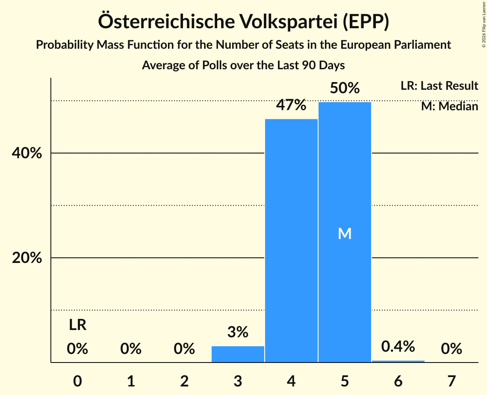

# Österreichische Volkspartei (EPP)

<a href="#voting-intentions">Voting Intentions</a> | <a href="#seats">Seats</a>

## Voting Intentions

Last result: **0.0%** (General Election of 9 June 2024)

### Confidence Intervals

| Period     | Polling firm/Commissioner(s) | Median | 80% Confidence Interval | 90% Confidence Interval | 95% Confidence Interval | 99% Confidence Interval |
|:----------:|:----------------:|:-----------:|:-----------------------:|:-----------------------:|:-----------------------:|:-----------------------:|
| N/A | [Poll Average](average.html) | 20.9% | 19.1–24.1% | 18.6–24.9% | 18.2–25.6% | 17.3–26.7% |
| [3–4 January 2025](2025-01-04-IFDD.html) | IFDD   Kronen Zeitung | 21.0% | 19.6–22.6% | 19.2–23.0% | 18.9–23.4% | 18.2–24.1% |
| [17–18 December 2024](2024-12-18-IFDD.html) | IFDD   Kronen Zeitung | 21.0% | 19.6–22.6% | 19.2–23.0% | 18.9–23.4% | 18.2–24.1% |
| [16–17 December 2024](2024-12-17-Market.html) | Market   ÖSTERREICH | 20.0% | 18.9–21.2% | 18.6–21.5% | 18.3–21.8% | 17.8–22.4% |
| [9–10 December 2024](2024-12-10-Market.html) | Market   ÖSTERREICH | 21.0% | N/A | N/A | N/A | N/A |
| [2–4 December 2024](2024-12-04-UniqueResearch.html) | Unique Research   Heute | 20.0% | 18.3–21.9% | 17.8–22.5% | 17.4–22.9% | 16.6–23.9% |
| [2–4 December 2024](2024-12-04-INSA.html) | INSA   eXXpress | 21.0% | 19.4–22.7% | 19.0–23.2% | 18.6–23.7% | 17.9–24.5% |
| [2–3 December 2024](2024-12-03-Market.html) | Market   ÖSTERREICH | 20.0% | 18.9–21.2% | 18.6–21.5% | 18.3–21.8% | 17.8–22.4% |
| [25–26 November 2024](2024-11-26-OGM.html) | OGM | 24.0% | 22.3–25.8% | 21.8–26.3% | 21.4–26.7% | 20.7–27.6% |
| [25–26 November 2024](2024-11-26-Market.html) | Market   ÖSTERREICH | 21.0% | 19.9–22.2% | 19.5–22.6% | 19.3–22.8% | 18.7–23.4% |
| [18–19 November 2024](2024-11-19-Market.html) | Market   ÖSTERREICH | 23.0% | N/A | N/A | N/A | N/A |
| [11–13 November 2024](2024-11-13-INSA.html) | INSA   eXXpress | 22.0% | 20.4–23.7% | 19.9–24.2% | 19.5–24.7% | 18.8–25.5% |
| [11–12 November 2024](2024-11-12-Market.html) | Market   ÖSTERREICH | 23.0% | 21.8–24.2% | 21.5–24.6% | 21.2–24.9% | 20.7–25.5% |
| [4–5 November 2024](2024-11-05-Market.html) | Market   ÖSTERREICH | 23.0% | N/A | N/A | N/A | N/A |
| [28–29 October 2024](2024-10-29-Market.html) | Market   ÖSTERREICH | 23.0% | 21.8–24.2% | 21.5–24.6% | 21.2–24.9% | 20.7–25.5% |
| [25–28 October 2024](2024-10-28-OGM.html) | OGM   Servus TV | 25.0% | 23.3–26.8% | 22.8–27.3% | 22.4–27.8% | 21.6–28.7% |
| [21–22 October 2024](2024-10-22-Market.html) | Market   ÖSTERREICH | 23.0% | N/A | N/A | N/A | N/A |
| [14–15 October 2024](2024-10-15-Market.html) | Market   ÖSTERREICH | 25.0% | N/A | N/A | N/A | N/A |
| [7–8 October 2024](2024-10-08-Market.html) | Market   ÖSTERREICH | 26.0% | 24.8–27.3% | 24.4–27.7% | 24.1–28.0% | 23.5–28.6% |
| [30 September–1 October 2024](2024-10-01-Market.html) | Market   ÖSTERREICH | 25.0% | N/A | N/A | N/A | N/A |
| [19–22 September 2024](2024-09-22-IFDD.html) | IFDD   ATV, Kronen Zeitung and PULS 24 | 25.0% | 23.3–26.8% | 22.8–27.3% | 22.4–27.8% | 21.6–28.7% |
| [16–18 September 2024](2024-09-18-OGM.html) | OGM   Servus TV | 25.0% | 23.4–26.9% | 22.9–27.4% | 22.5–27.8% | 21.7–28.7% |
| [9–17 September 2024](2024-09-17-Market.html) | Market   ÖSTERREICH | 25.0% | 23.7–26.2% | 23.4–26.6% | 23.1–26.9% | 22.5–27.5% |
| [5–11 September 2024](2024-09-11-UniqueResearch.html) | Unique Research   Heute | 25.0% | 23.1–27.0% | 22.6–27.6% | 22.1–28.1% | 21.2–29.1% |
| [9–11 September 2024](2024-09-11-INSA.html) | INSA   eXXpress | 23.0% | 21.4–24.8% | 20.9–25.3% | 20.5–25.7% | 19.7–26.6% |
| [9–10 September 2024](2024-09-10-Market.html) | Market   ÖSTERREICH | 25.0% | N/A | N/A | N/A | N/A |
| [2–9 September 2024](2024-09-09-Spectra.html) | Spectra   Kleine Zeitung, OÖNachrichten and Salzburger Nachrichten | 24.0% | 22.3–25.8% | 21.9–26.3% | 21.4–26.7% | 20.7–27.6% |
| [2–6 September 2024](2024-09-06-IFDD.html) | IFDD   Kronen Zeitung | 25.0% | N/A | N/A | N/A | N/A |
| [28 August–4 September 2024](2024-09-04-UniqueResearch.html) | Unique Research   profil | 23.9% | N/A | N/A | N/A | N/A |
| [2–4 September 2024](2024-09-04-Market.html) | Market   ÖSTERREICH | 26.0% | N/A | N/A | N/A | N/A |
| [26 August–3 September 2024](2024-09-03-TripleM.html) | Triple M   News | 23.0% | 21.4–24.8% | 20.9–25.3% | 20.5–25.7% | 19.7–26.6% |
| [1–31 August 2024](2024-08-31-OGM.html) | OGM   Servus TV | 22.9% | 20.7–25.4% | 20.1–26.1% | 19.5–26.7% | 18.5–28.0% |
| [26–27 August 2024](2024-08-27-Market.html) | Market | 23.0% | 21.8–24.2% | 21.5–24.6% | 21.2–24.9% | 20.7–25.5% |
| [23–26 August 2024](2024-08-26-IFDD.html) | IFDD   Radio Content Austria | 25.0% | 23.3–26.9% | 22.8–27.4% | 22.4–27.8% | 21.6–28.7% |
| [19–22 August 2024](2024-08-22-OGM.html) | OGM   Servus TV | 24.0% | N/A | N/A | N/A | N/A |
| [19–20 August 2024](2024-08-20-Market.html) | Market   ÖSTERREICH | 22.0% | 20.8–23.2% | 20.5–23.6% | 20.2–23.9% | 19.7–24.5% |
| [5–7 August 2024](2024-08-07-INSA.html) | INSA   eXXpress | 19.0% | 17.5–20.7% | 17.1–21.1% | 16.7–21.6% | 16.0–22.4% |
| [5–6 August 2024](2024-08-06-Market.html) | Market   ÖSTERREICH | 23.0% | N/A | N/A | N/A | N/A |
| [22–30 July 2024](2024-07-30-Market.html) | Market   ÖSTERREICH | 23.0% | 21.8–24.2% | 21.5–24.6% | 21.2–24.9% | 20.7–25.5% |
| [25–26 July 2024](2024-07-26-IFDD.html) | IFDD   Radio Content Austria | 24.9% | 23.3–26.6% | 22.8–27.1% | 22.4–27.6% | 21.7–28.4% |
| [15–24 July 2024](2024-07-24-Market.html) | Market   ÖSTERREICH | 24.0% | N/A | N/A | N/A | N/A |
| [12–21 July 2024](2024-07-21-Spectra.html) | Spectra   Kleine Zeitung, OÖNachrichten and Salzburger Nachrichten | 22.0% | 20.4–23.7% | 19.9–24.2% | 19.5–24.7% | 18.8–25.5% |
| [8–12 July 2024](2024-07-12-UniqueResearch.html) | Unique Research   Kronen Zeitung | 23.0% | 21.4–24.8% | 20.9–25.3% | 20.5–25.7% | 19.7–26.6% |
| [8–11 July 2024](2024-07-11-Market.html) | Market   Der Standard | 22.0% | N/A | N/A | N/A | N/A |
| [8–10 July 2024](2024-07-10-Market.html) | Market   ÖSTERREICH | 22.0% | N/A | N/A | N/A | N/A |
| [1–2 July 2024](2024-07-02-Market.html) | Market | 24.0% | N/A | N/A | N/A | N/A |
| [24–26 June 2024](2024-06-26-OGM.html) | OGM   KURIER | 24.0% | 22.4–25.8% | 21.9–26.3% | 21.5–26.8% | 20.7–27.6% |
| [24–25 June 2024](2024-06-25-Market.html) | Market   ÖSTERREICH | 24.0% | N/A | N/A | N/A | N/A |
| [12–19 June 2024](2024-06-19-UniqueResearch.html) | Unique Research   profil | 23.0% | N/A | N/A | N/A | N/A |
| [10–19 June 2024](2024-06-19-Market.html) | Market   ÖSTERREICH | 23.0% | N/A | N/A | N/A | N/A |
| [10–13 June 2024](2024-06-13-UniqueResearch.html) | Unique Research   Heute | 23.0% | N/A | N/A | N/A | N/A |
| [10–11 June 2024](2024-06-11-OGM.html) | OGM   Servus TV | 23.0% | N/A | N/A | N/A | N/A |
| [10–11 June 2024](2024-06-11-Market.html) | Market   ÖSTERREICH | 22.0% | N/A | N/A | N/A | N/A |

### Probability Mass Function

The following table shows the probability mass function per percentage block of voting intentions for the [poll average](average.html) for Österreichische Volkspartei (EPP).

| Voting Intentions | Probability | Accumulated | Special Marks |
|:-----------------:|:-----------:|:-----------:|:-------------:|
| 0.0–0.5% | 0% | 100% | Last Result |
| 0.5–1.5% | 0% | 100% |  |
| 1.5–2.5% | 0% | 100% |  |
| 2.5–3.5% | 0% | 100% |  |
| 3.5–4.5% | 0% | 100% |  |
| 4.5–5.5% | 0% | 100% |  |
| 5.5–6.5% | 0% | 100% |  |
| 6.5–7.5% | 0% | 100% |  |
| 7.5–8.5% | 0% | 100% |  |
| 8.5–9.5% | 0% | 100% |  |
| 9.5–10.5% | 0% | 100% |  |
| 10.5–11.5% | 0% | 100% |  |
| 11.5–12.5% | 0% | 100% |  |
| 12.5–13.5% | 0% | 100% |  |
| 13.5–14.5% | 0% | 100% |  |
| 14.5–15.5% | 0% | 100% |  |
| 15.5–16.5% | 0.1% | 100% |  |
| 16.5–17.5% | 0.7% | 99.9% |  |
| 17.5–18.5% | 4% | 99.2% |  |
| 18.5–19.5% | 13% | 96% |  |
| 19.5–20.5% | 23% | 83% |  |
| 20.5–21.5% | 22% | 59% | Median |
| 21.5–22.5% | 14% | 37% |  |
| 22.5–23.5% | 9% | 23% |  |
| 23.5–24.5% | 7% | 14% |  |
| 24.5–25.5% | 4% | 7% |  |
| 25.5–26.5% | 2% | 3% |  |
| 26.5–27.5% | 0.5% | 0.6% |  |
| 27.5–28.5% | 0.1% | 0.1% |  |
| 28.5–29.5% | 0% | 0% |  |

## Seats

Last result: **0** seats (General Election of 9 June 2024)

### Confidence Intervals

| Period     | Polling firm/Commissioner(s) | Median | 80% Confidence Interval | 90% Confidence Interval | 95% Confidence Interval | 99% Confidence Interval |
|:----------:|:----------------:|:------:|:-----------------------:|:-----------------------:|:-----------------------:|:-----------------------:|
| N/A | [Poll Average](average.html) | 4 | 4–5 | 4–5 | 4–5 | 4–6 |
| [3–4 January 2025](2025-01-04-IFDD.html) | IFDD   Kronen Zeitung | 4 | 4–5 | 4–5 | 4–5 | 4–5 |
| [17–18 December 2024](2024-12-18-IFDD.html) | IFDD   Kronen Zeitung | 4 | 4–5 | 4–5 | 4–5 | 4–5 |
| [16–17 December 2024](2024-12-17-Market.html) | Market   ÖSTERREICH | 4 | 4–5 | 4–5 | 4–5 | 4–5 |
| [9–10 December 2024](2024-12-10-Market.html) | Market   ÖSTERREICH |  |  |  |  |  |
| [2–4 December 2024](2024-12-04-UniqueResearch.html) | Unique Research   Heute | 4 | 4–5 | 4–5 | 4–5 | 3–5 |
| [2–4 December 2024](2024-12-04-INSA.html) | INSA   eXXpress | 5 | 4–5 | 4–5 | 4–5 | 4–5 |
| [2–3 December 2024](2024-12-03-Market.html) | Market   ÖSTERREICH | 4 | 4–5 | 4–5 | 4–5 | 4–5 |
| [25–26 November 2024](2024-11-26-OGM.html) | OGM | 5 | 5 | 4–6 | 4–6 | 4–6 |
| [25–26 November 2024](2024-11-26-Market.html) | Market   ÖSTERREICH | 5 | 4–5 | 4–5 | 4–5 | 4–5 |
| [18–19 November 2024](2024-11-19-Market.html) | Market   ÖSTERREICH |  |  |  |  |  |
| [11–13 November 2024](2024-11-13-INSA.html) | INSA   eXXpress | 5 | 4–5 | 4–5 | 4–5 | 4–6 |
| [11–12 November 2024](2024-11-12-Market.html) | Market   ÖSTERREICH | 5 | 5 | 5 | 4–6 | 4–6 |
| [4–5 November 2024](2024-11-05-Market.html) | Market   ÖSTERREICH |  |  |  |  |  |
| [28–29 October 2024](2024-10-29-Market.html) | Market   ÖSTERREICH | 5 | 5 | 5 | 4–5 | 4–6 |
| [25–28 October 2024](2024-10-28-OGM.html) | OGM   Servus TV | 5 | 5–6 | 5–6 | 5–6 | 5–6 |
| [21–22 October 2024](2024-10-22-Market.html) | Market   ÖSTERREICH |  |  |  |  |  |
| [14–15 October 2024](2024-10-15-Market.html) | Market   ÖSTERREICH |  |  |  |  |  |
| [7–8 October 2024](2024-10-08-Market.html) | Market   ÖSTERREICH | 6 | 5–6 | 5–6 | 5–6 | 5–6 |
| [30 September–1 October 2024](2024-10-01-Market.html) | Market   ÖSTERREICH |  |  |  |  |  |
| [19–22 September 2024](2024-09-22-IFDD.html) | IFDD   ATV, Kronen Zeitung and PULS 24 | 6 | 5–6 | 5–6 | 5–6 | 5–7 |
| [16–18 September 2024](2024-09-18-OGM.html) | OGM   Servus TV | 6 | 5–6 | 5–6 | 5–6 | 5–7 |
| [9–17 September 2024](2024-09-17-Market.html) | Market   ÖSTERREICH | 6 | 5–6 | 5–6 | 5–6 | 5–6 |
| [5–11 September 2024](2024-09-11-UniqueResearch.html) | Unique Research   Heute | 6 | 5–6 | 5–6 | 5–6 | 5–7 |
| [9–11 September 2024](2024-09-11-INSA.html) | INSA   eXXpress | 5 | 5–6 | 4–6 | 4–6 | 4–6 |
| [9–10 September 2024](2024-09-10-Market.html) | Market   ÖSTERREICH |  |  |  |  |  |
| [2–9 September 2024](2024-09-09-Spectra.html) | Spectra   Kleine Zeitung, OÖNachrichten and Salzburger Nachrichten | 5 | 5–6 | 5–6 | 5–6 | 4–6 |
| [2–6 September 2024](2024-09-06-IFDD.html) | IFDD   Kronen Zeitung |  |  |  |  |  |
| [28 August–4 September 2024](2024-09-04-UniqueResearch.html) | Unique Research   profil |  |  |  |  |  |
| [2–4 September 2024](2024-09-04-Market.html) | Market   ÖSTERREICH |  |  |  |  |  |
| [26 August–3 September 2024](2024-09-03-TripleM.html) | Triple M   News | 5 | 5 | 4–6 | 4–6 | 4–6 |
| [1–31 August 2024](2024-08-31-OGM.html) | OGM   Servus TV | 5 | 4–6 | 4–6 | 4–6 | 4–7 |
| [26–27 August 2024](2024-08-27-Market.html) | Market | 5 | 5–6 | 5–6 | 5–6 | 4–6 |
| [23–26 August 2024](2024-08-26-IFDD.html) | IFDD   Radio Content Austria | 6 | 5–6 | 5–6 | 5–6 | 5–6 |
| [19–22 August 2024](2024-08-22-OGM.html) | OGM   Servus TV |  |  |  |  |  |
| [19–20 August 2024](2024-08-20-Market.html) | Market   ÖSTERREICH | 5 | 5 | 4–5 | 4–5 | 4–6 |
| [5–7 August 2024](2024-08-07-INSA.html) | INSA   eXXpress | 4 | 4 | 4–5 | 3–5 | 3–5 |
| [5–6 August 2024](2024-08-06-Market.html) | Market   ÖSTERREICH |  |  |  |  |  |
| [22–30 July 2024](2024-07-30-Market.html) | Market   ÖSTERREICH | 5 | 5 | 5 | 5 | 4–6 |
| [25–26 July 2024](2024-07-26-IFDD.html) | IFDD   Radio Content Austria | 5 | 5–6 | 5–6 | 5–6 | 4–6 |
| [15–24 July 2024](2024-07-24-Market.html) | Market   ÖSTERREICH |  |  |  |  |  |
| [12–21 July 2024](2024-07-21-Spectra.html) | Spectra   Kleine Zeitung, OÖNachrichten and Salzburger Nachrichten | 5 | 4–5 | 4–5 | 4–5 | 4–6 |
| [8–12 July 2024](2024-07-12-UniqueResearch.html) | Unique Research   Kronen Zeitung | 5 | 4–5 | 4–5 | 4–6 | 4–6 |
| [8–11 July 2024](2024-07-11-Market.html) | Market   Der Standard |  |  |  |  |  |
| [8–10 July 2024](2024-07-10-Market.html) | Market   ÖSTERREICH |  |  |  |  |  |
| [1–2 July 2024](2024-07-02-Market.html) | Market |  |  |  |  |  |
| [24–26 June 2024](2024-06-26-OGM.html) | OGM   KURIER | 5 | 5–6 | 5–6 | 5–6 | 4–6 |
| [24–25 June 2024](2024-06-25-Market.html) | Market   ÖSTERREICH |  |  |  |  |  |
| [12–19 June 2024](2024-06-19-UniqueResearch.html) | Unique Research   profil |  |  |  |  |  |
| [10–19 June 2024](2024-06-19-Market.html) | Market   ÖSTERREICH |  |  |  |  |  |
| [10–13 June 2024](2024-06-13-UniqueResearch.html) | Unique Research   Heute |  |  |  |  |  |
| [10–11 June 2024](2024-06-11-OGM.html) | OGM   Servus TV |  |  |  |  |  |
| [10–11 June 2024](2024-06-11-Market.html) | Market   ÖSTERREICH |  |  |  |  |  |

### Probability Mass Function

The following table shows the probability mass function per seat for the [poll average](average.html) for Österreichische Volkspartei (EPP).

| Number of Seats | Probability | Accumulated | Special Marks |
|:---------------:|:-----------:|:-----------:|:-------------:|
| 0 | 0% | 100% | Last Result |
| 1 | 0% | 100% |  |
| 2 | 0% | 100% |  |
| 3 | 0.4% | 100% |  |
| 4 | 52% | 99.6% | Median |
| 5 | 46% | 47% |  |
| 6 | 1.2% | 1.2% |  |
| 7 | 0% | 0% |  |

